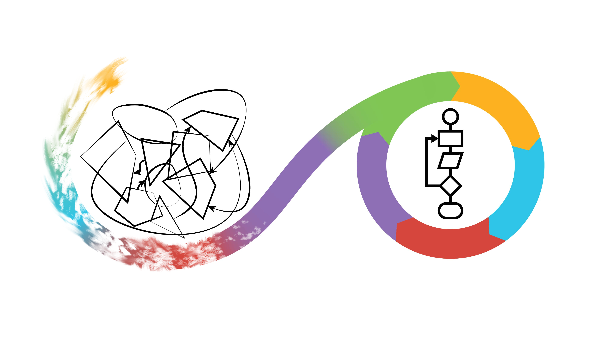

# Programming formalisms

> 'Programming Formalisms' course logo, by Jonas Söderberg and Lars Eklund

<!-- markdownlint-disable MD013 --><!-- Badges cannot be split up over lines, hence will break 80 characters per line -->

<!-- markdownlint-enable MD013 -->

## [Go to the nicely-rendered version of the course](https://uppmax.github.io/programming_formalisms/)
