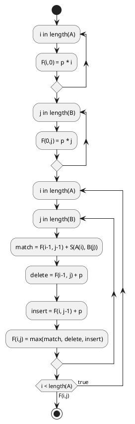

BLAST: A real-world example

"In bioinformatics, BLAST [basic local alignment search tool](https://en.wikipedia.org/wiki/BLAST_(biotechnology))
Links to an external site. is an algorithm and program for comparing primary biological sequence information,
such as the amino-acid sequences of proteins or the nucleotides of DNA and/or RNA sequences." (<https://en.wikipedia.org/wiki/BLAST_(biotechnology)#cite_note-KarlinObit.NYT-2>)

First copy the pseudo code into the markdown code ticks

```
for i in length(A):
   F(i,0) = p * i
for j in length(B):
   F(0,j) = p * j
for i in length(A):
   for j in length(B):
      match = F(i-1, j-1) + S(A(i), B(j))
      delete = F(i-1, j) + p
      insert = F(i, j-1) + p
      F(i,j) = max(match, delete, insert)
```



```plantuml
@startuml

@enduml
```
