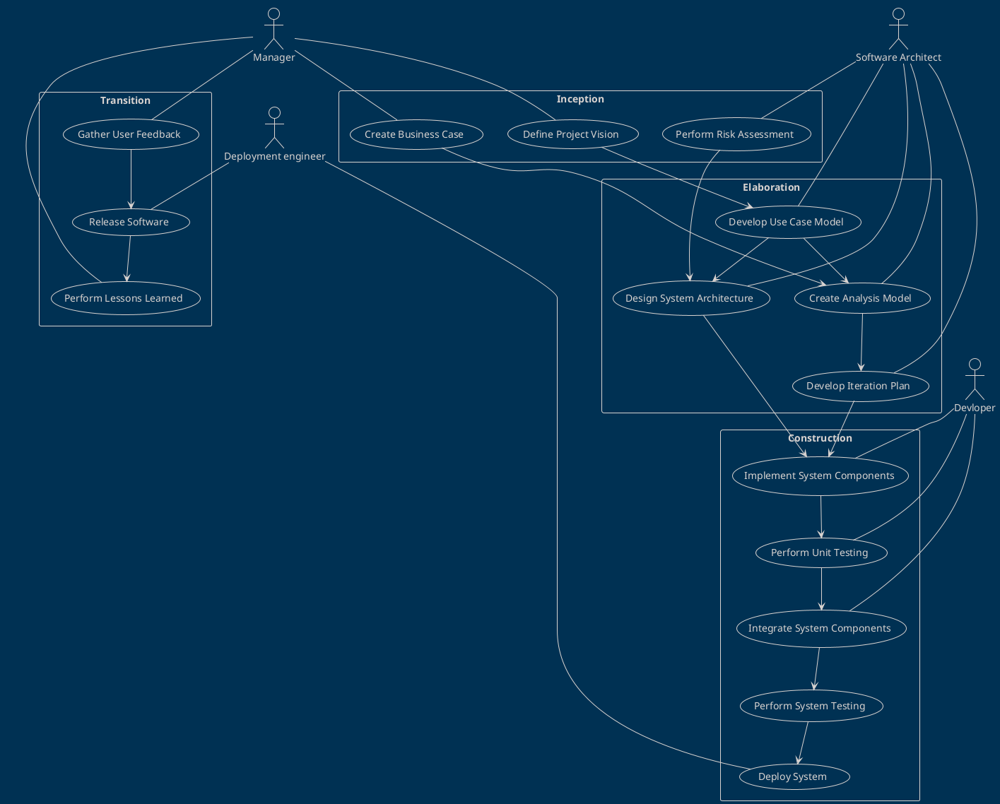
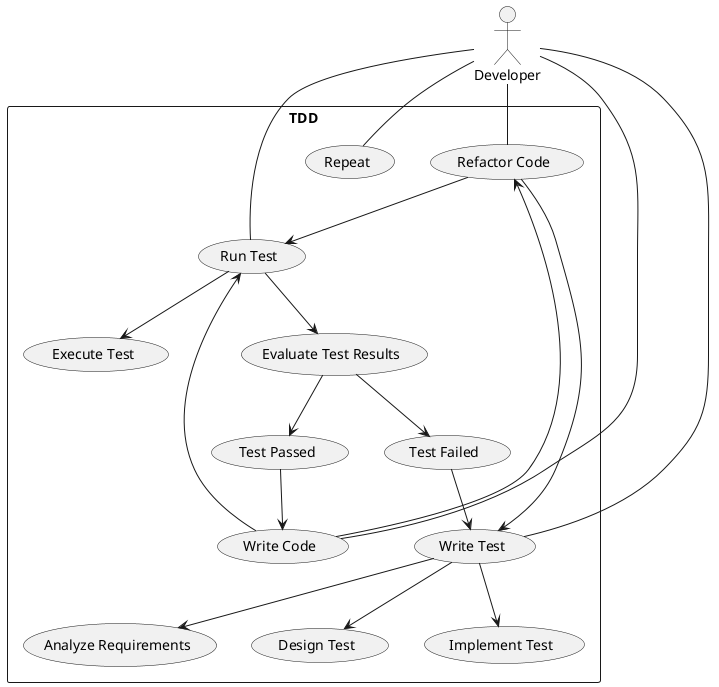
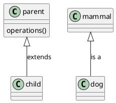
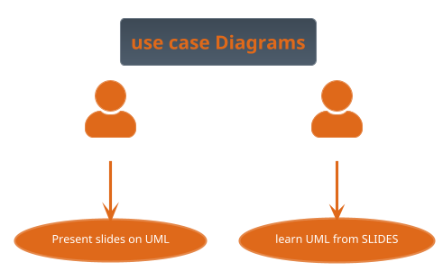
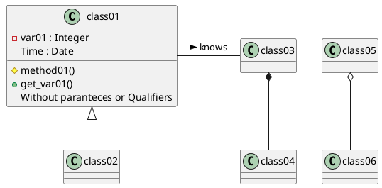
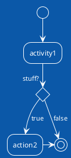
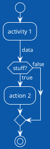

# Software development processes

## SDLC
*SDLC* ,or the Software Development Life Cycle, is a model describing the process of bringing a piece of software to market and maintaining it. The basic steps or as they are know phases each encompass different tasks needed to be completed as the software goes from idea to fruition.
<image src="./img/SDLC.png">
<span style="font-size:10px"> Generalized SDLC phases as a cycle of steps where the circle is traversed multiple times, there is a week correlation between cycles and versions</span>
You will if you google around many variations of this and the phases can change some what but the general idea stays constant. The following illustrations show both a variation of the common lifecycle model and  the ISO/IEC 12207 model described in ISO/IEC TR 24748-1:2010
  <!--- https://www.tutorialspoint.com/sdlc/index.htm --->
<image src="./img/SDLC_ISO_IEC_12207.png"><span style="font-size:10px"> Illustration of the generalize SDLC, from the IEEE Guide—Adoption of ISO/IEC TR 24748-1:2010
Systems and Software Engineering—Life Cycle Management—Part 1: Guide for Life Cycle Management</span>
 
 The early models where depicted as circles stemming from the waterflow model. <image src="./img/Waterfall_system_model.jpg"><span style="font-size:10px"> Illustration waterfall model from https://commons.wikimedia.org/wiki/File:Waterfall_system_model.jpg </span>
 
 After the 80s models tend  to focus on the iterative nature of development. One way of thinking about the iterative nature of development while keeping the incremental cost of iteration is as a helix. Where a change in the design in a lower spiral incurs the cost of the previous spirals, eventually the cost of introducing change into the next step will be larger that what is profitable for the project, at which time the efforts into the project usually trickles down rather than following the theoretical step of retirement. 
 <image src="./img/helix_legend-01.png" > The helix model of SDLC, concept: Lars Eklund, NBIS/UPPMAX, Uppsala University art: Jonas Söderberg, NBIS/UPPMAX, Uppsala University image is released under CC-BY licence<span style="font-size:10px"> </span>

Iterative models like RUP or Spiral model will emphasises that a software is developed in iterative steps where you may spend more or less time in any give phase, usually earlier iteration focus on planing and later on development and maintenance. Each time a change is introduced the impact on the cost increases with number of iteration and phases. 
Evolutionary software development like the Living Software Development Process takes inspiration from genetic algorithms and genetic programming to build a library of models from which to work.


*recommended reading*

 * [SDLC stands for Software Development Life Cycle at www.tutorialspoint.com](https://www.tutorialspoint.com/sdlc/index.htm)

 * [Towards a Tool Support for a Living Software Development Process](https://ieeexplore.ieee.org/document/994022 )

 * Evolutionary software engineering, a review, `https://www.sciencedirect.com/science/article/pii/S1568494604000778`

<br>
Depending on the chosen method or methodology these steps are generally named slightly different dependent on model but in general these steps fulfill the standard SDLC.

# PHASES OF THE SDLC 
In our five phased version of SDLC we section the development into five phases which are somewhat arbitrary as most development is more fluid than the fixed models that have evolved from the waterfall model 
while the ISO/IEC version of SDLC has nine phases below is an attempt to map the phases to each other.

## First phase *Planning*

In the first phase one needs to determine what Trauth et.al call Perception of need, Feasability and Analysis
The ISO/IEC standard 12207 calls this **Needs Determination** 
after the needs, the initial requirements, have been determined through the above mentions process they are then fleshed out in the **Concept and Exploration**
according to the SDLC_ISO_IEC_12207 this is the time to make a risk analysis of your development strategy, and then adopt that strategy, such as a once through(waterfall), iterative(such as RUP) or evolutionary software model(Living Software Development Process)
Most models cover some form of risk assessment, involved in the requirements gathering process. In the Spiral model the concept of risk assessment is essential while in models like RUP it has a lesser role. 
### Risk assessment

***This table does not render correctly in preview mode see the github pages for a complete view***
  <table>
 <tr>
    <th>Probability/Severity</th>
    <th>S1</th>
    <th>S2</th>
    <th>S3</th>
    <th>S4</th>
    <th>S5</th>
  </tr>
  <tr>
    <td>P5</td>
    <td style="background-color: DARKGOLDENROD">
      <p align=center>5</p>Supplementary issue
    </td>
    <td style="background-color: ORANGE">
      <p align=center>10</p>Issue
    </td>
    <td style="background-color: RED">
      <p align=center>15</p>Unacceptable
    </td>
    <td style="background-color: RED">
      <p align=center>20</p>Unacceptable
    </td>
    <td style="background-color: RED">
      <p align=center>25</p>Unacceptable
    </td>
    
  </tr>
  <tr>
    <td>P4</td>
    <td style="background-color: GREEN">
     <p align=center>4</p>Acceptable
    </td>
    <td style="background-color: DARKGOLDENROD">
      <p align=center>8</p>Supplementary issue
    </td>
    <td style="background-color: ORANGE">
      <p align=center>12</p>Issue
    </td>
    <td style="background-color: RED">
    <p align=center>16</p>Unacceptable
    </td>
    <td style="background-color: RED">
    <p align=center>20</p>Unacceptable
    </td>
    
  </tr>
  <tr>
    <td>P3</td>
   <td style="background-color: GREEN">
   <p align=center>3</p>Acceptable
   </td>
    <td style="background-color: DARKGOLDENROD">
    <p align=center>6</p>Supplementary issue
    </td>
    <td style="background-color: DARKGOLDENROD">
      <p align=center>9</p>Supplementary issue
    </td>
    <td style="background-color: ORANGE">
      <p align=center>12</p>Issue
    </td>
    <td style="background-color: RED">
    <p align=center>15</p>Unacceptable
    </td>
  </tr>
  <tr>
    <td>P2</td>
    <td style="background-color: GREEN">
    <p align=center>2</p>Acceptable
    </td>
    <td style="background-color: GREEN">
    <p align=center>4</p>Acceptable
    </td>
    <td style="background-color: DARKGOLDENROD">
    <p align=center>6</p>Supplementary issue
    </td>
    <td style="background-color: DARKGOLDENROD">
    <p align=center>8</p>Supplementary issue
    </td>
    <td style="background-color: ORANGE">
    <p align=center>10</p>issue
    </td>
  </tr>
  <tr>
    <td>P1</td>
    <td style="background-color: GREEN">
    <p align=center>1</p>Acceptable
    </td>
    <td style="background-color: GREEN">
    <p align=center>2</p>Acceptable
    </td>
    <td style="background-color: GREEN">
    <p align=center>3</p>Acceptable
    </td>
    <td style="background-color: GREEN">
    <p align=center>4</p>Acceptable
    </td>
    <td style="background-color: DARKGOLDENROD">
    <p align=center>5</p>Supplementary issue
    </td>
  </tr>
</table>

A good resource for risk assessment templates are is https://openregulatory.com/ which has some templates for ISO 13485, IEC 62304, ISO 14971 and IEC 62366.

## Second phase   *Design*
This stage corresponds to the third phase in the ISO/IEC standard **Demonstration and Evaluation** where we flesh out and create the system that will full fill the identified requirements put on the system. This is where we most often use visual diagrams and pseudo-code to describe our system. The design phase should be detailed enough that you can plan and execute a coherent development, but it is important to note that doing more than what you need is as bad as doing to little(well a little less :-)  but still it is important to not over-engineer when you and your team have a clear picture of what you want to develop that is when we step to the next phase)
At the end of this stage we have our first iteration of the Design documents, after we should in a structured manner set up the project planning and transfer of Design Documentation to actionable pseudocode, if we are using Git this can be set up as git issues as demeonstrated by Richel  in this [youtube video](https://www.youtube.com/watch?v=f-rzfZtsPKU)<!--- https://www.youtube.com/watch?v=f-rzfZtsPKU  is a place holder with the same process just not adopted for the example project.-->

## Third phase  *Development*
 This stage corresponds to the fourth phase in the ISO/IEC standard **Engineering/Development** is the stage where you use processes to implement your software system that is this is the coding step.

## Fourth phase *Deployment*/*Testing*
 The forth phase corresponds to phases of **Production/manufacturing** where you verify your product, and **Deployment/Sale**  where the product is released to the intended customers/audience

## Fifth phase *Maintenance*/*Deployment and Maintenance*
 **Operations** , **Maintenance and support** as well as the **Retirement** phase of the ISO/IEC standard 

# Development Processes
Below some descriptions of Development process, what model should be chosen should according to ISO/IEC 12207 be determined through a risk analysis and
then risk minimised,but in practice the choice is often determined by the culture of the development team and organisation policy. 

## Spiral model
The spiral model was developed in 1986 by Barry Boehm in his paper A Spiral Model of Software Development and Enhancement
The focus of the spiral model is to identify risk 
<image src="./img/Spiral_model_(Boehm,_1988).png"><span style="font-size:10px"> Illustration of the spiral model as presented by Boehm 1988 </span>, from `https://commons.wikimedia.org/wiki/File:Spiral_model_(Boehm,_1988).png`
 
## RUP, Rational Unified Process
Rational Unified Process is a software development method based on iterative object-oriented development. The idea is that you tailor the development method to fit the project, this however is not without cost as adapting and formulating templates take time. It is important to note that development models of this type are not in contrast to Agile development but some concessions to the iterative flow may have to be made as the image depicts RUP follows the phases of design as SDLC (with the addition of a 0th step Business modeling), Each phase in RUP is a complete iteration of the design steps Inception, Elaboration,Construction and Transition



What follows next is an emphasis diagram which describes where the focus of the work should be put in at which time of the project. It is common to have a signof at the end of each phase before starting the next one.
 
<p>
 <p>
   <image src="./img/Unified_Process_Model_for_Iterative_Development.png">
   <span style="font-size:10px">image contributed from  Wikimedia Commons and was originally made Jakob Farian Krarup and released to the public domain under cc 0 </span>

### Inception
 The focus of the inception stage is to identify the user needs to initial use case development 
- The purpose of the project
- The scheduled time frame for its completion
- The resources required for its completion
- The success criteria
- The estimated cost, and
- The estimated risk assessment, among others

 By the end of the Inception phase you should have determined the following:
- The General vision of the project
- The Project Plan and goal
- The Project scope
- Initial business suit from financial analysis, could be replaced by the scientific motivation, proposal for the project.
- Requirements understanding, through use case design.

### Elaboration
The elaboration phase is focused on the refinement of requirements the design of the software and test that are to be run through the project iteration lifetime.
Deliverables of the Elaboration phase is:
- A full model with functional and non-functional requirements
- A complete software architecture description
- A stable project plan
- Actual resource cost versus planned resource cost, etc.

### Construction
Is the development of the software and the creation of the deployment modules that are needed
Deliverables are:
- A user manual
- A fully completed software system

### Transition
The transition phase T1 and T2 is when you take your product to market maintain the current iteration and plan for the next iteration during this phase the Buisning modeling done regards to the future effects transitions in the organisation might bring on future organisation the requirements gathering is commonly extracted from bug reports, design is almost never changed during the transition phase while Testing and deployment have mayor focus in this phase.
Deliverables:
- Beta testing execution(firs iteration only)
- Marketing and distributing of the product
- User training
- Converting existing data
- Assessments based on user experience

Further reading RUP and examples of applied RUP:

* The Rational Unified Process--An Introduction., Kruchten, Philippe. (2000).
 <br/> https://www.researchgate.net/publication/220018149_The_Rational_Unified_Process--An_Introduction 
<br/>the links are outdated as the sale of RUP to IBM in 2003 his references lead to DevOps (IBMs newest development model) 
 * Real world example RUP as used by volvo, Åsa Nordin( Master Thesis, Trollhättan 2003):
  <br/> https://www.diva-portal.org/smash/get/diva2:215156/FULLTEXT01.pdf
 * Using Rational Unified Process in an SME – A Case Study,  Hansen et. al (springer 2005)
  <br/> https://www.researchgate.net/publication/221045898_Using_Rational_Unified_Process_in_an_SME_-_A_Case_Study 

## RAD Rapid Application Development
Using Prototyping and minimal design to generate fast development cycles, this has the disadvantage to generating very little structure and for larger or more complex systems the risk of derailing projects or unmaintainable solutions are high.

**Suitable parameters** for using a RAD process
- Focused project scope where business objectives are well defined and narrow.
- Data for the project already exists (completely or in part). The project largely comprises analysis or reporting of the data.
- Decisions can be made by a small number of people who are available and preferably co-located.
- Project team is small, preferably six people or less.
- Technical architecture is defined and clear and the key technology components are in place and tested.
- Technical requirements e.g response times, throughput, database sizes, etc. are reasonable and well within the capabilities of the used technologies. Targeted performance preferably less than 70% of the published limits of the used technologies.

**Unsuitable parameters** for using RAD processes
- Broad project scope where the business objectives are obscure or broad.
- Complex and voluminous data must be analyzed, designed and created within the scope of the project.
- Many people must be involved in the decisions on the project, the decision makers are not available on a timely basis or they are geographically dispersed.
- The project team is large or there are multiple teams whose work needs to be coordinated.
- The technical architecture is unclear and much of the technology will be used for the first time within the project.
- Technical requirements are tight for the equipment to be used.

further reading for RAD (Rapid Application Development):
 * https://www.projectmanagement.com/process/processMain.cfm?ID=11306#_=_

## eXtreme Programming
<image src="./img/Extreme_Programming_bgw.png">
   <span style="font-size:10px">The loops of eXtremeProgramming </span>

## TDD Test Driven Development

Test-Driven Development (TDD) is a methodology in software development that focuses on an iterative development cycle where the emphasis is placed on writing test cases before the actual feature or function is written. The iterative cycle in TDD is often referred to as the RED-GREEN-REFACTOR were code first fails the test, the code is then modified until it succeeds the test, lastly the code is refactored
 <br />
  <image src="./img/TDD_Global_Lifecycle.png">
   <span style="font-size:10px"> image contributed from Xarawn, CC BY-SA 4.0 <https://creativecommons.org/licenses/by-sa/4.0>, via Wikimedia Commons and released to the public domain with the aforementioned license</span>
<br />
 The three laws of TDD:
- 1.You are not allowed to write any production code unless it is to make a failing unit test pass.
- 2.You are not allowed to write any more of a unit test than is sufficient to fail; and compilation failures are failures.
- 3.You are not allowed to write any more production code than is sufficient to pass the one failing unit test.
     
   <br />
  http://butunclebob.com/ArticleS.UncleBob.TheThreeRulesOfTdd

The following Use Case model describes some common steps followed when developing according to TDD, in this scenario only one developer actor is present but this can be several people holding the role of developer when
     they interact with the model. In TDD pair programming is very common and  a practice of writing tests for your colleague is common practice. So one developer works on the code and one developer is working on the test and then they
switch.

In this diagram, a relatively detailed representation of the TDD process has been rendered:

    Write Test: The developer goes through three sub-steps:
        Analyze Requirements: The developer analyzes the requirements or user stories to understand the desired behavior.
        Design Test: The developer designs the test case(s) based on the requirements, ensuring complete coverage.
        Implement Test: The developer writes the test code without implementing the corresponding functionality in the system.

    Run Test: The developer proceeds with two sub-steps:
        Execute Test: The developer runs the test case(s) against the system or the code being developed.
        Evaluate Test Results: The developer evaluates the test results to determine if the test case(s) passed or failed.

    Test Failed or Test Passed: Based on the evaluation, the test can either fail or pass.

    If the test failed, the developer goes back to "Write Test" to create a new or modified test case that will capture the desired behavior. This iteration ensures that the system is designed to pass the new test case.

    If the test passed, the developer moves on to "Write Code" to implement the necessary functionality that will make the test pass.

    After writing code, the developer can choose to either "Run Test" to ensure the new functionality works as expected or "Refactor Code" to improve the code's structure without changing its functionality.

    If the code is refactored, the developer repeats the "Run Test" and "Write Test" steps to ensure the refactoring did not introduce any issues.

The diagram illustrates the iterative nature of TDD, where the process repeats until all the desired functionality is implemented, and all test cases pass.

Please note that this diagram is still a simplified representation of the TDD process and can be customized further based on specific requirements or methodologies followed in different contexts.
     
TDD will be covered in detail in other parts of the material, but the general idea of TDD is to generate robust solutions through the use of test for the whole life cycle.

## AGILE Development and the The AGILE manifesto
Manifesto for Agile Software Development

We are uncovering better ways of developing
software by doing it and helping others do it.
Through this work we have come to value:

Individuals and interactions over processes and tools
Working software over comprehensive documentation
Customer collaboration over contract negotiation
Responding to change over following a plan

That is, while there is value in the items on
the right, we value the items on the left more.
[https://agilemanifesto.org](https://agilemanifesto.org)

Kent Beck
Mike Beedle
Arie van Bennekum
Alistair Cockburn
Ward Cunningham
Martin Fowler
James Grenning
Jim Highsmith
Andrew Hunt
Ron Jeffries
Jon Kern
Brian Marick
Robert C. Martin
Steve Mellor
Ken Schwaber
Jeff Sutherland
Dave Thomas

© 2001, the above authors
this declaration may be freely copied in any form,
but only in its entirety through this notice. 

This manifesto was first conceived at the Snowbird meeting in Utah in early 2001

## DevOps 
<image src="./img/Devops-toolchain.png">
   <span style="font-size:10px">The DevOps Loop includes both the traditional SDLC and the Organisational tasks of the release</span>
From the [GitLab DevOps] Page(https://about.gitlab.com/topics/devops/)

DevOps can be best explained as people working together to conceive, build and deliver secure software at top speed. DevOps practices enable software developers (devs) and operations (ops) teams to accelerate delivery through automation, collaboration, fast feedback, and iterative improvement.

Stemming from an Agile approach to software development, a DevOps delivery process expands on the cross-functional approach of building and shipping applications in a faster and more iterative manner. In adopting a DevOps development process, you are making a decision to improve the flow and value delivery of your application by encouraging a more collaborative environment at all stages of the development cycle.
DevOps is a combination of software developers (dev) and operations (ops). It is defined as a software engineering methodology which aims to integrate the work of software development and software operations teams by facilitating a culture of collaboration and shared responsibility.
The DevOps methodology comprises four key principles that guide the effectiveness and efficiency of application development and deployment. These principles, listed below, center on the best aspects of modern software development.

    Automation of the software development lifecycle
    Collaboration and communication
    Continuous improvement and minimization of waste
    Hyperfocus on user needs with short feedback loops

By adopting these principles, organizations can improve code quality, achieve a faster time to market, and engage in better application planning.

# Tools and methodologies  
The tools and methodologies are too numerous to describe in any complete way, and they are always evolving as developers find issues with the models and methodologies they are currently using. The trends in software development is to find the "latest and greatest" method a silver bullet of development, this is of course not a reachable goal. It is better to find a method that is good enough for the task you need to achieve. 
First we need to define, 
A system can be defined as any structure of concepts that helps categorize a concept. This definition is quite broad and not very helpful the definitions of systems but they get more useful as we lower the degree of abstraction, for example when we talk about a biological system or a information system. An information system is a system consisting of organisation, hardware and software that help convey information between a sender and receiver. Further refined we can talk about a software system as the delimiter between components that make up some software. As our scope narrows the concept of system goes from the abstract to the concrete.  
The best way to approach which methodology one should use is to look at the development requirements of the system that you wish to create and choose the one that lets you do the least amount of work for the highest value. 

In this course we will present a few methodologies which are in no way or form the best or only methods out there but is a start.

# Paradigms of Design
## Modular development/programming
A software design technique that emphasizes separating the functionality of a program into independent, interchangeable modules.Each module contains everything necessary to execute only one aspect of the desired functionality of the software. Each module fits together like pieces of lego. A derivation of modular programming is interface programming which uses OOP/OOD to implement the concept of modules in a language that have support for objects but not for modules.
The principles of modular programming was introduced in the 1960s by Larry LeRoy Constantine with the proposal of adding modules to ALGOL68 to ALGOL68-R being the concrete application of the modular development paradigm.

[Code labs introduction to modular programming](https://codelabs.rocks/blog/detailed-guide-for-modular-programming-concept) state the following principles regarding modular programming:
There are two types of module, *program control modules* which are purposely and only designed for controlling the flow of the program. This is usually where the main functionality of a program is defined. *Specific task modules* A module that carries the data transfer amid the initial module and other modules. Specific task modules carries the functionality of the program and have a set of predefined data transmission options:
- no communication in with no communication out
- no communication in with some communication out
- some communication in with some communication out
- some communication in with no communication out

The point of designing with modular development is to enforce information hiding which in this case mainly makes the development independent of the specific development team and enables code reuse. At a higher state a modular design achieve the same interchangability over the design space.

### Additional material on Practical implementation of modular design
The following is a reference to practical applied modular development and design of Agri software it has a good practice described.
<br>Jones JW, Keating BA, Porter CH. Approaches to modular model development. Agricultural Systems. 2001 Nov 1;70(2):421–43. https://www.sciencedirect.com/science/article/pii/S0308521X01000543

## Object Orientation
Object orientation is primarily a design paradigm unlike Imperative,procedural,functional and declarative programming which focuses on how you code. One can use any number of programming paradigms to implement the object-oriented design.

An object is the representation of a thing or concept, that encapsulates both data and the actions performed on it. A key concept of an object is that it interacts with the world through message passing of its parameters. 

An object is characterised by a number of operations and a state which remembers the effect of these operations. 

An object oriented model is comprised of a number of objects which are clearly delimited parts of the system.
Objects also carry any association to other objects in their states. These relationships are categorised as either static or dynamic. Two objects with static relationships are associated but have no direct communication that is they know of each other but to not pass messages between each other.
A dynamic object relationship on the other hand implies two or more objects that actually communicate with each other

An object can be composed of other object, such can be achieved either through **composition** in the way that a person is composed by its parts head, arms, legs and body to give an example.
Key concepts in achieving these relationships are the relationships:
* The concept of Information Hiding 
* The concept of Encapsulation
* The concept of message passing


Once a set of objects have been identified it is common to abstract these through the process of classification, a process where we abstract a given object into its concepts, as we build out our classes some concepts that have no connection to the objects of our design. These classes are commonly known as utility classes. Once the classification and message passing have been designed our classes are generally instantiated as objects again which are the interacting entities of our software. 

The act of classification is when you take behaviour of an object and describe it as a general method that works for all objects of that type and the properties of the objects are abstracted to class properties, remember each property is should in pure OO only be accessible to the object itself that is to any one instance of a class.
In the classification of an object sometimes it is advantageous to make a class that is a class whose purpose is to define a common interface for their subclasses and therefor can not be instantiated. 


 **The concept of message passing**
 Each object has a external interface through which it interacts with other objects, it is the carriers of messages public(access qualifier, see below) methods of the Classes are the implementation of message passing.

**Inheritance** 
Inheritance is the carrier of behaviour between similar objects. When we implement the object model into a class model of common behaviour one of the most important features of object orientation(OO) is that it allows us to define the *is a* relationship such as a dog *is a* mammal this represented as en extension of the class where the subclass(dog) has all the characteristics of the parent (mammal)

<br>
**The concept of Information Hiding** is about making sure that each time in the execution any part of the program only has the information it needs, the helps with establishing modularity and makes each part of the program atomic. This is something we want because it reduces the risk of side-effects and it allows for multiple developers to work on the project without risking to step on each others toes. Information hiding further lets you implement each parts without knowing how the internal data structure or algorithm implements the interface.
This is accomplished through the use of *access qualifier* of the parameter/property or method. The levels of privacy are generally defined as: 
private, protected and public in increasing accessibility to the inheritance structure and other classes or objects. A private property is only accessible to the object itself, the protected are accessible to objects and classes in the same inheritance structure and public are accessible to any class or object in the software
<br>
<br>
Aditonal material (From one of the Icons in OO):
<br>
Stroustrup B. What is “Object-oriented Programming”? Software, IEEE. 1988 Jun 1;5:10–20. 


# Paradigms of Programming 

### Structural programming
The concept of structural programming is from 1950s with the aim of improving clarity and quality of software, by the introduction of structured control flow and block structures that is clearly defined areas of computation. Edsger W. Dijkstra coined the term in his 
### Imperative programming
Imperative programming is a software development paradigm where functions are implicitly coded in every step required to solve a problem. In imperative programming, every operation is coded and the code itself specifies how the problem is to be solved, which means that pre-coded models are not called on.

Imperative programming requires an understanding of the functions necessary to solve a problem, rather than a reliance on models that are able to solve it. The focus of imperative programming is how the problem should be solved, which requires a detailed step-by-step guide. Because the written code performs the functions instead of models, the programmer must code each step.
(https://www.techtarget.com/whatis/definition/imperative-programming)
### procedural programming
Derived from Imperative programming, the basic concept of a procedure call where a procedure is a routine or subroutine which contains the computational steps to be carried out.
### object oriented programming
The evolution of programming languages that support the object oriented design paradigm is long and branched with different amounts of support for the different concepts. Any language can be used to code object oriented but the effort of doing so may not be useful or cost effective. 

### Functional programming
In functional programming, based of the lambda calculus of Alonzo Church during the 1930s, the idea of pure functions, are meant to have no side effects is implemented as a design strategy, the second concept that needs to be implemented is the concept of recursion which functions as the mechanism of iteration in functional programming.

Programming languages like Haskell, LISP, IPL are languages that represent languages that implement the functional paradigm to varying degrees, but as most design paradigms any language that allows for recursive high order functions will allow for functional programming.
### Declarative programming
A problem is solved is not specifically defined, but instead focuses on what needs to be solved. Declarative programming provides a constant to check to ensure the problem is solved correctly, but does not provide instructions on how to solve the problem. The exact manner in which the problem is solved is defined by the programming language’s implementation through models. Declarative programming is also called model-based programming. Functional, domain-specific (DSL) and logical programming languages fit under declarative programming, such as SQL, HTML, XML and CSS.
(https://www.techtarget.com/whatis/definition/imperative-programming)

## Tools
### UML
The Unified modelling language was first standardized in November 1997 as [UML-98]. It has its origin in Rumbaugh OMT and Jacobsens efforts with the OOSE (object oriented software engineering). It is by that nature very good at describing the Rational Unified Process (RUP), see below, created by Rumbaugh, Booch and Jacobsen in the late 90s. Today the UML standard is maintained by the omg standard development organisation https://www.omg.org/spec/UML/2.5/PDF) 
A brief history of the development of UML and other modeling languages which primarily are for object-oriented modeling(observe that the UML standard also works well for describing other models using such things as activity diagrams and sequence diagram to describe algorithms or interactions between sections of your code.)
<image src="./img/OO_Modeling_languages_history.jpg"><span style="font-size:10px"> Model language history from https://commons.wikimedia.org/wiki/File:OO_Modeling_languages_history.jpg</span>

plantuml.org a way of using UML graphs and charts in markdown, and to specify the relationship between objects using text/pseudo code. The reason we chose plantuml is for its cross-platform integration and its integration with github and markdown. There are many other software with more advanced features and that can be interacted through graphical user interfaces. The traditional method is to use some sort of modeling software, a complete modeling software allows for at least forward engineering from models to code. There are of course great commercial versions but also some decent free ones.
draw.io
[Papyrus](https://www.eclipse.org/papyrus/)

[*Markdown Diagrams*](https://github.com/marcozaccari/markdown-diagrams-browser-extension) is available both as chrome extension and as firefox extension. To see the diagrams the extension has to be loaded.





//legacy style uml

//new style

Unified modeling language is defined and managed by the OMG(object management group)(omg.org), which is a standards developments organisation with 27 countries and more than 230 organisations which produces standards for business development and the software industry. UML is divided into Diagram types these types are supplemental, behavioural and structural - modeling. The Supplemental modeling is Use Cases, Deployments and Information flows. The Behavioural models include state machines, activities and interactions and are based on actions and common behaviour. Structural modeling models Values, Classifiers and Packages and describe the common structure of the software. Structural modeling is vital to discover proper abstraction of classes and interaction models help you find the methods needed to run an object oriented design. Activities and state machines are great for describing the flow of a program and to supplement pseudo code when visualizing processes or algorithms.
**Diagrams** 
<image src="./img/Uml_hierarchie_des_diagrammes.png"><span style="font-size:10px"> The different diagram types. https://upload.wikimedia.org/wikipedia/commons/6/6f/Uml_hierarchie_des_diagrammes.png </span>
*Structure Diagrams* 
- Class Diagram 
   
   Class diagrams are the most common diagrams used in UML. Class diagram consists of classes, interfaces, associations, and collaboration. Class diagrams basically represent the object-oriented view of a system, which is static in nature.
   Class diagram represents the object orientation of a system. Hence, it is generally used for development purpose. This is the most widely used diagram at the time of system construction.
- Object Diagrams
   
   Object diagrams can be described as an instance of class diagram. Thus, these diagrams are more close to real-life scenarios where we implement a system.
   The usage of object diagrams is similar to class diagrams but they are used to build prototype of a system from a practical perspective 

- Component Diagram
   
   Component diagrams represent a set of components and their relationships. These components consist of classes, interfaces, or collaborations. Component diagrams represent the implementation view of a system.
   During the design phase, software artifacts (classes, interfaces, etc.) of a system are arranged in different groups depending upon their relationship. Now, these groups are known as components.
   Component diagrams can also be used to represent modules in modular development view.
   Finally, it can be said component diagrams are used to visualize the implementation. 
- composite structure diagram
- Deployment diagram
   
   Deployment diagrams are a set of nodes and their relationships. These nodes are physical entities where the components are deployed.
   Deployment diagrams are used for visualizing the deployment view of a system. This is generally used by the deployment team.
- Package Diagram

  Package diagram, a kind of structural diagram, shows the arrangement and organization of model elements in the project. Package diagram can show both structure and dependencies between sub-systems or modules, showing different views of a system, for example, as multi-layered or multi-tiered application 
  The purpose of these diagrams are to:
   - Simplify complex class diagrams
   - collect and organise diagrams and documents and key deliverables into a collection. 
   - A package is a collection of logically related UML elements
   - Packages are depicted as file folders.

- **Note**  − If the above descriptions and usages are observed carefully then it is very clear that all the diagrams have some relationship with one another. Component diagrams are dependent upon the classes, interfaces, etc. which are part of class/object diagram. Again, the deployment diagram is dependent upon the components, which are used to make component diagrams. 

*Behaviour Diagrams*
- Activity Diagram
Activity diagram describes the flow of control in a system. It consists of activities and links. The flow can be sequential, concurrent, or branched.
Activities are nothing but the functions of a system. Numbers of activity diagrams are prepared to capture the entire flow in a system.
Activity diagrams are used to visualize the flow of controls in a system. This is prepared to have an idea of how the system will work when executed.
Activity diagrams are also excellent to describe Algorithms, in conjunction with pseudo code. 

- **Note** Due to that the dynamic nature of a system is very difficult to capture. UML has provided features to capture the dynamics of a system from different angles. Sequence diagrams and collaboration diagrams are isomorphic, hence they can be converted from one another without losing any information. This is also true for Statechart and activity diagram

- Use Case diagram
   A set of use cases, actors, and their relationships. They represent the use case view of a system. The intention of using a use case view and not just text to describe the use cases of your system is so you can describe the relationship between different stake holders, controllers (Actors)
   A use case represents a particular functionality of a system. It is used to describe the relationships among the functionalities and their internal/external controllers. 

- State Machine Diagram
 Any real-time system is expected to be reacted by some kind of internal/external events. These events are responsible for state change of the system.
Statechart diagram is used to represent the event driven state change of a system. It basically describes the state change of a class, interface, etc.
State chart diagram is used to visualize the reaction of a system by internal/external factors
- *Interaction diagrams*
   - Sequence diagram
     A sequence diagram is an interaction diagram. From the name, it is clear that the diagram deals with some sequences, which are the sequence of messages flowing from one object to another.
      Interaction among the components of a system is very important from implementation and execution perspective. Sequence diagram is used to visualize the sequence of calls in a system to perform a specific functionality.
   - Communication diagram or collaboration diagram
    It represents the structural organization of a system and the messages sent/received. Structural organization consists of objects and links.
    The purpose of collaboration diagram is similar to sequence diagram. However, the specific purpose of collaboration diagram is to visualize the organization of objects and their interaction.
    <image src="./img/Communication-Diagram-Financial-Analysis.webp"><span style="font-size:10px"> [A MVC model describing a financial system from visual-paradigm-com](https://circle.visual-paradigm.com/financial-analysis/)</span>
   - **Note** Plant UML can not do Communication diagram/collaboration diagrams

   - Interaction overview diagram
     UML Interaction Overview Diagrams provide a high level of abstraction an interaction model. It is a variant of the Activity Diagram where the nodes are the interactions or interaction occurrences.

   - Timing Diagram
     Timing diagrams are UML interaction diagrams used to show interactions when a primary purpose of the diagram is to reason about time. 
   ```plantuml
      @startuml
         robust "Web Browser" as WB
         concise "Web User" as WU
         @0
         WU is Idle
         WB is Idle
      @100
      WU is Waiting
      WB is Processing
      @300
      WB is Waiting
      @enduml
   ``` 


### Pair Programming 

A tool for rapid development is the so called Pair Programming where two developers code on the same code simultaneously one as the "Driver" and one as the "Navigator" 

### Design Patterns

A design pattern is a collection of best practises to solve a given design problem. Such as window management on your computer. One such pattern is the Model View Control pattern developed by  first introduced in 1979 by computer scientist Trygve Mikkjel Heyerdahl Reenskaug it describes the partition of a system into three components Model(the Data of the system and data interactions), the Controller/Control(the process control flow of the program) and the View (The User interface and external communications of the program)

  <image src="./img/Model-View-Controller_architectural_pattern.png"><span style="font-size:10px"> [MVC model describing the interactions between program interface, control and data(Model)](https://upload.wikimedia.org/wikipedia/commons/thumb/7/7a/Model-View-Controller_architectural_pattern.svg/2560px-Model-View-Controller_architectural_pattern.svg.png)</span>
Some examples of where this pattern has been implemented in modern times are:
- [Ruby on Rails](https://rubyonrails.org/)
- [ASP.NET MVC](https://dotnet.microsoft.com/en-us/apps/aspnet/mvc) Microsoft Active Server Pagess in the .NET framework 
- [Laravel](https://laravel.com/) PHP framework
- [Angular](https://angular.io/) is built using TypeScript
A good source for learning Design patterns and using as a reference material is [Design Patterns, Elements of Reusable Object-Oriented Software by Gamma Et.al 1994](https://libris.kb.se/bib/11947731)
 <br />

### AI assisted programming/AI

With the emergence of more complex AI and especially the use of LLM (Large Language Models) in AI has given us a new development tool in AI assisted coding.  This may result in high quality coding solutions outside of our current solution space. One of the issues is that whenever we employ AI or construct AI we need to be aware of the particular ethics surrounding this, As it stands we as developers and writers have the soul accountability for any development don on and with ai. A good starting point in these ethics are the RDA guidelines from the AIDV working group that will be presentet in full in may, until then another good source is the [UNESCO recommendations on AI ethics](https://www.unesco.org/en/artificial-intelligence/recommendation-ethics)
These comprehensive recommendations basically states that in all development done with or on ai we need to keep a view of what is good for humanity in perspective. One hard issue in the scientific endeavor when using AI assisted development is credit. How do we credit. So how can we use AI in development, In the design and development fase Traditionally we seek the requirements as described above, but we can get a head start and generate a discussion point.
In traditional requirements gathering we usaly take the plain English project breef and sort out verbs and subjects, The verbs generaly specify a feature the software needs to do and the subject somthing it has to provide or that it has. 
Once the requirments have been gathered and refined and checked against the test case. Test case for requirment documents generally are written on the form of does R have correspondance in the Project breef or technichal requirment that follows the breef?
There are quite a lot of references to code from natural sentence structure Microsoft cheif engineer has written a short article summarising some of the work https://news.microsoft.com/source/features/ai/how-ai-makes-developers-lives-easier-and-helps-everybody-learn-to-develop-software/ 
When presented with these options it is tempting to skipp some of the steps in the SDLC, and go directly from Idea to production code, I caution agains this as it will lead to less maintainable code where you as the developer have less understanding of issuse arraising. I instead recomend using ai assistance through out the development process and to view it as a partner that assists you both in design and implementation and testing. There is a risk that when presented with the "Answer" we feel we as developers should not touch "Their"*(the AI)* solution, this should be overcome as in all design work rework and reconceptulisation is ineveiteable.