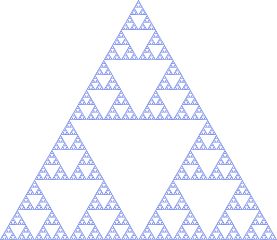

---
tags:
  - recursive
  - function
  - algorithm
---

# Recursive algorithms

!!!- info "Learning objectives"

    - Understand that functions can be recursive
    - Understand that recursive functions can usually be implemented
      with a for loop

## Why?

In the real world, there are behaviors that are recursive.

An example is this dictionary definition (from `[Hunter, 2021]`):

> Recursion, see Recursion.

Or (also from `[Hunter, 2021]`):

> To understand recursion, you must understand recursion

Or a Sierpiński triangle, which repeats itself in itself:



The simplest example in mathematics is a factorial:

 `n` | `n!`
-----|-----------------------
 0   | 1
 1   | 1
 2   | 2 \* 1 = 2
 3   | 3 \* 2 \* 1 = 6
 4   | 4 \* 3 \* 2 \* 1 = 24
 5   | 5 \* `4!`
 `n` | `n` \* `(n-1)!`

To calculate the factorial of `n` (for `n` bigger than 1),
you need the factorial of `n-1`.

Another example is a Fibonacci sequence:

| N    | 0   | 1   | 2   | 3   | 4   | 5   | 6   | 7   | 8   | 9   | 10  |
|------|-----|-----|-----|-----|-----|-----|-----|-----|-----|-----|-----|
| `Fn` | 0   | 1   | 1   | 2   | 3   | 5   | 8   | 13  | 21  | 34  | 55  |


## Exercise 1: factorial

- Develop a function to get the factorial of a number using a for-loop
- Develop a function to get the factorial of a number using recursion

```python
assert calc_factorial_iterative(13) ==
    calc_factorial_recursive(13)
```

???- question "Prefer R?"

    ```r
    expect_equal(
      calc_factorial_iterative(13),
      calc_factorial_recursive(13)
    )
    ```

## Exercise 2: get the nth value in the Fibonacci sequence

- Develop a function to get the nth value in the Fibonacci sequence
  using a for-loop
- Develop a function to get the nth value in the Fibonacci sequence
  using recursions

## References

- `[Hunter, 2021]` Hunter, David J. Essentials of discrete mathematics. Jones & Bartlett Learning, 2021.
