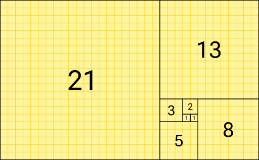

# Recursive algorithms

!!!- info "Learning objectives"

    - Understand design by contract
    - Understand algorithm names increase expressiveness of code
    - Understand difference between `if` and `assert` in function writing

## Types of recursive algorithms

- Iterative: use a for-loop
- Recursive: a function that calls itself

## Example 1: factorial

| `n` | `n!`                  |
|-----|-----------------------|
| 0   | 1                     |
| 1   | 1                     |
| 2   | 2 \* 1 = 2            |
| 3   | 3 \* 2 \* 1 = 6       |
| 4   | 4 \* 3 \* 2 \* 1 = 24 |
| 5   | 5 \* `4!`             |
| `n` | `n` \* `(n-1)!`       |

## Exercise 1: factorial

- Develop a function to get the factorial of a number
- If the function used a for-loop, create another function that uses recursion,
  or the other way around
- Write the code of the function as a pair and/or with help of an AI

```python
assert calc_factorial_iterative(13) ==
    calc_factorial_recursive(13)
```

???- question "Prefer R?"

    ```r
    expect_equal(
      calc_factorial_iterative(13),
      calc_factorial_recursive(13)
    )
    ```

## Example 2

Fibonacci sequence:

| N    | 0   | 1   | 2   | 3   | 4   | 5   | 6   | 7   | 8   | 9   | 10  |
|------|-----|-----|-----|-----|-----|-----|-----|-----|-----|-----|-----|
| `Fn` | 0   | 1   | 1   | 2   | 3   | 5   | 8   | 13  | 21  | 34  | 55  |



## Example 2: get Fibonacci number

| N   | `Fn`                    |
|-----|-------------------------|
| 0   | 0                       |
| 1   | 1                       |
| 2   | 1                       |
| 3   | `Fn(1) + Fn(2)`         |
| `n` | `Fn(n - 2) + Fn(n - 1)` |

## Exercise 2: get the nth value in the Fibonacci sequence

- Develop a function to get the nth value in the Fibonacci sequence
- If the function used a for-loop, create another function that uses recursion,
  or vice versa
- Write the code of the function as a pair and/or with help of an AI

???- question "Answer in Python"

    ```python
    assert get_nth_fibonacci_iterative(13) ==
      get_nth_fibonacci_recursive(13)
    ```

???- question "Answer in R"

    ```r
    expect_equal(
      get_nth_fibonacci_iterative(13),
      get_nth_fibonacci_recursive(13)
    )
    ```
