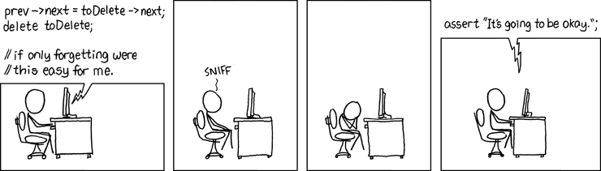

---
tags:
  - assert
  - debug
  - test
  - check
  - programmer
  - develop
  - dev
  - self
  - yourself
  - documentation
---

# `assert`

!!!- info "Learning outcomes"

    - Understand the purpose of `assert`
    - Understand that Python has a debug and release mode
    - Understand that `assert` is superior to documentation
    - Understand that `assert` has no reduction in run-time speed
      in release mode
    - Understand that `assert` statements should have no side effects
    - Understand that `assert` can be used to signal stubs
    - `assert` liberally

???- question "For teachers"

    Prior:

    - Somewhere in you code, you know something, e.g. `x` is positive,
      and the rest of the code needs that to be true to be able to function.
      Should, and if yes, how, this knowledge be written down?
    - What synonymn does 'to assert' have in English?
    - Have you ever used asserts? In R, the equivalent is `testthat::expect_`


    Lesson plans:

    ```mermaid
    gantt
      title Lesson plan pair programming 1
      dateFormat X
      axisFormat %s
      Introduction : intro, 0, 5s
      Theory 1: theory_1, after intro, 5s
      Exercise 1: crit, exercise_1, after theory_1, 15s
      Feedback 1: feedback_1, after exercise_1, 5s
      Theory 2: theory_2, after feedback_1, 5s
      Exercise 2: crit, exercise_2, after theory_2, 10s
      Exercise 2 after the break: crit, after exercise_2, 5s
    ```



## Why use assertions

> If debugging is the process of removing bugs,
> then programming must be the process of putting them in.
> Edsger W. Dijkstra

You will be writing code with flaws and bugs.
Making you assumptions explicit
will help you structure your thoughts and reduce
the time you spend debugging.

## About assumptions

> Assert liberally to document internal assumptions and invariants
>
> `[Sutter & Alexandrescu, 2004]`, chapter 68.

While coding, we have assumptions.
Take, for example, this code:

```python
average = sum_of_elements / n_elements
```

Here, we assume that `n_elements` is non-zero,
else we cannot calculate an average.
We can express that with an `assert` statement:

```python
assert n_elements > 0
average = sum_of_elements / n_elements
```

???- question "Prefer R?"

    In R, the same story hold for the `testthat::expect_true`
    (as part of the Tidyverse) function.

This `assert` will terminate the program if the assertion is false.
Assert liberally to document assumptions
`[Sutter & Alexandrescu, 2004; Stroustrup, 1997; McConnell, 2004a]`
`[Liberty, 2001; Lakos, 1996; Stroustrup, 2013a]`,
even if you think something should never occur `[McConnell, 2004b]`.

### Assertions in debug and release mode

Python scripts can be run in debug mode or release mode:

```bash
python my_script.py # debug mode
python -O my_script.py # release mode
```

Do not assume that `assert` is always evaluated `[Stroustrup, 2013b]`:
when running a script in debug mode or release mode,
`assert` has different behavior:

- in debug mode: the `assert`s are active
- in release mode: the `assert`s are ignored

This means that there is no drawback in speed
when running your script in release mode.

It also mean that `assert` statements:

- must not do anything (e.g. modifying a value) `[Turner, 2024]`
- cannot be used to talk to the user of your code

Parameter           |Debug mode           |Release mode
--------------------|---------------------|------------------------
Purpose of `assert` |To checking yourself |None
How to run script   |`python my_script.py`|`python -O my_script.py`
Behavior of `assert`|Active               |Ignored
Runtime speed       |Lower                |Unaffected

### Using assertions as a stub

`assert` can be used as a stub,
to signal that work that needs to be done.
For example, here is a function that aligns any amount of DNA sequences:

```python
def align(dna_sequences):
    """Align the DNA sequences"""
    assert len(dna_sequences) == 2 # TODO
    # the actual code
```

The developer (you!) has indicated clearly that the function,
for now, expects to take two DNA sequences.
The `# TODO` is signalling clearly that this will be changed in the
future.
Use `assert` to specifify assumption on the input of a function
`[Stroustrup, 1997][McConnell, 2004a]`.

!!! note

    [Specifify](https://www.urbandictionary.com/define.php?term=specifify): When you have to further define what you are talking about to further explain yourself.

### Using assertions to check a function's return value

Lastly, `assert` can be used to quick check
to check if a function return a not-too-crazy value.

For example, here is a function that aligns two DNA sequences:

```python
def align_two_dna_sequences(dna_sequences):
    """Align the DNA sequences"""
    # ....
    results = ["AAAA", "AAC-"] # Should be result of calculation
    assert len(results[1]) == len(results[2])
    return results
```

Here the `assert` checks if the resulting DNA sequences are equally long,
as they should. The resulting DNA sequences may have incorrect content,
which likely is to be checked someplace else. But checking for the
sequences to be of equal length may help as a first quick
test to find bugs.
Use `assert` to specifify assumption on the output of a function
`[Stroustrup, 1997][McConnell, 2004a]`.

## Exercises

### Exercise 1: the behavior of `assert` in debug and release mode

- Write a script called `my_assert.py` with the following content:

```python
assert 1 == 2
```

- Run the script, using `python my_assert.py`
- What is the error message? Why?

???- question "Answer"

    This is the error message:

    ```bash
    $ python my_assert.py
    Traceback (most recent call last):
      File "/home/sven/my_assert.py", line 1, in <module>
        assert 1 == 2
    AssertionError
    ```

    It fails because one is, indeed, not equal to two.

- Run the script, now using `python -O my_assert.py`
- What is the error message? Why?

???- question "Answer"

    There is no error message here.

    There is no error message, as the Python script was run in
    release mode: in release mode, all `assert`s are removed

### Exercise 2: making assumptions explicit

- Below is a function that divides two floating point numbers.
  Add the assumptions this function makes, either
  as comments or as Python code

```python
def divide_by(numerator, denominator):
    return (numerator / denominator)
```

???- question "Answer with comments"

    ```python
    def divide_by(numerator, denominator):
        # Numerator is a floating point number
        # Denominator is a floating point number
        # Numerator is not zero
        return (numerator / denominator)
    ```

???- question "Answer with Python code"

    ```python
    def divide_by(numerator, denominator):
        assert isinstance(numerator, float)
        assert isinstance(denominator, float)
        assert(denominator != 0.0)
        return (numerator / denominator)
    ```

- Run this function with the integer values 3 as the numerator
  and 4 as the denominator and observe what happens.
  Which two ways are there to solve this?

???- question "Answer"

    The code will fail, because the input are not floating point numbers
    anymore. How to deal with this is a design decision.

    Here are the options:

    - Change the **use** of the function:
      change `divide_by(3, 4)`
      to `divide_by(3.0, 4.0)`

    - Change the **implementation** of the function:

    ```python
    def divide_by_3(numerator, denominator):
        assert isinstance(numerator, (float, int))
        assert isinstance(denominator, (float, int))
        assert type(numerator) == type(denominator)
        assert(denominator != 0.0)
        return (numerator / denominator)
    ```

    The first puts the responsibility at the user of the function,
    the second puts it on the author of the function.

- Which of the two ways is better?

???- question "Answer"

    The first one, because a function should does one thing correctly
    `[Martin, 2009; CppCore F.2; tidyverse style guideline of functions]`.

    Or phrased differently `[Martin, 2009]`:

    > Functions should do one thing.
    > They should do it well.
    > They should do it only [sic].

### Exercise 3: making assumptions explicit

- Below is a function that reads a file and returns its contents.
  How to use it?

```python
def read_file(filename):
    file = open(filename, "r")
    content = file.read()
    file.close()
    return content
```

???- question "Answer"

    Here is how to use this function:

    ```python
    read_file("my_file.txt")
    ```

    The function will give an error is the file cannot be
    found at the path.

- Add the assumptions this function makes, either
  as comments or as Python code

???- question "Answer with comments"

    ```python
    def read_file(filename):
        # The path to the filename exists
        # The file is readable
        file = open(filename, "r")
        content = file.read()
        file.close()
        return content
    ```

???- question "Answer with code"

    ```python
    def read_file(filename):
        import os
        assert os.path.isfile(filename)
        assert os.access(filename, os.R_OK)

        file = open(filename, "r")
        content = file.read()
        file.close()
        return content
    ```

- Compare the behavior of the functions without and with `assert`.
  Did we do a better job by adding `assert`s? If yes: how? If no: why not?

???- question "Anwer"

    We know we should 'assert liberally to document internal assumptions and
    invariants' `[Sutter & Alexandrescu, 2004, chapter 68]` which we did
    well by adding those `assert`s.

    The behavior of our code, however, has not changed much: the error
    message by either function are readable enough, hence you could
    argue that we've wasted our time typing out our assumptions.

    On the other hand, asserting liberally is a good habit, so doing
    it is fine.

## References

- `[CppCore F.2]` C++ Core Guidelines.
   F.2: A function should perform a single logical operation,
   <https://isocpp.github.io/CppCoreGuidelines/CppCoreGuidelines#Rf-logical>
- `[Liberty, 2001]` [5] Jesse Liberty. Sams teach yourself C++ in 24 hours.
  ISBN: 0-672-32224-2. Hour 24, chapter 'assert()': 'Use assert freely'
- `[Lakos, 1996]` John Lakos. Large-Scale C++ Software Design. 1996.
  ISBN: 0-201-63362-0. Chapter 2.6: 'The use of assert statements can help to
  document the assumptions you make when implementing your code
- `[Martin, 2009]` Martin, Robert C.
  Clean code: a handbook of agile software craftsmanship.
  Pearson Education, 2009.
- `[McConnell, 2004a]` Steve McConnell. Code Complete (2nd edition). 2004.
  ISBN: -735619670. Chapter 8.2 'Assertions', paragraph 'Guidelines for using
  asserts': 'Use assertions to document and verify preconditions and
  postconditions'
- `[McConnell, 2004b]` Steve McConnell. Code Complete (2nd edition). 2004.
  ISBN: -735619670. Chapter 8.2 'Assertions', paragraph 'Guidelines for using
  asserts': 'Use assertions for conditions that should never occur'.
- `[Stroustrup, 1997]` Bjarne Stroustrup.
  The C++ Programming Language (3rd edition). 1997.
  ISBN: 0-201-88954-4. Advice 24.5.18: 'Explicitly express preconditions,
  postconditions, and other assertions as assertions'
- `[Stroustrup, 2013a]` Bjarne Stroustrup.
  The C++ Programming Language (4th edition). 2013. ISBN: 978-0-321-56384-2.
  Chapter 30.5. Advice. page 884: '[13] Use static_assert() and assert() extensively'
- `[Stroustrup, 2013b]` Bjarne Stroustrup.
  The C++ Programming Language (4th edition). 2013. ISBN: 978-0-321-56384-2.
  Chapter 30.5. Advice. page 884: '[14] Do not assume that assert() is always
  evaluated'
- `[Sutter & Alexandrescu, 2004]` Herb Sutter, Andrei Alexandrescu.
  C++ coding standards: 101 rules, guidelines, and best practices. 2004.
  ISBN: 0-32-111358-6. Chapter 68: 'Assert liberally to document internal
  assumptions and invariants'
- `[tidyverse style guideline of functions]`
  <https://style.tidyverse.org/functions.html>
- `[Turner, 2024]` Jason Turner, cppbestpractices:
  'Never Put Code with Side Effects Inside an assert()'
  [here](https://github.com/cpp-best-practices/cppbestpractices/blob/master/03-Style.md#never-put-code-with-side-effects-inside-an-assert)
