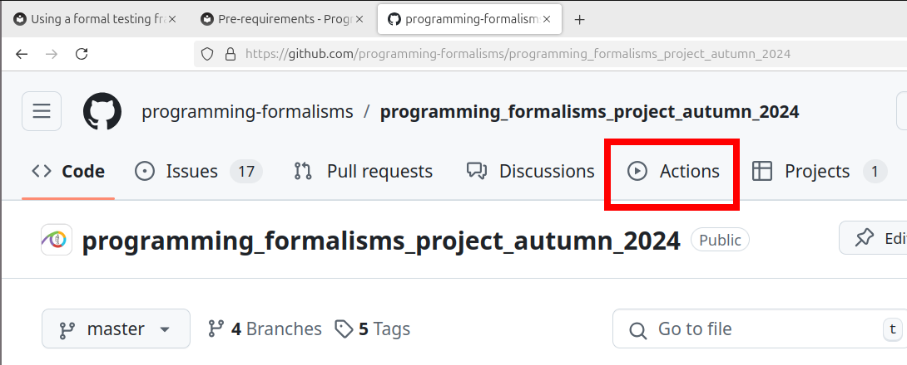
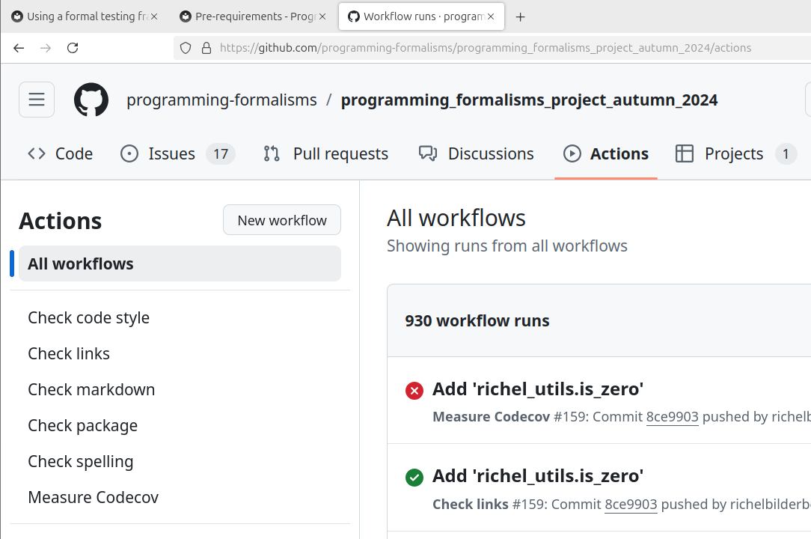
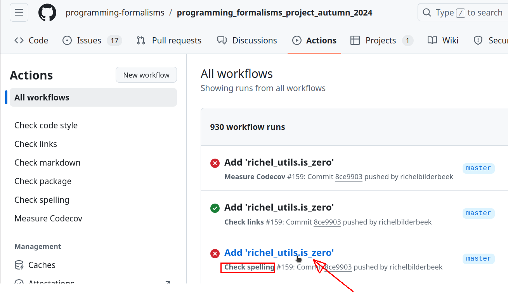
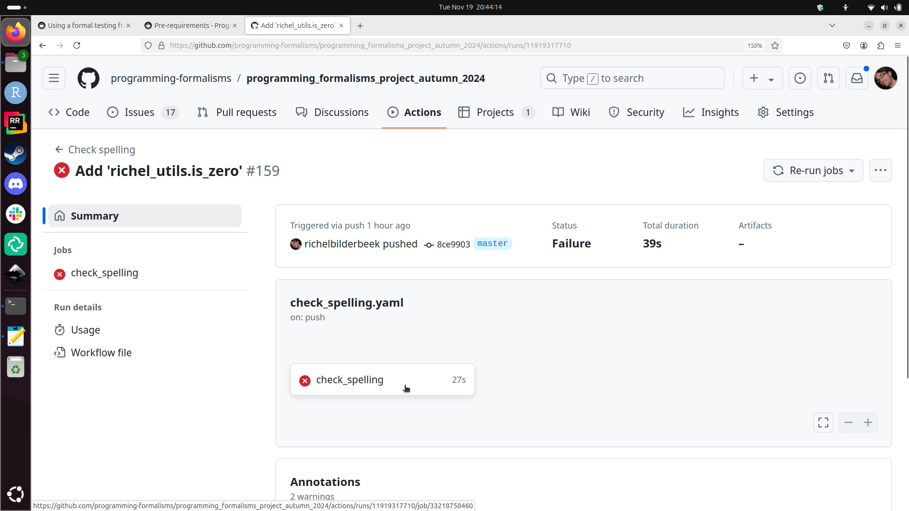
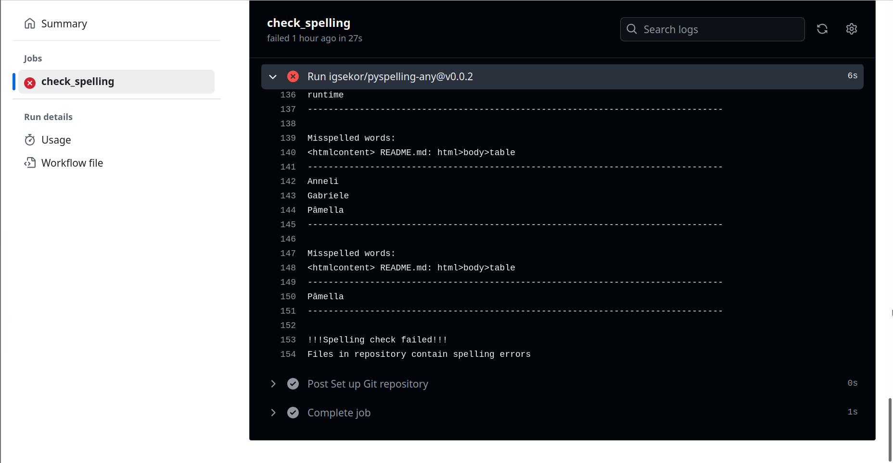
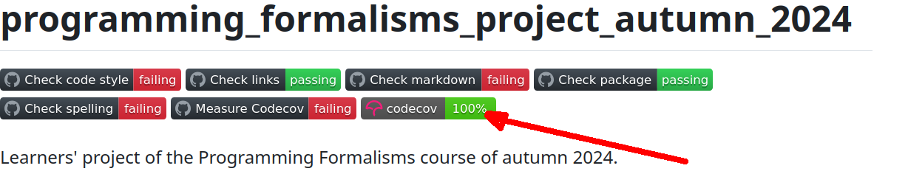

---
tags:
  - CI
  - Continuous integration
---

# Continuous integration

!!!- info "Learning outcomes"

    - Understand what continuous integration is
    - Understand why continuous integration is important
    - I can find the continuous integration errors
    - I can fix an error given by a CI script

???- question "For teachers"

    Priors:

    - Someone pushes code to `main` and the project breaks.
      How can this be prevent?
    - Someone pushes code to `main` that has a spelling mistake.
      How can this be prevent?
    - Someone pushes code to `main` that has untested code.
      How can this be prevent?
    - You want to measure the runtime speed of the project
      in time, to see which changes cause a dip in performance.
      How would you do this?

    Lesson plan:

    - 5 mins: prior knowledge
        - When do you trust your code?
        - When do you trust code written by others?
        - How do you convince other developers of a bug?

    - 5 mins: presentation
    - 10 mins: demonstration `is_zero`
    - 25 mins: challenge
    - 10 mins: feedback

## Why?

You want things to happen upon a `git push` or a `git merge`.
Continuous integration scripts let you do just that!

### Use case 1: test the build in a clean/independent environment

You push/merge new code to `main` and you don't realize is that
the project does not work anymore, as it depended
on a file or operating system that only you have.
Wouldn't it be great
if code could be tested automatically in a clean/independent environment?

### Use case 2: measure code coverage

You wonder how much of your code is tested.
Wouldn't it be great
if code coverage could be measured automatically after a push?

### Use case 3: enforce coding standard

A team member (or external contributor)
is a sloppy code. You told him/her to follow the coding standards
multiple times and now have grown tired of doing so.
Wouldn't it be great
if code could be tested to follow a coding standard automatically
before merging?

### Use case 4: measure run-time speed

You want to measure the run-time speed of your project
in a clean/independent environment.
Wouldn't it be great
if code could be tested for run-time speed automatically after a push?

## How Continuous Integration looks like

'Continuous Integration' is to continuously integrate new
code with existing code (i.e. without human formal approval steps).
This is quite an obvious definition, more interesting is
to read how CI looks like (from `[Beck, 1999]`):
Continuous integration [is that new] code is
integrated with the current system
after no more than a few hours.
When integrating, the system is built
from scratch and all tests must pass
or the changes are discarded.

Scripts that are triggered when `push`ing code.

Assures quality:

- Tests pass
- Code has consistent style
- Links are valid (i.e. not broken)
- Spelling is correct
- [your check here]

## Features of Continuous Integration

- CI significantly increase the number of bugs exposed `[Vasilescu et al., 2015]`
- CI increases the speed at which new features are added `[Vasilescu et al., 2015]`

## Code coverage

- Percentage of code tested
- Correlates with code quality `[Horgan et al., 1994][Del Frate et al., 1995]`
- 100% mandatory to pass a code peer-review by rOpenSci `[Hart et al., 2013]`
- Break the build if test coverage is too low 
  `[Henney, 2010, chapter 'Automate Your Coding Standard']`

## Coding style

- Following a consistent coding style improves software quality `[Fang, 2001]`
    - Python: PEP8 `[PEP 8]`
    - R: Tidyverse `[Wickham, 2019]`
- Use static code analysis tools to scan the code for unwanted antipatterns
  `[Henney, 2010, chapter 'Automate Your Coding Standard']`
- The cyclomatic complexity of code is part of the coding style,
  where more complex code is likelier to have more bugs
  `[Abd Jader et al., 2018][Chen, 2019][Mens et al., 2008]`
- If an antipattern is found, break the build
  `[Henney, 2010, chapter 'Automate Your Coding Standard']`

A 'linter' is program that tests code for style.

Some Python linters:

Name                                              |VSCode plugin?|Features
--------------------------------------------------|--------------|--------
[`ruff`](https://github.com/astral-sh/ruff)       |Yes           |Fastest, active development, can replace Flake8, Black, isort, pydocstyle, pyupgrade, autoflake, and more
[`mypy`](https://www.mypy-lang.org/)              |Yes           |Only checks on data type hints
Black                                             |No            |Many checks
[Pylint](https://pylint.readthedocs.io/en/stable/)|Yes           |Slow, checks on data type
[Flake8](https://flake8.pycqa.org/en/latest/)     |Yes           |Many checks
`autopep8`                                        |No            |Named after PEP8

Sometimes, you will disagree with a linter.
All linters allow you to turn it off temporarily.

For example, this code will trigger the `ruff` linter:

```python
import random
i = random.randint(0, 1)
```

The linter gives [a S311 error](https://docs.astral.sh/ruff/rules/suspicious-non-cryptographic-random-usage/)),
which means that the `random.randint` is too quick-and-dirty to its taste.
However, if you need exactly
that (e.g. in a test), you can disable the linter for in that line like this:

```python
i = random.randint(0, 1) # noqa: S311
```

You will need to defend this in a code review :-)

## Exercises

### Exercise 1: look at the results of our CI scripts

- Go to the learners' project
- Click on the 'Actions' tab

???- question "Where is the 'Actions' tab?"

    It is here:

    

- You now see all the Actions. 'Actions' are the names of the
  continuous integration scripts.

???- question "How does that look like?"

    This is how it looks like:

    

- What are the actions in the learners' project?

???- question "Answer"

    Actions are:

    - Check code style
    - Check links
    - Check markdown
    - Check package
    - Check spelling
    - Measure codecov

- Click on the workflow (a GitHub term) with 'Check spelling'
  in the second line

???- question "Where to click exactly?"

    Click here:

    

- Click on the `check_spelling` job (another GitHub term)

???- question "Where to click exactly?"

    Click here:

    

- You will be shown the results of the spell check

???- question "How does that look like?"

    

Fixing this is beyond this exercise.

### Exercise 2: improve the learners' project

Now we try to improve the learners' project by fixing one
of the errors.

- Go to the learners' project
- Click on the 'Actions' tab
- Look for an Action that fails. Which actions do you see?

???- question "Answer"

    - 'Check code style'
    - 'Check package'
    - 'Check links'
    - 'Check spelling'
    - 'Measure codecov'

- What would you guess that these do?

???- question "Answer"

    - 'Check code style': checks for Python style, will improve your
      Python grammar
    - 'Check package': checks if the repo can be built into a package,
      has the most diverse range of Python problems
    - 'Check links': checks for links, straightforward
    - 'Check markdown': checks for markdown style, will improve
      your markdown grammar
    - 'Check spelling': spellcheck, straightforward
    - 'Measure codecov': checks if the code can be tested
      practice writing, has a diverse range of Python problems
    - The codecov percentage:
      needs to be 100%, practice writing tests

- What is the most important action?

???- question "Answer"

    'Check package' is the most important action:
    if the package cannot be created,
    the code is broken.

- Pick your favorite action and try to fix 1 error, see below for hints

!!! note "Pick your favorite action"

    - 'Check code style': will improve your Python grammar
    - 'Check package': has the most diverse range of Python problems
    - 'Check links': straightforward
    - 'Check markdown': will improve your markdown grammar
    - 'Check spelling': straightforward
    - 'Measure codecov': has a wide range of problems
    - The codecov percentage: practice writing tests

???- question "How to fix 'Check code style'?"

    The errors given are diverse and commonly show the solution as well.

    For example, take this error:

    ```text
    src/learners/probability.py:13:5: RET505 [*] Unnecessary `else` after `return` statement
       |
    11 |     if (x>0.0) & (x<1.0):
    12 |         return True
    13 |     else:
       |     ^^^^ RET505
    14 |         return False
    ```

    The error occurs in the file `src/learners/probability.py` at line 13.
    In this case, there is an unnecessary `else` after `return` statement,
    which has error code `RET505`. Googling for `ruff RET505`
    takes you to [the corresponding ruff documentation](https://docs.astral.sh/ruff/rules/superfluous-else-return/).
    Here you can read how to fix it.

    In this case, rewrite the existing code ...

    ```python
    if (x>0.0) & (x<1.0):
        return True
    else:
        return False
    ```

    to

    ```python
    if (x>0.0) & (x<1.0):
        return True
    return False
    ```

    It is possible that `ruff` has some new errors too.
    Here is a version that `ruff` will guide you to:

    ```python
    return x > 0.0 && x < 1.0
    ```

???- question "How to fix 'Check links  '?"

    Search the error logs for the word `error`.
    You will find a link that considered to be broken.

    If indeed the link is broken, either remove the link
    or point it to another URL.

    If the link is misdiagnosed to be broken,
    add it to `mlc_config.json`.

    For example, here is an example `mlc_config.json`:

    ```text
    {
      "aliveStatusCodes": [200, 403, 418, 429, 503],
      "ignorePatterns": [
        {
          "pattern": "https://www.sciencedirect.com/science/article/pii/S0308521X01000543"
        }
      ]
    }
    ```

    To add a link to ignore it (in this example `https://www.my_link.sv`, change it to:

    ```text
    {
      "aliveStatusCodes": [200, 403, 418, 429, 503],
      "ignorePatterns": [
        {
          "pattern": "https://www.sciencedirect.com/science/article/pii/S0308521X01000543"
        },
        {
          "pattern": "https://www.my_link.sv"
        }
      ]
    }
    ```

???- question "How to fix 'Check markdown'?"

    The errors given are diverse.

    For example, take this error:

    ```text
    Error: requirements.md:29:81 MD013/line-length Line length [Expected: 80; Actual: 209]
    ```

    This error is caused in file `requirements.md`, line 29.
    To find a better explanation Google for `markdownlint MD013`
    and you'll find [the markdownlint documentation on MD13](https://github.com/DavidAnson/markdownlint/blob/main/doc/md013.md)

    There are multiple ways to fix it.

    If possible, split up the line in multiple lines.

    If not, you can locally ignore `markdownlint` errors by adding this around
    the offending lines:

    ```text
    <!-- markdownlint-disable MD013 -->

    [the line that is too long]

    <!-- markdownlint-enable MD013 -->
    ```

???- question "How to fix 'Check package'?"

    This is the most important test:
    if this fails, it means the code of our project is broken.
    You will see a Python error that needs fixing, for example:

    ```text
    ImportError: Failed to import test module: tests.test_sven
    Traceback (most recent call last):
      File "/usr/lib/python3.10/unittest/loader.py", line 436, in _find_test_path
        module = self._get_module_from_name(name)
      File "/usr/lib/python3.10/unittest/loader.py", line 377, in _get_module_from_name
        __import__(name)
      File "/home/runner/work/programming_formalisms_project_summer_2025/programming_formalisms_project_summer_2025/
      tests/test_sven.py", line 23
        def test_prime_numbers(self)
                                    ^
    SyntaxError: expected ':'


    ----------------------------------------------------------------------
    Ran 7 tests in 0.001s

    FAILED (errors=2)
    ```

    This error occurs in file `tests/test_sven.py` at line 23.
    It is a syntax error that can be fixed by fixing the Python code in that
    file.

???- question "How to fix 'Check spelling'?"

    Take a look at the words that triggered the spellcheck,
    for example:

    ```text
    Misspelled words:
    <htmlcontent> learners/sven/design/requirements.md: html>body>table
    --------------------------------------------------------------------------------
    Programm
    ```

    This means that in the file `learners/sven/design/requirements.md`
    the misspelled word `Programm` was found.

    In this case, this is a valid spelling error,
    which is fixed by fixing the file.

    However, the error may be a false positive, e.g. the very common ( ;-) ):

    ```text
    Misspelled words:
    <htmlcontent> README.md: html>body>table
    --------------------------------------------------------------------------------
    Richèl
    ```

    In such a case, add the offending word to the whitelist that is in file
    `.wordlist.txt` at the root folder of our repo.

???- question "How to fix 'Measure codecov'?"

    This is the one-but-most important test:
    if this fails, it means the testing of our project is broken.
    You will see a Python error that needs fixing, for example:

    ```text
    ImportError: Failed to import test module: tests.test_sven
    Traceback (most recent call last):
      File "/usr/lib/python3.10/unittest/loader.py", line 436, in _find_test_path
        module = self._get_module_from_name(name)
      File "/usr/lib/python3.10/unittest/loader.py", line 377, in _get_module_from_name
        __import__(name)
      File "/home/runner/work/programming_formalisms_project_summer_2025/programming_formalisms_project_summer_2025/
      tests/test_sven.py", line 23
        def test_prime_numbers(self)
                                    ^
    SyntaxError: expected ':'


    ----------------------------------------------------------------------
    Ran 7 tests in 0.001s

    FAILED (errors=2)
    ```

    This error occurs in file `tests/test_sven.py` at line 23.
    It is a syntax error that can be fixed by fixing the Python code in that
    file.

???- question "How to fix the code coverage percentage?"

    One can only improve the code coverage if 'Mesaure codecov'
    passes: if our package's testing is broken, we cannot measure code
    coverage.

    See 'How to fix 'Measure codecov'' on how to do that.

    If the package and tests can be built successfully,
    click on the codecov badge at the front page
    of the learners' project:

    

    This will take you to a
    [https://about.codecov.io/](https://about.codecov.io/)
    site. Look for functions that are not tested 100% and click on those.
    You will then see in red which lines are not tested.

    Then use your judgement to either:

    - Write tests to trigger those lines
    - Remove the lines that are not triggered

## References

- `[Abd Jader et al., 2018]` Abd Jader, Marwa Najm, and Riyadh Zaghlool Mahmood.
  "Calculating McCabe's cyclomatic complexity metric and its effect on the
  quality aspects of software."
- `[Beck, 1999]` Beck, Kent.
  "Embracing change with extreme programming." Computer 32.10 (1999): 70-77.
- `[Booch, 1990]` Booch, Grady. Object oriented design with applications.
  Benjamin-Cummings Publishing Co., Inc., 1990.
- `[Chen, 2019]` Chen, Changqi.
  "An Empirical Investigation of Correlation between Code Complexity and Bugs."
  arXiv preprint arXiv:1912.01142 (2019).
- `[Del Frate et al., 1995]` Del Frate, Fabio, et al.
  "On the correlation between code coverage and software reliability."
  Proceedings of Sixth International Symposium on Software Reliability
  Engineering. ISSRE'95. IEEE, 1995.
- `[Fang, 2001]` Fang, Xuefen.
  "Using a coding standard to improve program quality." Proceedings Second
  Asia-Pacific Conference on Quality Software. IEEE, 2001.
- `[Hart et al., 2013]` Hart, Edmumd, et al.
  "rOpenSci-a collaborative effort to develop R-based tools for facilitating
  Open Science." figshare (2013): 791569.
- `[Henney, 2010]` Henney, Kevlin.
  97 things every programmer should know: collective wisdom from the experts. "
  O'Reilly Media, Inc.", 2010.
- `[Mens et al., 2008]` Mens, Tom, et al.
  "Empirical studies of open source evolution."
  Software evolution (2008): 263-288.
- `[PEP 8]` Van Rossum, Guido, Barry Warsaw, and Nick Coghlan.
  "PEP 8–style guide for python code." Python. org 1565 (2001): 28.
- `[Horgan et al., 1994]` Horgan, Joseph R., Saul London, and Michael R. Lyu.
  "Achieving software quality with testing coverage measures."
  Computer 27.9 (1994): 60-69.
- `[Vasilescu et al., 2015]` Vasilescu, Bogdan, et al.
  "Quality and productivity outcomes relating to continuous integration in
  GitHub." Proceedings of the 2015 10th joint meeting on foundations of
  software engineering. 2015.
- `[Wickham, 2019]` Wickham, Hadley.
  Advanced R. chapman and hall/CRC, 2019.

