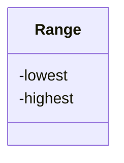

# Data structures

!!!- info "Learning objectives"

    - .

# `class` design

## An invariant



- Use class if the class has an invariant; 
  use struct if the data members can vary independently `[CppCore C.2]`
- Use class rather than struct if any member is non-public `[CppCore C.8]`

# Writing a good class

Q: What is a good class?

. . .

A:

- guarantees its stored data is valid, 
  e.g the class `DnaSequence` is probably a string of one or more A, C, G and T
- the quality requirements for a function, among others a good interface
- writing a design, documentation and tests all help

## General class anatomy

- A constructor: all data needed to create it
- Private member variables
- Public member functions

## Class anatomy in R

- R has four class types (S3, S4, R5, R6)
- S3 classes are closest to structures
- R6 classes are real classes

## Class anatomy in Python

```python
class DnaSequence:
    def __init__(self, sequence):
        assert is_dna_string(sequence)
        self._sequence = sequence # convention
    
    def get_str(self):
        return self._sequence

a = DnaSequence("ACGT")
assert a.get_str() == "ACGT"
```

## Private variables are a social convention

Use of `_` before the name of a private variable is a social convention!

```
self._sequence = sequence # convention
```

Nothing stops you from:

```python
a._sequence = "XXX"
assert a.get_str() == "XXX"
```

Some other programming languages offer stronger guarantees.

## Inheritance and polymorphism

> C++ is a horrible language.
> It's made more horrible by the fact that a lot of substandard programmers use it,
> to the point where it's much much easier to generate total and utter crap with it.
>
> Linus Torvalds, 2007-09-06

## Inheritance and polymorphism

- Can create class hierarchies
    - 'All Animal objects can make a sounds'
- Easy to abuse, hard to use correctly
- Design Patterns are known to work well


## Class design

- [Python classes](https://docs.python.org/3/tutorial/classes.html)
- [C++ Core Guidelines](https://isocpp.github.io/CppCoreGuidelines/CppCoreGuidelines#S-class)
- `[CppCore C.2]` [C.2: Use class if the class has an invariant; use struct if the data members can vary independently](https://isocpp.github.io/CppCoreGuidelines/CppCoreGuidelines#Rc-struct)
- `[CppCore C.8]` [C.8: Use class rather than struct if any member is non-public](https://isocpp.github.io/CppCoreGuidelines/CppCoreGuidelines#Rc-class)
