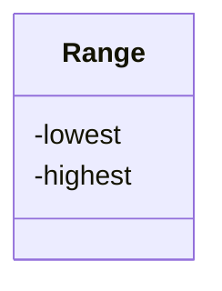

---
tags:
  - class design
  - architecture
---

# Class design

!!!- info "Learning objectives"

    - .

???- question "For teachers"

    Prerequisites are:

    - .

    Teaching goals are:

    - .

    Prior:

    - .

    Lesson plans:

    ```mermaid
    gantt
      title Lesson plan pair programming 1
      dateFormat X
      axisFormat %s
      Introduction : intro, 0, 5s
      Theory 1: theory_1, after intro, 5s
      Exercise 1: crit, exercise_1, after theory_1, 15s
      Feedback 1: feedback_1, after exercise_1, 5s
      Theory 2: theory_2, after feedback_1, 5s
      Exercise 2: crit, exercise_2, after theory_2, 10s
      Exercise 2 after the break: crit, after exercise_2, 5s
    ```

## Why?

You are modeling something in the real world as code.
You want to use the same world in your code as in the real world
and you want it to be natural to use in your code.

This is a goal of class design.

## Benefits from object-oriented development

Benefits from object-oriented development (from `[Booch, 2008]`):

- Appeals to the working of human cognition
- Leads to systems that are more resilient to change
- Encourages the reuse of software components
- Reduces development risk
- Exploits the expressive power of object-oriented programming languages

## An invariant



- Use class if the class has an invariant;
  use struct if the data members can vary independently `[CppCore C.2]`
- Use class rather than struct if any member is non-public `[CppCore C.8]`

## Writing a good class

A good class guarantees that its stored data is valid.
For example, the class `DnaSequence`
is probably a string of one or more A, C, G and T

- the quality requirements for a function, among others a good interface
- writing a design, documentation and tests all help

## General class anatomy

- A constructor: all data needed to create it
- Private member variables
- Public member functions

## Class anatomy in R

- R has four class types (S3, S4, R5, R6)
- S3 classes are closest to structures
- R6 classes are real classes

## Class anatomy in Python

```python
class DnaSequence:
    def __init__(self, sequence):
        assert is_dna_string(sequence)
        self._sequence = sequence # convention

    def get_str(self):
        return self._sequence

a = DnaSequence("ACGT")
assert a.get_str() == "ACGT"
```

## Private variables are a social convention

Use of `_` before the name of a private variable is a social convention!

```python
self._sequence = sequence # convention
```

Nothing stops you from:

```python
a._sequence = "XXX"
assert a.get_str() == "XXX"
```

Some other programming languages offer stronger guarantees.

## Inheritance and polymorphism quote

> C++ is a horrible language.
> It's made more horrible by the fact
> that a lot of substandard programmers use it,
> to the point where it's much much easier
> to generate total and utter crap with it.
>
> Linus Torvalds, 2007-09-06

## Inheritance and polymorphism

- Can create class hierarchies
    - 'All Animal objects can make a sounds'
- Easy to abuse, hard to use correctly
- Design Patterns are known to work well


> `[Gamma et al., 1995]`

## References

- `[Booch, 2008]` Booch, Grady, et al. "Object-oriented analysis and design with applications." ACM SIGSOFT software engineering notes 33.5 (2008): 29-29.
- [Python classes](https://docs.python.org/3/tutorial/classes.html)
- [C++ Core Guidelines](https://isocpp.github.io/CppCoreGuidelines/CppCoreGuidelines#S-class)
- `[CppCore C.2]` C.2: Use class if the class has an invariant; use struct
  if the data members can vary independently
  [https://isocpp.github.io/CppCoreGuidelines/CppCoreGuidelines#Rc-struct](https://isocpp.github.io/CppCoreGuidelines/CppCoreGuidelines#Rc-struct)
- `[CppCore C.8]` C.8: Use class rather than struct if any member is non-public
  [https://isocpp.github.io/CppCoreGuidelines/CppCoreGuidelines#c8-use-class-rather-than-struct-if-any-member-is-non-public](https://isocpp.github.io/CppCoreGuidelines/CppCoreGuidelines#c8-use-class-rather-than-struct-if-any-member-is-non-public)
- `[Gamma et al., 1995]` Gamma, Erich, et al.
  "Elements of reusable object-oriented software." Design Patterns (1995).
