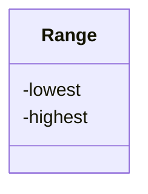

---
tags:
  - class design
  - architecture
---

# Class design

!!!- info "Learning outcomes"

    - Understand what an invariant is
    - Write a class that protects an invariant

???- question "For teachers"

    Prerequisites are:

    - .

    Teaching goals are:

    - .

    Prior:

    - .

    Lesson plans:

    ```mermaid
    gantt
      title Lesson plan pair programming 1
      dateFormat X
      axisFormat %s
      Introduction : intro, 0, 5s
      Theory 1: theory_1, after intro, 5s
      Exercise 1: crit, exercise_1, after theory_1, 15s
      Feedback 1: feedback_1, after exercise_1, 5s
      Theory 2: theory_2, after feedback_1, 5s
      Exercise 2: crit, exercise_2, after theory_2, 10s
      Exercise 2 after the break: crit, after exercise_2, 5s
    ```

## Why?

You are modeling something in the real world as code.
You want to use the same world in your code as in the real world
and you want it to be natural to use in your code.

This is a goal of class design.

## Example

Here we see some code where a user constantly checks
if his/her stays positive:

```python
positive_number = 42
assert positive_number >= 0

positive_number = do_something_with_it(positive_number)
assert positive_number >= 0

positive_number = do_something_else_with_it(positive_number)
assert positive_number >= 0
```

Wouldn't it be great if `positive_number` itself could check
if it is positive, instead of us `assert`ing this at every step?

For that, we could write a class for exactly that,
with a name such as `PositiveNumber`.

## Benefits from object-oriented development

Benefits from object-oriented development (from `[Booch, 2008]`):

- Appeals to the working of human cognition
- Leads to systems that are more resilient to change
- Encourages the reuse of software components
- Reduces development risk
- Exploits the expressive power of object-oriented programming languages

## An invariant

An invariant is something that must always be.
Some examples:

- a persons' age must always be positive
- a persons' total height must be longer than a persons' arms' length

Use a class if the class has an invariant `[CppCore C.2]`.

For example, here we have a class with an invariant:




???- question "What is the invariant in the `Range` class?"

    The invariant is that `highest` must be bigger or equal to
    `lowest`.

## Writing a good class

A good class guarantees that its stored data is valid.
For example, the class `DnaSequence`
is probably a string of one or more A, C, G and T

- the quality requirements for a function, among others a good interface
- writing a design, documentation and tests all help

## General class anatomy

- A constructor: all data needed to create it
- Private member variables
- Public member functions

???- question "Prefer R?"

    Class anatomy in R:

    - R has four class types (S3, S4, R5, R6)
    - S3 classes are closest to structures
    - R6 classes are real classes

## A `DnaSequence` class

Here is how to implement a class for a DNA sequence:

```python
class DnaSequence:
    def __init__(self, sequence):
        assert is_dna_string(sequence)
        self._sequence = sequence

    def get_str(self):
        return self._sequence

a = DnaSequence("ACGT")
assert a.get_str() == "ACGT"
```

The `init` method (also known as a constructor) checks if the
input is indeed a valid DNA string, using an `assert`.
After that, the sequences is stored inside of the class,
in a member variable called `_sequence`.
The underscore signals (by social convention) that the value must
be treated as 'do not touch' and that the only
class itself will keep it valid.

However, nothing stops you from doing this:

```python
a._sequence = "XXX" # No! Breaks the invariant!
assert a.get_str() == "XXX"
```

On the other hand, a Python developer can at least see that this convention
was broken.

Note that some other programming languages completely disallows
you from modifying a so-called 'private' member variable.

<!--

## Inheritance and polymorphism quote

> C++ is a horrible language.
> It's made more horrible by the fact
> that a lot of substandard programmers use it,
> to the point where it's much much easier
> to generate total and utter crap with it.
>
> Linus Torvalds, 2007-09-06

Inheritance and polymorphism are easy to abuse and hard to use
correctly `[Gamma et al., 1995]`.
However, tried and known-to work combinations of classes
called 'Design Patterns' do use inheritance and are known to work
well `[Gamma et al., 1995]`


> `[Gamma et al., 1995]`

-->

## Exercise

### Exercise: write a class with an invariant

- Pick a class at your skill level:

???- note "Easiest: a class for a positive number"

    Here is an example how to use it:

    ```python
    x = PositiveNumber(3)
    assert x.get_value() == 3
    PositiveNumber(-1) # Must raise an exception
    ```

    Work in `src/learners`.

???- note "Medium: a class for a range, e.g 'a range from 3 to 10'"


    Here is an example how to use it:

    ```python
    x = Range(3, 10)
    assert x.get_lowest() == 3
    assert x.get_highest() == 10
    Range(100, 10) # Must raise an exception
    ```

    Work in `src/learners`

???- note "Hard: a class in the learners' project"

    Work in `src/weather`

    Don't break the main branch :-)

- Write the class that protects its invariant

???- question "Answer for a positive number"

    ```python
    class PositiveNumber:
        def __init__(self, any_positive_number):
            assert any_positive_number >= 0
            self._value = any_positive_number
        def get_value(self):
            return self._value
    ```

???- question "Answer for range"

    ```python
    class Range:
        def __init__(self, any_lowest, any_highest):
            assert any_lowest <= any_highest
            self._lowest = any_lowest
            self._highest = any_highest
        def get_lowest(self):
            return self._lowest
        def get_highest(self):
            return self._highest
    ```

## References

- `[Booch, 2008]` Booch, Grady, et al. "Object-oriented analysis and design with applications." ACM SIGSOFT software engineering notes 33.5 (2008): 29-29.
- [Python classes](https://docs.python.org/3/tutorial/classes.html)
- [C++ Core Guidelines](https://isocpp.github.io/CppCoreGuidelines/CppCoreGuidelines#S-class)
- `[CppCore C.2]` C.2: Use class if the class has an invariant; use struct
  if the data members can vary independently
  [https://isocpp.github.io/CppCoreGuidelines/CppCoreGuidelines#Rc-struct](https://isocpp.github.io/CppCoreGuidelines/CppCoreGuidelines#Rc-struct)
- `[CppCore C.8]` C.8: Use class rather than struct if any member is non-public
  [https://isocpp.github.io/CppCoreGuidelines/CppCoreGuidelines#c8-use-class-rather-than-struct-if-any-member-is-non-public](https://isocpp.github.io/CppCoreGuidelines/CppCoreGuidelines#c8-use-class-rather-than-struct-if-any-member-is-non-public)
- `[Gamma et al., 1995]` Gamma, Erich, et al.
  "Elements of reusable object-oriented software." Design Patterns (1995).
