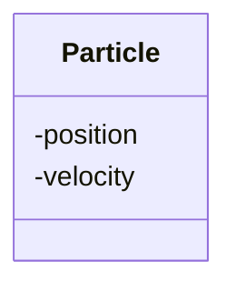

# Expressive data types

!!!- info "Learning objectives"

    - Practice to use classes for expression
    - Practice to use classes for type safety
    - Understand difference between composition and aggregation
    - Practice to use composition for a 'has-a' relationship

## What and why?

Data structure are 'ways to organize your data'.

- Bad way: put all in one `list`

Good (:innocent:) data structures:

- **Increase expressiveness**
- Bundles data that belongs together
- Ensures correct state of the program

## Increase expressiveness, in design

"A two-dimensional coordinate **has a** x and a y component"




> Class diagram of a two-dimensional coordinate

## Increase expressiveness, in code

```python
a = get_a()
print(a)
print(type(a))
```

???- question "Prefer R?"

    ```r
    a <- get_a()
    a
    class(a)
    ```

## Increase expressiveness, in code again

```python
class Coordinat:
    def __init__(self, any_x, any_y):
      self.x = any_x
      self.y = any_y
    def __repr__(self):
        return "Coordinat"
    def __str__(self):
        return "(" + str(self.x) + ", " + str(self.y) + ")"
def get_a():
    return Coordinat(3.14, 2.72)
```

```python
a = get_a()
print(a)
```

```python
print(type(a))
```

???- question "Prefer R?"

    ```r
    a <- get_a()
    a
    ```

    ```r
    class(a)
    ```

Ah, it is a **coordinat**!

- Express ideas directly in code `[CppCore P.1]`
- Explicit is better than implicit `[PEP 20]`

## Exercise 1: design a struct (15 mins)

???- info "Learning objectives"

    - to convince design is trickier than one thinks
    - to convince design has implications
    - to grow appreciation of classes

What are their elements? Which do you guess are structures? Were they?

- A coordinate in 3 dimensions :innocent:
- A velocity in two dimensions
- A circle
- A square

## References

- `[CppCore P.1]` [P.1. Express ideas directly in code](https://isocpp.github.io/CppCoreGuidelines/CppCoreGuidelines#Rp-direct)
- `[PEP 20]` [PEP 20: 'Explicit is better than implicit'](https://peps.python.org/pep-0020/#the-zen-of-python)

