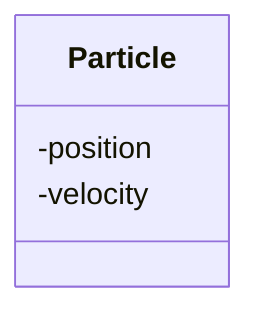

# Expressive data types

!!!- info "Learning objectives"

    - Practice to use classes for expression
    - Practice to use classes for type safety
    - Understand difference between composition and aggregation
    - Practice to use composition for a 'has-a' relationship

## What and why?

Data structure are 'ways to organize your data'.

-   Bad way: put all in one `list`

Good (:innocent:) data structures:

-   Increase expressiveness
-   Bundles data that belongs together
-   Ensures correct state of the program

## `struct` design

Good (:innocent:) data structures:

-   **Increase expressiveness**
-   Bundles data that belongs together
-   Ensures correct state of the program

## Increase expressiveness, in design

"A two-dimensional coordinate **has a** x and a y component"




> Class diagram of a two-dimensional coordinate

## Increase expressiveness, in code

=== "Python"

    ```python
    a = get_a()
    print(a)
    print(type(a))
    ```

=== "R"

    ```r
    a <- get_a()
    a
    class(a)
    ```

## Increase expressiveness, in code

=== "Python"

    ```{python}
    #| echo: false
    #| eval: true
    class Coordinat:
        def __init__(self, any_x, any_y):
          self.x = any_x
          self.y = any_y
        def __repr__(self):
            return "Coordinat"
        def __str__(self):
            return "(" + str(self.x) + ", " + str(self.y) + ")"
    def get_a():
        return Coordinat(3.14, 2.72)
    ```

    ```{python}
    #| echo: true
    #| eval: true
    a = get_a()
    print(a)
    ```

    ```{python}
    #| echo: true
    #| eval: true
    print(type(a))
    ```
=== "R"

    ```{r echo=FALSE}
    get_a <- function() {
      a <- c(3.14, 2.72)
      class(a) <- "Coordinat"
      a
    }
    ```

    ```{r echo=TRUE}
    a <- get_a()
    a
    ```

    ```{r echo=TRUE}
    class(a)
    ```

Ah, it is a **coordinat**!

-   [P.1. Express ideas directly in code](https://isocpp.github.io/CppCoreGuidelines/CppCoreGuidelines#Rp-direct)
-   [PEP 20: 'Explicit is better than implicit'](https://peps.python.org/pep-0020/#the-zen-of-python)

## Exercise 1: design a struct (15 mins)

???- info "Learning objectives"

     - to convince design is trickier than one thinks
     - to convince design has implications
     - to grow appreciation of classes

What are their elements? Which do you guess are structures? Were they?

-   A coordinate in 3 dimensions :innocent:
-   A velocity in two dimensions
-   A circle
-   A square

## Exercise 2: create overview of classes (15 mins)

Goals:

-   Experience first step in design
-   Allow feeling that design could be improved in hindsight
-   Distribute ownership of project

## Exercise 2: overview of classes (20 mins)

-   Read project description
-   Which classes does the project need?
-   Together:
    -   make an alphabetic list of structures in the shared document
    -   add exactly 1 maintainer to each struct
-   Put it on the GitHub repository

## Exercise 3: create structs (30 mins)

-   Per struct maintainer, create one group
-   Add the struct to the GitHub project repository
