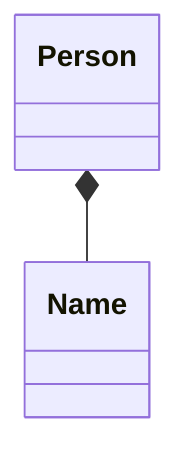
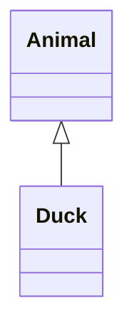
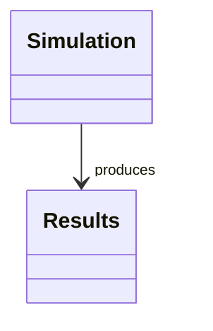
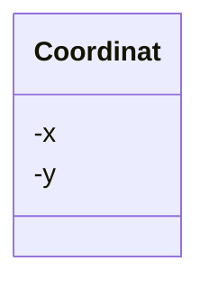
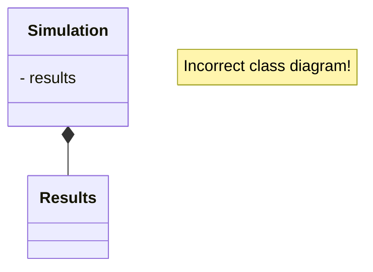
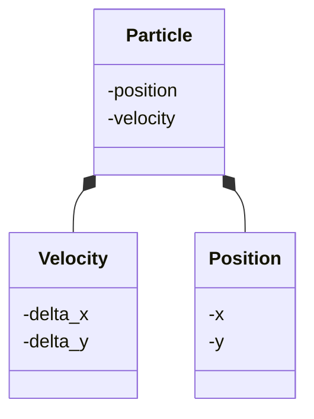

# Has-a relationships

!!!- info "Learning objectives"

    - Understand the two types of 'has-a' relationships
    - Practice to use composition

???- question "For teachers"

    Prerequisites are:

    - Learners have .

    Teaching goals are:

    - Learners .

    Teaching form used:

    - .

    Lesson plan:

    - 5 mins: prior knowledge
      - Imagine a university, departments, professors, the department of biology, the department of physics. Which relationships are there?
      - A university has departments. Departments have professors. Is this the same type of relationship? Hint: what happens if the bigger one ends existing?
    - 5 mins: presentation
    - 10 mins: demonstration `is_zero`
    - 25 mins: challenge
    - 10 mins: feedback

# `struct` relations

Good (:innocent:) data structures:

-   Increase expressiveness
-   **Bundles data that belongs together**
-   Ensures correct state of the program

## Class relations

In this course, we use only these types of relations:

- composition, a 'has-a' relationship
- inheritance, a 'is-a-type-of' relationship
- association, a 'uses' relationship

> An example of composition

In English this would be read as 'a person has a name'.

> An example of inheritance

In English this would be read as 'a duck is a type of animal'.

> An example of association

In English this would be read as 'a simulation creates results'.

## A 'has-a' relationship

When one data type has a 'has-a' relationship with another, 
this is called *composition*.

A `Coordinat` has an `x` and `y`. 
This is close to English, as it should be.

However, 'has a' is not always a literal translation.
Below is an incorrect class diagram:

Although we could say 'a simulation has results', a simulation does
not own these results. It does not manage the state of the results.
Instead, a simulation has an association with the results it produces.

## Composition versus aggregation

A university has departments, where a department has professors.
These are two different 'has-a' relationships.

Has-a relationship                     |Composition                                               |Aggregation
---------------------------------------|----------------------------------------------------------|--------------------------------------------------------------------
Example                                |A university has departments                              |A department has professors
Ownership of its elements              |Yes, a university owns its departments                    |No, a department allows professors to group
What happens to elements when destroyed|Destroyed: when a university closes, all departments close|Left intact: when a department closes, all professors live afterwards

!!! note "In this course, we never use aggregation"

## Composition of structs

-   [C.1. Organize related data into structures (structs or classes)](https://isocpp.github.io/CppCoreGuidelines/CppCoreGuidelines#Rc-org)

## Exercise 1: design a struct (15 mins)

Goal:

-   to convince design is trickier than one thinks
-   to convince design has implications
-   to grow appreciation of classes

What are their elements? Which do you guess are structures? Were they?

-   A coordinate in 3 dimensions :innocent:
-   A velocity in two dimensions
-   A circle
-   A square

## Exercise 2: a coordinate in 3 dimensions

-   consists out of an `x`, `y` and `z` coordinate
-   `struct`: all combinations valid

But:

-   Spherical coordinate: radial distance, polar angle, azimuthal angle
-   distance must be positive, hence `class`

## Exercise 3: a velocity in two dimensions

-   consists out of a `delta_x`, `delta_y`: `struct`
-   consists out of a `angle`, `speed` (:monocle_face:): maybe `class`

## Exercise 4: a circle

A circle has:

-   a center coordinat and ...
    -   a diameter (:monocle_face:): maybe `struct`
    -   a radius (:monocle_face:): maybe `struct`
-   three coordinats: class, must avoid colinearity

## Exercise 5: a square

A square has

-   a center coordinat and size (:monocle_face:) and ...
    -   maybe an angle (:monocle_face:)
-   a top-left coordinat and size (:monocle_face:) and ...
    -   maybe an angle (:monocle_face:)
-   a two opposing coordinats: struct?

