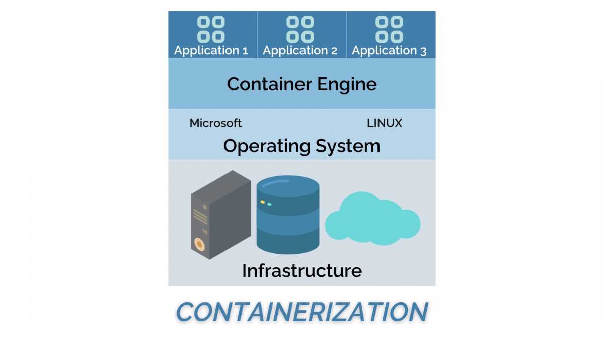
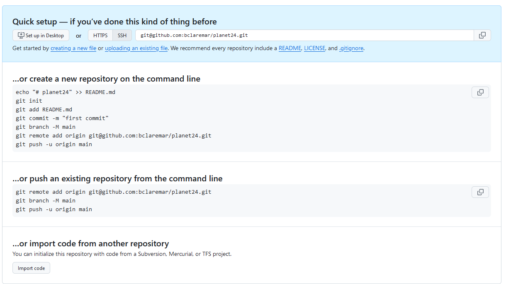
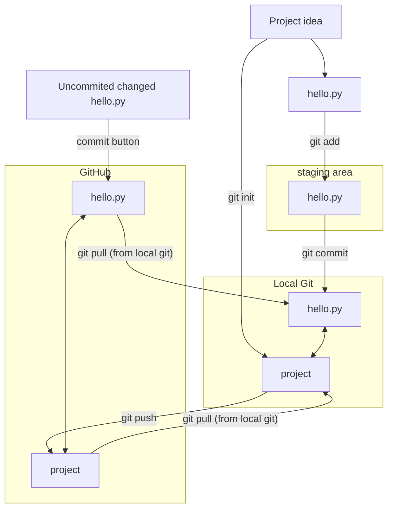

---
tags:
  - deployment
  - deploy
  - code
---

# Deploy your code

!!! questions

    - How to make your program work for others?

!!! info "Learning outcomes of 'Deployment'"

    - I can mentalize the installation needs from the users' perspective
    - I can evaluate different available tools for reproducibility and installations
    - I can make an installation instruction for potential users

!!! info "Content"

    - We will prepare for installation of your code
    - But also...
        - some theory of packages
        - some theory of workflows
        - some theory of containers
        - get some hands on

???- note "Instructor notes"

    Prerequisites are:

    - ...

    Lesson Plan: **FIX**

    - **Total** 30 min
    - Theory 20
    - Discussions 10 min

???- info "TOC"

    - Overview
        - Recording dependencies
        - workflows
        - containers


???- admonition "Changes"

    - implement new project
    - clear goal
    - clearer guide
    - ask about level
    - exercises
        - state where to work
        - practical things within exercise (not needing to scroll back and forth)
        - clearer instructions
        - advanced exercises

## Introduction

- It's about Distribution!

!!! note

    - Many projects/scripts start as something for personal use, but expands to be distributed.
    - Let's start in that end and be prepared.
    - The following steps can be very valuable for you in a couple of months as well as you revisit your code and don't know what it does or why you did this and that.

!!! attention

    - Make your program or workflow works for others and yourself in the future.

## Recording dependencies

- **Reproducibility**: We can control our code but how can we control dependencies?
- **10-year challenge**: Try to build/run your own code that you have created 10 (or less) years ago. Will your code from today work in 5 years if you don’t change it?
- **Dependency hell**: Different codes on the same environment can have conflicting dependencies.

### To make sure about needed dependencies

- Start with empty environment
- Nowadays platforms are less important, still "system files" may differ among OS platforms and Linux distributions
    - will your program require specific "system files"
    - are these typically not installed already?
    - in the **best world test on Windows/Mac and Linux platforms**
        - and with as empty as possible environment
- What about Shared services like a cluster where users and most staff do not have writing privileges ('sudo' rights) for system installations?

!!! discussion "Discussion: Where do you run your program?"

    - From a terminal?
    - On different computers?
    - On a cluster?

- We need to either inform what is needed to run the software in the README file
- Or provide them with everything needed
    - hopefully not interfering with other software they are using

!!! note "Ways to distribute"

    - Python packages:
        - pip (PyPI)
        - conda
    - R:
        - R repos like CRAN and GitHub (devtools)
        - conda
    - Compiled languages:
        - built binaries (platform specific)
        - install from source
            - manual
            - make
            - CMake
    - General tools
        - Containers

### Conda, pip

**These _Python-related_ tools try to solve the following problems:**

- **Defining a specific set of dependencies**, possibly with well-defined versions
    - requirements.txt...
- **Installing those dependencies** mostly automatically
- **Recording the versions** for all dependencies
- **Isolated environments** (venv, virtualenv)
    - On your computer for projects so they can use different software.
    - Isolate environments on computers with many users (and allow self-installations)
    - Using **different Python/R versions** per project??
    - Provide tools and services to **share packages**

- Let's focus here on PyPI!
    - Remember we made a package this morning!
- We'll cover the other tools after the exercise.

### Principle using python pip in a virtual environment

- We can make other users aware of the dependencies for our Python project.
- One can state those specifically as a list in a README
- Or, we can make a ready file (in python)

**Save your requirements as a file**

- You may have developed your Python program with your existing python modules environment. You may have installed some new packages during the development but did not track it in a good way.
- We need to identify what python packages a user (or you on another computer) will need, to make the program work!
    - There are many packages distributed in the "base" installation of Python so it is not just to look at the import lines in the code.
    - You may also be hard to get an overview because you have too many import lines, also distributed among files if you worked in a modular way
- So here are some steps:

- Start a python virtual environment.
    - you can do this outside the git repo to not pollute it

```console
python -m venv <path>/usertest
```

- This creates an empty virtual environment located in `<path>/usertest` directory
- Activate

```console
source <PATH>/usertest/bin/activate
```

- In Windows you may have to instead do:

```console
source <PATH>/usertest/Scripts/activate
```

- Note the ``(usertest)`` in the beginning of the prompt!
- Do note the python version and you may inform users that you know that this version is known to work!

```console
which python        #must point to the python belonging to the virtual environment
python -V            # note this version
which pip        #must point to the pip belonging to the virtual environment
```

- You can switch to the directory where you have your code and test to run it
- It may give you errors of missing packages, like ``numpy``
- Install them with

```console
pip install <package name>
```

- No need to use ´´--user``, since it will be installed in the virtual environment only.
- Do this until your program works
- Check what is installed by:

```console
pip freeze        #pip list works as well
```

- You will probably recognise some of them, but some may be more obscure and were installed automatically as dependencies.

- Save your requirements as a file that user can run to get the needed dependencies

```console
pip freeze > requirements.txt
```

- Other users can then install the same packages with:

```console
pip install --user -r requirements.txt
```

- End the isolated environment and work with other things!

```console
deactivate # deactivate the venv!
```

!!! example

    - [planet project](https://uppmax.github.io/programming_formalisms/deployment/deploy/)
    - [requirements.txt](https://github.com/bclaremar/planets-bjorn/blob/main/code/requirements.txt)

### README: installation section

**Let's take a look at different READMEs**

- Also interesting: Is there any test that makes sure it is correctly installed?

!!! example

    - R: <https://github.com/KamilSJaron/smudgeplot/tree/v0.3.0?tab=readme-ov-file#install-the-whole-thing>
    - Conda: <https://github.com/biobakery/MetaPhlAn>
    - pip: <https://github.com/deeptools/HiCExplorer>
    - pip: <https://github.com/caleblareau/mgatk?tab=readme-ov-file>
    - binaries/executable: <https://github.com/dougspeed/LDAK?tab=readme-ov-file#how-to-obtain-ldak>

## Exercises 20-30 min

- We already have a file called ``README.md``, that is used for information for the course participants.
- Let's work with a README file for potential users. We can call it ``README-EXT.md``

!!! info "Intro"

    - (External) Users should be able to install the the complete tool, including dependencies:
    . Repo work
        - work on GitHub!
        - When modifying repo, use a group specific branch
        - When done, merge
    - In the end we do code review together of the merging conflicts

    ???- info "Hints"

        - The main program ``main.py`` is in the repo.
        - ``bacsim`` is a python package needed by ``main.py``
        - available here: <https://test.pypi.org/project/bacsim/1.0.1/>

???+ question "(In groups) Will people need any additional packages for this tool?"

    - Test in isolated environment (``venv``) on local computer if there are errors
    - That is, are there any more packages needed
    - follow the example above

???+ question "(In groups) Make a 'requirements.txt' file (if needed)"

    - each group in different branches
    - then merge and teacher does code review

???+ question "(In groups) Make 'installation instruction' in groups"

    - each group in different branches
    - then merge and teacher does code review

## Going further with deployment


[Python packaging](https://aaltoscicomp.github.io/python-for-scicomp/packaging/).

- **Possibilities for other languages can be**
    - C/C+
        - CMake
        - Conda
    - Fortran
        - Fortran package manager
    - Julia
        - Pkg.jl

- [More info](https://uppmax.github.io/programming_formalisms_intro/reproducible_deeper.html#recording-dependencies)

- [The tools](https://uppmax.github.io/programming_formalisms_intro/reproducible_deeper.html#the-tools)


**Course advertisement**
[Python for scientific computing](https://aaltoscicomp.github.io/python-for-scicomp/)

### Containers

- Containers let you install programs without needing to think about the computer environment, like

    - operative system
    - dependencies (libraries and other programs) with correct versions



> From [Nextlabs](https://www.nextlabs.com/what-is-containerization/)

!!! info

    - 2(3) types

        1. Singularity/Apptainer perfect for HPC systems
        2. Docker that does not work on HPC-systems

            - But docker images can be used by Singularity and Apptainer

    - Everything is included
    - Workflow:

        - Download on Rackham or local computer
        - Transfer to Bianca
        - Move to from wharf to any place in your working folders on Bianca

    - Draw-backs

        - you install also things that may be already installed
        - therefore, probably more disk space is needed

!!! info "More info"

    - [Singularity course](https://pmitev.github.io/UPPMAX-Singularity-workshop/)
    - [Environments by CodeRefinery](https://coderefinery.github.io/reproducible-research/environments)
    - [Containers in the extra material](https://uppmax.github.io/programming_formalisms_intro/reproducible_deeper.html#containers)


### Workflows

!!! info "See also"

    **Learn more**
    [Workflow management by CodeRefinery](https://coderefinery.github.io/reproducible-research/workflow-management/)
    [Snakemake by CodeRefinery](https://nbis-reproducible-research.readthedocs.io/en/course_2104/snakemake/)

### Make a file executable by its own

- Run a python script without the ``python`` before!

- This line helps in the top of the main script:

```bash
#!/bin/env python
```

- Then the python active in "PATH" will automatically be used
    - especially important on a shared system where python is not in the typical "/usr/bin/python" path.


### Compiled languages

- [Build Systems Course](https://github.com/PDC-support/build-systems-course)


### Ignoring files and paths with .gitignore

Compiled and generated files are not committed to version control. There are many reasons for this:

- Your code could be run on different platforms.
- These files are automatically generated and thus do not contribute in any meaningful way.
- The number of changes to track per source code change can increase quickly.
- When tracking generated files you could see differences in the code although you haven't touched the code.

For this we use `.gitignore` files.

- Read more <https://uppmax.github.io/programming_formalisms_intro/git_deeper.html>

!!! example "From our project repo"

    <programming_formalisms_project_summer_2025/blob/main/.gitignore>

## (Optional) Start a Git/GitHub repo from existing project

!!! note

    - Many projects/scripts start as something for personal use, but expands to be distributed.
    - Let's start in that end and be prepared.
    - The following steps can be very valuable for you in a couple of months as well as you revisit your code and don't know what it does or why you did this and that.

!!! info "Principle"

    - Let's say you have some code you have started to work with
    - Initiate git project
        - Be in a terminal and go to the ``planets`` folder, which will be the project repository (**repo**)
        - run ``git init``
        - make sure that there is a ``.git`` directory created
    - stage and commit
    - upload to github

### Initial code base

- Let's say you have some code you have started to work with

- Choose one of the following

???- question "Exercise A: Start project from one of your existing projects"

    - Just use an existing programming project you have today
    - use it in the follwong steps.

???- question "Exercise B: Start the test project"

    - Make a ``test_project`` directory in a good place (like a ``Programming formalisms`` course folder)
    - Create and save a file ``hello.py`` with the following code base and the in-code documentation answering the question "why".

    ```python
    # We just want some output from a simple program
    print('Hello world!')
    ```

## Initiate a project

???- question "Exercise: Initiate the project"

    - Be in a terminal and go to the ``project`` folder, which will be the project repository (**repo**)
    - run ``git init``
    - make sure that there is a ``.git`` directory created
        - you have to show hidden files, in bash terminal with ``ls -a``

    - Now you have a git repo called ``test_project``
    - check with the command: ``git status``
    - It is always a safe command to run and in general a good idea to do when you are trying to figure out what to do next:

### Add/Commit

- So far, there is no content. We have to manually add the content to the repo.

???- question "Exercise: Add and commit the content"

    - Add and Commit your changes

    ```console
    git add
    git commit -m 'first commit'
    ```

    - Look and understand at the output of the following commands

    ```console
    git status
    git log
    git log --stat
    git log --oneline
    ```

### Upload to GitHub

???- question "Exercise: Follow the steps below"

    - Make sure that you are **logged into GitHub**.

    <figure markdown="span">
    { width="500" }
    </figure>


    - To create a repository we either click the green button "New" (top right corner).

    - Or if you see your profile page, there is a "+" menu (top right corner).

    { width=60% }

    ---

    - On this page choose a project name, e.g. ``test_project``

    - **NOTE** It is not necessary to have the same name but it makes things easier to know what is what when syncing between GitHub and git.

    - For the sake of this exercise **do NOT select** "Initialize this repository with a README"
    - and **NO Licence**

    
    > Example project

    - Press "**Create repository**"

    

    - Choose **html**
    - Copy-paste the code for "**…or push an existing repository from the command line**"
    - Go to **local git terminal** and go to the **git project you started above**
    - Paste the code

    - Did it work??
    - Reload the GitHub page and see the fiels present locally is also present there.

    **Done!**

### What we did




## Summary

!!! info "Key points"

    **Make sure it works for others or yourself in the future!**


!!! admonition "Parts to be covered!"

    - &#9745; Source/version control
        - Git
        - We have a starting point!
        - GitHub as remote backup
        - branches
    - &#9745; Planning
        - &#9745; Analysis
        - &#9745; Design
    - &#9745; Testing
        - Different levels
    - &#9745; Collaboration
        - GitHub
        - pull requests
    - &#9744; Sharing
        - &#9745; open science
        - &#9744; citation
        - &#9744; licensing
        - &#9745; deploying
    - &#9744; Documentation
        - &#9745; in-code documentation
        - &#9744; finish documentation

