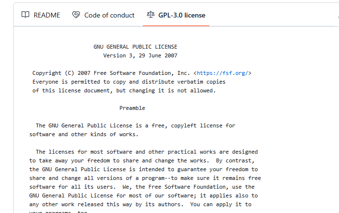

---
tags:
  - documentation
  - doc
  - end
  - ending
---

# Ending documentation

!!! questions

    - How can the user understand how to run your program and what it does?

???+ info "Learning outcomes of 'Documentation'"

    learners

    - know the most important sections for a full public README
    - can make citation info
    - know how to find instruction of going to more sophisticated documentation

!!! info "Content"

    - content of README
        - installation
        - get started
        - test
        - citation

    - Revisit licence

    - View other possibilities
        - Wiki
        - GitHub pages/ReadTheDocs
        - MkDocs/sphinx

## Revisiting documentation

!!! admonition "Documentation comes in different forms"

    - What *is* documentation?
        - **Tutorials**: learning-oriented, allows the newcomer to get started
        - **How-to guides**: goal-oriented, shows how to solve a specific problem
        - **Explanation**: understanding-oriented, explains a concept
        - **Reference**: information-oriented, describes the machinery
        - **In-code documentaion — docstrings**

        **Not to forget**

        - Project documentation:
            - requirements: what is the goal of the software, risks, platforms
            - the analysis: pseudocode and UML
            - risk analysis

**There is no one size fits all**: often for small projects a `README.md` or
`README.rst` can be enough (more about these formats later).

### Where are we?

**DONE**

- &#9745; In-code documentation
- &#9745; Project documentation:
    - requirements: what is the goal of the software, risks, platforms
    - the analysis: pseudocode and UML
    - risk analysis

**Finalize today**

- &#9744; README
    - &#9744; installation instruction
    - &#9744; Tutorial: get started
    - &#9744; Citation

**Further documentation for future projects**

- &#9744; **License**
- &#9744; **Tutorials**: learning-oriented, allows the newcomer to get started
- &#9744; **How-to guides**: goal-oriented, shows how to solve a specific problem
- &#9744; **Explanation**: understanding-oriented, explains a concept
- &#9744; **Reference**: information-oriented, describes the machinery

## Markdown

- One of the most popular lightweight markup languages.

```markdown
# This is a section heading in Markdown   

## This is a subsection header

Nothing special needed for a normal paragraph.

    This is a code block


**Bold** and *emphasized*.

A list:
- this is an item
- another item

There is more:
,
[links](URL),
tables...
```

!!! info "Read more"

    [reStructuredText and Markdown](../extra_bc/documentation_deeper.md/#restructuredtext-and-markdown)

## The README

### Example content

- About
- Installation (with dependencies and testing)
- Get started
- Use cases
- Citation

### About

- About the software
- What does it do?
- One (Punch-)line describing what it does.
    - Also in GitHub in upper right corner!
- More information below below the first description

### Installation section

**Let's take a look at different READMEs**

- Also interesting: Is there any test that makes sure it is correctly installed?

!!! example

    - R: <https://github.com/KamilSJaron/smudgeplot/tree/v0.3.0?tab=readme-ov-file#install-the-whole-thing>
    - Conda: <https://github.com/biobakery/MetaPhlAn>
    - pip: <https://github.com/deeptools/HiCExplorer>
    - pip: <https://github.com/caleblareau/mgatk?tab=readme-ov-file>
    - binaries/executable: <https://github.com/dougspeed/LDAK?tab=readme-ov-file#how-to-obtain-ldak>

### Get started

- This session can be "running some test data" to get an overview of what the program can perform.
- It may describe how to get test data
- Example: <https://github.com/KamilSJaron/smudgeplot/tree/v0.3.0?tab=readme-ov-file#runing-this-version-on-sacharomyces-data>

### Use cases

- This may sometimes be merged with the previous section

- **How-to guide**: goal-oriented, shows how to solve a specific problem
- May be a sub-set of the most important commands, depending on how wide the program is.
- Example: <https://github.com/KamilSJaron/smudgeplot/tree/v0.3.0?tab=readme-ov-file#runing-this-version-on-sacharomyces-data>

???- discussion "would it be needed for your project?"

### Contributions

- How to contribute?
- Example: <https://github.com/KamilSJaron/smudgeplot/tree/v0.3.0?tab=readme-ov-file#runing-this-version-on-sacharomyces-data>

### Licensing

- We use GPL-3 in the project

> Strong copyleft share-alike (GPL, AGPL)
> Derivative work is free software and derivative work extends to the combined project
> If the licenses of components are strong copyleft, one must use the same license

- We can click on the license and a image will also show up!

    - [LICENSE](https://github.com/programming-formalisms/programming_formalisms_project_summer_2025/blob/main/LICENSE)

???- question "How does that look like?"

    

!!! info "See also"

    [Extra material about licensing](https://uppmax.github.io/programming_formalisms_intro/sharing_deeper.html#licensing)

### Acknowledgements

- Add references that inspired or added algorithms to your code
- Example: <https://github.com/KamilSJaron/smudgeplot/tree/v0.3.0?tab=readme-ov-file#acknowledgements>

### References/Citation

- Think the same as for a scientific paper

**Practical recommendations**:

- Get a [DOI](https://en.wikipedia.org/wiki/Digital_object_identifier) using [Zenodo](https://zenodo.org) or similar services.
- Open source license can't demand citation, but it is required by science ethics anyway.
- Make it as easy as possible! Clearly say what you want cited.
- Make it easy for scripts and tools, use the [Citation File Format](https://citation-file-format.github.io).
- [GitHub now supports CITATION.cff files](https://docs.github.com/en/repositories/managing-your-repositorys-settings-and-features/customizing-your-repository/about-citation-files)

This is an example of a simple `CITATION.cff` file:

```yaml
cff-version: 1.2.0
message: "If you use this software, please cite it as below."
authors:
  - family-names: Druskat
    given-names: Stephan
    orcid: https://orcid.org/0000-0003-4925-7248
title: "My Research Software"
version: 2.0.4
doi: 10.5281/zenodo.1234
date-released: 2021-08-11
```

Recommended format for software citation is to ensure the following information
is provided as part of the reference [Katz, Chue Hong, Clark, 2021](https://f1000research.com/articles/9-1257/v2):

- Creator
- Title
- Publication venue
- Date
- Identifier
- Version
- Type

- Digital object identifiers (DOI) are the backbone of the academic reference and metrics system.
- CodeRefinery has an exercise to see how to make a GitHub repository citable by archiving it on the Zenodo archiving service. If you are interested,  have a look [here](https://coderefinery.github.io/github-without-command-line/doi/#making-your-project-citable)

- Example: <https://github.com/KamilSJaron/smudgeplot/tree/v0.3.0?tab=readme-ov-file#reference>

!!! example "Examples of README files"

    - R: <https://github.com/KamilSJaron/smudgeplot/tree/v0.3.0?tab=readme-ov-file#install-the-whole-thing>
    - Conda: <https://github.com/biobakery/MetaPhlAn>
    - pip: <https://github.com/deeptools/HiCExplorer>
    - pip: <https://github.com/caleblareau/mgatk?tab=readme-ov-file>
    - binaries/executable: <https://github.com/dougspeed/LDAK?tab=readme-ov-file#how-to-obtain-ldak>

!!! info "See also"

    - [Collection of (Academic) software repo links](https://www.softwareheritage.org/)
    - [Awesome list of Research Software Registries](https://github.com/NLeSC/awesome-research-software-registries)

## Exercises

### Exercises 30-40 min

- We already have a file called ``README.md`` in ``/learners`` folder, that is used for information for the course participants.
- Let's work with a README file for potential users. We can call it ``README-EXT.md``

!!! info "Intro"

    - (External) users should be able to install and use the the complete tool, including dependencies
    - Repo work
        - Work on GitHub!
        - When modifying repo, use a group specific branch
        - When done, merge
    - In the end we do code review together of the merging conflicts

???- tip "Markdown Cheat-Sheet"

    ```markdown
    # This is a section heading in Markdown   

    ## This is a subsection header

    Nothing special needed for a normal paragraph.

        This is a code block

    **Bold** and *emphasized*.

    A list:
    - this is an item
    - another item

    There is more:
    ,
    [links](URL),
    tables...
    ```

### Group 1: Make 'installation instruction' in groups

???- info "Hints **FIX**"

    - The main program ``main.py`` is in the repo.
    - ``weather`` is a python package needed by ``main.py``
    - available here: <https://test.pypi.org/project/weather/1.0.1/>

???+ question "Make 'installation instruction'"

    - Work together in group
    - Do ``git push`` first from local command-line, everyone!
    - 1 person types directly in GitHub
    - Create branch ``installation``
    - Open the file ``learners/README-EXT.md``

    - Be inspired by the examples above
    - Include the sections "**Dependencies**" and "**Installing**"
    - When done, make pull request to main

### Group 2 Formulate an 'About' section

???+ question "Make 'About' and 'Getting started'"

    - Work together in group
    - Do ``git push`` first from local command-line, everyone!
    - 1 person types directly in GitHub
    - Create branch ``about``
    - Open the file ``learners/README-EXT.md``

    - Be inspired by the examples above
    - Include the section "**About**" which should give some background of what the program does and how to run it.
    - Include the section '**Getting started**'
    
    - When done, make pull request to main

### Group 3: Formulate "Sharing sections"

???+ question "Make sections about 'Getting started', 'Citation', 'License' and 'Authors'"

    - Work together in group
    - Do ``git push`` first from local command-line, everyone!
    - 1 person types directly in GitHub
    - Create branch ``sharing``
    - Work with a CITATION(.cff) file

    ???- question "How?"

        **Easier**

        Create a learners/**CITATION** file (no file extension) with most of the following lines
        
        - Creator
        - Title
        - Publication venue
        - Date
        - Identifier
        - Version
        - Type

        **Harder**

        - open the file ``learners/CITATION.cff`` file
        - Fill it in

        ???- question "How can it look like?"

            ```yaml
            cff-version: 1.2.0
            message: "If you use this software, please cite it as below."
            authors:
              - family-names: Druskat
                given-names: Stephan
                orcid: https://orcid.org/0000-0003-4925-7248
            title: "My Research Software"
            version: 2.0.4
            doi: 10.5281/zenodo.1234
            date-released: 2021-08-11

    - Open the file ``learners/README-EXT.md``
    - Be inspired by the examples above
    - Include the sections
        - 'Citation', link to the CITATION(.cff) file
        - 'License' link to the license
            - try relative or absolute path!
        - 'Authors', List of the involved learners
        - 'Acknowledgements'
            - Add references that inspired or added algorithms to your code
            - [Example](https://github.com/KamilSJaron/smudgeplot/tree/v0.3.0?tab=readme-ov-file#acknowledgements)

    - When done, make pull request to main

???- solution "Example solution from last course"

     [programming_formalisms_project_autumn_2024](https://github.com/programming-formalisms/programming_formalisms_project_autumn_2024/blob/master/README-EXT.md)

### Discussion of the README file

???- question "Discussion: Describe what you've done and why?"

    - We go through the README!
    - Teacher makes Code review if needed

## Going further with documentation

### Wikis

- Popular solutions (but many others exist):
    - [MediaWiki](https://www.mediawiki.org)
    - [Dokuwiki](https://www.dokuwiki.org)
    - These typically needs to be hosted and maintained
- Also on GitHub!
    - [About wikis](https://docs.github.com/en/communities/documenting-your-project-with-wikis/about-wikis)
    - [Adding or editing wiki pages](https://docs.github.com/en/communities/documenting-your-project-with-wikis/adding-or-editing-wiki-pages)
    - Example with [WRF weather model](https://github.com/wrf-model/WRF/wiki)

### HTML static site generators

There are many tools that can turn RST or Markdown into beautiful HTML pages:

- [Sphinx](http://sphinx-doc.org)
    - Generate HTML/PDF/LaTeX from RST and Markdown.
    - [Read the docs style](https://sphinx-rtd-theme.readthedocs.io/en/stable/)
    - [HICexplorer documentation](https://hicexplorer.readthedocs.io/en/latest/)
- [Jekyll](https://jekyllrb.com)
    - Generates HTML from Markdown.
    - GitHub supports this without adding extra build steps.
- [MkDocs](https://www.mkdocs.org/) **← we will exercise this, this is how this lesson material is built**
    - Generates HTML from Markdown.
    - Example: [Programming formalisms course](https://uppmax.github.io/programming_formalisms)

There are many more ...

### Deployment on servers

GitHub, GitLab, and Bitbucket make it possible to serve HTML pages:

- [GitHub Pages](https://pages.github.com) (GH-pages) ← this is what we and many others use for course and tutorial material
- [Bitbucket Pages](https://www.w3schools.com/git/git_remote_pages.asp?remote=bitbucket)
- [GitLab Pages](https://pages.gitlab.io)
- [Read the docs](http://readthedocs.org) ← this is what NBIS uses for some course material
    - hosts public Sphinx documentation for free!
    - Example: [NBIS Introduction to Git](https://nbis-reproducible-research.readthedocs.io/en/course_1803/git/)

!!! info "GitHub pages"

    - Easiest. Everything is local to GitHub
    - This lesson material

!!! info "Read the Docs"

    - Somewhat more possibilities, like having several versions of documentation to switch between.

### What contributes to reusability?

What contributes to you being able to reuse stuff that others make, and others
(or you) being able to reuse your stuff? When you find a repository with code
you would like to reuse, you may look at the following things to determine its
reusability:

!!! note

    - Date of last code change
      > ... is the project abandoned?
    - Release history
      > ... how about stability and backwards-compatibility?
    - Versioning
      > ... will it be painful to upgrade?
    - Number of open pull requests and issues
      > ... are they followed-up?
    - Installation instructions
      > ... will it be difficult to get it running?
    - Example
      > ... will it be difficult to get started?
    - License
      > ... am I allowed to use it?
    - Contribution guide
      > ... how to contribute and decision process?
    - Code of conduct
      > ... how to make clear which behaviors are unacceptable and discouraged? How violations of Code of conduct will be handled?
    - Trust and community
      > ... somebody you trust recommended it?

## Summary

!!! info "Key points"

    **Make sure it works for others or yourself in the future!**

### We are done!

!!! admonition "Parts to be covered!"

    - &#9745; Source/version control
        - Git
        - We have a starting point!
        - GitHub as remote backup
        - Branches
    - &#9745; Planning
        - &#9745; Analysis
        - &#9745; Design
    - &#9745; Testing
        - Different levels
    - &#9745; Collaboration
        - GitHub
        - pull requests
    - &#9745; Sharing
        - &#9745; open science
        - &#9745; citation
        - &#9745; licensing
        - &#9745; deploying
    - &#9745; Documentation
        - &#9745; in-code documentation
        - &#9745; finish documentation

!!! info "See also"

    [Documentation by CodeRefinery](https://coderefinery.github.io/documentation/)
