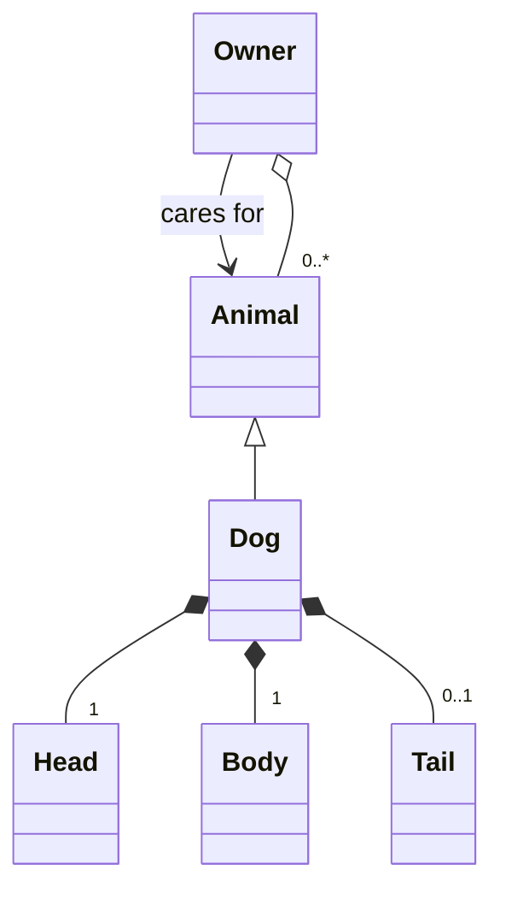

---
tags:
  - OOP
  - OOD
  - object-oriented
  - object oriented
  - programming
  - development
---
# Object Oriented development

!!! Hint "The most important thing for your Design and Analysis Documents"

    A Design document or Requirements document must be kept up to date with your code, If you during coding realize that you need another class or feature these should be added to the documentation do not be afraid to refactor your designs.

!!! info "Learning outcomes"

    - Understand the benefits of object-oriented development, including smaller semantic gaps for improved understanding and easier modification of models.
    - Learn the definition and characteristics of an object, including its ability to save state and perform operations.
    - Comprehend the principles of object-oriented development, such as information hiding, encapsulation, and message passing.
    - Understand the definition and structure of a class as a collection of objects with common traits and behaviors.
    - Recognize the importance of relationships between classes, including association, composition, in class diagrams.

???- question "For teachers"

    Prior:

    - What is a Object orientation?
    - What is a semantic gap?
    - What do we mean when we say a programming language is object oriented?

???- question "Read the material(10 min)"
    we now read the material down till exercises

Why do we suggest that Obeject Oriented design is still relevant.
Ivar Jacobson one of the Inventors of the UML language and
the opject oriented software enginering method OOSE
states

"People regard their environment in terms of objects"
`[Jacobson 1992]`


???- question "What is the impact of objects on the Semantic gap"

    Object leads to a smaller semantic gap as they are a more natural abstraction of data in the world which gives two major benefits

    - **Understanding**
    The semantic gap(The distance form input to understanding) between reality and model is smaller making the risk of misunderstanding less.

    - **Modification**
        The model tends to be local resulting from a individual item. Each of these are represented by a single object.


## Objects

!!! info "What is an object?"

    An object is an entity that is defined by being able to save state(Information) and a number of operations(Behavior).

!!! info "Object Orientation is a paradigm, not a language feature"

    - Mariam-webster defines a Paradigm as:
      philosophical and theoretical framework of a scientific school or discipline within which theories, laws, and generalizations and the experiments performed in support of them are formulated

    - Stanford Encyclopedia of Philosophy cites the work of Thomas Kuhn The Structure of Scientific Revolutions in where a work of Paradigm is not only the key theories and laws, but also—and this is what makes them paradigms—the applications of those theories in the solution of important problems

!!! info "Principles of object orientated development"

    1: **Information Hiding**
        No unit outside of the object shall know the internal workings of the object;
        Or as Jacobson states "they hide their internal structure from their surroundings"`[Ivar Jacobson 1992]`

    2: **The concept of Encapsulation**
        The behavior and information are encapsulated in the object
        `[Ivar Jacobson 1992]`

    3: **The concept of message passing**
        Each object has a external interface through which it interacts with other objects, it is the carriers of messages public(access qualifier, see below) methods of the Classes are the implementation of message passing.

???- question "What is a Class"

    >A class is a set of objects that share a common structure, common behavior, and common semantics.
    `[Booch 2007]`


The modeling software company [Visual Paradigm](https://www.visual-paradigm.com) has a guide in some common roles between object such as Association.
"If two classes in a model need to communicate with each other, there must be a link between them, and that can be represented by an association (connector)."

Composition implies a relationship where the child cannot exist independent of the parent. Example: House (parent) and Room (child). Rooms don't exist separate to a House.



Further reading:
[UML Association vs Aggregation vs Composition](https://www.visual-paradigm.com/guide/uml-unified-modeling-language/uml-aggregation-vs-composition/)


???- question "Is a programming language object oriented?"

    Object-oriented programming is a technique for programming – a paradigm
    for writing 'good' programs for a set of problems.
    If the term 'object-oriented programming language' means anything it must
    mean 'a programming language that provides mechanisms that support
    the object-oriented style of programming well'.
    `[Stroustrup B. 1998]`

!!! info "Techniques for Object oriented programming"

    Decide which classes you want;
    provide a full set of operations for each class;
    make commonality explicit by using inheritance.
    `[Stroustrup B. 1988]`


!!! hint "Why do we Break the rule?"

    In this course we do not go into the concept of
    inheritance in implementation as this is makes for a
    more complicated structure. We only concern our selfs
    with the "has a" relation ship rather than "is a" relation ship.
    we work with the composite and the aggregate relationships


### Exercise

???- question "Explore Mermaid"(5 min)"

    Open the [Mermaid](https://mermaid.js.org/) page click on Try Playground, make a object diagram either use a flowchart with each object as a box. This is quite common the other option is to use a class diagram.
    This should show some object structure

!!!- "An answer"

    ```mermaid

        classDiagram
            direction TD
            Owner --> Animal :"cares for"
            Dog*--"1"Head : "has a"
            Dog*--"1"Body : "has a"
            Dog*--"0..1"Tail : "has a"
            Owner o--"0..*"Animal : "has a"
            Animal <|-- Dog : "is a"
    ```

    ```mermaid
        flowchart TD
            Owner -->|cares for| Dog
            Dog ---|has a| Head
            Dog ---|has a| Body
            Dog ---|has a| Tail
    ```


???- question "Objects"(5 min)"
    Write a object description for Uppsala Weather station
    An object description can be done either using plain text
    A combination of plaintext and mermaid diagram either a flowchart or a class diagram, in the case of flowchart the behavior and properties or write them separately in your markdown

!!!- hint "what to add"
    Add objects that we need for our weather project such as Display, Graph, user interface etc. look in your features and requirements

!!!- hint "Where to find requirements"
    References to the requirements found either in the teacher example [requirements](https://github.com/programming-formalisms/programming_formalisms_project_autumn_2025/blob/main/docs/requirements.md) document (A requirements document is often referred to as an SRS - System/**S**oftware **R**equirement **S**pecification )
    or in your own [requirments](https://github.com/programming-formalisms/programming_formalisms_project_autumn_2025/blob/main/learners/merged_requirements.md) document. Also check your issues for features you want to include


!!!- Hint "A solution"

    ```mermaid
        flowchart TD

        DownloadService --> UserInterface
        Graph ---> UserInterface
        StatisticsData --> UserInterface
        DataSource --> StatisticsData
        DataSource --> DownloadService
        DataSource --> Graph
        StatisticsData --> Graph
        weatherStationData --> DataSource
    ```

??? question "Make an refactoring and extension of your class diagrams from [Expressive data types](https://uppmax.github.io/programming_formalisms/expressive_data_type/)" (10 min)

!!!- Hint "example of a weather station analysis class diagram"

    ```mermaid
    classDiagram
        direction TD
        namespace WeatherStationAnalyzer {

            class UserInterface {
                +start()
                +MsgGetDownload()
                +MsgApplyFilter(FilterType)
                +MsgPlotData()
                +MsgAnalyzeStats()
            }

            class DataController {
                +applyTimeFilter()
                +applyDateFilter()
                +applyRegionFilter()
            }

            class PlotService {
                +drawTimeSeries()
                +drawHistogram()
                +drawBoxPlot()
            }

            class StatsService {
                +computeAverage()
                +computeMin()
                +computeMax()
                +computeMedian()
                +computeMode()
            }

            class DownloadService {
                +exportRawData()
                +exportFilteredData()
                +exportPlot()
                +exportStats()
            }

            class GitHubDataSource {
                +loadData()
                +verifyData()
            }
        }
        %% relations
        UserInterface --> DataController
        DataController --> PlotService
        DataController --> StatsService
        UserInterface --> DownloadService
        DownloadService --> GitHubDataSource

        %% color clean classes green
        style UserInterface fill:#ddffdd,stroke:#00aa00,stroke-width:2px
        style DataController fill:#ddffdd,stroke:#00aa00,stroke-width:2px
        style PlotService fill:#ddffdd,stroke:#00aa00,stroke-width:2px
        style StatsService fill:#ddffdd,stroke:#00aa00,stroke-width:2px
        style DownloadService fill:#ddffdd,stroke:#00aa00,stroke-width:2px
        style GitHubDataSource fill:#ddffdd,stroke:#00aa00,stroke-width:2px

    ```


## Further studies(Self study)

### Inheritance(Self study)

The concept of inheritance "is a" relation ship although central to many design structures is not necessary to uphold the tenants of Object orientation.
The basic concept of inheritance is the parent to child
relationship in OO the child has all the properties and behavior of the parent, it either extends or limits(specializes) the parent object(or class).

The way we discover inheritance in OO is usually when we
see a set of object that share properties or behavior we abstract those behaviors and properties into a parent this usually happens when we transition from object design to class design and are looking to group similar objects together.
A common case where we utilize the power of inheritance, is
when we have a group of objects that share a common interface.
the interface is then implemented as an abstract class(a class that cannot be instantiated into and object.) which the other classes inherits. This common set of behavior and properties needed to convey information to a class but lets the child classes deal with the information as it will, this is a common practice when designing multiple UI for example if the CLI and the graphical UI interact with the controller class in a similar way passing messages(data) between the analysis unit and the UI this can easily be implemented as a inheritance structure.


### Design patters(self study)

???- info "Learning outcomes of Design Patterns"

    - The learners know of the "zero line" code and how it relates to software design "Zero line" Design
    - The learners can describe the general parts of a design pattern and why we use them.
    - The Learners should be able to understand the "Decorator pattern" and what problem it solves
    - Explore the concept of design patterns as blueprints for solving common software design problems.


The zero line code is the most optimal code there for the zero line design must be the most optimal?

The zero line code/design simply refers do not make something that some one else already has coded unless warranted by either security concerns (the source is not trusted such as untested code )or for learning.

Zero line Design is optimal in the sense that if some one already figure out a tried a tested method to do something don't do it yourself. Zero line design means using a tried and tested design.

???- question  "What is a Design Pattern?"

    Design patterns are typical solutions to common problems
    in software design. Each pattern is like a blueprint
    that you can customize to solve a particular
    design problem in your code.
    from [refactoring.guru](https://refactoring.guru/design-patterns)

    Gamma et al. starts describing a design pattern with a quote from Christopher alexander "Each pattern describes a problem which occurs over and over again in our environment,and then describes the core of the solution to that problem in such away that you can use this solution a million time over , without doing it the same way twice" which is a qoute about buildings and towns, but they go on to claim that this is applicable in object design as well`[Gamma et al., 1995]`

???- question  "Why do we use Design Patterns?"

    The truth is that you might manage to work as a programmer for many years without knowing about a single pattern. A lot of people do just that. Even in that case, though, you might be implementing some patterns without even knowing it. So why would you spend time learning them?

    Design patterns are a toolkit of tried and tested solutions to common problems in software design. Even if you never encounter these problems, knowing patterns is still useful because it teaches you how to solve all sorts of problems using principles of object-oriented design.

    Design patterns define a common language that you and your teammates can use to communicate more efficiently. You can say, “Oh, just use a Singleton for that,” and everyone will understand the idea behind your suggestion. No need to explain what a singleton is if you know the pattern and its name.
    from [refactoring.guru](https://refactoring.guru/design-patterns)

Exercise

???+ "Design Patterns"

    Read the [Decorator](https://refactoring.guru/design-patterns/decorator) pattern is there a function or Class that would fit this particular problem?

!!! Hint "Something that must be done differently but belong together"
    when looking for pattern it is always good to go through what you have design or code so far and check if something just changes how a thing looks. Or when you need to access multiple data formats in one way


!!!- "Answer"

    The temperature converter in utils is an excellent case where generalization by a decorator that lets you add as many converters to the system as you like

???- "Extra assignment"

    Using refactoring.guru find an design Describe in a design document a pattern that is useful for the weather project

<!-- consider adding images of each book used in the refrence -->

## References

- `[Ivar Jacobson 1992]` Ivar Jacobson et al., Object-Oriented Software Engineering, a usecase driven approach, Addison-wesley 1992.
- `[Booch 2007]` Grady Booch et al.,Object-oriented analysis and design with applications -3rd ed,Addison-wesley 2007.
- `[Stroustrup B. 1998]` Stroustrup B. What is “Object-oriented Programming”? Software, IEEE. 1988 Jun 1;5:10–20.
-`[Gamma et al., 1995]` Gamma, Erich, et al.
  "Elements of reusable object-oriented software." Design Patterns (1995).

