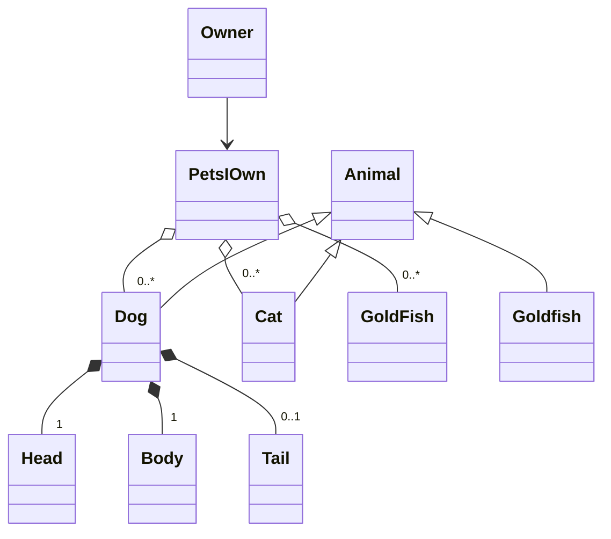

# Object Oriented development

???- info "Learning objectives"
    - Understand the benefits of object-oriented development, including smaller semantic gaps for improved understanding and easier modification of models.
    - Learn the definition and characteristics of an object, including its ability to save state and perform operations.
    - Comprehend the principles of object-oriented development, such as information hiding, encapsulation, and message passing.
    - Understand the definition and structure of a class as a collection of objects with common traits and behaviors.
    - Recognize the importance of relationships between classes, including association, composition, and aggregation, in class diagrams.
    - Explore the concept of design patterns as blueprints for solving common software design problems.
    - Develop a practical understanding of the Factory Method design pattern

???- info "Learning objectives of Design Patterns"

    - The learners know of the "zero line" code and how it relates to software design "Zero line" Design
    - The learners can describe the general parts of a design pattern and why we use them.
    - The Learners should be able to understand the "Factory pattern" and what problem it solves

>People regard their environment in terms of objects"
`[Jacobson 1992]`

This leads to a smaller semantic gap which
gives two major benefits

- **Understanding**
The semantic gap(The distance form input to understanding) between reality and model is smaller making the risk of misunderstanding less.

- **Modification**
    The model tends to be local resulting from a individual item. Each of these are represented by a single object.

## Objects

!!! info "What is an object?"

    An object is an entity that is defined by being able to save state(Information) and a number of operations(Behavior).

!!! info "Object Orientation is a paradigm, not a language feature"

    - Mariam-webster defines a Paradigm as:
      philosophical and theoretical framework of a scientific school or discipline within which theories, laws, and generalizations and the experiments performed in support of them are formulated

    - Stanford Encyclopedia of Philosophy cites the work of Thomas Kuhn The Structure of Scientific Revolutions in where a work of Paradigm is not only the key theories and laws, but also—and this is what makes them paradigms—the applications of those theories in the solution of important problems

!!! info "Principles of object orientated development"

    1: **Information Hiding**
        No unit outside of the object shall know the internal workings of the object

    2: **The concept of Encapsulation**

    3: **The concept of message passing**

???- question "What is a Class"

    >A class is a set of objects that share a common structure, common behavior, and common semantics.
    `[Booch 2007]`

The 4 most important relationship classes can have
are association, composition and aggregation

Further reading:
[Aggregation vs composition and Generalization vs Specialization](https://www.visual-paradigm.com/guide/uml-unified-modeling-language/uml-aggregation-vs-composition/)

???- question  "What is a Design Pattern"

    Design patterns are typical solutions to common problems
    in software design. Each pattern is like a blueprint
    that you can customize to solve a particular
    design problem in your code.
    from [refactoring.guru](https://refactoring.guru/design-patterns)

???- question  "Why do we use Design Patterns"

    The truth is that you might manage to work as a programmer for many years without knowing about a single pattern. A lot of people do just that. Even in that case, though, you might be implementing some patterns without even knowing it. So why would you spend time learning them?

    Design patterns are a toolkit of tried and tested solutions to common problems in software design. Even if you never encounter these problems, knowing patterns is still useful because it teaches you how to solve all sorts of problems using principles of object-oriented design.

    Design patterns define a common language that you and your teammates can use to communicate more efficiently. You can say, “Oh, just use a Singleton for that,” and everyone will understand the idea behind your suggestion. No need to explain what a singleton is if you know the pattern and its name.
    from [refactoring.guru](https://refactoring.guru/design-patterns)

### Exercise

???- "Design Patterns"

    Design a Factory method for the creation of bacteria

???- "Extra assignment"

    Using refactoring.guru find an design Describe in a design document another pattern that is useful for your project.

## References

- `[Ivar Jacobson 1992] Ivar Jacobson et al., Object-Oriented Software Engineering, a usecase driven approach, Addison-wesley 1992.
- `[Booch 2007]` Grady Booch et al.,Object-oriented analysis and design with applications -3rd ed,Addison-wesley 2007.
- `[Stroustrup B. 1998]` Stroustrup B. What is “Object-oriented Programming”? Software, IEEE. 1988 Jun 1;5:10–20.

