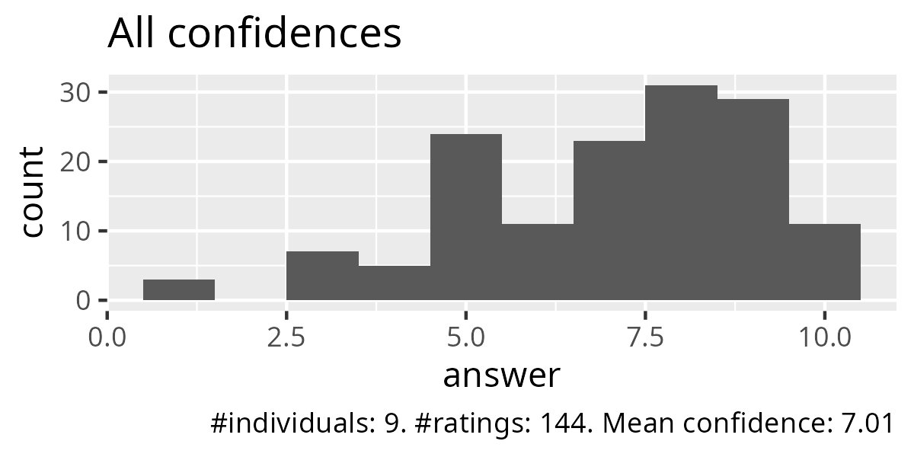
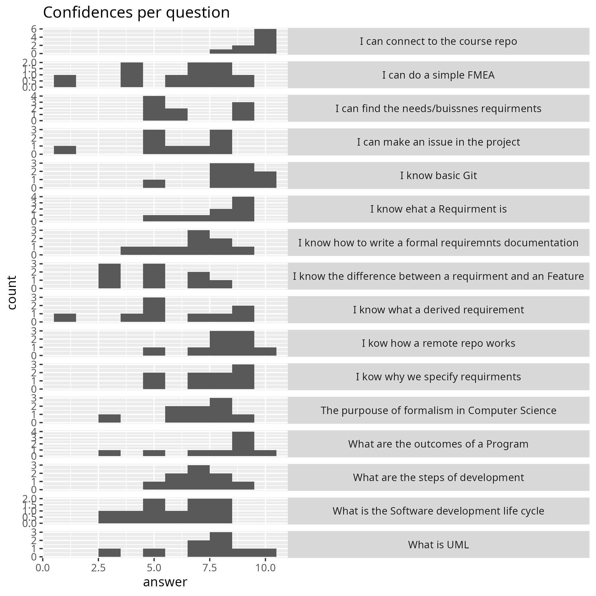
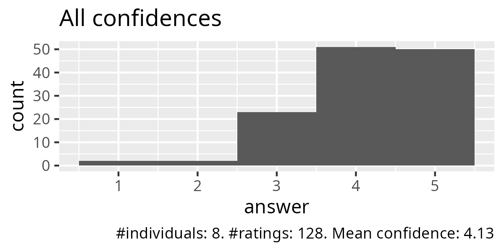
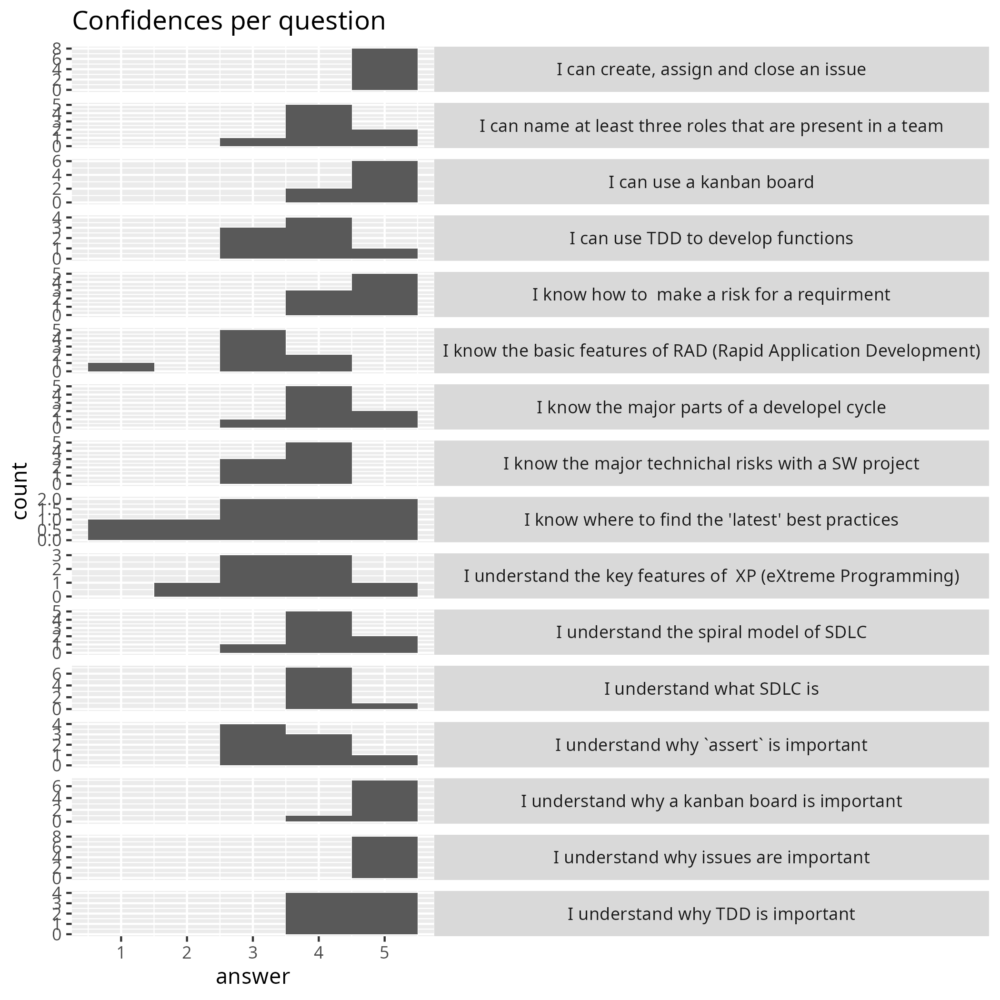
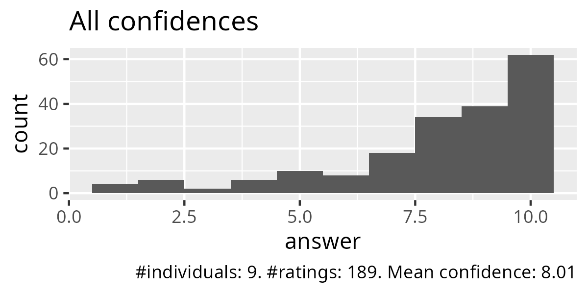
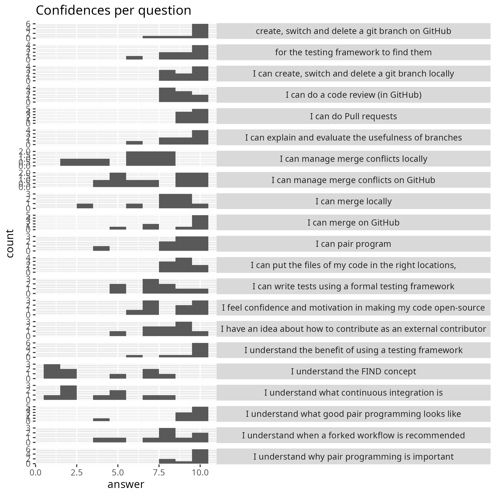
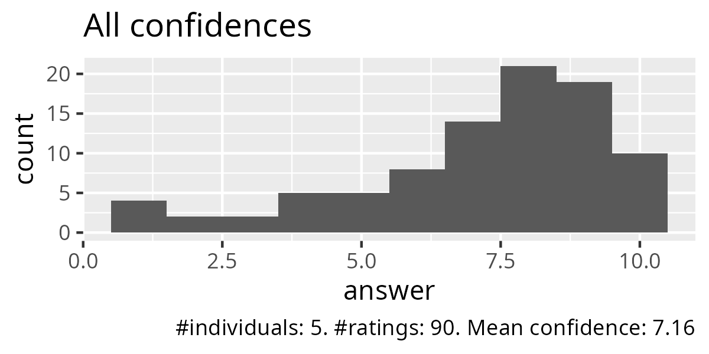
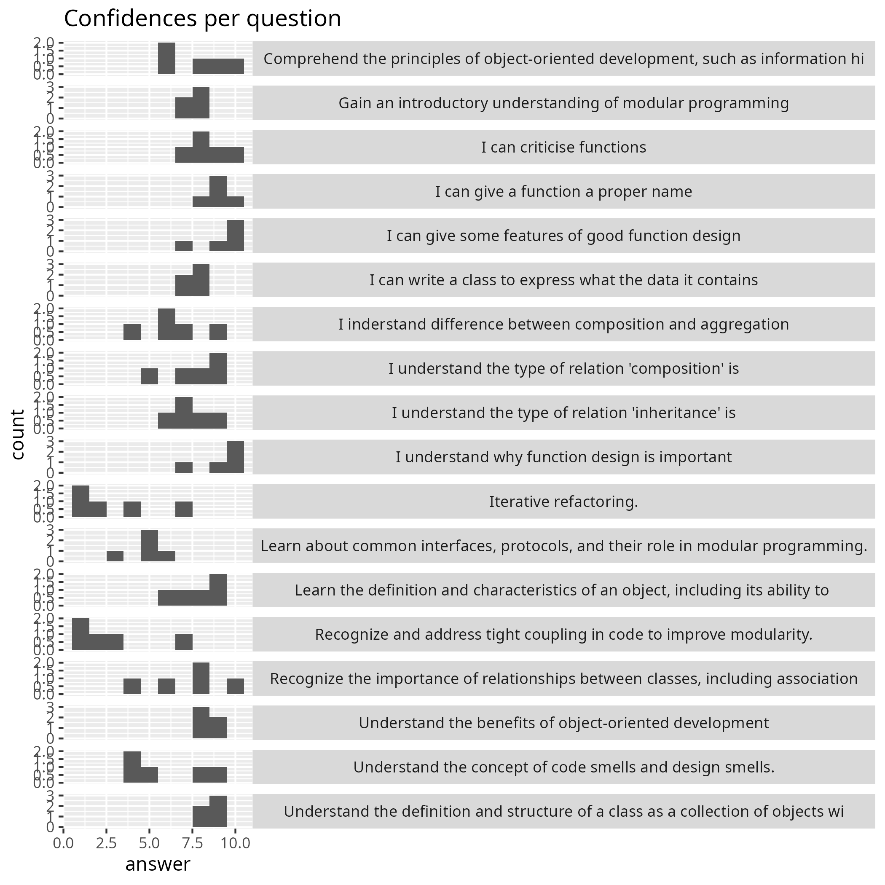
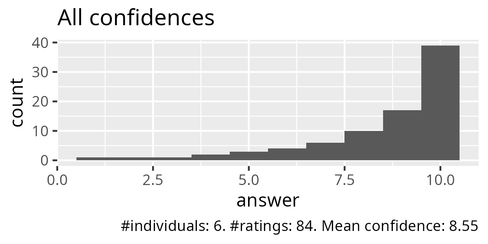
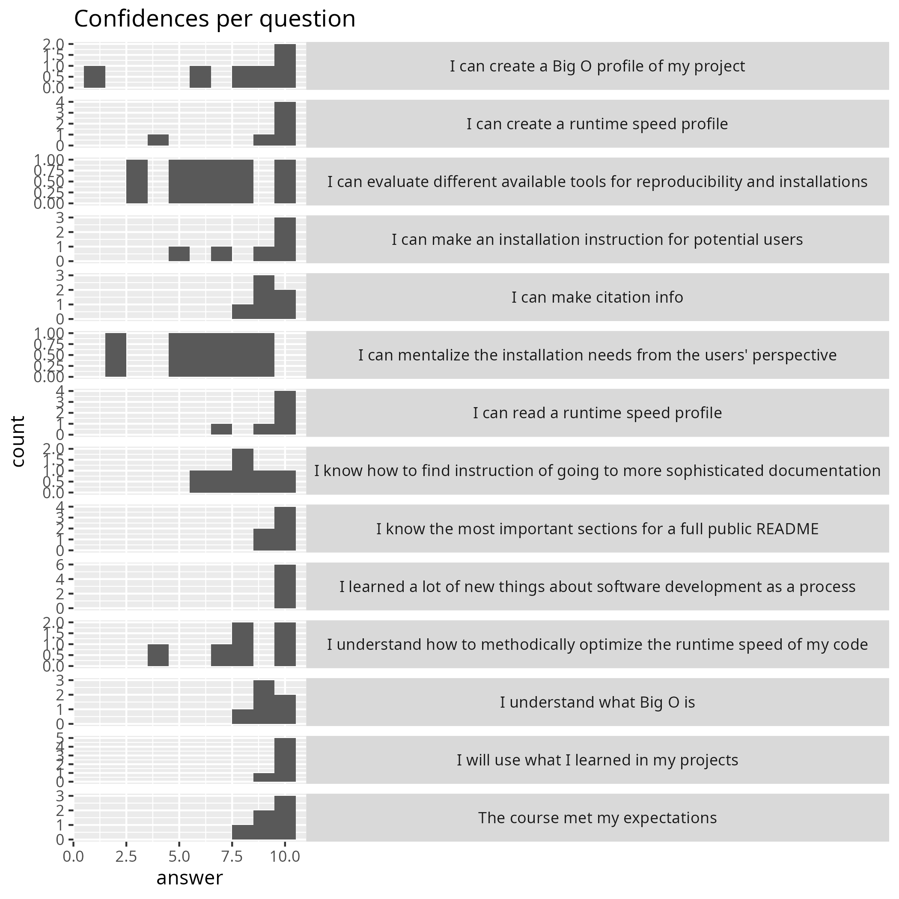

---
tags:
  - evaluation
---

# Evaluation autumn 2024

- Reflections: [Richel](../../reflections/2024_autumn/README.md)

## Monday

- [Retrospect](20241118.md)
- [Confidences per question as tally](monday_tally.csv)
- [Confidences per question as average](monday_averages.csv)

## Tuesday

- [Retrospect](20241119.md)
- [Confidences per question as tally](tuesday_tally.csv)
- [Confidences per question as average](tuesday_averages.csv)

## Wednesday

- [Retrospect](20241120.md)
- [Confidences per question as tally](wednesday_tally.csv)
- [Confidences per question as average](wednesday_averages.csv)

## Thursday

- [Retrospect](20241121.md)
- [Confidences per question as tally](thursday_tally.csv)
- [Confidences per question as average](thursday_averages.csv)

## Friday

- [Retrospect](20241122.md)
- [Teacher comments](teacher_comments.csv)
- [Confidences per question as tally](friday_tally.csv)
- [Confidences per question as average](friday_averages.csv)

<!-- markdownlint-disable MD013 --><!-- Badges cannot be split up over lines, hence will break 80 characters per line -->

| What did Richèl do well                                                                                                                                                                                                                                                          | What could Richèl Improve                                       | What did Björn do well                                      | What could Björn Improve                                                                                                                              | What did Lars do well                                                                | What could Lars Improve                                                                                                                                                            |
| -------------------------------------------------------------------------------------------------------------------------------------------------------------------------------------------------------------------------------------------------------------------------------- | --------------------------------------------------------------- | ----------------------------------------------------------- | ----------------------------------------------------------------------------------------------------------------------------------------------------- | ------------------------------------------------------------------------------------ | ---------------------------------------------------------------------------------------------------------------------------------------------------------------------------------- |
| I think Richèl carry this course. He explained well his lectures and give very good exercises. He asked good questions that challenges our thinking. He seems very prepare everyday and always there to help. Additionally, he listens to comments and give really good insight. | He is really good already. Just continue it.                    | I like his lecture in git and giving nice exercise on that. | I think next time avoid just reading the page. Simplify things and asks questions and encourage student to answer.                                    | Lars really give good insight most of the time while in lecture or even in the side. | I think the exercises, maybe make it more understandable and assess the time needed to accomplish it. Also, there is a room for improvement in the lecture.                        |
| Involving everyone with the discussions                                                                                                                                                                                                                                          | Clearer exercises. This became clearer as the course went along | Clear theory parts on the subjects                          | Clearer exercises                                                                                                                                     | Giving helpful tips when needed                                                      | Clearer exercises                                                                                                                                                                  |
| Explain everything super well and be very positive about everything                                                                                                                                                                                                              | Remake the video that was in one of the days that lagged        | Explain very vague concepts in an understandable way        | When asking questions, make them more specific so that people are more apt to answer                                                                  | Give a lot of extra knowledge that was not always in the website                     | Give a lot more real-life practical examples when explaining concepts, that would help a lot                                                                                       |
| Really great engagement and explanations. Calling people out for discussion greatly improved flow. Really felt like his heart was in the course.                                                                                                                                 | Tbh I'm really not finding anything.                            | Good help during the exercises.                             | Was at points difficult to follow the lectures, because he just read the course material out loud. Could benefit from a more free style of lecturing! | Great knowledge, really helpful.                                                     | Feel like it would be great to see him do a pair-programming exercise together with another lecturer. Got the impression that he's someone who can showcase how to be a navigator. |

<!-- markdownlint-enable MD013 -->

