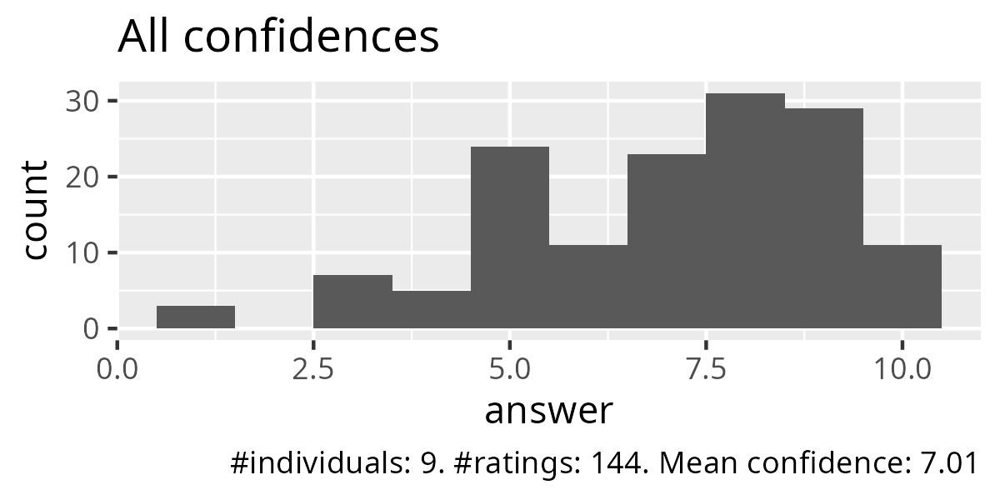
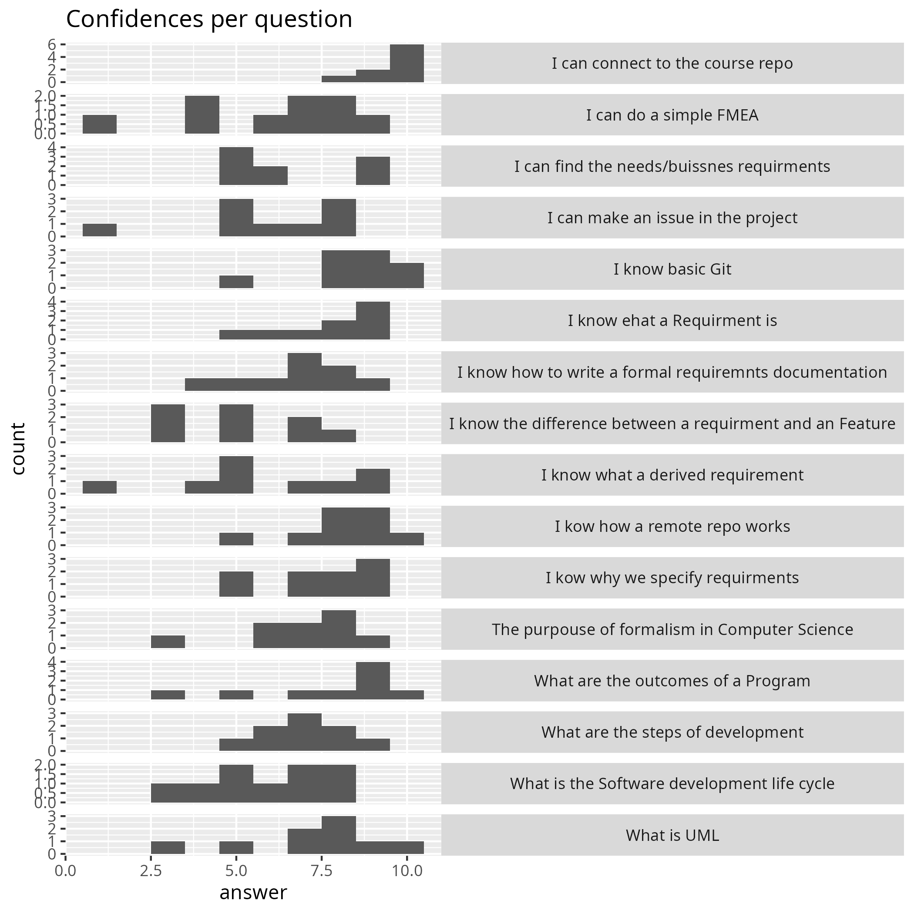
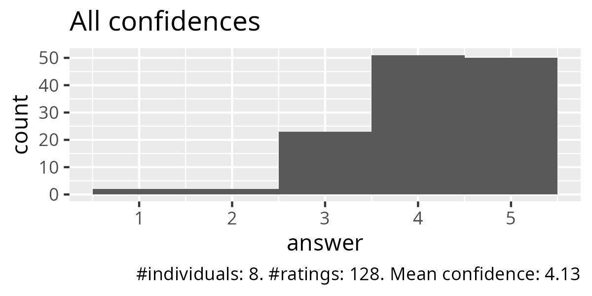
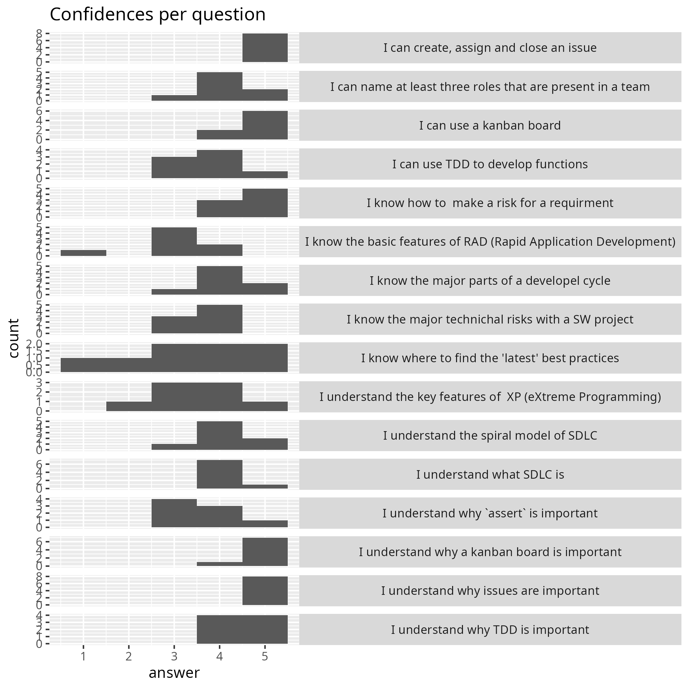
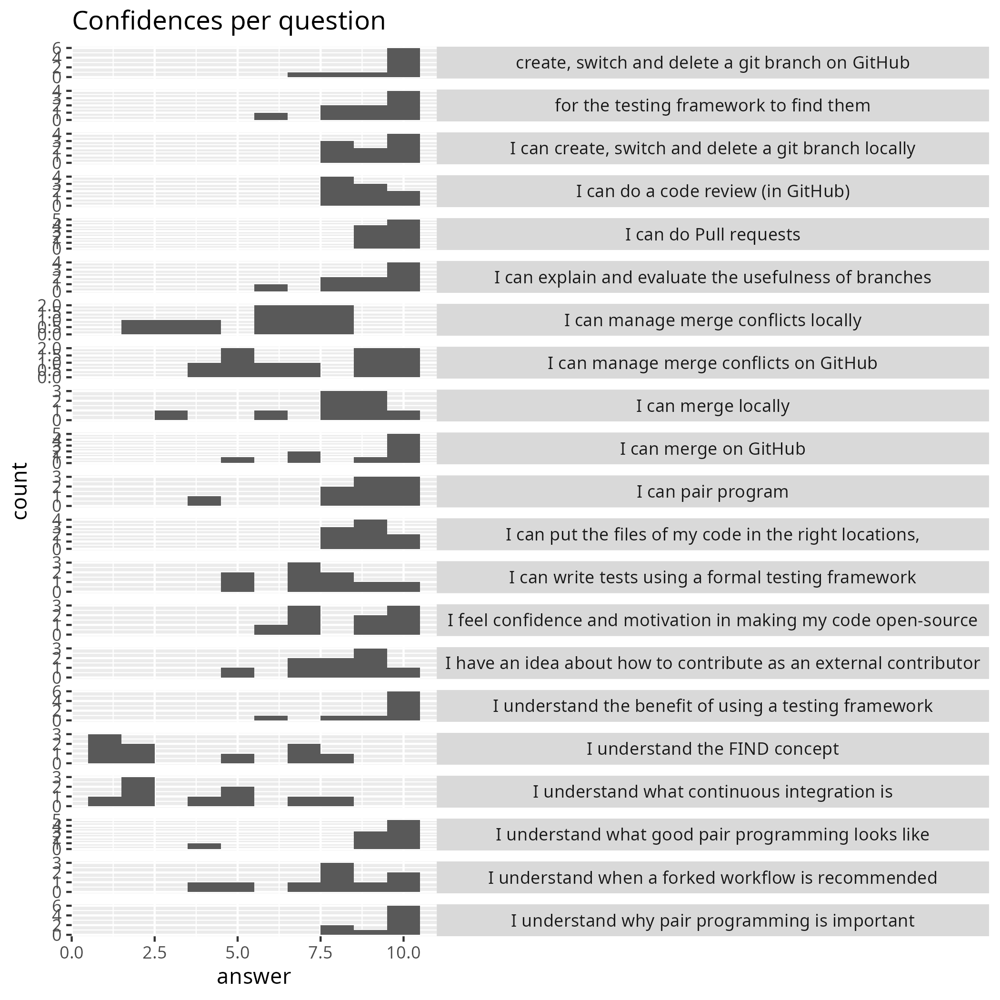
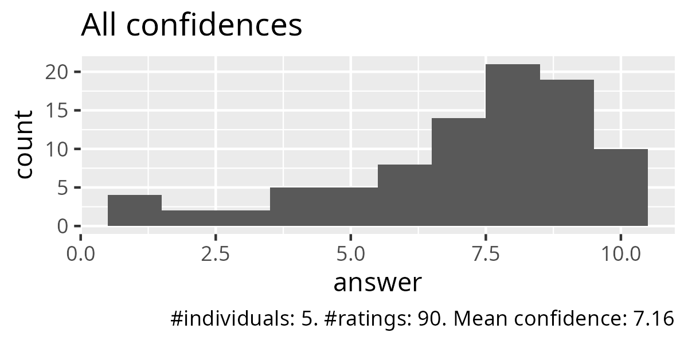
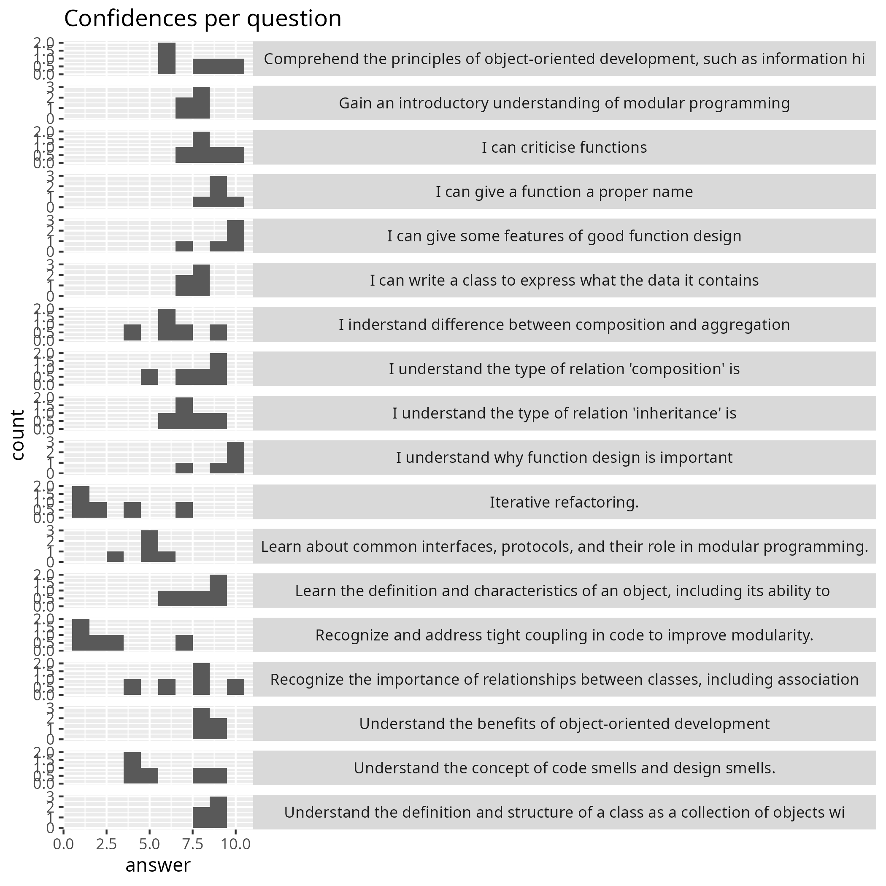
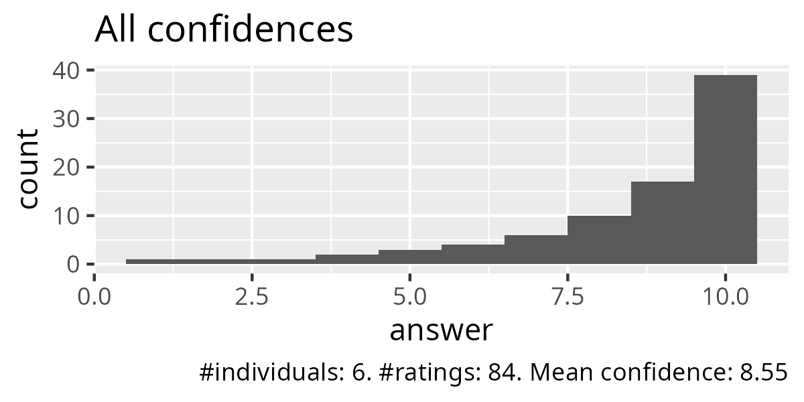
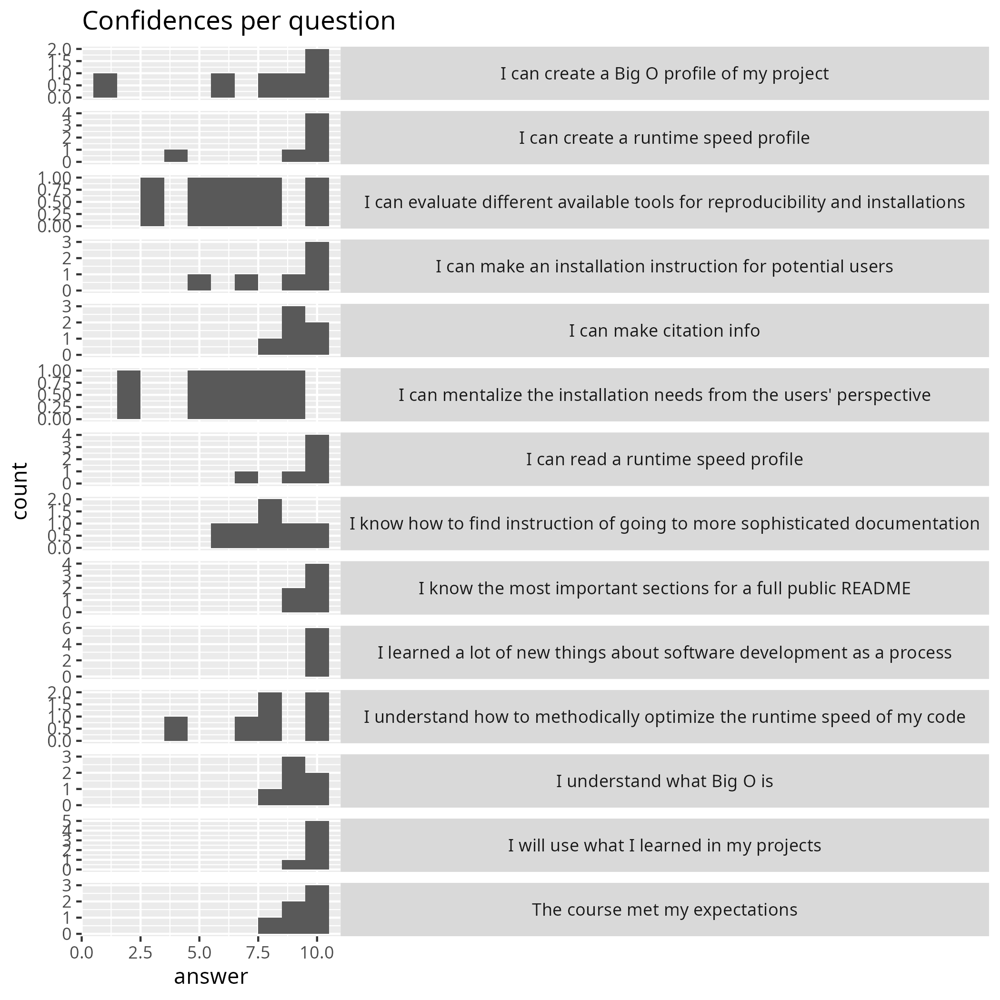

---
tags:
  - evaluation
---

# Evaluation autumn 2024

- Reflections: [Richel](../../reflections/20241118/README.md)

## Monday

- [Retrospect](20241118.md)
- [Confidences per question as tally](monday_tally.csv)
- [Confidences per question as average](monday_averages.csv)

## Tuesday

- [Retrospect](20241119.md)
- [Confidences per question as tally](tuesday_tally.csv)
- [Confidences per question as average](tuesday_averages.csv)

## Wednesday

- [Retrospect](20241120.md)
- [Confidences per question as tally](wednesday_tally.csv)
- [Confidences per question as average](wednesday_averages.csv)

## Thursday

- [Retrospect](20241121.md)
- [Confidences per question as tally](thursday_tally.csv)
- [Confidences per question as average](thursday_averages.csv)

## Friday

- [Retrospect](20241122.md)
- [Teacher comments](teacher_comments.csv)
- [Confidences per question as tally](friday_tally.csv)
- [Confidences per question as average](friday_averages.csv)

