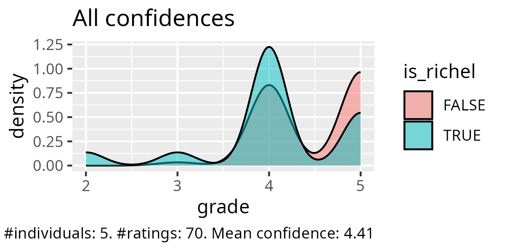
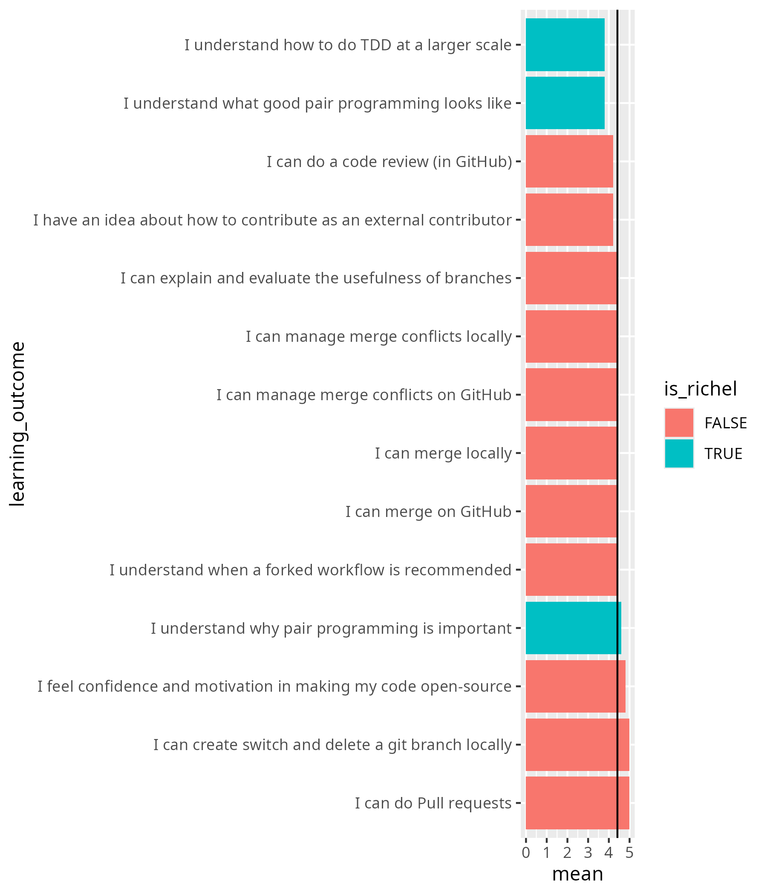
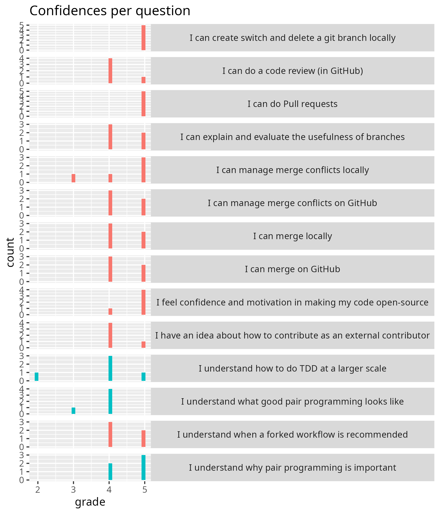

# Evaluation 

- Date: 2025-10-27
- Day: 3

## Analysis

- [Learning outcomes in a better readable format](20251027.txt)
- [Analysis script](20251027_analysis.R)
- [The calculated average confidences](20251027_average_confidences.csv)
- [Success score by Richel](20251027_success_score_richel.txt): 81%

## Retrospect

### What helped us learn (let us move forward)

- A:
- A:The live-examples and the exercises were very helpful. I appreciated the example from big to small programming. (I also appreciate the breaks!)
- A:
- A: I was happy with the pair programming concepts and the last group exercises.
- A: Live examples and pair programming very funny !
- A: pair exercises and live examples
- A:
- A:Exercises in pairs
- A:Thorough explanation of TDD method to create the weather code
- A:
- A:Good way to learn TDD through Pair programming!
- A:Today's session had more pratical exercises which helped us learn hands-on! Good job to the instructors!

### What stopped us from learning (What held us back)

- A:
- A: Nothing to declare.
- A:
- A: I can't think of anything 
- A: Still some issues with VSCode, but it worked in the end. Time for group exercises and off topic questions were a bit short. 
- A: Technical issue in the morning with Git website rendering - don't know how that could be avoided though
- A: Using GitHub web interface and git commands and VS code, I think we should agree on one single method, or at least mostly use one
- A:
- A: Maybe some more time with the group exercises would be appreciated!
- A:
- A:
- A:

### What could we do to improve learning (What can we invent)

- A: Maybe bit more on how to integrate these in our discipline specific programming would be appreciated, like some of us work on data analysis/exploration where the data might not be a spefic value but a dataframe or numpy array, how do we integrate the assert to such cases? Also, most of us work involves data cleaning and others, but how do we check if the data is cleaned or not?
- A:
- A: Maybe some more clarity in stating the purpose/methods to be used in the morning exercises - but it might as well just be me not functioning on Monday morning 
- A:
- A: Can't think of anything
- A:
- A: Was a good session!
- A:
- A:
- A:
- A: Good session overall!
- A:

### What will we do(Act) [Teachers only]

## Confidence Report: (maximum 10min) You can leave when you are done.

Give you confidence levels of the following statements,
using this scale:

- 0: I don't know even what this is about ...?
- 1: I have no confidence I can do this
- 2: I have low confidence I can do this
- 3: I have some confidence I can do this
- 4: I have good confidence I can do this
- 5: I absolutely can do this!

I can create, switch and delete a git branch locally

    - A: 5
    - A: 5
    - A:5
    - A: 5
    - A: 5
    - A:
    - A:

I can do Pull requests

    - A: 5
    - A: 5
    - A: 5
    - A:5
    - A:5
    - A:
    - A:

I can do a code review (in GitHub)

    - A: 5
    - A: 4
    - A: 4
    - A:
    - A:4
    - A:
    - A:4

I can explain and evaluate the usefulness of branches

    - A: 5
    - A: 5
    - A: 4
    - A:4
    - A:
    - A:4
    - A:

I can manage merge conflicts locally

    - A: 5
    - A:
    - A: 5
    - A: 3
    - A:5
    - A:
    - A:4

I can manage merge conflicts on GitHub

    - A: 5
    - A: 4
    - A: 4
    - A:
    - A:5
    - A:
    - A:4

I can merge locally

    - A: 5
    - A: 4
    - A: 4
    - A:
    - A:5
    - A:4
    - A:

I can merge on GitHub

    - A: 5
    - A:
    - A: 4
    - A: 4
    - A:5
    - A:
    - A:4
    
I feel confidence and motivation in making my code open-source

    - A: 5
    - A: 4
    - A: 5
    - A:
    - A:5
    - A:5
    - A:
    
I have an idea about how to contribute as an external contributor

    - A: 4
    - A: 5
    - A: 4
    - A:
    - A:4
    - A:4
    - A:
    
I understand when a forked workflow is recommended

    - A: 5
    - A: 5
    - A:4
    - A: 4
    - A:4
    - A:
    - A:

I understand how to do TDD at a larger scale

    - A: 4
    - A: 4
    - A:4
    - A: 2
    - A:5
    - A:
    - A:

I understand why pair programming is important

    - A: 5
    - A: 5
    - A: 4
    - A:5
    - A:
    - A:
    - A:4
    
I understand what good pair programming looks like

    - A: 4
    - A: 4
    - A: 4
    - A:
    - A:3
    - A:4
    - A:
    
    
