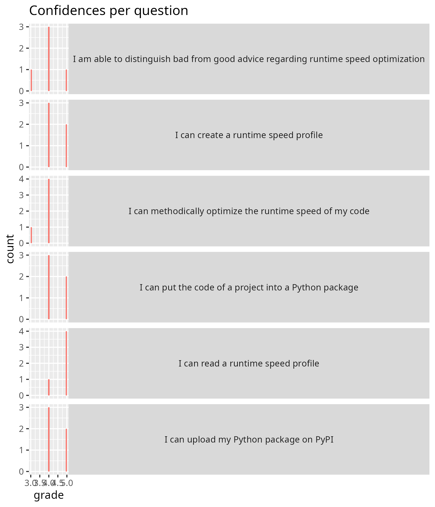

# Evaluation 

- Date: 2025-10-29
- Day: 5

## Analysis

- [Learning outcomes in a better readable format](20251029.txt)
- [Analysis script](single_day_analysis.R)
- [The calculated average confidences](20251029_average_confidences.csv)
- [Success score by Richel](20251029_success_score_richel.txt): 86%

## Day 5 Retrospect

What helped us learn (let us move forward) 2 min 

- A: Exercises, specially the testing time with cprofile. I liked hearing about creating packages, and also about ReadTheDocs and similar options.
- A: create and upload a package to pypi
- A: As always, the exercises: they help staying active
- A:Testing the performance of the code with the cprofile was useful! Along with their rules - super useful in improving our programming!
- A:The group exercise were helpful! Documentation tasks, Licensing, README documentations were super helpful.
       
What stopped us from learning (What held us back) 2 min

- A:In general, I think it would be better if some more actual explanation was introduced, together with practical examples, instead of reading and highlighting the online material. Sometimes attention is hard to keep for prolonged time, if the teacher is reading.
- A:Hard to grasp some concepts on build.
- A: I had the feelings sometimes the teacher were distracted or not sure "what was next" (but honestly, aren't we all tired?)
- A: Some teachers seem to be in a rush all the time. They explain at a superficial level.
- A: very time-constrained course; it feels like virtual environments are introduced very late in the course, even though they would be already useful in the beginning (before installing anything in base, helps also in cleaning up after the course is done); it often felt like the teachers are just reading the page and then run out of time for questions/exercises
- A: Short time for some tasks/topics
    
What could we do to improve learning (What can we invent) 2 min¶

- A: Perhaps because I've wrote READMEs for my GitHub repositories before, I wish less time had been spent on that, and instead I wish we could hear more about creating Wikis and ReadTheDocs-like documentation. I was also often confused with the exercises instructions.
- A: Be prepared to teach, no just read.  In every section, I got something like "we do not have time to cover the topic A, so we move on"
- A: better time management, I think it would actually be more helpful to spend time more time on basics with going through examples and thorough explanations and time for questions than rushing through that we can cover all the topics that are planned (because the content is anyway on the page and you can just refer to it and if people are interested can have a look on their own and ask about it because there is the additional time to do so)
- A: Quite time-constrained, maybe having a the course for 2 days in week for 3/4 weeks would be great!
- A: I would have liked to see less reading and more interaction, more space for questions and active discussion on exercises. Sometimes how exercises were introduced was still unclear (but better than previous sessions). 
- A: Some discipline specific examples would be appreciated, for example with simulation data or codes
- A: More interactive sessions or handsn exercises rather than reading (which can be pre-read before the lectures)
- A: Really liked the group exercises, which we can increase in the future!
    
## Confidence Report: (maximum 10min) You can leave when you are done.

Give you confidence levels of the following statements,
using this scale:

- 0: I don't know even what this is about ...?
- 1: I have no confidence I can do this
- 2: I have low confidence I can do this
- 3: I have some confidence I can do this
- 4: I have good confidence I can do this
- 5: I absolutely can do this!

I am confidant that...:

- I can put the code of a project into a Python package
- A: 4
- A: 4
- A: 5
- A: 5
- A:
- A:
- A:4

- I can upload my Python package on PyPI
- A: 4
- A:
- A: 4
- A: 5
- A: 5
- A:
- A:4
 
- I can methodically optimize the runtime speed of my code
- A:
- A: 3
- A:
- A: 4
- A: 4
- A: 4
- A:4

- I can create a runtime speed profile
- A:
- A:  5
- A: 4
- A: 5
- A: 4
- A:4
- A:

- I can read a runtime speed profile
- A: 5
- A:
- A: 5
- A: 5
- A: 5
- A:
- A:4

- I am able to distinguish bad from good advice regarding runtime speed optimization
- A:
- A: 4
- A:4
- A: 3
- A: 4
- A:
- A: 5

- I can mentalize the installation needs from the users' perspective:

- A: 3
- A:4
- A: 5
- A:
- A: 4
- A: 5
- A:

- I can initialize a new project: 

- A:
- A: 4
- A: 5
- A: 5
- A:4
- A: 3
- A:

- I know the most important sections for a full public README:
    
- A: 5
- A:
- A: 5
- A: 4
- A: 3
- A:4
- A:

- I can make an installation instruction for potential users:

- A: 3
- A:4
- A: 
- A: 4
- A:
- A: 5
- A:

- I can make citation info:

- A:
- A: 3
- A: 3
- A: 3
- A:
- A:4
- A:

- I know how to find instruction of going to more sophisticated documentation: The course met my expectations:

- A:
- A: 2
- A:
- A: 4
- A: 2
- A:
- A:4

- I learned a lot of new things about software development as a process:

- A:
- A: 5
- A: 5
- A: 5
- A: 5
- A:
- A:4

- I will use what I learned in my projects:

- A:
- A: 5
- A: 5
- A: 5
- A: 4
- A:5
- A:
  
 

## Extended questions (10 min)
  
-  Imagine you are boss. How would you improve the Programming Formalisms course? Do consider that if you want more of something, what would you want less of?
  
- A: More:: Add some text about good practices about writing classes. Explain more with some examples about composition, inherence, etc.  
    - Provide more links to video tutorials. 
    - Creating video contents that students can watch to complement the training. 
    - Less:: Teachers reading what everyone at this level can read. Use the text as a guide. 
- A: **First of all I wanted to thank you all for this great course! All the following critics are just small to make the course even better.** There was a lot of group work where it was actually not needed, I don't need to be in a breakout room with someone just to ask questions, seems a bit unnecessary. 
    - Also an time expectation of the real group work and a better outline of what we should actually do would be great (for some of the tasks that is actually already very well implemented). Some of the topics are actually falling short, e.g. about classes/object oriented programming and modules I didn't really catch the grip and feel similarly unsure about it than before the course (also the course page is rather short and doesn't really provide further information). 
    - Time could definitely be saved when not only the pages get read to us and the teachers stumble upon mistakes but just by either reciting it shortly or letting us read ourselves. Also a proper flipped classroom could work, just tell us to read up on a topic the day before and then discuss it or do exercises (I mean we are all voluntarily taking this course and want to learn something, so I think it wouldn't be an issue to put the extra time in.)
- A: I really enjoyed the course! Thank you all for that! But I learned more through the hands-on exercises than reading, so maybe I would arrange more group sessions where the teams worked together, so that they can fail and learn! Pushing them into the project first (maybe give them some resources to read on first) and then letting them review their project work would be my approach. Maybe also, ask the students to bring their own data (discipline specific data) and work on them and review them in group, so that students can understand how to use these tools/tips in their discipline data.
- A: Thank you for the course.  I think I would in general increase the prerequisites for taking the course to a higher level. I started the course with the exact python/git requirements as stated in the UPPMAX web page, but I still found some sessions quite hard - or maybe too advanced for my level, or that they served a purpose that is too advanced for what I am working on at the moment. I took the course early in my phd thanks to the suggestion of my supervisor and of a fellow phd student, but maybe it  would have been more useful to take it with more pior experience in programming in general. 
    - That said, it was very useful to see how software development works in a formal way. It's super useful to see that there are guidelines/ good practises to be followed, which could be good to learn very early in my career. Also, I am very happy that I can go back to the course materiak and revise topics. 
    - What I personally found the most useful as a beginner was collaborating on git, understanding how to use tests and asserts to make code stronger from the beginning,  continuous integration and classes. I wished we had seen more function design as well. 
    - Regarding teaching style, I really appreciated exercises, as they really help tpo stay focus. Sometimes I wished we had clearer instructions before each exercise, but I think this got better during the course. I also liked the video tutorials when available, as they helped a lot when a full example was needed before practising hands-on.
    - What I think could be improved were some explanations and timing. Topics were often skipped, not covered or covered too fast. It may be good to reduce the course content a bit and focus on the most appreciated/needed sessions.
    - Something I didn't understand fully was the purpose of having the 'weather project'. I guess it is to provide a full-cycle software development example, but since we ended up not really working on that, I would have rather had more small exercises, which help strenghtening the broad understanding. 
    - Last, I suggest adding a video tutorial on the use of VS code with git, and then always stick to that method. Or always work from terminal. It can become confusiong if people use different methods.
