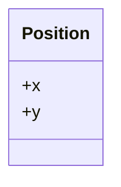

---
tags:
  - data type
  - expressive
---

# Expressive data types

!!!- info "Learning outcomes"

    - Practice to use classes for expression
    - Practice to use classes for type safety
    - Practice to use composition for a 'has-a' relationship

## Why?

You want to combine your variables into bigger things.
You want those 'bigger things' to work well with the rest of your code.

## When a `list` is not good enough anymore

Data structure are 'ways to organize your data'.

For simple data structures, using a `list` can be considered 'good enough':

```python
position = [1.2, 3.4]
def get_x(position): return position[0]
def get_y(position): return position[1]
```

???- question "Is it indeed 'good enough'? Why?"

    A reason that this is 'good enough' is because it is hard
    to confusion people. Most people expect a 2D position to
    have an x and y position. Storing the x and y in a `list`
    with two elements in that order will be something close to what
    most people expect.

However, storing parameters as a `list` is not 'good enough' anymore:

```python
parameters = [42, 1000, 'uniform', 'uniform']
def get_n_bacteria(parameters): return parameters[0]
def get_n_timesteps(parameters): return parameters[1]
def get_gradient_type(parameters): return parameters[2]
def get_bacteria_initialization(parameters): return parameters[3]
```

???- question "Why is this no longer 'good enough'?"

    There is no logical order to expect the parameters to be in:

    - Why would the first value be the number of bacteria, instead
      of the number of timesteps the simulation will take?

    Also, reading such a list is too uninformative: which `uniform`
    belong to which parameter?

Using [a dictionary (`dict`)](https://docs.python.org/3/tutorial/datastructures.html#dictionaries)
can be considered good enough,
until you've read up about classes:

```python
parameters = { 
    'n_bacteria': 42, 
    'n_timesteps': 1000,
    'gradient_type': 'uniform',
    'bacteria_initialization': 'uniform'
}
def get_n_bacteria(parameters): 
    return parameters['n_bacteria']
def get_n_timesteps(parameters): 
    return parameters['n_timesteps']
def get_gradient_type(parameters): 
    return parameters['gradient_type']
def get_bacteria_initialization(parameters): 
    return parameters['bacteria_initialization']
```

When having read up on classes,
one understands these are dictionaries
with extra properties, such
as **a name**.

## Good data structures increase expressiveness

This is what (part of) the literature states:

- Express ideas directly in code `[CppCore P.1]`
- Explicit is better than implicit `[PEP 20]`


Here is the code to create a 'something',
print it and print its data type:

```python
a = get_a()
print(a)
print(type(a))
```

???- question "Prefer R?"

    ```r
    a <- get_a()
    a
    class(a)
    ```

The output looks like:

```console
[3.14, 2.72]
<class 'list'>
```

We cannot read what `a` is exactly.
We cannot express this as a `list` or a `dict`.
Instead, we can express this is a `class`.

Here we put our 'something' into a class. Here is the design:



Here is the code:

```python
class Position:
    def __init__(self, any_x, any_y):
        self.x = any_x
        self.y = any_y
    def __str__(self):
        return "(" + str(self.x) + ", " + str(self.y) + ")"
```

???- question "What does this code all mean again?"


    ```python
    class Position:
    ```

    > now I am going to define a class called `Position`.

    ```python
    def __init__(self, any_x, any_y):
        self.x = any_x
        self.y = any_y
    ```

    > To create a `Position`, the use need to give two things,
    > called `any_x` and `any_y`. These are stored inside of the
    > class as `x` and `y`.

    ```python
    def __str__(self):
        return "(" + str(self.x) + ", " + str(self.y) + ")"
    ```

    > When asked for its value, return the `x` and `y` between braces
    > separated by a comma.

Using the implementation of `get_a` like this:

```python
def get_a():
    return Position(3.14, 2.72)
```

Then running the same code again:

```python
a = get_a()
print(a)
print(type(a))
```

Now results in

```text
(3.14, 2.72)
<class '__main__.Position'>
```

???- question "This does not show the word 'Position'?"

Then add this to the class:

    ```python
    def __repr__(self):
        return "Position"
    ```

    Resulting in the complete class:

    ```python
    class Position:
        def __init__(self, any_x, any_y):
            self.x = any_x
            self.y = any_y
        def __str__(self):
            return "(" + str(self.x) + ", " + str(self.y) + ")"
        def __repr__(self):
            return 'Position'
    ```

    > When asked for its data type, return the word 'Position'.

Aha, `a` is a **position**!

We can even test that:

```python
assert str(type(a)) == "<class '__main__.Position'>"
```

## Exercise 1: use your own class

- Pick a class to design at your skill level:
    - Easiest: the worked-out position class, work in `src/learners`
    - Medium: the parameters class as shown above, work in `src/learners`
    - Hardest: one in the learners' project, work in `src/bacsim`

- Write the definition of the classes

???- question "Answer for the position class"

    This is the code of the class:

    ```python
    class Position:
        def __init__(self, any_x, any_y):
          self.x = any_x
          self.y = any_y
        def __repr__(self):
            return "Position"
        def __str__(self):
            return "(" + str(self.x) + ", " + str(self.y) + ")"
    ```

???- question "Answer for the parameters class"

    Modify the `Position` class :-)

- Use the class in a function, e.g. `create_test_x`

???- question "Answer for the position class"

    This is the code:

    ```python
    def create_test_position():
        return Position(3.14, 2.72)

    a = create_test_position()
    print(a)
    print(type(a))
    ```

???- question "Answer for the parameters class"

    Modify the answer for the `Position` class :-)

## References

- `[CppCore P.1]` [P.1. Express ideas directly in code](https://isocpp.github.io/CppCoreGuidelines/CppCoreGuidelines#Rp-direct)
- `[PEP 20]` [PEP 20: 'Explicit is better than implicit'](https://peps.python.org/pep-0020/#the-zen-of-python)

