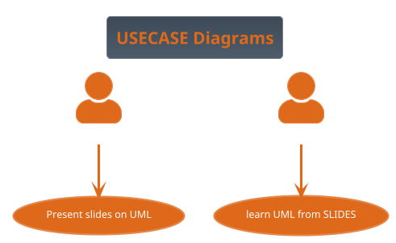

# PlantUML
- PlantUML is a good tool to render UML code to graphical diagrams and flowcharts.

- We won't cover this tool specifically in this workshop 

- If you anyway are interested, see below for some useful settings!

- If you want PlantUML to render directly from a file on GitHub please install the **extension PlantUML viewer to your web browser**.
- works for multiple browsers [https://github.com/marcozaccari/markdown-diagrams-browser-extension](https://github.com/marcozaccari/markdown-diagrams-browser-extension)
   - Restart browser after installation!  
-  if the above does not work try
   - Firefox: PlantUML visualizer (is not compatible with !theme _none_ tag)
   - Chrome: Pegmatite,PlantUML viewer
   - Microsoft Edge Markdown Diagrams
- When done you should see the code below as a diagram.

