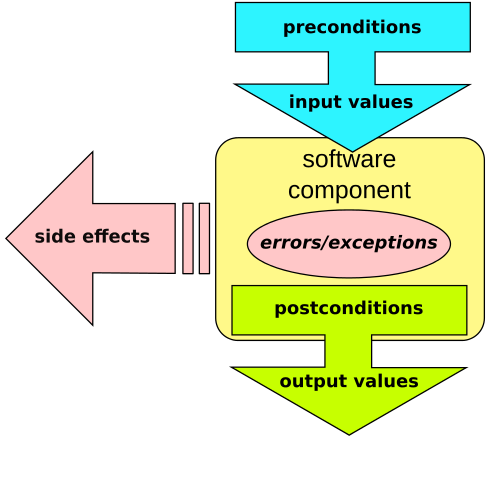

---
tags:
  - algorithm design
  - function design
  - design
---

# Function design

!!!- info "Learning outcomes"

    - Understand why function design is important
    - Can give some features of good function design
    - Give a function a proper name
    - Criticise functions

???- question "For teachers"

    Prior:

    - What is a function?
    - Why are functions important?
    - What makes a well-written function?
    - What is more important: that a function is correct or that
      it is easy to use?
    - What is more important: that a function is correct or that
      it is fast?
    - What is more important: that a function is easy to use or that
      it is fast?

## Why?

You want your program to do many things, like
reading files, doing an analysis and saving the
results to files. You want it to be correct.

You needs to convert your ideas to functions.

## Big picture

You should decompose programs into functions `[Wilson et al, 2017]`,
to make the problem simpler.

## Terminology

Term                 |Description
---------------------|---------------
Function arguments   |The values that go into a function
Function body        |Everything the function does with its arguments
Function declaration |The function name and arguments
Function definition  |The complete function
Function name        |The name of the function
Function return type |The data type the function returns
Function signature   |The function name and arguments
Procedure            |A function that has no return type

```python
def my_function(my_arguments):
    # ...
    return my_return_value
```

## Functions design: design by contract

A common design of functions is that they follow
design-by-contract programming (term by `[Meyer, 1992]`),
where 'contract' is a metaphor for 'agreement'.



> [Source: Wikipedia](https://en.wikipedia.org/wiki/Design_by_contract#/media/File:Design_by_contract.svg)

- Input (plural) are called 'the preconditions'
- Within a function,
  if the preconditions are invalid, an error or exception is raised
- Within a function,
  if the preconditions are valid, a valid output is created
  and/or there will be side effects, such as creating a file

In this course, we've been using design by contract.

## Features of a good function

A good function ...

- Sometimes: is documented
  `[Ram, 2013][tidyverse style guideline of functions]`.
  In some contexts, documentation is mandatory `[Ram, 2013]`
  `[tidyverse style guideline of functions]`.

???- question "Example"

    Here is an example of a function with an unclear name.
    The documentation is used to clarify:

    ```python
    def sort_1(x):
      """Sort list `x` in-place.

      Returns nothing
      """

    def sort_2(x):
      """Sort list `x`.

      Returns the sorted list.
      """

    assert sort_1.__doc__
    assert sort_2.__doc__
    ```

    ???- question "Prefer R?"

        ```r
        #' Sort list `x` in-place.
        #' @param x a list
        #' @return nothing
        sort_1 <- function(x) {
          # ...
        }

        #' Sort list `x`
        #' @param x a list
        #' @return the sorted list
        sort_2 <- function(x) {
          # ...
        }

        # Check if functions have documentation here
        ```

- Is small `[Martin, 2009]`
  `[CppCore functions][tidyverse style guideline of functions][Uncle Bob, 2024]`
- Is even smaller than that `[Uncle Bob, 2024]`
- Has a good name `[Martin, 2009]`
  `[CppCore functions][tidyverse style guideline of functions]`
  `[PEP 20a][Reitz et al., 2016][Wilson et al, 2017]`:
    - starts with a verb `[tidyverse style guideline of functions]`
    - readable `[PEP 20a]`
    - intention-revealing `[Martin, 2009]`
    - pronounceable `[Martin, 2009]`
    - searchable `[Martin, 2009]`
    - not cute `[Martin, 2009]` (e.g. `apply_holy_handgrenade` over `remove_invalid_items`)
    - no pun `[Martin, 2009]` (e.g. apply `add` to both add numbers and insert an item into a collection. Instead, use `insert` to add an item to a collection)
    - carefully `[CppCore functions]`

???- question "Famous quote on naming functions"

    > There are only two hard things in Computer Science:
    > cache invalidation and naming things
    >
    > Phil Karlton

    

- Is easy to use correctly and hard to use incorrectly
  `[Meyers, 2005][CppCore functions][PEP 20c][PEP 20d]`
- Does one thing correctly `[Martin, 2009]`
  `[CppCore functions]`
  `[tidyverse style guideline of functions]`

???- question "Example"

    A function should perform a single logical operation `[CppCore F.2]`,
    hence don't:

    ```python
    def do_x_and_y(): pass

    do_x_and_y()
    ```

    Instead, do:

    ```python
    def do_x(): pass

    def do_y(): pass

    do_x()
    do_y()
    ```

    You rarely need `and` in a function name. An accepted exception
    is a function to calculate the mean and standard deviation,
    because this is a faster calculation.

- Is tested `[Martin, 2011][CppCore functions]`
  `[tidyverse style guideline of functions]`
    - [Joint Strike Fighter Coding Standards, section 3](http://www.stroustrup.com/JSF-AV-rules.pdf):
      Testability: Source code should be written to facilitate testability
- A function should perform a single logical operation `[CppCore F.2]`.
- Raises helpful exceptions `[Martin, 2009]`
  `[CppCore functions][tidyverse style guideline of functions][PEP 20b]`
- Fast if needed `[CppCore functions]`

## Exercises

### Exercise 1: bad function names

Could you give examples of bad function names? Why are these names bad?

???- question "Answers"

    There are many, here are some:

    - `calculate`: calculates what?
    - `calc_bfgt`: calculates *what*?
    - `prime`: a prime number is a data type. What does this function do?
    - `needleman_wunch`: this is a technique to get a DNA alignment.

### Exercise 2: name the function

#### Exercise 2.1: name the function

Imagine two DNA sequences:

```text
AAACCCGGGTTT
ATACCCGGGTAT
```

How would you call the algorithm that returns the number (i.e. a number
to indicate the second character) of which the characters
in the two DNA sequences mismatch
(it is `A` in the top one, `T` in the bottom one)?

???- info "Why is this scientifically useful?"

    DNA changes over time. These changes are called mutations.
    On such mutation is a point mutation, which is when one letter changes.

    This point mutations will be carried over to offspring
    and are use to create pedigries (e.g. in humans)
    or phylogenies (e.g. between species).

???- question "Answer"

    There are many, here a table of combinations:

    1     |2          |3           |4
    ------|-----------|------------|-------
    `find`|`first`    |`difference`|`index`
    `get` |`[nothing]`|`mismatch`  |`locus`
    .     |.          |.           |`pos`

    These are up for debate and 'the best name' is determined by the
    project, progamming language and social rules, such as:

    Column 1: `find` versus `get`:

    - `get` is better:
      in some languages (e.g. C++) `find` is used in the standard libary
      for functions that return an iterator (whatever that is),
      hence `find` is confusing
    - `find` is better:
      We are looking for a difference, i.e. we are **finding** something
      and our function name should reflect that

    Column 2: `first` versus `[nothing]`:

    - `first` is better: in some languages (e.g. C++) `first`
      is used in the standard library
      to indicate only the first match is returned,
      hence not using that would confuse
    - `nothing` is better: this is shorter

    Column 3: `difference` versus `mismatch`:

    - `mismatch` is better:
      in some languages (e.g. C++) the term 'mismatch' is used in the
      standard library for things that have different content
      (such as characters in a string),
      hence 'difference' would be the unexpected noun
    - `difference` is better:
      we are looking for a difference
      and our function name should reflect that

    Column 4: `index` versus `locus` versus `pos`:

    - `index` is better:
      if the function returns an index
      (i.e. the first position has index zero),
      `index` is the only correct description
    - `locus` is better:
      a position on a DNA sequence is called a 'locus',
      which is a more precise naming. Loci start counting at 1 (unlike
      Python indices, which start counting at 0), so the function is expected
      to do so too
    - `pos` is better:
      a position in a string is commonly abbreviated to `pos`
      and is broadly understood, also by non-biologists.

    Other good answers are those that:

    - starts with a verb
    - is as English as possible
    - only uses common abbreviations

#### Exercise 2.2: name the function

Imagine two DNA sequences:

```text
AAACCCGGGTTT
ATACCCGGGTAT
```

How would you call the algorithm that detects all the locations of
where the DNA sequences are different?

???- question "Answer"

    There are many, here a table of combinations:

    1     |2          |3            |4
    ------|-----------|-------------|------
    `find`|`all`      |`difference` |`indices`
    `get` |`[nothing]`|`mismatch`   |`loci`
    .     |.          |.            |`pos`
    .     |.          |.            |`poss`
    .     |.          |.            |`posses`
    .     |.          |.            |`positions`

    Most of the reasoning is the same as in the previous answer,
    with the addition of:

    - `pos` is best: when it is common that `pos` can be a plural
      and/or in combination with `all` to signal so
    - `poss` is best: when this `+s` to signal a plural is
      already widespread in your project
      (note from Richel: I've never seen this in practice!)
    - `posses` is best: when the uses of a reduplicated plural
      (or: 'Gollumese', after the character in Lord of the Ring)
      to signal a plural is already widespread in your project
    - `positions` is best: when the project discourages these computer-y
      abbreviations

    Other good answers are those that:

    - starts with a verb
    - is as English as possible
    - only uses common abbreviations

#### Exercise 2.3: name the function

Imagine two DNA sequences:

```text
AAACCCGGGTTT
ATACCGGGTTT
```

How would you call the algorithm that makes the sequences
have as much similarities as possible, by possibly inserting a `-`,
resulting in:

```text
AAACCCGGGTTT
ATACC-GGGTTT
```

???- info "Why is this scientifically useful?"

    DNA changes over time. These changes are called mutations.
    On such mutation is a deletion, which is when one letter disappears.

    Taking a look at the DNA sequences, there must have been a deletion
    somewhere. We can visualize a deletion by a dash (`-`), resulting
    again in two DNA sequences of equal length.

    Doing so, i.e. making two DNA sequences of equal length,
    is called 'aligning'. It allows us to clearly see where a deletion
    has taken place.


???- question "Answer"

    1      |2          |3          |4
    -------|-----------|-----------|------
    `align`|`aligned`  |`dna`      |`seqs`
    `calc` |`[nothing]`|`[nothing]`|`sequences`
    `get`  |.          |.          |.

    Most of the reasoning is the same as in the previous answer,
    with the addition of:

    - `seqs` is a common abbreviation
    - `dna` signals that the function expects DNA sequences
      and will fail upon other sequences

    Other good answers are those that:

    - starts with a verb
    - is as English as possible
    - only uses common abbreviations

### Exercise 3

Take a look at the function
below ([from Pythonpool](https://www.pythonpool.com/check-if-number-is-prime-in-python/)):

```python
i=2

def Prime(no, i):
    if no == i:
        return True
    elif no % i == 0:
        return False
    return Prime(no, i + 1)
```

- Does it follow a good function design? Why?

???- question "Answers"

    These are some elements of good function design that are breached:

    - By convention, function names start with lowercase character,
      where this functions' name that starts with an uppercase first
      character is normally suggesting that this is a class
      name (instead of a function name).
      A better name would be `is_prime`
    - A function should start with a verb, this function does not.
      A better name would be `is_prime`
    - The function's input is not checked for its data type.
      For example, this test will pass:

    ```python
    assert Prime("nonsense", "nonsense")
    ```

    - The function is easy to use incorrectly; the second element
      must be a two for this to function.

    ```python
    assert Prime(2, 2)
    assert Prime(3, 2)
    assert Prime(3, 3) # Nothing stops me!
    assert not Prime(4, 2)
    assert Prime(5, 2)
    ```

    In this case, the function should be refactored,
    so that a user cannot misuse the function.
    Here is an example how to keep `Prime` as it is,
    and fix most of its problems:

    ```python
    fun is_prime(x):
        """Determine if a number is prime."""
        assert isinstance(x, int)
        return Prime(x, 2)
    ```

### Exercise 4: misnomers in learners' project?

Look at the code of the learners' project.
Do you think there is a function that has a bad name?
If yes, create an issue to suggest to change it to your suggestion,
which should include your reasoning.

## References

- `[CppCore functions]` C++ Core Guidelines.
  <https://isocpp.github.io/CppCoreGuidelines/CppCoreGuidelines#S-functions>
- `[CppCore F.2]` C++ Core Guidelines.
   F.2: A function should perform a single logical operation,
   <https://isocpp.github.io/CppCoreGuidelines/CppCoreGuidelines#Rf-logical>
- `[Fowler, 2018]`
  Fowler, Martin.
  Refactoring: improving the design of existing code.
  Addison-Wesley Professional, 2018.
- `[Martin, 2009]` Martin, Robert C.
  Clean code: a handbook of agile software craftsmanship.
  Pearson Education, 2009.
- `[Martin, 2011]` Martin, Robert C.
  The clean coder: a code of conduct for professional programmers.
  Pearson Education, 2011.
- `[Meyer, 1992]` Meyer, Bertrand. "Applying 'design by contract'."
  Computer 25.10 (1992): 40-51.
- `[Meyers, 2005]` Meyers, Scott.
  Effective C++: 55 specific ways to improve your programs and designs.
  Pearson Education, 2005.
- `[PEP 20a]` PEP 20, 'Readability counts',
  [The Zen of Python](https://peps.python.org/pep-0020/#the-zen-of-python)
- `[PEP 20b]` PEP 20, 'Errors should never pass silently',
  [The Zen of Python](https://peps.python.org/pep-0020/#the-zen-of-python)
- `[PEP 20c]` PEP 20,
  'If the implementation is hard to explain, it's a bad idea.',
  [The Zen of Python](https://peps.python.org/pep-0020/#the-zen-of-python)
- `[PEP 20d]` PEP 20,
  'If the implementation is easy to explain, it may be a good idea.',
  [The Zen of Python](https://peps.python.org/pep-0020/#the-zen-of-python)
- `[Ram, 2013]` Ram, K. "rOpenSci-open tools for open science."
  AGU Fall Meeting Abstracts. Vol. 2013. 2013.
- `[tidyverse style guideline of functions]`
  <https://style.tidyverse.org/functions.html>
- `[Reitz et al., 2016]` Reitz, Kenneth, and Tanya Schlusser.
  The Hitchhiker's guide to Python: best practices for development.
  "O'Reilly Media, Inc.", 2016.
  Chapter 'General concepts'
- `[Uncle Bob, 2024]` YouTube video
  ['How small should a function be?' by Robert C. Martin (Uncle Bob)](https://youtu.be/rXjf8eiGsSI?si=8LVdL6k1lLie7BqM)
- `[Wilson et al, 2014]`
  Wilson, Greg, et al. "Best practices for scientific computing."
  PLoS biology 12.1 (2014): e1001745.
- `[Wilson et al, 2017]` Wilson, Greg, et al.
  "Good enough practices in scientific computing."
  PLoS computational biology 13.6 (2017): e1005510.
  [here](https://doi.org/10.1371/journal.pcbi.1005510)
