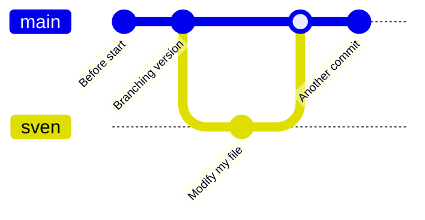
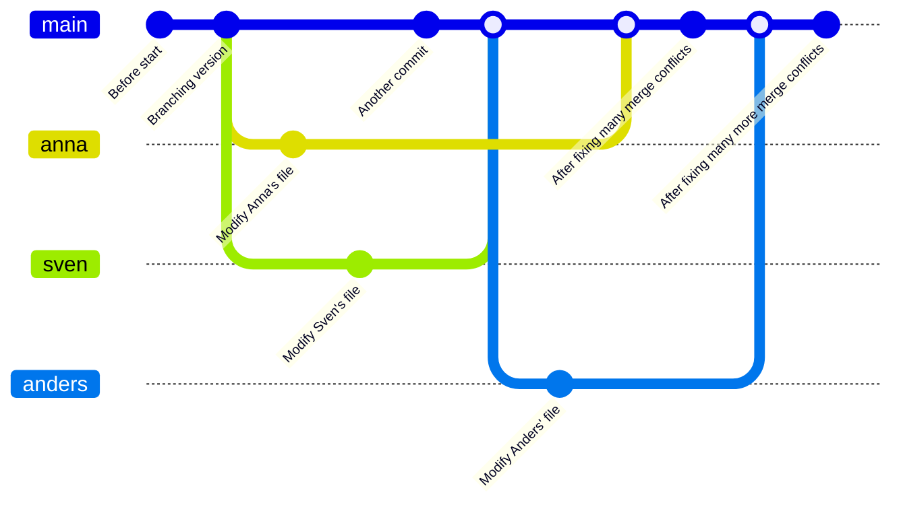

# Apply merge

!!!- info "Learning objectives"

    - practice merging `git` branches
    - practice fixing merge conflicts
    - practice doing a code review

???- question "For teachers"

    Teaching goals are:

    - Learners have merged `git` branches
    - Learners have fixed merge conflicts
    - Learners have done a code review

    Preparation:

    - There must be a file called `fairytale.md` present in the learners' repo

    Lesson plan:

    - 5 mins: prior knowledge
      - What does a merge do?
      - What does a merge do?
      - Do we need merging? When? Why?
      - When does a merge give a merge conflict?
      - Can a `git commit` result in a merge conflict? Why?
      - Can a `git push` result in a merge conflict? Why?
      - Can a `git pull` result in a merge conflict? Why?
    - 5 mins: presentation
    - 25 mins: challenge
    - 10 mins: feedback

## Exercises

See the exercise procedure [here](../misc/exercise_procedure.md).

### Exercise 1: practice merging `git` branches

!!!- info "Learning objectives"

    - practice merging git branches without a merge conflict

- For our GitHub repo, create a branch with your first name that is
  unique, e.g. `sven`, `sven_svensson` or `sven_svensson_314`.
  You may branch of from `main` or `develop` (if it exists).
  You may use the web interface (easiest!) or use the command line
- On your local computer, switch to that branch, change the repo 
  and push your changes online. Verify the changes are online
- On your local computer, switch to the `main` branch
- Merge your topic branch to `main`
- Delete your topic branch (i.e. the one with the unique name).
  You may use the web interface (easiest!) or use the command line
- On your local computer, update your code

### Exercise 2: practice merge conflicts between branches

!!!- info "Learning objectives"

    - experience merge conflicts between branches
    - fix merge conflicts between branches

- Create a merge conflict

### Exercise 3: practice code review

For team member A:

- Create a topic branch (from `develop`) 
- Do something trivial on that topic branch
- Submit a GitHub Pull Request to merge it to `develop`
- Assign the other team member as the reviewer
- Do a pretend code review until the Pull Request is accepted
- The reviewer merges the code to `develop`

Now do the same for team member B.

## Links

- [Book 'Pro Git', chapter 'git branching'](https://git-scm.com/book/en/v2/Git-Branching-Branches-in-a-Nutshell)

