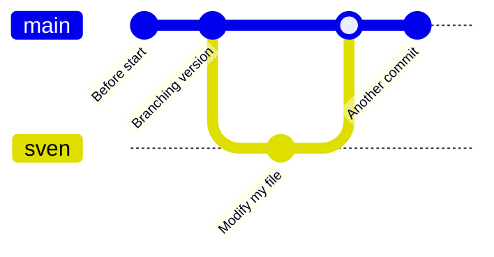

# Apply merge

!!!- info "Learning objectives"

    - practice merging `git` branches
    - practice fixing merge conflicts

???- question "For teachers"

    Teaching goals are:

    - Learners have merged `git` branches
    - Learners have fixed merge conflicts

    Preparation:

    - There must be a file called `fairytale.md` present in the learners' repo

    Lesson plan:

    * 5 mins: prior knowledge
    * 5 mins: presentation
    * 15 mins: challenge
    * 5 mins: feedback

## Exercises

### Exercise 1: practice merging `git` branches

!!!- info "Learning objectives"

    - practice merging git branches without a merge conflict

- For our GitHub repo, create a branch with your first name that is
  unique, e.g. `sven`, `sven_svensson` or `sven_svensson_314`.
  You may branch of from `main` or `develop` (if it exists).
  You may use the web interface (easiest!) or use the command line
- On your local computer, switch to that branch, change the repo 
  and push your changes online. Verify the changes are online
- On your local computer, switch to the `main` branch
- Delete your branch (i.e. the one with the unique name).
  You may use the web interface (easiest!) or use the command line
- On your local computer, update your code

### Exercise 2: practice merge conflicts

!!!- info "Learning objectives"

    - experience merge conflicts
    - fix merge conflicts

- For our GitHub repo, create a branch with your first name that is
  unique, e.g. `sven`, `sven_svensson` or `sven_svensson_314`.
  You may branch of from `main` or `develop` (if it exists).
  You may use the web interface (easiest!) or use the command line
- On your local computer, switch to that branch, change the repo 
  and push your changes online. Verify the changes are online
- On your local computer, switch to the `main` branch
- Delete your branch (i.e. the one with the unique name).
  You may use the web interface (easiest!) or use the command line
- On your local computer, update your code

## Links

- [Book 'Pro Git', chapter 'git branching'](https://git-scm.com/book/en/v2/Git-Branching-Branches-in-a-Nutshell)

