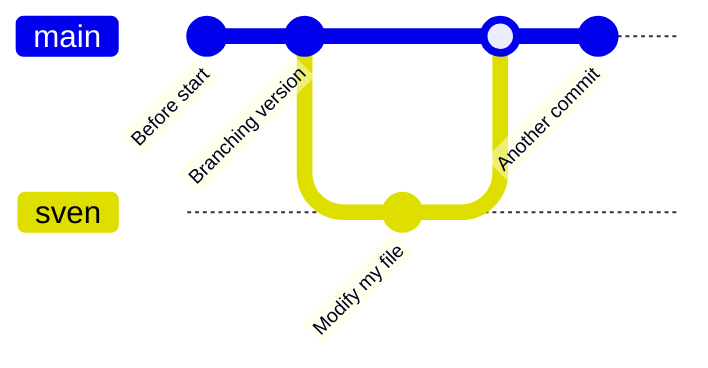
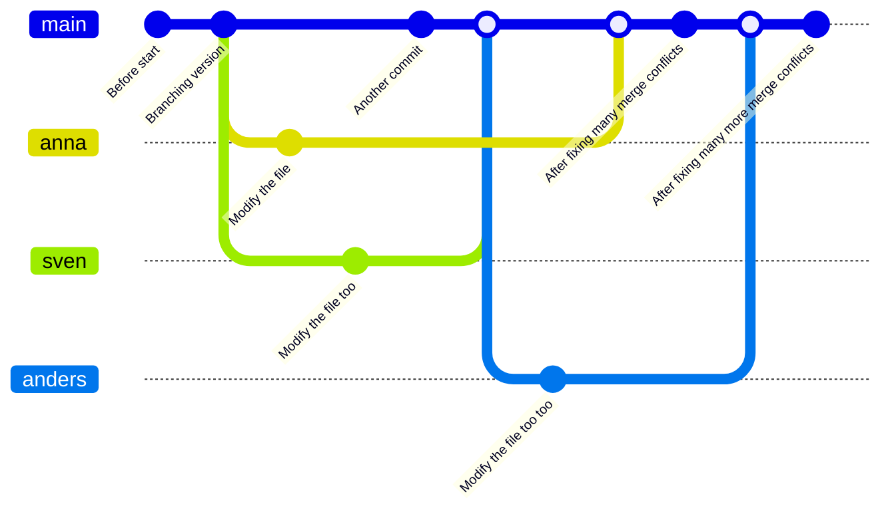

# Apply merge

!!!- info "Learning objectives"

    - practice merging `git` branches
    - practice fixing merge conflicts
    - practice doing a code review

???- question "For teachers"

    Teaching goals are:

    - Learners have merged `git` branches
    - Learners have fixed merge conflicts
    - Learners have done a code review

    Preparation:

    - There must be a file called `fairytale.md` present in the learners' repo

    Lesson plan:

    - 5 mins: prior knowledge
      - What does a merge do?
      - What does a merge do?
      - Do we need merging? When? Why?
      - When does a merge give a merge conflict?
      - Can a `git commit` result in a merge conflict? Why?
      - Can a `git push` result in a merge conflict? Why?
      - Can a `git pull` result in a merge conflict? Why?
    - 5 mins: presentation
    - 25 mins: challenge
    - 10 mins: feedback

## Exercises

### Exercise 1: practice merging `git` branches

!!!- info "Learning objectives"

    - practice merging git branches without a merge conflict



- For our GitHub repo, create a branch with your first name that is
  unique, e.g. `sven`, `sven_svensson` or `sven_svensson_314`.
  You may branch of from `main` or `develop` (if it exists).
  You may use the web interface (easiest!) or use the command line
- On your local computer:
     - update your repository
     - switch to that branch
     - change the repo 
     - push your changes online
- Verify the changes are online
- On your local computer
     - switch to the `main` branch
     - merge your topic branch to `main`
     - upload your changes
- Delete your topic branch (i.e. the one with the unique name).
  You may use the web interface (easiest!) or use the command line
- On your local computer, update your code

???- info "Answers"

    

    Click on 1, type your branch name at 2 (in this case, `richel`), then click 3.
    Done!

    > - On your local computer:
    >    - update the repository

    On your local computer, navigate to the folder of the shared project 
    and update:

    ```
    git pull
    ```

    > - On your local computer:
    >     - switch to the new branch

    Switch to the new branch, for example, `richel`, by doing:

    ```
    git checkout richel
    ```

    > - On your local computer:
    >     - change the content of the repository, for example,
    >       by creating a file in `learners/[your_name]/[your_name]_is_on_[your_branch_name]`

    This can be any change you'd like.
    To create a file under Linux (and maybe this works on other
    operating systems too), one can do:

    ```
    touch learners/richel/richel_is_on_richel.txt
    ```

    After the change, commit these:

    ```
    git add .
    git commit -m "Richel is on richel"
    ```

    > - On your local computer:
    >     - push your changes online. 

    Do:

    ```
    git push
    ```

    And your code may end up online.

    If that does not work, do:

    ```
    git pull
    ```

    and try pushing again, maybe multiple times, as many people
    are pushing to the shared repo.

    > - On GitHub, verify that your changes on your branch can be found online

    

    Make sure you look at the correct branch, as displayed at 1.
    Then your commit message shows up at 2.

    > - On your local computer
    >      - switch to the `main` branch

    ```
    git checkout main
    ```

    > - On your local computer
    >      - merge your topic branch to `main`

    ```
    git merge richel
    ```

    > - On your local computer
    >      - upload your changes

    ```
    git push
    ```

    > - Delete your branch (i.e. the one with the unique name).
    >   You may use the web interface (easiest!) or use the command line

    [](github_view_branches_annotated.png)

    Click on 'Branches', as shown in the image above.

    

    Click on garbage bin, as shown in the image above.

    

    The branch will now be deleted, as shown in the image above.

    > - On your local computer, update your code

    Do:

    ```
    git pull
    ```

???- question "Enjoy a video?"

    You can find a video [here](https://youtu.be/BSi9nFhlgwM)

### Exercise 2: practice merge conflicts between branches

!!!- info "Learning objectives"

    - experience merge conflicts between branches
    - fix merge conflicts between branches



- Create a merge conflict

### Exercise 3: practice code review

For team member A:

- Create a topic branch (from `develop`) 
- Do something trivial on that topic branch
- Submit a GitHub Pull Request to merge it to `develop`
- Assign the other team member as the reviewer
- Do a pretend code review until the Pull Request is accepted
- The reviewer merges the code to `develop`

Now do the same for team member B.

## Links

- [Book 'Pro Git', chapter 'git branching'](https://git-scm.com/book/en/v2/Git-Branching-Branches-in-a-Nutshell)


