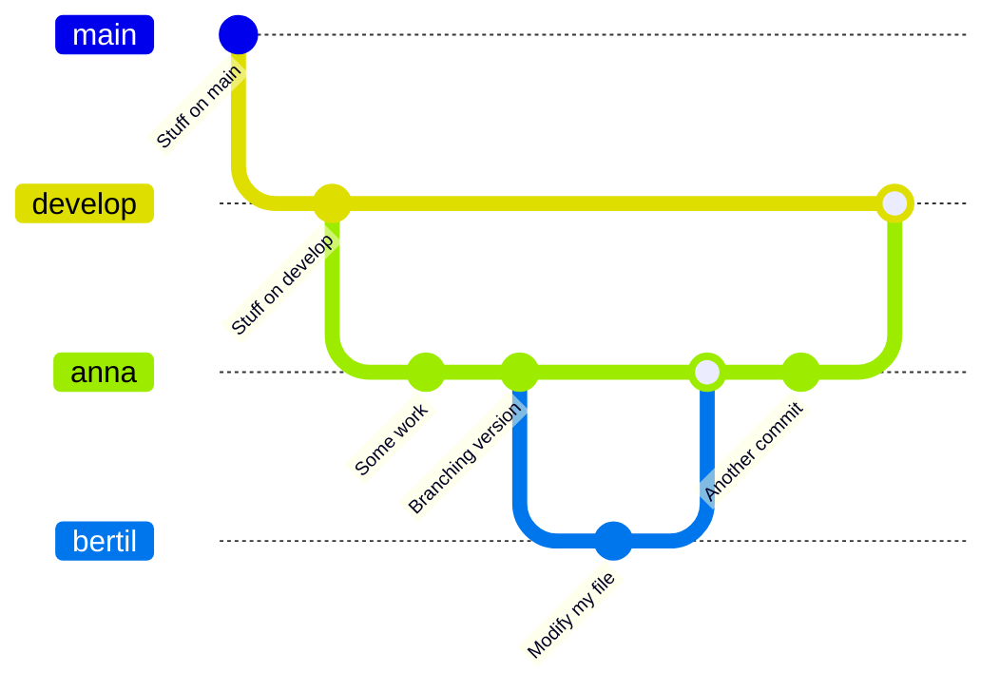
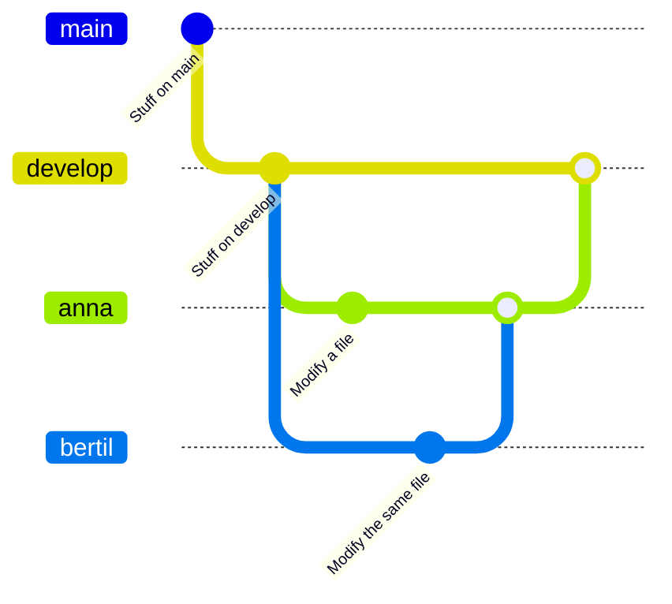
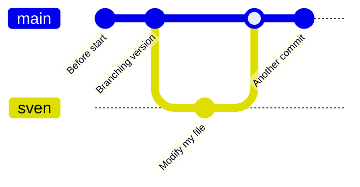
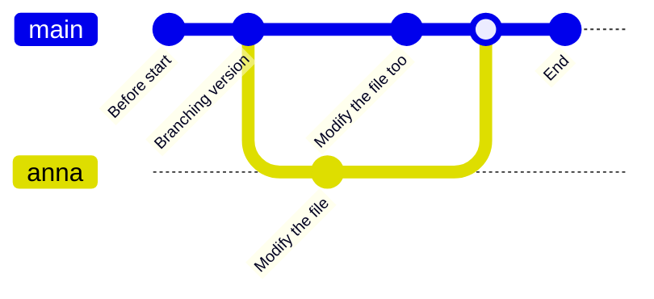

# Apply merge

!!!- info "Learning objectives"

    - practice doing Pull Requests using the GitHub interface
    - practice doing a code review
    - practice fixing merge conflicts on GitHub
    - practice merging branches using the command-line interface
    - practice fixing merge conflicts on local computer, 
      using the command-line interface

???- question "For teachers"

    Teaching goals are:

    - Learners have practiced doing Pull Requests using the GitHub interface
    - Learners have practiced doing a code review
    - Learners have practiced fixing merge conflicts on GitHub
    - Learners have practiced merging branches using the command-line interface
    - Learners have practiced fixing merge conflicts on local computer, 
      using the command-line interface


    ```mermaid
    gantt
      title Lesson plan apply merge
      dateFormat X
      axisFormat %s
      Introduction: intro, 0, 5s
      Theory 1: theory_1, after intro, 10s
      Exercise 1: crit, exercise_1, after theory_1, 30s
      Feedback 1: feedback_1, after exercise_1, 15s
    ```

    Prior questions:

    - What does a merge do?
    - What does a merge do?
    - Do we need merging? When? Why?
    - When does a merge give a merge conflict?
    - Can a `git commit` result in a merge conflict? Why?
    - Can a `git push` result in a merge conflict? Why?
    - Can a `git pull` result in a merge conflict? Why?

# Branches, merging, code reviews

Branches allow us to work independently.
Here we use branches to do so.

However, when we merge branches, it may result in a merge conflict.
A merge conflict occurs when git is unsure how to merge branches
and asks a human for help.
Here we create merge conflicts on trivial code.

One can suggest to merge branches on GitHub,
where it is called a Pull Request.
For a Pull Request, a team member can be asked for a code review.
Code reviews are useful for many reasons, 
among others the spread of knowledge.

One can merge branches locally, using the command-line.
This will bypass code review and that is OK.
For example, merging develop to your topic branch 
does not need a code review.

## Exercises

Exercises 1 and 2 use the GitHub interface, 
which is graphical and easy to use.
It should help you get acquainted to branches, Pull Requests and code review.

Exercises 3 and 4 use the command line instead to achieve similar goals.
It should help you get acquainted to working with git on the command-line.

Exercise 5 is a repeat of doing a code review.

### Exercise 1: practice merging `git` branches using the GitHub interface

!!!- info "Learning objectives"

    - practice merging git branches without a merge conflict



- You work in a pair or trio
- On GitHub, create a branch for person A, e.g. `anna` that branches off from `develop`
- On GitHub, use the branch of person A and create a new commit.
  Use the web interface or command-line.
- On GitHub, create a branch for person B, e.g. `bertil` that branches off from `anna`
- On GitHub, use the branch of person B and create a new commit.
  Use the web interface or command-line.
- On GitHub, use web interface to create a Pull Request from `bertil` to `anna`.
  The person that does this requests a reviewer.
- On GitHub, the other person approves the Pull Request and merges
- On GitHub, use web interface to create a Pull Request from `anna` to `develop`.
  The person that does this requests a reviewer.
  If there is a merge conflict, either stop (you've done the exercise, well done!)
  or fix the merge conflict
- On GitHub, the other person approves the Pull Request and merges

### Exercise 2: practice merging `git` branches using the GitHub interface

!!!- info "Learning objectives"

    - practice merging git branches with a merge conflict using the GitHub interface



- You work in a pair or trio
- On GitHub, create a branch for person A, e.g. `anna` that branches off from `develop`
- On GitHub, create a branch for person B, e.g. `bertil` that branches off from `anna`
- On GitHub, use the branch of person A and create a new commit in a file
  Use the web interface or command-line.
- On GitHub, use the branch of person B and create a new commit 
  **in the same place in the same (now outdated) file**
  Use the web interface or command-line.
- On GitHub, use web interface to create a Pull Request from `bertil` to `anna`.
  The person that does this requests a reviewer.
  There is a warning for a merge conflict!
- On GitHub, the other person fixes the merge conflict, 
  approves the Pull Request and merges
- On GitHub, use web interface to create a Pull Request from `anna` to `develop`.
  The person that does this requests a reviewer.
- On GitHub, the other person approves the Pull Request and merges

### Extra exercise 3: practice merging `git` branches using the command-line

!!!- info "Learning objectives"

    - practice merging git branches without a merge conflict

!!!- caution "Here we use the `main` branch for now"

    Instead of updating this exercise, its answer and video
    to use a proper branching workflow, we branch from `main`
    in this exercise



- For our GitHub repo, create a branch with your first name that is
  unique, e.g. `sven`, `sven_svensson` or `sven_svensson_314`.
  You may branch of from `main` or `develop` (if it exists).
  You may use the web interface (easiest!) or use the command line
- On your local computer:
     - update your repository
     - switch to that branch
     - change the repo 
     - push your changes online
- Verify the changes are online
- On your local computer
     - switch to the `main` branch
     - merge your topic branch to `main`
     - upload your changes
- Delete your topic branch (i.e. the one with the unique name).
  You may use the web interface (easiest!) or use the command line
- On your local computer, update your code

???- info "Answers"

    

    Click on 1, type your branch name at 2 (in this case, `richel`), then click 3.
    Done!

    > - On your local computer:
    >    - update the repository

    On your local computer, navigate to the folder of the shared project 
    and update:

    ```
    git pull
    ```

    > - On your local computer:
    >     - switch to the new branch

    Switch to the new branch, for example, `richel`, by doing:

    ```
    git checkout richel
    ```

    > - On your local computer:
    >     - change the content of the repository, for example,
    >       by creating a file in `learners/[your_name]/[your_name]_is_on_[your_branch_name]`

    This can be any change you'd like.
    To create a file under Linux (and maybe this works on other
    operating systems too), one can do:

    ```
    touch learners/richel/richel_is_on_richel.txt
    ```

    After the change, commit these:

    ```
    git add .
    git commit -m "Richel is on richel"
    ```

    > - On your local computer:
    >     - push your changes online. 

    Do:

    ```
    git push
    ```

    And your code may end up online.

    If that does not work, do:

    ```
    git pull
    ```

    and try pushing again, maybe multiple times, as many people
    are pushing to the shared repo.

    > - On GitHub, verify that your changes on your branch can be found online

    

    Make sure you look at the correct branch, as displayed at 1.
    Then your commit message shows up at 2.

    > - On your local computer
    >      - switch to the `main` branch

    ```
    git checkout main
    ```

    > - On your local computer
    >      - merge your topic branch to `main`

    ```
    git merge richel
    ```

    > - On your local computer
    >      - upload your changes

    ```
    git push
    ```

    > - Delete your branch (i.e. the one with the unique name).
    >   You may use the web interface (easiest!) or use the command line

    [](github_view_branches_annotated.png)

    Click on 'Branches', as shown in the image above.

    

    Click on garbage bin, as shown in the image above.

    

    The branch will now be deleted, as shown in the image above.

    > - On your local computer, update your code

    Do:

    ```
    git pull
    ```

???- question "Prefer a video?"

    You can find a video [here](https://youtu.be/BSi9nFhlgwM)

### Extra exercise 4: practice merge conflicts between branches using the command line

!!!- info "Learning objectives"

    - experience merge conflicts between branches
    - fix merge conflicts between branches

!!!- caution "Here we use the `main` branch for now"

    Instead of updating this exercise, its answer and video
    to use a proper branching workflow, we branch from `main`
    in this exercise



> An example picture of how to create a merge conflict.

- Create a merge conflict between two branches, e.g. a topic branch
  and the main branch. You can do so by creating random commits
  on both branches and merge. Alternatively, the figure above
  shows the minimal git branching history to do so.

???- info "Answers"

    Here, I will replay the figure above

    - in GitHub, create a branch called `anna`
    - on your local computer, `git pull`, then `git checkout anna`
    - on your local computer, modify a file, e.g. add the line `Anna was here`
      at the bottom of `README.md`. Then do `git add .`, 
      `git commit -m "Anna was here"` and `git push`.
      Do not merge braches yet, else there will be no merge conflicts!
    - on your local computer, `git checkout main`
    - on your local computer, modify a file, e.g. add the line `main person was here`.
      Then do `git add .`, `git commit -m "main person was here"` and `git push`.
    - To generate the merge conflict, merge `anna` into `main`, using `git merge main`.
      You will get a clear error :-)
    - Modify the file to have the texts merged.
      Then do `git add .`, `git commit -m "Fixed merge conflict"` and `git push`.

???- question "Enjoy a video?"

    You can find a video [here](https://youtu.be/2RTO8I9qdCk)

### Extra exercise 5: practice code review

For team member A:

- Create a topic branch (from `develop`) 
- Do something trivial on that topic branch
- Submit a GitHub Pull Request to merge it to `develop`
- Assign the other team member as the reviewer
- Do a pretend code review until the Pull Request is accepted
- The reviewer merges the code to `develop`

Now do the same for team member B.

???- question "Enjoy a video?"

    You can find a video [here](https://youtu.be/UXSKm_RvcLw)


## Links

- [Book 'Pro Git', chapter 'git branching'](https://git-scm.com/book/en/v2/Git-Branching-Branches-in-a-Nutshell)


