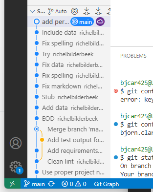
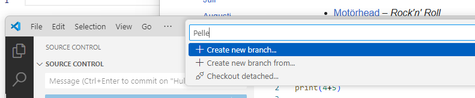
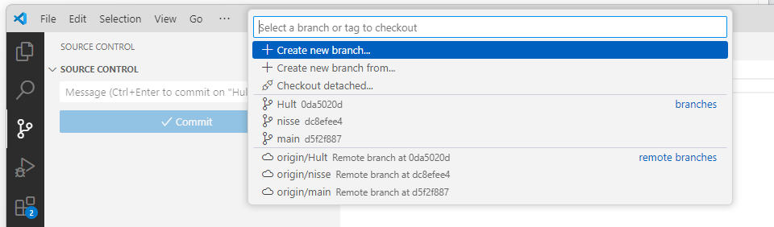
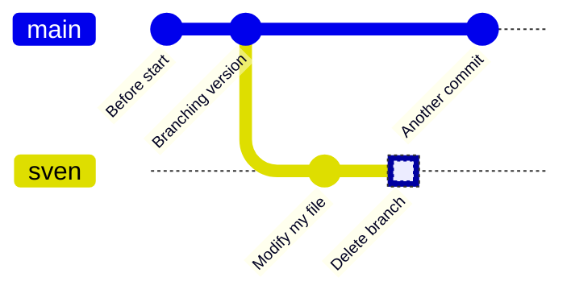
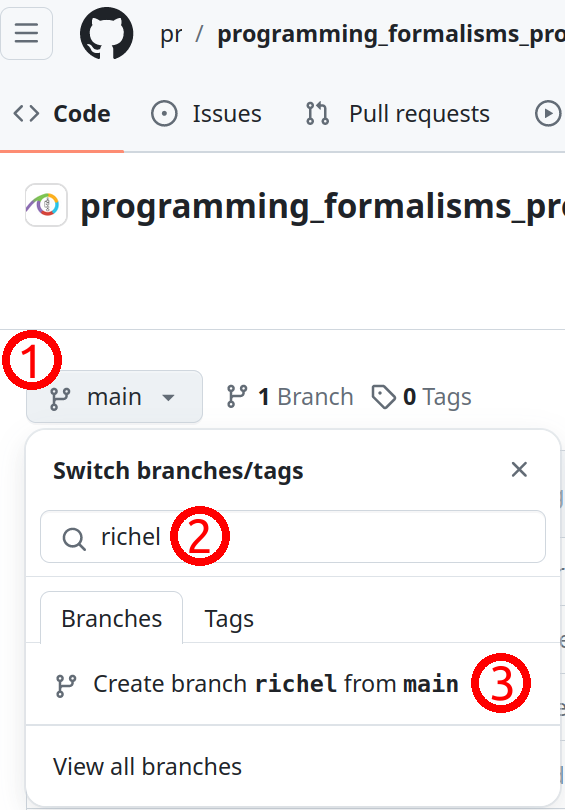
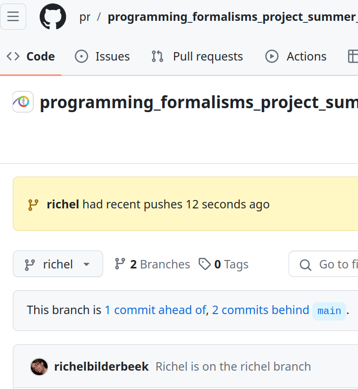
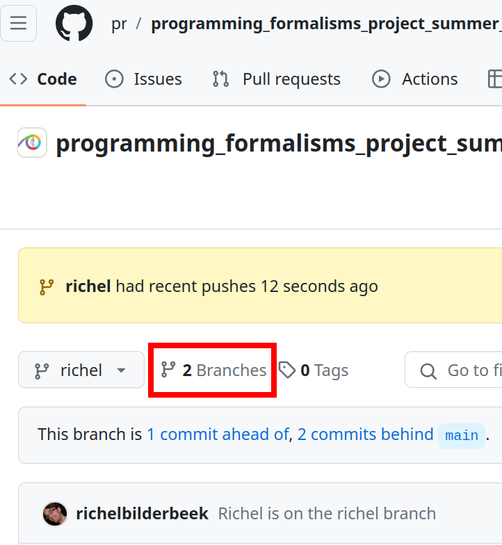
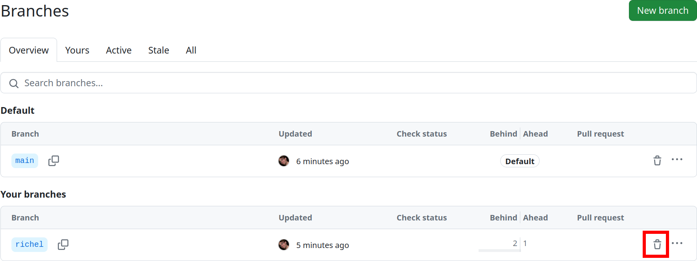
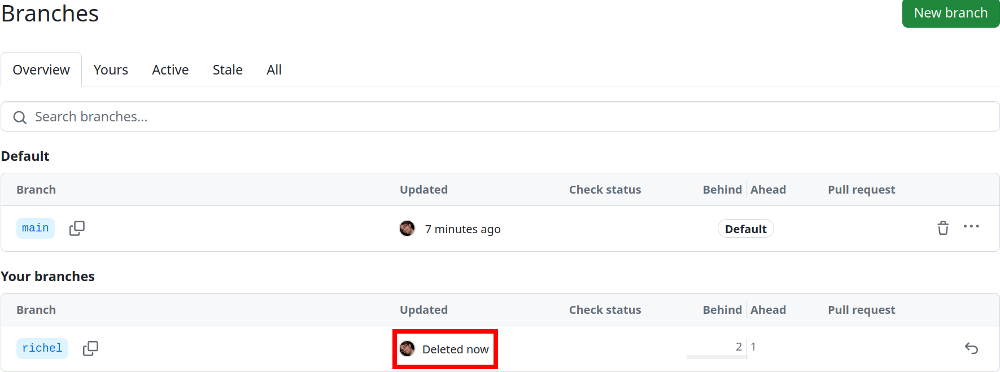

---
tags:
  - git
  - branch
---

# Git branches

!!! questions

    - How to not ruin working code when adding new features?
    - How to work on parallel tracks (many developers, versions)?
    - How to fix mistakes?

!!! info "Learning outcomes of 'Branches'"

    - learners can

        - explain and evaluate the usefulness of branches
        - create, switch and delete a `git` branch locally


???- note "Instructor notes"

    Prerequisites are:

    - git basics

    Lesson Plan:

    - **Total** 50 min
    - Theory 20
    - Exercise 20
    - Discussions 10 min

???- admonition "Changes"

    - clearer guide
    - ask about level
    - If possible simplify things even further, or expand on rationale behind each step not just "big picture"
    - practical examples than just explain the concept.
    - more practical examples of git forking and branching and when it is appropriate to use them.
    - exercises
        - practical things within exercise (not needing to scroll back and forth)
        - clearer instructions
        - advanced exercises

    - Give more practical examples of git branching and when it is appropriate to use them.
    - Git branch couple to SDLC

## Branching and merging

Software development is often not linear:

- We typically need at least one version of the code to "work" (to compile, to give expected results, ...).
- At the same time we work on new features, often several features concurrently.
  Often they are unfinished.
- We need to be able to separate different lines of work really well.

{width: 50%}
_Isolated tracks of work._

The strength of version control is that it permits the researcher to **isolate
different tracks of work**, which can later be merged to create a composite
version that contains all changes.

- We see branching points and merging points.
- Main line development is often called `master` or `main`.
- Other than this convention there is nothing special about `master` or `main`, it is just a branch.

- A group of commits that create a single narrative are called a **branch**.
- There are different branching **strategies**, but it is useful to think that a branch tells the **story of a feature**, e.g. "fast sequence extraction" or "Python interface" or "fixing bug in matrix inversion algorithm".

!!! note "Three ways to name a branch"

    - Issues: #45: Concrete examples
    - Features: GUI module
    - Personal: Björn

### Typical workflows

One typical workflow:

- create branch
- switch to it
- work, work, work, ..., and test
- add and commit
- once feature is ready, switch back to main
- make clear which branch you are in
- merge new-feature to present branch
- remove branch

In VS Code

- Here is where you handle branches



- Click and you have the possibility to
    - create a new branch

    

    - and switch between existing branches
  
    

???- admonition "In command line"

```console
git branch new-feature  # create branch, switch to it
git add/commit                   # work, work, work, ..., and test
git switch master          # once feature is ready, switch back to master
git branch                   # make clear which branch you are in
git merge new-feature        # merge work to present branch
git branch -d new-feature    # remove branch
```

### Git graph

- We can get an overview of graphs

- GitHub

   Link to last year

- VS Code

  - **Image here**


???- tip "Graph alias in command line"

    **An important alias**

    - We can define an _alias_ in Git, to be able to nicely visualize branch structure in the terminal without having to remember a long Git command.

    ```console
    git config --global alias.graph "log --all --graph --decorate --oneline"
    ```

    This will enable you to use ``git graph`` for short

    !!! example
    
        ```git

        $ git graph
        * 000b440 (HEAD -> main) rm print
        | * 4d4acaf (modularity) 4 modular files
        |/
        | * 2d4e252 (jupiter) add jupiter
        |/
        * b9465e4 (origin/main) planet.py documentation
        * 6a416b5 add folders and planet code

        ```

        ```mermaid
        gitGraph

        commit id: "add folders and planet code"
        commit id: "add planet.py documentation"
        branch jupiter
        checkout jupiter
        commit id: "add jupiter"
        checkout main
        branch modular
        checkout modular
        commit id: "4 modular files"
        checkout main
        commit id: "rm print"

        ```

!!! tip "Show unstaged/uncommitted modifications"

    - When you are done editing the files, try `git diff`:

    ```console
    git diff
    ```

    - You can use _arrows_ or _enter_ to scroll the output and quit with ``q``.
    - You will see some things like this.

    ???- "Output from 'diff'"

        ```diff
        diff --git a/ingredients.txt b/ingredients.txt
        index 4422a31..ba8854f 100644
        --- a/ingredients.txt
        +++ b/ingredients.txt
        @@ -2,3 +2,4 @@
         * 1 chili
         * 1 lime
         * 2 tsp salt
        +* 1/2 onion
        diff --git a/instructions.txt b/instructions.txt
        index 7811273..2b11074 100644
        --- a/instructions.txt
        +++ b/instructions.txt
        @@ -4,3 +4,4 @@
         * squeeze lime
         * add salt
         * and mix well
        +* enjoy!

        ```

## Test

    - What is a branch?
    - What is the problem that branches alleviate?
    - What is the name/names of the most important branch?
    - What is our git branching setup?
    - What is the goal of that setup?
    - Why do we use that setup instead of a different one?
    - What is the purpose of each of those branches?
    - Does creating a branch create a new version? Why?
    - Does changing a branch change the content of your local computer? Why?
    - Does deleting a branch create a new version? Why?


!!! tip "git push doesn't work with new branch"

    - you always have to pull before a push:

    ```git
    git pull #
    ```

    - You may need to be more detailed:

    ```git
    git push --set-upstream origin new-branch
    ```

## Exercises

!!! tip "Have VS code side-by-side with GitHub window"

### Exercise 1: create, switch and delete a `git` branch

???- info "Learning outcomes"

    - Create, switch and delete a `git` branch
    - Build up experience using git without troubleshooting



- For our shared **GitHub repository**, create a branch with your first name that is
  unique, e.g. `sven`, `sven_svensson` or `sven_svensson_314`.
  You may branch of from `main` or `develop` (if it exists).
  You may use the web interface (easiest!) or use VS Code


-** On your local computer:**
    - update the repository (pull)
    - switch to the new branch
    - change the content of the repository, for example,
      by creating a file in `learners/[your_name]/[your_name]_is_on_[your_branch_name]`
    - push your changes online.
- On **GitHub**, verify that your changes on your branch can be found online
- On your **local computer**, switch to the main branch,
  as we'll delete the branch you are on now
- Delete your branch (i.e. the one with the unique name).
  You may use the web interface (easiest!) or use the VS Code
- On your local computer, update your code (pull)

???- info "Answers"

    > - For our shared GitHub repository, create a branch with your first name that is
    >   unique, e.g. `sven`, `sven_svensson` or `sven_svensson_314`.
    >   You may branch of from `main` or `develop` (if it exists).
    >   You may use the **web interface** (easiest!) or use the command line

    

    Click on 1, type your branch name at 2 (in this case, `richel`), then click 3.
    Done!

    > - On your local computer:
    >     - update the repository

    On your **local computer**, navigate to the folder of the shared project
    and update:

    

    
  
    ???- admonition "command line"
    
        ```git
        git pull
        ```

    > - On your local computer:
    >     - switch to the new branch

    Switch to the new branch, for example, `richel`, by doing:

    ```git
    git switch richel
    ```

    > - On your local computer:
    >     - change the content of the repository, for example,
    >       by creating a file in `learners/[your_name]/[your_name]_is_on_[your_branch_name]`

    This can be any change you'd like.
    To create a file under Linux (and maybe this works on other
    operating systems too), one can do:

    ```git
    touch learners/richel/richel_is_on_richel.txt
    ```

    After the change, commit these:

    ```git
    git add .
    git commit -m "Richel is on richel"
    ```

    > - On your local computer:
    >     - push your changes online.

    Do:

    ```git
    git push
    ```

    And your code may end up online.

    If that does not work, do:

    ```git
    git pull
    ```

    and try pushing again, maybe multiple times, as many people
    are pushing to the shared repo.

    > - On GitHub, verify that your changes on your branch can be found online

    

    Make sure you look at the correct branch, as displayed at 1.
    Then your commit message shows up at 2.

    > - On your local computer, switch to the main branch,
    >   as we'll delete the branch you are on now

    Switch to the main branch, for example, `main`, by doing:

    ```git
    git switch main
    ```

    > - Delete your branch (i.e. the one with the unique name).
    >   You may use the web interface (easiest!) or use the command line

    

    Click on 'Branches', as shown in the image above.

    

    Click on garbage bin, as shown in the image above.

    

    The branch will now be deleted, as shown in the image above.

    > - On your local computer, update your code

    Do:

    ```git
    git pull
    ```

???- question "Need a video?"

    See a video [here](https://youtu.be/Ewewytijw1g)


## Summary

- Now we know how to save snapshots:

```git
git add <file(s)>
git commit
```

- And that is what we do as we program.
- Other very useful commands are these:

```git
git init    # initialize new repository
git add     # add files or stage file(s)
git commit  # commit staged file(s)
git status  # see what is going on
git log     # see history
git diff    # show unstaged/uncommitted modifications
git show    # show the change for a specific commit
git switch -b wild-idea    # create branch, switch to it, work, work, work ...
git switch main          # realize it was a bad idea, back to main/master
git branch -D wild-idea      # it is gone, off to a new idea
git merge
```

**Overview workflow**


!!! admonition "Parts to be covered!"

    - &#9745; Source/version control
        - Git
        - We have a starting point!
        - GitHub as remote backup
        - branches
    - &#9745; Planning
        - &#9745; Analysis
        - &#9745;Design
    - &#9745; Testing
        - Different levels
    - &#9744; Collaboration
        - GitHub
        - pull requests
    - &#9744; Sharing
        - &#9745; open science
        - &#9744; citation
        - &#9745; licensing
    - &#9744; Documentation
        - &#9745; in-code documentation

!!! Keypoints

    - Initializing a Git repository is simple: ``git init``.
    - Commits should be used to tell a story.
    - Git uses the .git folder to store the snapshots.
    - Don’t be afraid to stage and commit often. Better too o
    - A branch is a division unit of work, to be merged with
    - A tag is a pointer to a moment in the history of a proj
    - A repository can have one or multiple remotes (we will
    - Local branches often track remote branches.
    - A remote serves as a full backup of your work.

!!! note "See also"

    [More about branches](https://coderefinery.github.io/git-intro/branches/)


## Reference Git

- [Main git book](https://git-scm.com/book/en/v2)
- [Pro Git](https://uppmax.github.io/programming_formalisms/reading/chacon_and_straub_2014.pdf)
- Tsitoara, Mariot, and Mariot Tsitoara. "Git best practices." [Beginning Git and GitHub](https://learning.oreilly.com/library/view/beginning-git-and/9798868802157/): A Comprehensive Guide to Version Control, Project Management, and Teamwork for the New Developer (2020): 79-86.
