---
tags:
  - git
  - branch
---

# Git branches

!!! questions

    - How to not ruin working code when adding new features?
    - How to work on parallel tracks (many developers, versions)?
    - How to fix mistakes?

!!! info "Learning outcomes of 'Branches'"

    - learners can

        - explain and evaluate the usefulness of branches
        - create, switch and delete a `git` branch locally

???- note "Instructor notes"

    Prerequisites are:

    - git basics

    Lesson Plan:

    - **Total** 50 min
    - Theory 15
    - Exercise 25
    - Discussions 10 min

???- admonition "Changes"

    - practical examples than just explain the concept.
    - Git branch couple to SDLC??
    - exercises
        - advanced exercises

## Branching and merging

Software development is often not linear:

- We typically need at least one version of the code to "work" (to compile, to give expected results, ...).
    - This is the **main** branch (former *master*)
- At the same time we work on new features, often several features concurrently.
  Often they are unfinished.
- We need to be able to separate different lines of work really well.

{width: 50%}

*Isolated tracks of work*

The strength of version control is that it permits the researcher to **isolate
different tracks of work**, which can later be merged to create a composite
version that contains all changes.

- We see branching points and merging points.
- Main line development is often called `master` or `main`.
- Other than this convention there is nothing special about `master` or `main`, it is just a branch.

- A group of commits that create a single narrative are called a **branch**.
- There are different branching **strategies**, but it is useful to think that a branch tells the **story of a feature**, e.g. "fast sequence extraction" or "Python interface" or "fixing bug in matrix inversion algorithm".

!!! note "Three ways to name a branch"

    - Issues: #45: Concrete examples
    - Features: GUI module
    - Personal: Björn

### Typical workflows

One typical workflow:

- create branch
- switch to it
- work, work, work, ..., and test
- add and commit
- once feature is ready, switch back to main
- make clear which branch you are in
- merge new-feature to present branch
- remove branch

??? info "In VS Code"

    - Here is where you handle branches

    

    - Click and you have the possibility to
        - create a new branch

        

        - and switch between existing branches

        

??? info "In command line"

    ```console
    git branch new-feature  # create branch, switch to it
    git add/commit                   # work, work, work, ..., and test
    git switch master          # once feature is ready, switch back to master
    (git checkout <branch>)     # Old command for switching branch, but also going back in history to earlier commit
    git branch                   # make clear which branch you are in
    git merge new-feature        # merge work to present branch
    git branch -d new-feature    # remove branch
    ```

    !!! tip "git push doesn't work with new branch"

        - you always have to pull before a push:

        ```git
        git pull #
        ```

        - You may need to be more detailed:

        ```git
        git push --set-upstream origin new-branch
        ```

??? info "On GitHub"

    - You may branch of from `main` or `develop` (ONLY if it exists).

    {width: 10%}

    - Click on 1, type your branch name at 2 (in this case, `richel`), then click 3.
    - To view all branches

    {width: 40%}

    - The overview

    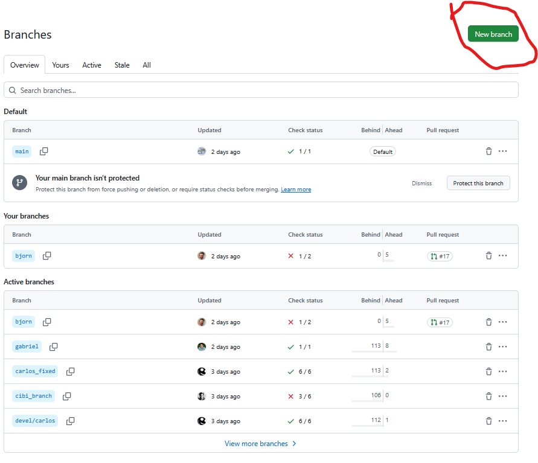{width: 40%}

### Git graph

- We can get an overview of graphs

??? info "GitHub"

    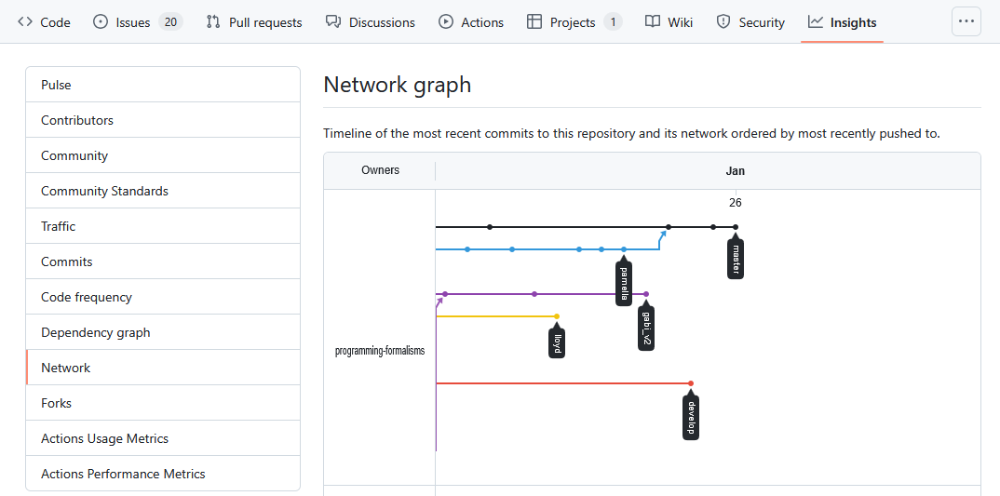

    - [Link to last year](https://github.com/programming-formalisms/programming_formalisms_project_autumn_2024/network)
    - [Link to this year](https://github.com/programming-formalisms/programming_formalisms_project_autumn_2025/network)

??? info "VS Code"

    - 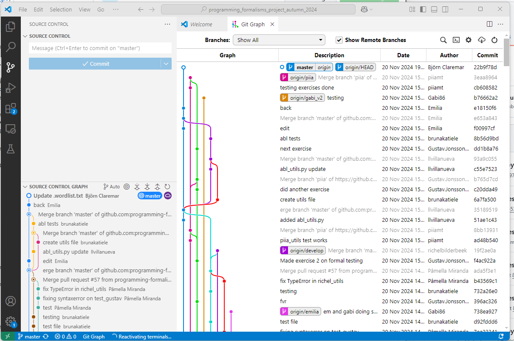

???- tip "Graph alias in command line"

    **An important alias**

    - We can define an *alias* in Git, to be able to nicely visualize branch structure in the terminal without having to remember a long Git command.

    ```console
    git config --global alias.graph "log --all --graph --decorate --oneline"
    ```

    This will enable you to use ``git graph`` for short

    !!! example

        ```git

        $ git graph
        * 000b440 (HEAD -> main) rm print
        | * 4d4acaf (modularity) 4 modular files
        |/
        | * 2d4e252 (jupiter) add jupiter
        |/
        * b9465e4 (origin/main) planet.py documentation
        * 6a416b5 add folders and planet code

        ```

        ```mermaid
        gitGraph

        commit id: "add folders and planet code"
        commit id: "add planet.py documentation"
        branch jupiter
        checkout jupiter
        commit id: "add jupiter"
        checkout main
        branch modular
        checkout modular
        commit id: "4 modular files"
        checkout main
        commit id: "rm print"
        ```

## Overview
        
??? info "Overview workflow"

    

???- question "Test"

    - What is a branch?
    - What is the problem that branches alleviate?
    - What is the name/names of the most important branch?
    - What is our git branching setup?
    - What is the goal of that setup?
    - Why do we use that setup instead of a different one?
    - What is the purpose of each of those branches?
    - Does creating a branch create a new version? Why?
    - Does changing a branch change the content of your local computer? Why?
    - Does deleting a branch create a new version? Why?

## The project: From requirement to branch

!!! note "Workflow of project"

    1. requirement
    2. issue
    3. branching
    4. merging/pull request
    5. code review


### Let's look at Björn's input and practice code review already (together)

Steps:

- branching
- merging/pull request
- code review
- issue


??? example "Björn's new requirements, using GitHub"

    - Updated information on requirements

    ??? question "Commit_add data requirements"

        

    - Björn used a branch

    ??? question "bjorn branch"

        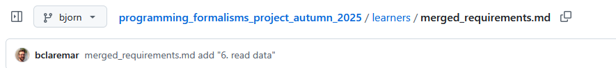

    - Wants to merge

    ??? question "No contribution info"

        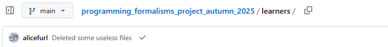

    - Need to go to root!
    
    ??? question "Compare & pull request_bjorn"

        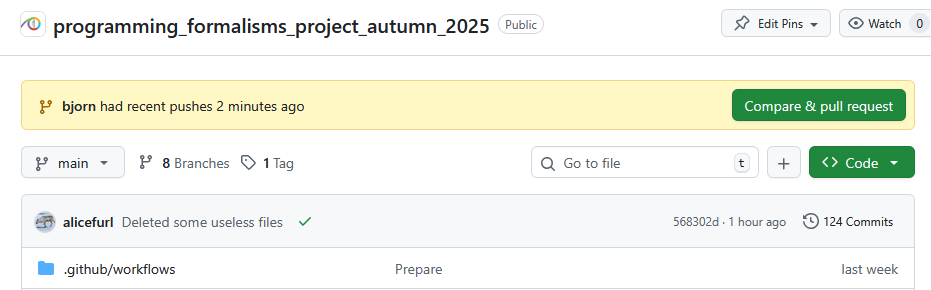

    - Open pull request
    
    ??? question "PR_add_reqs6"

        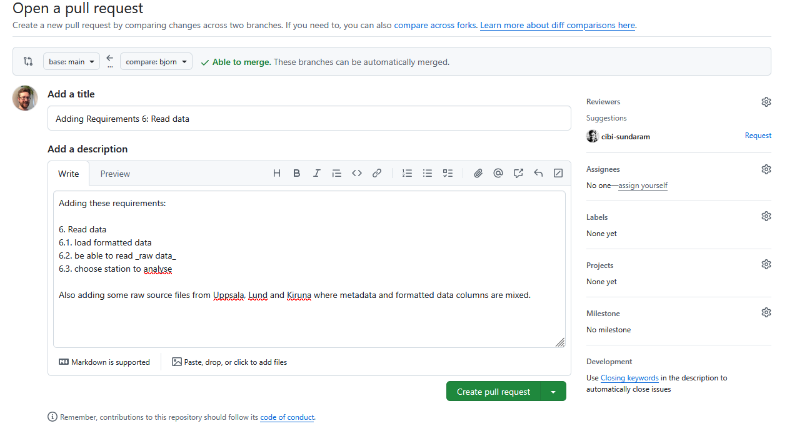

    - We find all pull requests (PRs) in the upper menu!
    
    ??? question "PR_overview"

        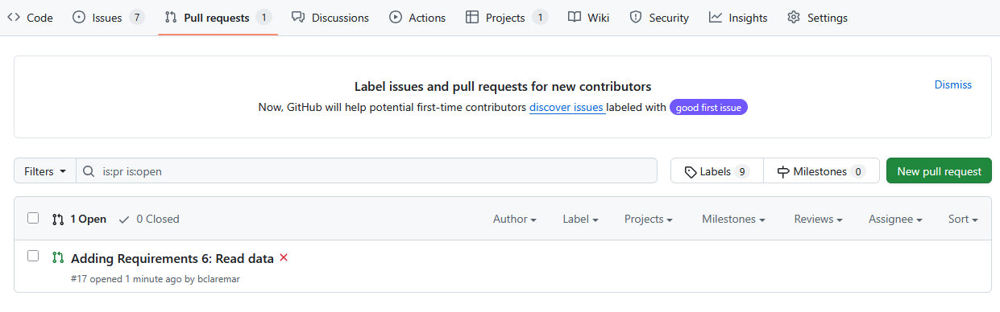

??? example "Approve Björn's new requirements"

    - Lets look and fix together
    - Code review!

??? example "Look at Björn's new Issue"

    - Do we agree?
    - Add to the issue the namings of 2 feature branches from Req 6.1-2 to be used in exercise 1.

    !!! note "Three ways to name a branch"

        - Issues: #45: Concrete examples
        - Features: GUI module
        - Personal: Björn

## Exercises

???- info "Learning outcomes"

    - Create, switch and delete a `git` branch
    - Build up experience using git without troubleshooting

### Exercise 1: Create a and switch to a project branch

!!! tip "Use GitHub"

- The 3 groups create one branch each according to issue above.
- Go to the branch
- Create a .py file which can be a function in the full program with a good name in the ``src/weather`` directory
- Copy-paste the suitable example below.
- (If there is time) Make a docstring describing what the function should do
- We will not go further with the file now, so let's go back to ``main``

??? example "Example code 6.1 (read Uppsala 1722-2022) using ``pandas``"

    ```python
    import pandas as pd

    df=pd.read_csv("../../data/uppsala_tm_1722-2022.dat",sep='\s+')
    print(df)
    df.columns=['Year','Month','Day','T','Tcorr','Data id']
    print(df.Tcorr)
    ```

??? example "Example code 6.2 (read other Swedish stations) using ``pandas``"

    ```python
    column_names=['Date','Time','Temp']
    df = pd.read_csv('data/smhi_opendata_1_97530_20250224_081022.csv', header=None, delimiter=";", names=column_names,skiprows = 10, usecols=[0, 1, 2])
    print(df)
    print(df.Date)
    print(df.Time)
    print(df.Temp)
    ```

??? example "Example code 6.3 (conenct station name with file name) "

    Make a simple docstring!

    
Workflow

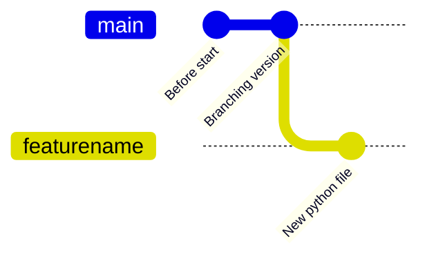

??? info "Answer"

    - For our shared GitHub repository, create a branch with the name
    - You may branch of from `main` or `develop` (ONLY if it exists).

    {width: 30%}

    - Click on 1, type your branch name at 2 (in this case, `richel`), then click 3.
    - Now do the work in the branch.
    - Save/commit
    - DO NOT MERGE!
    - Click on Branch and choose ``main``
    - Done!

### Exercise 2: create, switch and delete a test branch LOCALLY

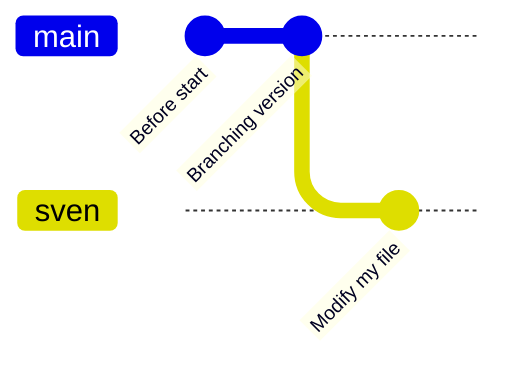

- For our shared **GitHub repository**, create a branch with your first name that is
  unique, e.g. `sven`, `sven_svensson` or `sven_svensson_314`.
  You may branch off from `main` or `develop` (if it exists).
  You may use the web interface (easiest!) or use VS Code


- **On your local computer:**
    - update the repository (pull)
    - switch to the new branch
    - change the content of the repository
      by creating a file in `learners/[your_name]/[your_name]_is_on_[your_branch_name]`
    - push your changes online.
- On **GitHub**, verify that your changes on your branch can be found online
- On your **local computer**, switch to the main branch,
  as we'll delete the branch you are on now
- Delete your branch (i.e. the one with the unique name).
  You may use the web interface (easiest!) or use the VS Code
- On your local computer, update your code (pull)

???- info "Answers"

    > - For our shared GitHub repository, create a branch with your first name that is
    >   unique, e.g. `sven`, `sven_svensson` or `sven_svensson_314`.
    >   You may branch of from `main` or `develop` (if it exists).
 
    ???- admonition "If you wish to use the command line"

        ```git
        git pull
        ```

        > - On your local computer:
        >     - switch to the new branch

        Switch to the new branch, for example, `richel`, by doing:

        ```git
        git switch richel
        ```

        > - On your local computer:
        >     - change the content of the repository, for example,
        >       by creating a file in `learners/[your_name]/[your_name]_is_on_[your_branch_name]`

        This can be any change you'd like.
        To create a file under Linux (and maybe this works on other
        operating systems too), one can do:

        ```git
        touch learners/richel/richel_is_on_richel.txt
        ```

        After the change, commit these:


        ```git
        git add .
        git commit -m "Richel is on richel"
        ```

        > - On your local computer:
        >     - push your changes online.

        Do:


        ```git
        git push
        ```

        And your code may end up online.

        If that does not work, do:

        ```git
        git pull
        ```

        and try pushing again, maybe multiple times, as many people
        are pushing to the shared repo.

        !!! tip "git push doesn't work with new branch"

            - you always have to pull before a push:

            ```git
            git pull #
            ```

            - You may need to be more detailed:

            ```git
            git push --set-upstream origin new-branch
            ```

        > - On GitHub, verify that your changes on your branch can be found online

        

        Make sure you look at the correct branch, as displayed at 1.
        Then your commit message shows up at 2.

        > - On your local computer, switch to the main branch,
        >   as we'll delete the branch you are on now

        Switch to the main branch, for example, `main`, by doing:

        ```git
        git switch main
        ```

        > - Delete your branch (i.e. the one with the unique name).
        >   You may use the web interface (easiest!) or use the command line

        

        Click on 'Branches', as shown in the image above.

        

        Click on garbage bin, as shown in the image above.

        

        The branch will now be deleted, as shown in the image above.

        > - On your local computer, update your code

        Do:

        ```git
        git pull
        ```

    **This is for VS Code**

    > - On your local computer:
    >     - update the repository

    On your **local computer**, navigate to the folder of the shared project
    and update: pull/sync

    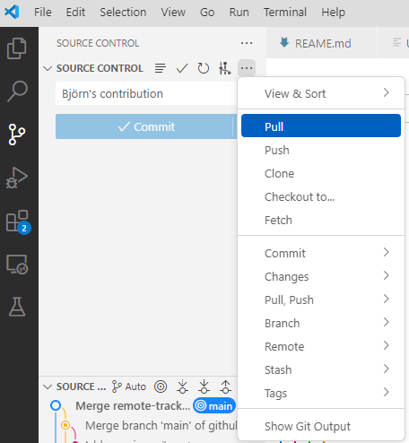


    > - On your local computer:
    >     - switch to the new branch

    Switch to the new branch, for example, `richel`, by doing:

    
    

    > - On your local computer:
    >     - change the content of the repository, for example,
    >       by creating a file in `learners/[your_name]/[your_name]_is_on_[your_branch_name]`

    This can be any change you'd like.

    After the change, commit these ("+" and "commit")

    > - On your local computer:
    >     - push your changes online.

    Push "Sync"

    And your code may end up online.

    If that does not work, try pushing again, maybe multiple times, as many people
    are pushing to the shared repo.

    > - On GitHub, verify that your changes on your branch can be found online

    {width: 30%}

    - Make sure you look at the correct branch, as displayed by the "drop-down button".
    - Then your commit message shows up in the yellow section
        - ”Ignore if a pull request shows up”

    > - On your local computer, switch to the main branch,
    >   as we'll delete the branch you are on now

    Switch to the *main* branch.

    > - Delete your branch (i.e. the one with the unique name).
    > - You may use the web interface (easiest!) or use VS Cde

    In VS Code

    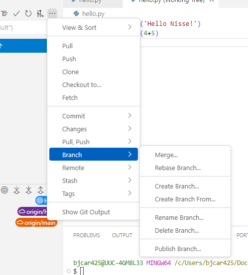

    ???- admonition "GitHub"

        {width: 50%}

        Click on 'Branches', as shown in the image above.

        

        Click on garbage bin, as shown in the image above.

        

        The branch will now be deleted, as shown in the image above.

    > - On your local computer, update your code

    Sync or Pull again!

???- question "Need a video for command line?"

    See the
    ['Programming Formalisms: git branch exercise' YouTube video](https://youtu.be/Ewewytijw1g)

## Extra: ``git diff``

??? tip "Show unstaged/uncommitted modifications"

    - When you are done editing the files, try "git diff"
    - When you select a file in the Source Control view, the editor shows a diff view that highlights the file changes, compared to the previously committed file.

    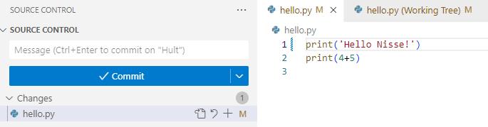

    - Press "M"

    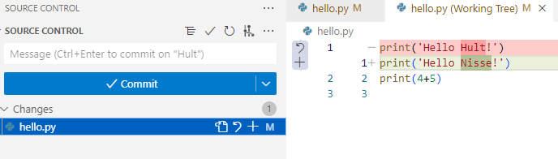


    ???- note "In console"

        ```console
        git diff
        ```

        - You can use *arrows* or *enter* to scroll the output and quit with ``q``.
        - You will see some things like this.

        ???- "Output from 'diff'"

            ```diff
            diff --git a/ingredients.txt b/ingredients.txt
            index 4422a31..ba8854f 100644
            --- a/ingredients.txt
            +++ b/ingredients.txt
            @@ -2,3 +2,4 @@
             * 1 chili
             * 1 lime
             * 2 tsp salt
            +* 1/2 onion
            diff --git a/instructions.txt b/instructions.txt
            index 7811273..2b11074 100644
            --- a/instructions.txt
            +++ b/instructions.txt
            @@ -4,3 +4,4 @@
             * squeeze lime
             * add salt
             * and mix well
            +* enjoy!

            ```
## Summary

```git
git switch -b wild-idea    # create branch, switch to it, work, work, work ...
git switch main          # realize it was a bad idea, back to main/master
```

!!! admonition "Parts to be covered!"

    - &#9745; Source/version control
        - Git
        - We have a starting point!
        - GitHub as remote backup
        - branches
    - &#9745; Planning
        - &#9745; Analysis
        - &#9745;Design
    - &#9745; Testing
        - Different levels
    - &#9744; Collaboration
        - GitHub
        - pull requests
    - &#9744; Sharing
        - &#9745; open science
        - &#9744; citation
        - &#9745; licensing
    - &#9744; Documentation
        - &#9745; in-code documentation

!!! Keypoints

    - A branch is a division unit of work, to be merged with main sometime
    - Both git locally and GitHub can be used
    - You can delete a branch safely after merging

!!! note "See also"

    [More about branches](https://coderefinery.github.io/git-intro/branches/)

## Reference Git

- [Main git book](https://git-scm.com/book/en/v2)
- [Pro Git](https://uppmax.github.io/programming_formalisms/reading/chacon_and_straub_2014.pdf)
- Tsitoara, Mariot, and Mariot Tsitoara. "Git best practices." [Beginning Git and GitHub](https://learning.oreilly.com/library/view/beginning-git-and/9798868802157/): A Comprehensive Guide to Version Control, Project Management, and Teamwork for the New Developer (2020): 79-86.
