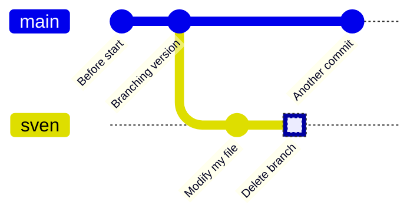

# Git branches and merging

!!! questions

    - How to not ruin working code when adding new features?
    - How to work on parallel tracks (many developers, versions)?
    - How to fix mistakes?

!!! info "Content"

    - We will
        - work with the basic commands in git
        - go through branching and merging


???- info "Learning objectives of 'Branches'"

    - learners can locally

        - explain and evaluate the usefulness of branches
        - create, switch and delete a `git` branch
        - merge


???- note "Instructor notes"

    Prerequisites are:

    - git basics

    Lesson Plan: **FIX**

    - **Total** 30 min
    - Theory 20
    - Discussions 10 min


!!! info "Table of content"

    **FIX**

    - Branching
        - background
        - workflows
        - examples/demos
        - discussion
    - Merging
        - background
        - workflows
        - conflicts?
        - examples/demos
        - discussion

!!! info "References"

    - The [main git book](https://git-scm.com/book/en/v2)

    - 'git best practices'

        - Tsitoara, Mariot, and Mariot Tsitoara. "Git best practices." Beginning Git and GitHub: A Comprehensive Guide to Version Control, Project Management, and Teamwork for the New Developer (2020): 79-86.
        - Tepavac, Igor, et al. "Version Control Systems, Tools and Best Practices: Case Git." CASE 27-Razvoj poslovnih i informatičkih sustava. 2015.

!!! warning

    VScode sync: skip because of generality

    - ``git config --global credential.helper cache``
    - ``git config --global credential.helper 'cache --timeout=36000'``

## Branching and merging

Software development is often not linear:

- We typically need at least one version of the code to "work" (to compile, to give expected results, ...).
- At the same time we work on new features, often several features concurrently.
  Often they are unfinished.
- We need to be able to separate different lines of work really well.

{width: 50%}
_Isolated tracks of work._


The strength of version control is that it permits the researcher to **isolate
different tracks of work**, which can later be merged to create a composite
version that contains all changes.

- We see branching points and merging points.
- Main line development is often called `master` or `main`.
- Other than this convention there is nothing special about `master` or `main`, it is just a branch.
- Commits form a directed acyclic graph (we have left out the arrows to avoid confusion about the time arrow).

A group of commits that create a single narrative are called a **branch**.
There are different branching strategies, but it is useful to think that a branch
tells the story of a feature, e.g. "fast sequence extraction" or "Python interface" or "fixing bug in
matrix inversion algorithm".

### Typical workflows

One typical workflow:

```console
git switch -c new-feature  # create branch, switch to it
git commit                   # work, work, work, ..., and test
git switch master          # once feature is ready, switch to master
git merge new-feature        # merge work to present branch
git branch -d new-feature    # remove branch
```

!!! info "Sea also"

    [More about branches](https://coderefinery.github.io/git-intro/branches/)

### Exercise 1: create, switch and delete a `git` branch

!!!- info "Learning objectives"

    - Create, switch and delete a `git` branch
    - Build up experience using git without troubleshooting



- For our shared GitHub repository, create a branch with your first name that is
  unique, e.g. `sven`, `sven_svensson` or `sven_svensson_314`.
  You may branch of from `main` or `develop` (if it exists).
  You may use the web interface (easiest!) or use the command line
- On your local computer:
    - update the repository
    - switch to the new branch
    - change the content of the repository, for example,
      by creating a file in `learners/[your_name]/[your_name]_is_on_[your_branch_name]`
    - push your changes online.
- On GitHub, verify that your changes on your branch can be found online
- On your local computer, switch to the main branch,
  as we'll delete the branch you are on now
- Delete your branch (i.e. the one with the unique name).
  You may use the web interface (easiest!) or use the command line
- On your local computer, update your code

???- info "Answers"

    > - For our shared GitHub repository, create a branch with your first name that is
    >   unique, e.g. `sven`, `sven_svensson` or `sven_svensson_314`.
    >   You may branch of from `main` or `develop` (if it exists).
    >   You may use the web interface (easiest!) or use the command line

    

    Click on 1, type your branch name at 2 (in this case, `richel`), then click 3.
    Done!

    > - On your local computer:
    >    - update the repository

    On your local computer, navigate to the folder of the shared project
    and update:

    ```
    git pull
    ```

    > - On your local computer:
    >     - switch to the new branch

    Switch to the new branch, for example, `richel`, by doing:

    ```
    git switch richel
    ```

    > - On your local computer:
    >     - change the content of the repository, for example,
    >       by creating a file in `learners/[your_name]/[your_name]_is_on_[your_branch_name]`

    This can be any change you'd like.
    To create a file under Linux (and maybe this works on other
    operating systems too), one can do:

    ```
    touch learners/richel/richel_is_on_richel.txt
    ```

    After the change, commit these:

    ```
    git add .
    git commit -m "Richel is on richel"
    ```

    > - On your local computer:
    >     - push your changes online.

    Do:

    ```
    git push
    ```

    And your code may end up online.

    If that does not work, do:

    ```
    git pull
    ```

    and try pushing again, maybe multiple times, as many people
    are pushing to the shared repo.

    > - On GitHub, verify that your changes on your branch can be found online

    

    Make sure you look at the correct branch, as displayed at 1.
    Then your commit message shows up at 2.

    > - On your local computer, switch to the main branch,
    >   as we'll delete the branch you are on now

    Switch to the main branch, for example, `main`, by doing:

    ```
    git switch main
    ```

    > - Delete your branch (i.e. the one with the unique name).
    >   You may use the web interface (easiest!) or use the command line

    [](github_view_branches_annotated.png)

    Click on 'Branches', as shown in the image above.

    

    Click on garbage bin, as shown in the image above.

    

    The branch will now be deleted, as shown in the image above.

    > - On your local computer, update your code

    Do:

    ```
    git pull
    ```

## Add ~~Jupiter~~ in a new branch

- Let's make a new branch called ``FIX``
- Here we add some code taking care of the motion of ~~Jupiter~~  and interaction with Earth

!!! example "Demo or Type-along: Add Jupiter"

    - Make sure we are in phase with our GitHub remote!

    ```git
    git pull
    ```

    - Let's make a new branch called ``jupiter``

    ```git
    git switch -c jupiter
    ```

    - Check that we are in that branch!

    ```git
    $ git branch

    * jupiter
    main

    ```

    - Note that we have the same working tree right now as before (code/ and Figures/ folders and the planet.py file).
    - Let's open the
    - We will add some lines to count with the effects from the gravity of Jupiter on Earth


**show unstaged/uncommitted modifications**

???- question "Demo: modular code in branch"

!!! example "Demo or type-along"

    - When you are done editing the files, try `git diff`:

    ```console
    git diff
    ```

    - You can use _arrows_ or _enter_ to scroll the output and quit with ``q``.
    - You will see some thing like this.

    ???- "Output from 'diff'"

        ```diff
        some output
        ```

## Let's make our code XXX (test in another branch)

- We consider the XX branch dead-end.
- Let's instead start from the main branch and create a "modularity"

!!! example "Demo or Type-along: git branch 2"

    - add and commit

    ```git
    git add .
    git commit -m 'XXX'
    ```

    - We can now check the history with a command that graphically tries to show the log with branches

!!! tip

    **An important alias**

    - We will now define an _alias_ in Git, to be able to nicely visualize branch structure in the terminal without having to remember a long Git command.

    ```console
    git config --global alias.graph "log --all --graph --decorate --oneline"
    ```

    This will enable you to use ``git graph`` for short

    - It will now give you something like this:


    ```git

    $ git graph
    * 4d4acaf (HEAD -> modularity) 4 modular files
    | * 2d4e252 (jupiter) add jupiter
    |/
    * b9465e4 (origin/main, main) planet.py documentation
    * 6a416b5 add folders and planet code

    ```

    ```mermaid
    gitGraph

    commit id: "add planet.py"
    branch jupiter
    checkout jupiter
    commit id: "add jupiter"
    checkout main
    branch modular
    checkout modular
    commit id: "4 modular files"

    ```


## Meanwhile

**Back in main branch**

- We spotted an unnecessary ``print`` line in the main branch code.
- Perhaps we're not finished with the modular branch, so let's fix this in the main branch.

!!! example "Demo or type-along"

    - Go to the main branch:

    ```git
    git switch main
    ```

    - Note that we now just find the ``planet.py`` file!
    - Let's remove the print line around row 35 in the for-loop.
    - Save, add and commit

    ```git
    git add planet.py
    git commit -m "rm print"
    ```

    - And do the graph!

    ```git
    $ git graph
    * 000b440 (HEAD -> main) rm print
    | * 4d4acaf (modularity) 4 modular files
    |/
    | * 2d4e252 (jupiter) add jupiter
    |/
    * b9465e4 (origin/main) planet.py documentation
    * 6a416b5 add folders and planet code
    ```

    ```mermaid
    gitGraph

    commit id: "add planet.py"
    branch jupiter
    checkout jupiter
    commit id: "add jupiter"
    checkout main
    branch modular
    checkout modular
    commit id: "4 modular files"
    checkout main
    commit id:"rm print"
    ```

### On GitHub

- Let's view the branches on Github!
- Go to _Insights_ in the top menu of the `XXX` repo and then go to _Network_ in side-bar
- If we do this after the merging the branches do not show up.


## Merging

- It turned out that our experiment with XX was a good idea.
- Our goal now is to merge modularity into main.


???- question "Demo: git merge"

!!! example "Merge into main"

    - once all features are ready, switch to main!

    ```git
    $ git switch main    # switch to main branch
    $ git branch           # check that we are on main branch
    $ git merge  XXXX          # merge modularity into main

    Merge made by the 'ort' strategy.
     output

    ```

    - let's now check the graphical view:

    ```git
    $ git graph
    * 1b29a8f (HEAD -> main) Merge branch 'modularity'
    |\
    | * 4d4acaf (modularity) 4 modular files
    * | 000b440 rm print
    |/
    | * 2d4e252 (jupiter) add jupiter
    |/
    * b9465e4 (origin/main) planet.py documentation
    * 6a416b5 add folders and planet code
    ```

    ```mermaid
    gitGraph

    commit id: "add planet.py"
    branch jupiter
    checkout jupiter
    commit id: "add jupiter"
    checkout main
    branch modular
    checkout modular
    commit id: "4 modular files"
    checkout main
    commit id:"rm print"
    merge modular
    ```

    - NOTE that (origin/main) planet.py documentation is not up-to-date
        - In other words: GitHub has an old version of the project
    - push to GitHub
    - ``git push``

    ```git
    $ git graph
    *   1b29a8f (HEAD -> main, origin/main) Merge branch 'modularity'
    |\
    | * 4d4acaf (modularity) 4 modular files
    * | 000b440 rm print
    |/
    | * 2d4e252 (jupiter) add jupiter
    |/
    * b9465e4 planet.py documentation
    * 6a416b5 add folders and planet code
    ```

    - Now local Git and GitHub are in phase!

## Test

    - What is a branch?
    - What is the problem that branches alleviate?
    - What is the name/names of the most important branch?
    - What is our git branching setup?
    - What is the goal of that setup?
    - Why do we use that setup instead of a different one?
    - What is the purpose of each of those branches?
    - Does creating a branch create a new version? Why?
    - Does changing a branch change the content of your local computer? Why?
    - Does deleting a branch create a new version? Why?


### On GitHub

- Let's view the branches on Github!
- Go to _Insights_ in the top menu of the `planet-bjorn` repo and then go to _Network_ in side-bar
- If we did this after the merging the branches do not show up.


## Summary

- Now we know how to save snapshots:

```git
git add <file(s)>
git commit
```

- And that is what we do as we program.
- Other very useful commands are these:

```git
git init    # initialize new repository
git add     # add files or stage file(s)
git commit  # commit staged file(s)
git status  # see what is going on
git log     # see history
git diff    # show unstaged/uncommitted modifications
git show    # show the change for a specific commit
git switch -b wild-idea    # create branch, switch to it, work, work, work ...
git switch main          # realize it was a bad idea, back to main/master
git branch -D wild-idea      # it is gone, off to a new idea
git merge
```

**Overview workflow**


!!! admonition "Parts to be covered!"

    - &#9745; Source/version control
        - Git
        - We have a starting point!
        - GitHub as remote backup
        - branches
    - &#9745; Planning
        - &#9745; Analysis
        - &#9745;Design
    - &#9745; Testing
        - Different levels
    - &#9744; Collaboration
        - GitHub
        - pull requests
    - &#9744; Sharing
        - &#9745; open science
        - &#9744; citation
        - &#9745; licensing
    - &#9744; Documentation
        - &#9745; in-code documentation

!!! Keypoints

    - Initializing a Git repository is simple: ``git init``.
    - Commits should be used to tell a story.
    - Git uses the .git folder to store the snapshots.
    - Don’t be afraid to stage and commit often. Better too o
    - A branch is a division unit of work, to be merged with
    - A tag is a pointer to a moment in the history of a proj
    - A repository can have one or multiple remotes (we will
    - Local branches often track remote branches.
    - A remote serves as a full backup of your work.

