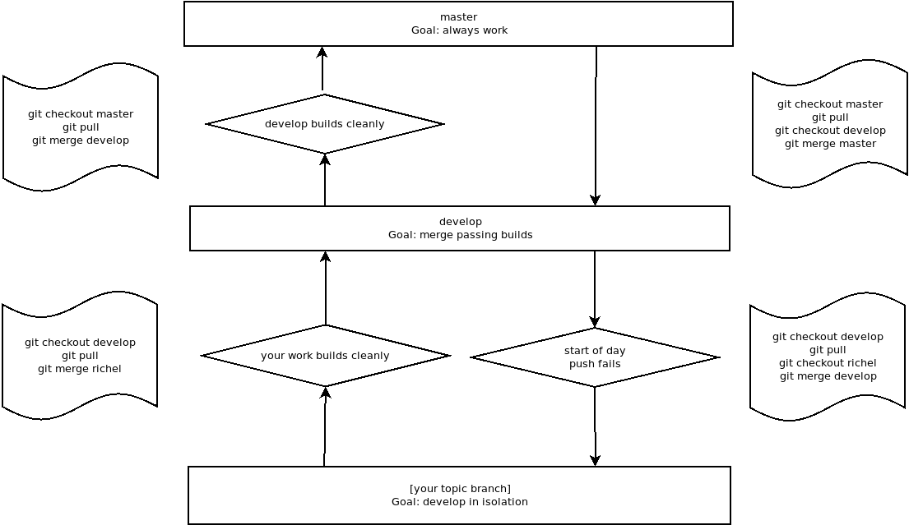

## Understand git branches and merging

!!! questions

    - How to not ruin working code when adding new features?
    - How to work on parallel tracks (many developers, versions)?
    - How to fix mistakes?

!!! info "Content"

    - We will
        - work with the basic commands in git
        - go through branching and merging


???- info "Learning objectives of 'Branches'"

    - learners can locally
       
        - explain and evaluate the usefulness of branches
        - create, switch and delete a `git` branch
        - merge 


???- note "Instructor notes"

    Prerequisites are:

    - git basics

    Lesson Plan: **FIX**
    
    - **Total** 30 min
    - Theory 20
    - Discussions 10 min


!!! info "Table of content"

    - Branching
        - background
        - workflows
        - examples/demos
        - discussion
    - Merging
        - background
        - workflows
        - conflicts?
        - examples/demos
        - discussion


!!! info "References"

    - The [main git book](https://git-scm.com/book/en/v2)

    - 'git best practices'

        - Tsitoara, Mariot, and Mariot Tsitoara. "Git best practices." Beginning Git and GitHub: A Comprehensive Guide to Version Control, Project Management, and Teamwork for the New Developer (2020): 79-86.
        - Tepavac, Igor, et al. "Version Control Systems, Tools and Best Practices: Case Git." CASE 27-Razvoj poslovnih i informatičkih sustava. 2015.


## Branching and merging

Software development is often not linear:

- We typically need at least one version of the code to "work" (to compile, to give expected results, ...).
- At the same time we work on new features, often several features concurrently.
  Often they are unfinished.
- We need to be able to separate different lines of work really well.

{width: 50%}
_Isolated tracks of work._


The strength of version control is that it permits the researcher to **isolate
different tracks of work**, which can later be merged to create a composite
version that contains all changes.

- We see branching points and merging points.
- Main line development is often called `master` or `main`.
- Other than this convention there is nothing special about `master` or `main`, it is just a branch.
- Commits form a directed acyclic graph (we have left out the arrows to avoid confusion about the time arrow).

A group of commits that create a single narrative are called a **branch**.
There are different branching strategies, but it is useful to think that a branch
tells the story of a feature, e.g. "fast sequence extraction" or "Python interface" or "fixing bug in
matrix inversion algorithm".

### Typical workflows

One typical workflow:

```console
git switch -c new-feature  # create branch, switch to it
git commit                   # work, work, work, ..., and test
git switch master          # once feature is ready, switch to master
git merge new-feature        # merge work to present branch
git branch -d new-feature    # remove branch
```

!!! info "Sea also"

    [More about branches](https://coderefinery.github.io/git-intro/branches/)


## Add Jupiter in a new branch

- Let's make a new branch called ``jupiter``
- Here we add some code taking care of the motion of Jupiter and interaction with Earth


!!! example "Demo or Type-along: Add Jupiter"

    - Make sure we are in phase with our GitHub remote!

    ```git
    git pull
    ```
    - Let's make a new branch called ``jupiter``

    ```git
    $ git switch -c jupiter
    ```

    - Check that we are in that branch!

    ```git
    $ git branch
    
    * jupiter
    main

    ```
    
    - Note that we have the same working tree right now as before (code/ and Figures/ folders and the planet.py file).
    - Let's open the 
    - We will add some lines to count with the effects from the gravity of Jupiter on Earth


    ???- "Code"
        ```python

        #planet with Jupiter
        import numpy as np
        import matplotlib.pyplot as plt 

        #constants
        G=6.6743e-11
        AU=149.597871e9 # 1 astronomical unit (AU) is the mean distance between sun and Earth
        AU1=150.8e9
        dJ=5.203*AU
        mj=5.97219e24
        mJ=1.899e27
        M=1.9891e30
        day=86400;
        year=31556926;
        v0=AU*2*np.pi/year;

        #Jupiter
        v0J=dJ*2*np.pi/(11.86*year);

        L=50000

        x0=AU1;
        y0=0;
        u0=0;
        x=np.zeros(365*L, dtype=float);
        y=np.zeros(365*L, dtype=float);


        x[0]=x0;
        y[0]=y0;
        u=u0;
        v=v0;

        x0J=dJ;
        y0J=0;
        u0J=0;
        xJ=np.zeros(365*L, dtype=float);
        yJ=np.zeros(365*L, dtype=float);
        xJ[0]=x0J;
        yJ[0]=y0J;
        uJ=u0J;
        vJ=v0J;

        for i in range(1,365*L):    
            if i % 36500==0:
                print(i/365)

            x[i]=x[i-1]+day*u;
            y[i]=y[i-1]+day*v;
            xJ[i]=xJ[i-1]+day*uJ;
            yJ[i]=yJ[i-1]+day*vJ;

            axS=-G*M/(abs(x[i]**2+y[i]**2)**[3/2])*x[i];
            ayS=-G*M/(abs(x[i]**2+y[i]**2)**[3/2])*y[i];
            dxJ=x[i]-xJ[i];
            dyJ=y[i]-yJ[i];
            axEJ=-G*mJ/(abs(dxJ**2+dyJ**2)**[3/2])*dxJ;
            ayEJ=-G*mJ/(abs(dxJ**2+dyJ**2)**[3/2])*dyJ;
            ax=axS+axEJ;
            ay=ayS+ayEJ;

            u=u+ax*day;
            v=v+ay*day;

            axJ=-G*M/(abs(xJ[i]**2+yJ[i]**2)**[3/2])*xJ[i];
            ayJ=-G*M/(abs(xJ[i]**2+yJ[i]**2)**[3/2])*yJ[i];
            uJ=uJ+axJ*day;
            vJ=vJ+ayJ*day;


        rj=(x**2+y**2)**.5

        l=1000;
        e=np.zeros(int(L/l), dtype=float);
        for i in range(0,int(L/l)):
            win=range(i*l*365,(i+1)*l*365)
            print((win))
            a=max(rj[win])
            b=min(rj[win])
            print(a,b)
            e[i]=1-2/(a/b+1)

        fig=plt.figure(1,figsize=(12,5))
        ax=fig.add_subplot(1,2,1)
        ax.plot(x,y)
        ax.plot(xJ,yJ)
        ax.plot (0,0,'o')


        ax=fig.add_subplot(1,2,2)
        ax.plot(range(0,int(L/l)),e)

        plt.savefig('../Figures/planet_earthJupiter.png', dpi=100, bbox_inches='tight')

        ```

    - **Do not run because we changed from 2 years simulation time to 5000 years!**
    - The output should look like this at least.

    

    - Do **not** stage (add) yet!

    **Discussion**
    
    - That's long code!
    - Perhaps make modular?
    - The orbits seems too elliptic in the plot. The axes should be equal!
    - Let's look at that in the next iteration!

## git diff

**show unstaged/uncommitted modifications**

???- question "Demo: modular code in branch"

!!! example "Demo or type-along"

    - When you are done editing the files, try `git diff`:

    ```console
    $ git diff
    ```

    - You can use _arrows_ or _enter_ to scroll the output and quit with ``q``.
    - You will see some thing like this.

    ???- "Output from 'diff'"
        ```diff
        diff --git a/planet.py b/planet.py
        index 60b8b20..8061461 100644
        --- a/planet.py
        +++ b/planet.py
        @@ -1,23 +1,24 @@
        -#planet
        +
        +#planet with Jupiter
         import numpy as np
         import matplotlib.pyplot as plt

         #constants
         G=6.6743e-11
         AU=149.597871e9 # 1 astronomical unit (AU) is the mean distance between sun and Earth
         AU1=150.8e9
        +dJ=5.203*AU
         mj=5.97219e24
         mJ=1.899e27
         M=1.9891e30
         day=86400;
         year=31556926;
         v0=AU*2*np.pi/year;
        -Fg=G*M*mj/AU**2
        -ag=Fg/mj
        -Fc=mj*v0**2/AU
        -ac=Fc/mj

        -L=2
        +#Jupiter
        +v0J=dJ*2*np.pi/(11.86*year);
        +
        +L=50000

         x0=AU1;
         y0=0;
        @@ -25,34 +26,69 @@ u0=0;
         x=np.zeros(365*L, dtype=float);
         y=np.zeros(365*L, dtype=float);

        +
         x[0]=x0;
         y[0]=y0;
         u=u0;
         v=v0;

        +x0J=dJ;
        +y0J=0;
        +u0J=0;
        +xJ=np.zeros(365*L, dtype=float);
        +yJ=np.zeros(365*L, dtype=float);
        +xJ[0]=x0J;
        +yJ[0]=y0J;
        +uJ=u0J;
        +vJ=v0J;
        +
         for i in range(1,365*L):
        -    print(i)
        +    if i % 36500==0:
        +        print(i/365)
        +
             x[i]=x[i-1]+day*u;
             y[i]=y[i-1]+day*v;
        -    ax=-G*M/(abs(x[i]**2+y[i]**2)**[3/2])*x[i];
        -    ay=-G*M/(abs(x[i]**2+y[i]**2)**[3/2])*y[i];
        +    xJ[i]=xJ[i-1]+day*uJ;
        +    yJ[i]=yJ[i-1]+day*vJ;
        +
        +    axS=-G*M/(abs(x[i]**2+y[i]**2)**[3/2])*x[i];
        +    ayS=-G*M/(abs(x[i]**2+y[i]**2)**[3/2])*y[i];
        +    dxJ=x[i]-xJ[i];
        +    dyJ=y[i]-yJ[i];
        +    axEJ=-G*mJ/(abs(dxJ**2+dyJ**2)**[3/2])*dxJ;
        +    ayEJ=-G*mJ/(abs(dxJ**2+dyJ**2)**[3/2])*dyJ;
        +    ax=axS+axEJ;
        +    ay=ayS+ayEJ;
        +
             u=u+ax*day;
             v=v+ay*day;

        +    axJ=-G*M/(abs(xJ[i]**2+yJ[i]**2)**[3/2])*xJ[i];
        +    ayJ=-G*M/(abs(xJ[i]**2+yJ[i]**2)**[3/2])*yJ[i];
        +    uJ=uJ+axJ*day;
        +    vJ=vJ+ayJ*day;
        +
        +
         rj=(x**2+y**2)**.5
        -a=max(rj)
        -b=min(rj)
        -e=1-2/(a/b+1)
        -rel=(a/b-1)

        +l=1000;
        +e=np.zeros(int(L/l), dtype=float);
        +for i in range(0,int(L/l)):
        +    win=range(i*l*365,(i+1)*l*365)
        +    print((win))
        +    a=max(rj[win])
        +    b=min(rj[win])
        +    print(a,b)
        +    e[i]=1-2/(a/b+1)

         fig=plt.figure(1,figsize=(12,5))
         ax=fig.add_subplot(1,2,1)
         ax.plot(x,y)
        +ax.plot(xJ,yJ)
         ax.plot (0,0,'o')
        -#axis equal
        +

         ax=fig.add_subplot(1,2,2)
        -ax.plot(range(0,365*2),rj)
        +ax.plot(range(0,int(L/l)),e)

        -plt.savefig('../Figures/planet_earth.png', dpi=100, bbox_inches='tight')
        +plt.savefig('../Figures/planet_earthJupiter.png', dpi=100, bbox_inches='tight')
        (END)

        ```

        - OK, now git add/commit!
        - After that, check the status:

        ```git
        $ git status
        On branch jupiter
        nothing to commit, working tree clean
        ```

## Let's make our code modular (test in another branch)

- We consider the Jupiter branch dead-end.
- Let's instead start from the main branch and create a "modularity"

!!! example "Demo or Type-along: git branch 2"

     **Make four modules/files**
    - Make sure you get back to the main branch

    ```git
    $ git switch main
    
    Switched to branch 'main'
    Your branch is up to date with 'origin/main'.
    ```
    
    - Make a branch called ``modularity`` and go to that branch
    
    ```console
    $ git switch -c modularity    # create branch, switch to it
    $ git branch                    # check that we are on the new branch
    
      jupiter
      main
    * modularity
    ```
    
    - We can now do our changes
    - We will make four files
        - ``planet_main.py``, containing an overview e.g. the main program
        - ``planet_data.py``, containing general constants, and planetary parameters
        - ``planet_iter.py``, containing the equation of motion for the planets
        - ``planet_functions.py``, containing eccentricity calculations and a plot function
  
    ???- "planet_main.py"
    
        ```python
        #planet with Jupiter
        import numpy as np
        from  planet_functions import *
        from  planet_data import *
        from  planet_iter import *

        L=400 #number of years to simulate

        G,AU,M,day,year=general_constants()

        # Get the mass and the initial position of Earth
        x,y,u,v,mj=init_Earth(AU,year,L)

        # Get the mass and the initial position of Jupiter
        xJ,yJ,uJ,vJ,mJ=init_Jupiter(AU,year,L)

        for i in range(1,365*L):    
            #Counter for each 100 years
            if i % 36500==0:
                print(i/365)

            # New positions of Earth
            x[i]=x[i-1]+day*u;
            y[i]=y[i-1]+day*v;

            # New positions of Jupiter
            xJ[i]=xJ[i-1]+day*uJ;
            yJ[i]=yJ[i-1]+day*vJ;

            # acceleration of Earth due to Sun
            axS, ayS = acc_effect(G,M,x[i],y[i])    

            # acceleration of Earth due to Jupiter
            dxJ=x[i]-xJ[i];
            dyJ=y[i]-yJ[i];
            axEJ, ayEJ = acc_effect(G,mJ,dxJ,dyJ)  

            # net effect on velocity of Earth
            ax=axS+axEJ;
            ay=ayS+ayEJ;
            u=u+ax*day;
            v=v+ay*day;

            # new velocity of Jupiter
            uJ,vJ = planet_motion(G,M,xJ[i],yJ[i],uJ,vJ,day)


        l=100
        e=eccentricity(x,y,L,l)

        figure_orbit(x,y,xJ,yJ,e)

        ```
    
    ???- "planet_data.py"
    
        ```python
        import numpy as np

        def general_constants():
        #  global G, M, AU, day, year
          G=6.6743e-11
          AU=149.597871e9
          M=1.9891e30
          day=86400;
          year=31556926;

          return G,AU,M,day,year

        def init_Earth(AU,year,L):

          mj=5.97219e24
          AU1=150.8e9

          x0=AU1;
          v0=AU*2*np.pi/year;
          y0=0;
          u0=0;
          x=np.zeros(365*L, dtype=float);
          y=np.zeros(365*L, dtype=float);
          x[0]=x0;
          y[0]=y0;
          u=u0;
          v=v0;

          return x,y,u,v,mj

        def init_Jupiter(AU,year,L):
          dJ=5.203*AU
          mJ=1.899e27
          v0J=dJ*2*np.pi/(11.86*year);

          x0J=dJ;
          y0J=0;
          u0J=0;
          xJ=np.zeros(365*L, dtype=float);
          yJ=np.zeros(365*L, dtype=float);
          xJ[0]=x0J;
          yJ[0]=y0J;
          uJ=u0J;
          vJ=v0J;

          return xJ,yJ,uJ,vJ,mJ

        ```

    ???- "planet_iter.py"
    
        ```python
        import numpy as np

        def acc_effect(G,M,x,y):

            ax=-G*M/(abs(x**2+y**2)**[3/2])*x;
            ay=-G*M/(abs(x**2+y**2)**[3/2])*y;

            return ax, ay

        def planet_motion(G,M,x,y,u,v,day):

            ax=-G*M/(abs(x**2+y**2)**[3/2])*x;
            ay=-G*M/(abs(x**2+y**2)**[3/2])*y;
            u=u+ax*day;
            v=v+ay*day;

            return u, v

        ```

    ???- "planet_functions.py"
    
        ```python
        import numpy as np
        import matplotlib.pyplot as plt 

        def eccentricity(x,y,L,l):

          rj=(x**2+y**2)**.5
          e=np.zeros(int(L/l), dtype=float);
          for i in range(0,int(L/l)):
            win=range(i*l*365,(i+1)*l*365)
            a=max(rj[win])
            b=min(rj[win])
            e[i]=1-2/(a/b+1)
          return e

        def figure_orbit(x,y,xJ,yJ,e):

          fig=plt.figure(1,figsize=(12,5))
          ax=fig.add_subplot(1,2,1)
          ax.plot(x,y)
          ax.plot(xJ,yJ)
          ax.plot (0,0,'o')
          ax.set_aspect('equal', 'box')

          ax=fig.add_subplot(1,2,2)
          ax.plot(range(0,len(e)),e)

          figname='../Figures/planet_earthJupiter2.png'

          plt.savefig(figname, dpi=100, bbox_inches='tight')

        ```
 
    - add and commit

    ```git
    $ git add .
    $ git commit -m '4 modular files'
    ```

    - We can now check the history with a command that graphically tries to show the log with branches


!!! tip

    **An important alias**

    - We will now define an *alias* in Git, to be able to nicely visualize branch structure in the terminal without having to remember a long Git command.

    ```console
    $ git config --global alias.graph "log --all --graph --decorate --oneline"
    ``` 
  
    This will enable you to use ``git graph`` for short


    - It will now give you something like this:

  
    ```git 
  
    $ git graph
    * 4d4acaf (HEAD -> modularity) 4 modular files
    | * 2d4e252 (jupiter) add jupiter
    |/
    * b9465e4 (origin/main, main) planet.py documentation
    * 6a416b5 add folders and planet code

    ```

    ```mermaid
    gitGraph

    commit id: "add planet.py"
    branch jupiter
    checkout jupiter
    commit id: "add jupiter"
    checkout main
    branch modular
    checkout modular
    commit id: "4 modular files"

    ```


## Meanwhile  

**Back in main branch**

- We spotted an unnecessary ``print`` line in the main branch code.
- Perhaps we're not finished with the modular branch, so let's fix this in the main branch.

!!! example "Demo or type-along"

    - Go to the main branch:
    ```git
    git switch main
    ```
    - Note that we now just find the ``planet.py`` file!
    - Let's remove the print line around row 35 in the for-loop.
    - Save, add and commit

    ```git
    git add planet.py
    git commit -m "rm print"  
    ```

    - And do the graph!

    ```git
    $ git graph
    * 000b440 (HEAD -> main) rm print
    | * 4d4acaf (modularity) 4 modular files
    |/
    | * 2d4e252 (jupiter) add jupiter
    |/
    * b9465e4 (origin/main) planet.py documentation
    * 6a416b5 add folders and planet code

    ```
    
    ```mermaid
    gitGraph

    commit id: "add planet.py"
    branch jupiter
    checkout jupiter
    commit id: "add jupiter"
    checkout main
    branch modular
    checkout modular
    commit id: "4 modular files"
    checkout main
    commit id:"rm print"
    ```

### On GitHub

- Let's view the branches on Github!
- Go to _Insights_ in the top menu of the `planet-bjorn` repo and then go to _Network_ in side-bar
- If we do this after the merging the branches do not show up.


## Merging

- It turned out that our experiment with modularity was a good idea.
- Our goal now is to merge modularity into main.


???- question "Demo: git merge"

!!! example "Merge into main"

    - once all features are ready, switch to main!
    
    ```git
    $ git switch main    # switch to main branch
    $ git branch           # check that we are on main branch
    $ git merge  modularity          # merge modularity into main

    Merge made by the 'ort' strategy.
     code/planet_data.py      | 46 +++++++++++++++++++++++++++++++++++++++++++
     code/planet_functions.py | 29 +++++++++++++++++++++++++++
     code/planet_iter.py      | 17 ++++++++++++++++
     code/planet_main.py      | 51 ++++++++++++++++++++++++++++++++++++++++++++++++       
     4 files changed, 143 insertions(+)
     create mode 100644 code/planet_data.py
     create mode 100644 code/planet_functions.py
     create mode 100644 code/planet_iter.py
     create mode 100644 code/planet_main.py

    ```
    - let's now check the graphical view:

   
    ```git
    $ git graph
    * 1b29a8f (HEAD -> main) Merge branch 'modularity'
    |\
    | * 4d4acaf (modularity) 4 modular files
    * | 000b440 rm print
    |/  
    | * 2d4e252 (jupiter) add jupiter
    |/
    * b9465e4 (origin/main) planet.py documentation
    * 6a416b5 add folders and planet code    
    ```

    ```mermaid
    gitGraph

    commit id: "add planet.py"
    branch jupiter
    checkout jupiter
    commit id: "add jupiter"
    checkout main
    branch modular
    checkout modular
    commit id: "4 modular files"
    checkout main
    commit id:"rm print"
    merge modular
    ```

    - NOTE that (origin/main) planet.py documentation is not up-to-date
        - In other words: GitHub has an old version of the project
    - push to GitHub
    - ``git push``

    ```git
    $ git graph
    *   1b29a8f (HEAD -> main, origin/main) Merge branch 'modularity'
    |\
    | * 4d4acaf (modularity) 4 modular files
    * | 000b440 rm print
    |/
    | * 2d4e252 (jupiter) add jupiter
    |/
    * b9465e4 planet.py documentation
    * 6a416b5 add folders and planet code
    ```

    - Now local Git and GitHub are in phase!

## Test!

    - What is a branch?
    - What is the problem that branches alleviate?
    - What is the name/names of the most important branch?
    - What is our git branching setup?
    - What is the goal of that setup?
    - Why do we use that setup instead of a different one?
    - What is the purpose of each of those branches?
    - Does creating a branch create a new version? Why?
    - Does changing a branch change the content of your local computer? Why?
    - Does deleting a branch create a new version? Why?


### On GitHub

- Let's view the branches on Github!
- Go to _Insights_ in the top menu of the `planet-bjorn` repo and then go to _Network_ in side-bar
- If we did this after the merging the branches do not show up.


## Summary

- Now we know how to save snapshots:

```git
git add <file(s)>
git commit
```

- And that is what we do as we program.
- Other very useful commands are these:

```git
git init    # initialize new repository
git add     # add files or stage file(s)
git commit  # commit staged file(s)
git status  # see what is going on
git log     # see history
git diff    # show unstaged/uncommitted modifications
git show    # show the change for a specific commit
git mv      # move tracked files
git rm      # remove tracked files
git switch -b wild-idea    # create branch, switch to it, work, work, work ...
git switch main          # realize it was a bad idea, back to main/master
git branch -D wild-idea      # it is gone, off to a new idea
git merge 
```

**Overview workflow**




!!! admonition "Parts to be covered!"

    - &#9745; Source/version control
        - Git
        - We have a starting point!
        - GitHub as remote backup
        - branches
    - &#9745; Planning
        - &#9745; Analysis
        - &#9745;Design
    - &#9745; Testing
        - Different levels
    - &#9744; Collaboration
        - GitHub
        - pull requests
    - &#9744; Sharing
        - &#9745; open science
        - &#9744; citation
        - &#9745; licensing  
    - &#9744; Documentation
        - &#9745; in-code documentation
  
!!! Keypoints

    - Initializing a Git repository is simple: ``git init``.
    - Commits should be used to tell a story.
    - Git uses the .git folder to store the snapshots.
    - Don’t be afraid to stage and commit often. Better too o
    - A branch is a division unit of work, to be merged with 
    - A tag is a pointer to a moment in the history of a proj
    - A repository can have one or multiple remotes (we will 
    - Local branches often track remote branches.
    - A remote serves as a full backup of your work.

