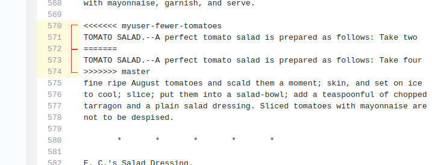

---
tags:
  - git
  - GitHub
  - merge
  - contribute
  - code review
---

# Merging and contributing with code review

!!! questions

    - How to collaborate in a project
    - How to contribute to someone else's project?

!!! info Content

    - We will give an overview of
        - Centralized collaboration
        - Forked collaboration
        - How to contribute

???+ info "Learning outcomes"

    - practice doing Pull Requests using the GitHub interface
    - practice doing a code review
    - explain and evaluate the usefulness of git Pull Request with code review

???- question "For teachers"

    Teaching goals are:

    - Learners have practiced doing Pull Requests using the GitHub interface
    - Learners have practiced doing a code review

    ```mermaid
    gantt
      title Lesson plan apply merge
      dateFormat X
      axisFormat %s
      Introduction: intro, 0, 5s
      Theory 1: theory_1, after intro, 5s
      Exercise 1: crit, exercise_1, after theory_1, 40s
      Feedback 1: feedback_1, after exercise_1, 10s
    ```

???- admonition "Changes"

    - more practical examples of git forking and branching and when it is appropriate to use them.
    - exercises
        - clearer instructions

## Branches, merging, code reviews

!!! note

    - The earlier '(Make a) Pull Request' has changed name into 'Contribute`
    - Still `Pull requests` is the name in the menu!

One can suggest to merge branches on GitHub,
where it is called a Pull Request.
For a Pull Request, a team member can be asked for a code review.
Code reviews are useful for many reasons,
among others the spread of knowledge.

One can merge branches locally, using the command-line or VS code.
This will bypass code review and that is OK.
For example, merging develop to your topic branch
does not need a code review.

## GitHub and new repos

**Let's go back to GitHub and collaboration for now!**

There are two more ways to create “copies” of repositories into your user space:

- A repository can be marked as **template** and new repositories can be **generated** from it, like using a cookie-cutter.
    - The newly created repository will start with a _new history_, only one commit, and not inherit the history of the template.
- You can **import** a repository from another hosting service or web address.
    - This will _preserve the history_ of the imported project.

## Different workflows for collaboration

### Centralized workflow


**Centralized layout**

- **Red** is the repository on GitHub.
- **Blue** is where all contributors work on their own computers.


- Centralized workflow is often used for **remote collaborative work**.
- `origin` refers to where you cloned from (but you can relocate it).
- `origin/mybranch` is a read-only pointer to branch `mybranch` on `origin`.
- These read-only pointers only move when you `git fetch`/`git pull` or `git push`.

### Distributed version control and Forking workflow

**This is used when you are not a collaborator**


**Forking workflow**

- **Red** is the central repository, where only owners have access.
- **Green** are _forks_ on GitHub (copy for a single user to work on).
- **Blue** are local copies where contributors work on their own computer.

## Contributing in a team

### Contributing to existing repositories using pull requests

**Step 1. [Add collaborators to your repository](https://coderefinery.github.io/github-without-command-line/contributing/#step-1-learn-how-to-add-collaborators-to-your-repository)**

Based on: <https://coderefinery.github.io/github-without-command-line/contributing/#step-1-learn-how-to-add-collaborators-to-your-repository>

???- note "License: Creative Commons Attribution 4.0 International"

        - Permits almost any use subject to providing credit and license notice.
        - Frequently used for media assets and educational materials.
        - The most common license for Open Access scientific publications.
        - Not recommended for software.

!!! info

    - This was done the first day!

- Add your group members or collaborators as "collaborators" under GitHub.  This allows them to change things directly (but we'll actually do it with review).

- From here on the collaborators can push changes in the same way as we have done in a
single-person repository in the previous episodes.

**Step 2: Submit a small change via the web interface as collaborator**

- We learned how to directly commit changes either via web or via the desktop and you need to be a collaborator (have write permissions) to be able to do that.

- The tool here is [pull request](https://docs.github.com/en/pull-requests/collaborating-with-pull-requests/proposing-changes-to-your-work-with-pull-requests/about-pull-requests)

!!! example "Example with a salad repo"

    - In this example the contributor will not change the `main` branch directly but submit a "pull request" (a **change proposal**) towards the `main` branch for **code review**.
    - You do this by just **changing the file at GitHub**
    - Before committing/proposing file change you may preview the changes.

    

    - After we click "Commit / change proposal" we are taken to this form:

    

    - In there we
        - verify the **source and target branch**,
        - verify the **file changes**,
        - can edit the **title** and **description** of the "pull request" (change proposal)
    - After we have submitted the "pull request", one of our collaborators can review it
    - We can discuss and ask for changes before merging the changes "Merge pull request"


!!! Discussion

    - Ideally submitter and reviewer should be two different persons.
        - When is this best? When not?
    - You can modify an open "pull request" by committing new changes to the branch
    - Review is not only to assure quality but also to enhance learning and **knowledge transfer** within the group

---

- **To make sure that _all_ changes of the `main` branch are reviewed and nobody
can push commits to it directly, it can be useful to "protect" branches.**

- "Settings", then "Branches", then "Add rule":


### Discussion

> - Protecting the `main` branch "forces" all changes to it to be reviewed first.
>   **We recommend this for group repositories**.
>   Discuss the advantages/disadvantages of this.

---

### Resolving a conflict

**When merging** two branches a conflict can arise when the same file **portion**
has been modified in two **different** ways on the two branches.

We can practice how a conflict looks and how to resolve it:

- Two participants send two "pull requests" (change proposals)
  branching from `main` changing the same line in two different ways


- We merge together one of the pull requests (this will work)
- Then we try to merge the other and we see a conflict:


- We try to resolve the conflict via web
- **Choose the version that you wish to keep**, remove conflict markers, "Mark as resolved" and commit the change



### Discussion

> - Compare with Google Docs: can you get conflicts there? What are the advantages and disadvantages?
> - What can we do to avoid conflicts?


## How to contribute changes to somebody else’s project

- Avoid frustration and surprises by first discussing and then coding.

- We apply the Forking workflow

  {width: 50%}

**Forking workflow**

- **Red** is the central repository, where only owners have access.
- **Green** are _forks_ on GitHub (copy for a single user to work on).
- **Blue** are local copies where contributors work on their own computer.


In the forking layout described above we work with **multiple remotes**,
in this case **two remotes**: One remote refers to the **"central"** repository, and the other remote refers to the **"fork"**.

- Working with multiple remotes is not as scary as it might look.
- `origin` is just an alias/placeholder.
- We can add and remove remotes.
- We can call these aliases/placeholders as we like.
- We typically synchronize/updates remotes via the local clone.
- To see all remotes use `git remote -v`.
- If you are more than one person contributing to a project, consider using code review.

!!! info "See also"

    [Code Refinery's course](https://coderefinery.github.io/git-collaborative/forking-workflow/)

### Contributing very minor changes

- Fork repository
- Create a branch (e.g. with your name)
- Commit and push change
- File a pull request or merge request

### If you observe an issue and have an idea how to fix it

- Open an **issue** in the repository you wish to contribute to
- Describe the problem
- If you have a suggestion on how to fix it, describe your suggestion
- Possibly **discuss and get feedback**
- If you are working on the fix, indicate it in the issue so that others know that somebody is working on it and who is working on it
- Submit your fix as **pull request** or **merge request** which references/closes the issue

### Example with Pull request

- Submitting a change proposal as external contributor  looks very similar to submitting a "pull request" to a repository with a protected `main` branch.
    - (we assume you are not added as "collaborator" and thus have no write-permissions to a repository)
- Only this time you have no other choice than **"Propose file change"**.

!!! admonition "Cheat-sheet"

    **Commits, branches, repositories, forks, clones**

    - **repository**: The project, contains all data and history (commits, branches, tags).
    - **commit**: Snapshot of the project, gets a unique identifier (e.g. `c7f0e8bfc718be04525847fc7ac237f470add76e`).
    - **branch**: Independent development line, often we call the main development line `main` or `main`.
    - **tag**: A pointer to one commit, to be able to refer to it later. Like a [commemorative plaque](https://en.wikipedia.org/wiki/Commemorative_plaque) that you attach to a particular commit (e.g. `phd-printed` or `paper-submitted`).
    - **cloning**: Copying the whole repository to your laptop - the first time.
        - It is not necessary to download each file one by one.
        - good within a group
    - **forking**: Taking a copy of a repository (which is typically not yours)
        - our copy (fork) stays on GitHub and you can make changes to your copy.
        - better for contribution to other's project
    - `git clone` copies everything: all commits and all branches.
    - Branches on the remote appear as (read-only) local branches with a prefix, e.g. `origin/main`.
    - We synchronize commits between local and remote with `git fetch`/`git pull` and `git push`.
    - Repositories that are shared online often synchronize via **pull requests** or **merge requests**.
    - Repositories that are forked or cloned **do not automatically synchronize themselves**.

## Exercises

### Extra exercise 1: Practice code review

For team member A:

- Create a topic branch (from `develop`)
- Do something trivial on that topic branch
- Submit a GitHub Pull Request to merge it to `develop`
- Assign the other team member as the reviewer
- Do a pretend code review until the Pull Request is accepted
- The reviewer merges the code to `develop`

Now do the same for team member B.

???- question "Enjoy a video?"

    You can find a video [here](https://youtu.be/UXSKm_RvcLw)


## Summary


## Goals

- [ ] explain and evaluate the usefulness of git Pull Request with code review

!!! admonition "Parts to be covered!"

    - &#9745; Source/version control
        - Git
        - We have a starting point!
        - GitHub as remote backup
        - branches
    - &#9745; Planning
        - &#9745; Analysis
        - &#9744; Design
    - &#9745; Testing
        - Different levels
    - &#975; Collaboration
        - &#975; GitHub
        - &#975; pull requests
    - &#9744; Sharing
        - &#9744; open science
        - &#9744; citation
        - &#9744; licensing
    - &#9744; Documentation
        - &#9745; in-code documentation
        - &#9744; documentation for users

!!! info "See also"

    - For ideas view Code Refinery's  [Centralized workflow](https://coderefinery.github.io/git-collaborative/same-repository/)

## Reference Git

- [Book 'Pro Git', chapter 'git branching'](https://git-scm.com/book/en/v2/Git-Branching-Branches-in-a-Nutshell)

- [Main git book](https://git-scm.com/book/en/v2)
- [Pro Git](https://uppmax.github.io/programming_formalisms/reading/chacon_and_straub_2014.pdf)
- Tsitoara, Mariot, and Mariot Tsitoara. "Git best practices." [Beginning Git and GitHub](https://learning.oreilly.com/library/view/beginning-git-and/9798868802157/): A Comprehensive Guide to Version Control, Project Management, and Teamwork for the New Developer (2020): 79-86.
