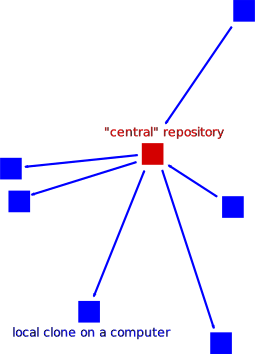
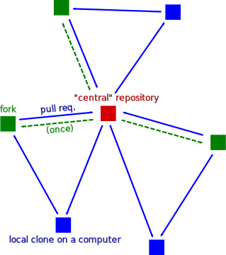

# Merging and contributing with code review

!!! questions

    - How to collaborate in a project
    - How to contribute to someone else's project?

!!! info Content

    - We will give an overview of
        - centralized collaboration
        - Forked collaboration
        - How to contribute

???+ info "Learning objectives of 'Contributing'"

    - explain and evaluate the usefulness of git Pull Request with code review
    - practice doing Pull Requests using the GitHub interface
    - practice doing a code review
    - practice fixing merge conflicts on GitHub
    - practice merging branches using the command-line interface
    - practice fixing merge conflicts on local computer, using the command-line interface

???- note "Instructor notes"

    Prerequisites are:

    - ...

    Lesson Plan: **FIX**

    - **Total** 30 min
    - Theory 20
    - Discussions 10 min

???- info "Table of content"

    - GitHub
    - Centralized workflow
    - Distributed version control and Forking workflow
    - How to contribute changes to somebody else’s project
        - Contributing very minor changes
        - If you observe an issue and have an idea how to fix it

!!! info "References"

    - The [main git book](https://git-scm.com/book/en/v2)

    - 'git best practices'

        - Tsitoara, Mariot, and Mariot Tsitoara. "Git best practices." Beginning Git and GitHub: A Comprehensive Guide to Version Control, Project Management, and Teamwork for the New Developer (2020): 79-86.
        - Tepavac, Igor, et al. "Version Control Systems, Tools and Best Practices: Case Git." CASE 27-Razvoj poslovnih i informatičkih sustava. 2015.

**MERGE these with abve**

!!!- info "Learning objectives"

    - practice doing Pull Requests using the GitHub interface
    - practice doing a code review

???- question "For teachers"

    Teaching goals are:

    - Learners have practiced doing Pull Requests using the GitHub interface
    - Learners have practiced doing a code review

    ```mermaid
    gantt
      title Lesson plan apply merge
      dateFormat X
      axisFormat %s
      Introduction: intro, 0, 5s
      Theory 1: theory_1, after intro, 5s
      Exercise 1: crit, exercise_1, after theory_1, 40s
      Feedback 1: feedback_1, after exercise_1, 10s
    ```

    Prior questions:

    - What does a merge do?
    - What does a merge do?
    - Do we need merging? When? Why?
    - When does a merge give a merge conflict?
    - Can a `git commit` result in a merge conflict? Why?
    - Can a `git push` result in a merge conflict? Why?
    - Can a `git pull` result in a merge conflict? Why?


## Branches, merging, code reviews

!!! note 

    - The earlier '(Make a) Pull Request' has changed name into 'Contribute`
    - Still `Pull requests` is the name in the menu!

One can suggest to merge branches on GitHub,
where it is called a Pull Request.
For a Pull Request, a team member can be asked for a code review.
Code reviews are useful for many reasons,
among others the spread of knowledge.

One can merge branches locally, using the command-line.
This will bypass code review and that is OK.
For example, merging develop to your topic branch
does not need a code review.

## GitHub and new repos

**Let's go back to GitHub and collaboration for now!**

There are two more ways to create “copies” of repositories into your user space:

- A repository can be marked as **template** and new repositories can be **generated** from it, like using a cookie-cutter.
    - The newly created repository will start with a _new history_, only one commit, and not inherit the history of the template.
- You can **import** a repository from another hosting service or web address.
    - This will _preserve the history_ of the imported project.


## Different workflows for collaboration

### Centralized workflow



**Centralized layout**

- **Red** is the repository on GitHub.
- **Blue** is where all contributors work on their own computers.


- Centralized workflow is often used for **remote collaborative work**.
- `origin` refers to where you cloned from (but you can relocate it).
- `origin/mybranch` is a read-only pointer to branch `mybranch` on `origin`.
- These read-only pointers only move when you `git fetch`/`git pull` or `git push`.

### Distributed version control and Forking workflow

**This is used when you are not a collaborator**



**Forking workflow**

- **Red** is the central repository, where only owners have access.
- **Green** are _forks_ on GitHub (copy for a single user to work on).
- **Blue** are local copies where contributors work on their own computer.

## Contributing in a team

### Contributing to existing repositories using pull requests 

### Summary


**Centralized layout**

- **Red** is the repository on GitHub.
- **Blue** is where all contributors work on their own computers.


- Centralized workflow is often used for **remote collaborative work**.
- `origin` refers to where you cloned from (but you can relocate it).
- `origin/mybranch` is a read-only pointer to branch `mybranch` on `origin`.
- These read-only pointers only move when you `git fetch`/`git pull` or `git push`.


!!! info "See also"

    - For ideas view Code Refinery's  [Centralized workflow](https://coderefinery.github.io/git-collaborative/same-repository/)


## How to contribute changes to somebody else’s project

- Avoid frustration and surprises by first discussing and then coding.

- We apply the Forking workflow

  {width: 50%}

**Forking workflow**

- **Red** is the central repository, where only owners have access.
- **Green** are _forks_ on GitHub (copy for a single user to work on).
- **Blue** are local copies where contributors work on their own computer.


In the forking layout described above we work with **multiple remotes**,
in this case **two remotes**: One remote refers to the **"central"** repository, and the other remote refers to the **"fork"**.

- Working with multiple remotes is not as scary as it might look.
- `origin` is just an alias/placeholder.
- We can add and remove remotes.
- We can call these aliases/placeholders as we like.
- We typically synchronize/updates remotes via the local clone.
- To see all remotes use `git remote -v`.
- If you are more than one person contributing to a project, consider using code review.

!!! info "See also"

    [Code Refinery's course](https://coderefinery.github.io/git-collaborative/forking-workflow/)

### Contributing very minor changes

- Fork repository
- Create a branch (e.g. with your name)
- Commit and push change
- File a pull request or merge request

### If you observe an issue and have an idea how to fix it

- Open an **issue** in the repository you wish to contribute to
- Describe the problem
- If you have a suggestion on how to fix it, describe your suggestion
- Possibly **discuss and get feedback**
- If you are working on the fix, indicate it in the issue so that others know that somebody is working on it and who is working on it
- Submit your fix as **pull request** or **merge request** which references/closes the issue

### Example with Pull request

- Submitting a change proposal as external contributor  looks very similar to submitting a "pull request" to a repository with a protected `main` branch.
    - (we assume you are not added as "collaborator" and thus have no write-permissions to a repository)
- Only this time you have no other choice than **"Propose file change"**.


!!! example "Demo with student"

    **Example: Submit a small change via the web interface as external contributor**


Let's try this with one participant who has not been added as collaborator
sharing screen:

- Edit a file with the "pen" button
- Edit the commit message and click green button "Propose file change"
- This creates a **fork** of the repository (GitHub makes a copy of the original repository to your user space **automatically**)
- You can now still review the change before submitting it, green button "Create pull request"
- Later you can remove the fork if you like


!!! admonition "Cheat-sheet"

    **Commits, branches, repositories, forks, clones**

    - **repository**: The project, contains all data and history (commits, branches, tags).
    - **commit**: Snapshot of the project, gets a unique identifier (e.g. `c7f0e8bfc718be04525847fc7ac237f470add76e`).
    - **branch**: Independent development line, often we call the main development line `main` or `main`.
    - **tag**: A pointer to one commit, to be able to refer to it later. Like a [commemorative plaque](https://en.wikipedia.org/wiki/Commemorative_plaque) that you attach to a particular commit (e.g. `phd-printed` or `paper-submitted`).
    - **cloning**: Copying the whole repository to your laptop - the first time.
        - It is not necessary to download each file one by one.
        - good within a group
    - **forking**: Taking a copy of a repository (which is typically not yours)
        - our copy (fork) stays on GitHub and you can make changes to your copy.
        - better for contribution to other's project
    - `git clone` copies everything: all commits and all branches.
    - Branches on the remote appear as (read-only) local branches with a prefix, e.g. `origin/main`.
    - We synchronize commits between local and remote with `git fetch`/`git pull` and `git push`.
    - Repositories that are shared online often synchronize via **pull requests** or **merge requests**.
    - Repositories that are forked or cloned **do not automatically synchronize themselves**.


## Exercises

Exercise 5 is a repeat of doing a code review.


### Extra exercise 5: practice code review

For team member A:

- Create a topic branch (from `develop`)
- Do something trivial on that topic branch
- Submit a GitHub Pull Request to merge it to `develop`
- Assign the other team member as the reviewer
- Do a pretend code review until the Pull Request is accepted
- The reviewer merges the code to `develop`

Now do the same for team member B.

???- question "Enjoy a video?"

    You can find a video [here](https://youtu.be/UXSKm_RvcLw)

## Links

- [Book 'Pro Git', chapter 'git branching'](https://git-scm.com/book/en/v2/Git-Branching-Branches-in-a-Nutshell)

## Goals

- [ ] explain and evaluate the usefulness of git Pull Request with code review


!!! admonition "Parts to be covered!"

    - &#9745; Source/version control
        - Git
        - We have a starting point!
        - GitHub as remote backup
        - branches
    - &#9745; Planning
        - &#9745; Analysis
        - &#9745;Design
    - &#9745; Testing
        - Different levels
    - &#9745; Collaboration
        - GitHub
        - pull requests
    - &#9744; Sharing
        - &#9745; open science
        - &#9744; citation
        - &#9745; licensing
    - &#9744; Documentation
        - &#9745; in-code documentation

