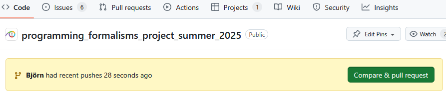
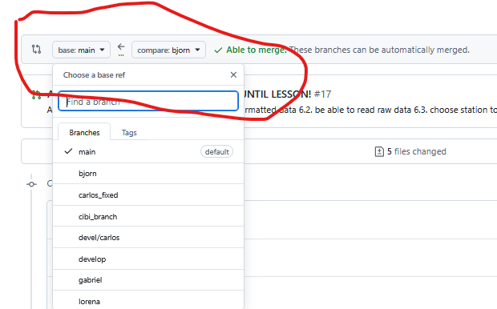
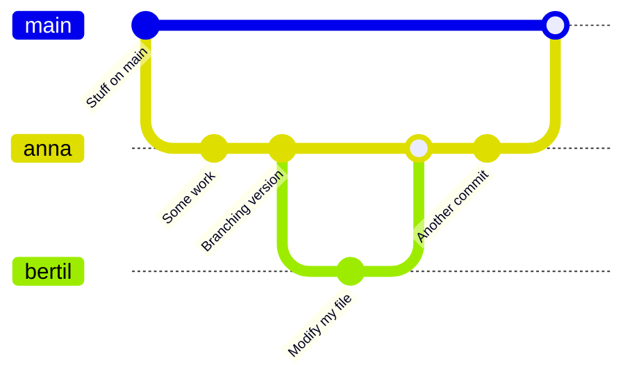
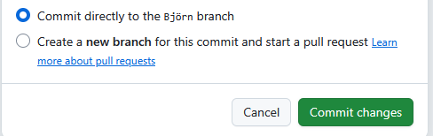
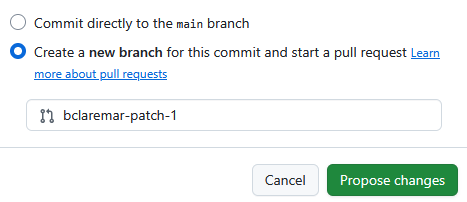
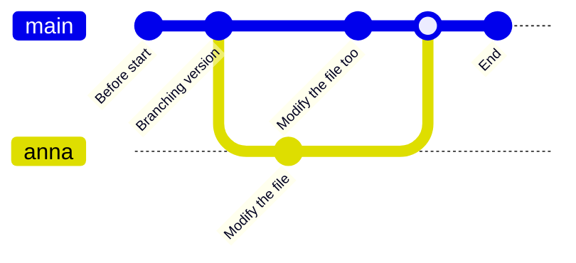
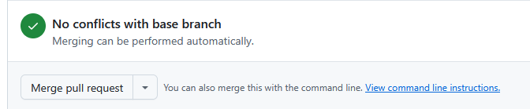
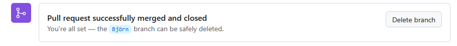
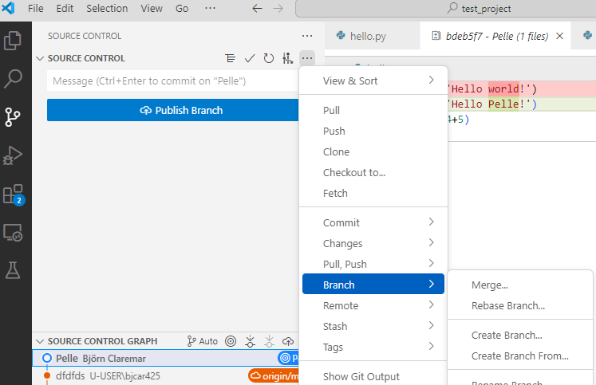

---
tags:
  - merging
  - merge
  - git
---

# Merging

!!!- info "Learning outcomes"

    - practice merging branches using VS code
    - practice merging/doing Pull Requests using the GitHub interface
branches using GitHub
    - practice fixing merge conflicts on GitHub

???- question "For teachers"

    Teaching goals are:

    - Learners have practiced fixing merge conflicts on GitHub
    - Learners have practiced merging branches using the command-line interface


    ```mermaid
    gantt
      title Lesson plan apply merge
      dateFormat X
      axisFormat %s
      Introduction: intro, 0, 5s
      Theory 1: theory_1, after intro, 5s
      Exercise 1: crit, exercise_1, after theory_1, 40s
      Feedback 1: feedback_1, after exercise_1, 10s
    ```


## Workflow of merge

- Once a feature is ready, merge to "main" or "develop"

???+ admonition "Command line"

    ```git
    git switch main    # switch to main branch
    git branch           # check that we are on main branch
    git merge <feature branch>
    ```

???- example "Example of merged branches"

    ```git
    $ git graph
    *   1b29a8f (HEAD -> main, origin/main) Merge branch 'modularity'
    |\
    | * 4d4acaf (modularity) 4 modular files
    * | 000b440 rm print
    |/
    | * 2d4e252 (jupiter) add jupiter
    |/
    * b9465e4 planet.py documentation
    * 6a416b5 add folders and planet code
    ```

???- admonition "GitHub" 

     - Merge
     
     

     - Be sure that you merge to right branch!
     
     
     
     

- Good practice: Delete branch when done. You won't need it any more!

## Merge conflicts

- When merging two branches a conflict can arise *when the same file portion has been modified in two different ways on the two branches*.
- A merge conflict occurs when ``git`` is unsure how to merge branches and asks a human for help.

??? example "Example: Two branches to be merged"

    Based on: <https://coderefinery.github.io/git-intro/conflicts/>

    ???- note "License: Creative Commons Attribution 4.0 International"

        - Permits almost any use subject to providing credit and license notice.
        - Frequently used for media assets and educational materials.
        - The most common license for Open Access scientific publications.
        - Not recommended for software.

    - Once all features are ready, switch to main!
    - This is the **Branch** we want to **merge to**

    The first merge will work

    ```git
    $ git switch main    # switch to main branch
    $ git branch           # check that we are on main branch
    $ git merge like-cilantro

    Updating 4e03d4b..3caa632
    Fast-forward
     ingredients.txt | 2 +-
     1 file changed, 1 insertion(+), 1 deletion(-)
    ```

    - But the second will fail:

    ```git
    $ git merge dislike-cilantro

    Auto-merging ingredients.txt
    CONFLICT (content): Merge conflict in ingredients.txt
    Automatic merge failed; fix conflicts and then commit the result.
    ```

    - Without conflict Git would have automatically created a merge commit, but since there is a conflict, Git did not commit:

    ```git
    $ git status

    You have unmerged paths.
      (fix conflicts and run "git commit")
      (use "git merge --abort" to abort the merge)

    Unmerged paths:
      (use "git add <file>..." to mark resolution)
        both modified:   ingredients.txt

    no changes added to commit (use "git add" and/or "git commit -a")
    ```

    - Git won’t decide which to take and we need to decide. Observe how Git gives us clear instructions on how to move forward.

    ```console
    $ git diff

    diff --cc ingredients.txt
    index 6cacd50,6484462..0000000
    --- a/ingredients.txt
    +++ b/ingredients.txt
    @@@ -1,4 -1,4 +1,10 @@@
    ++<<<<<<< HEAD
     +* 2 tbsp cilantro
    ++=======
    + * 1/2 tbsp cilantro
    ++>>>>>>> dislike-cilantro
      * 2 avocados
      * 1 chili
      * 1 lime
    ```

    - Check status with git status and git diff.
    - Decide what you keep (the one, the other, or both or something else). Edit the file to do this.
        - Remove the resolution markers, if not already done.
        - The file(s) should now look exactly how you want them.
    - Check status with git status and git diff.
    - Tell Git that you have resolved the conflict with git add ingredients.txt (if you use the Emacs editor with a certain plugin the editor may stage the change for you after you have removed the conflict markers).
    - Verify the result with git status.
    - Finally commit the merge with only git commit. Everything is pre-filled.

### On GitHub

- Let's view the branches on Github!
- Go to *Insights* in the top menu and then go to *Network* in side-bar
- If we did this after the merging the branches do not show up.

!!! warning

    - In GitHub MERGE is called PULL REQUEST!

- Conflicts may show up like this:


- We merge together one of the pull requests (this will work)
- Then we try to merge the other and we see a conflict:


- We try to resolve the conflict via web
- **Choose the version that you wish to keep**, remove conflict markers, "Mark as resolved" and commit the change


!!! example "Discuss"

    - Merge locally or on GitHub?
    - Does it matter?
    - Dependent on "level"?

???- question "Test"

    - What does a merge do?
    - Do we need merging? When? Why?
    - When does a merge give a merge conflict?
    - Can a `git commit` result in a merge conflict? Why?
    - Can a `git push` result in a merge conflict? Why?
    - Can a `git pull` result in a merge conflict? Why?

## Exercises

!!! info "Content"

    1. Practice merging `git` branches using the GitHub interface
    2. Practice merge conflicts between branches using GitHub

### Exercise 1: Practice merging `git` branches using the GitHub interface

!!!- info "Learning outcomes"

    - practice merging git branches **without** a merge conflict



- You work in a pair or trio
- On **GitHub**, create a branch for **person A**, e.g. `anna` that branches off from `main`
- On **GitHub**, use the branch of **person A** and create a new commit.

???- question "How should it look like?"

    

- On **GitHub**, create a branch for **person B**, e.g. `bertil` that branches off from `anna`
- On **GitHub**, use the branch of **person B** and create a new commit.
- On GitHub, use web interface to create a Pull Request from `bertil` to `anna`.

???- question "How should it look like?"

    

  The person that does this requests a reviewer.

- On GitHub, the other person approves the Pull Request and merges
- On GitHub, use web interface to create a Pull Request from `anna` to `develop`.

- The person that does this requests a reviewer.
- If there is a merge conflict, either stop (you've done the exercise, well done!)
  or fix the merge conflict

- On GitHub, the other person approves the Pull Request and merges


### Exercise 2: Practice merge CONFLICTS between branches using GitHub

!!! tip

    - Do this individually
    - But you can still help each-other!

!!!- info "Learning outcomes"

    - experience merge conflicts between branches
    - fix merge conflicts between branches



> An example picture of how to create a merge conflict.

- Create a merge conflict between two branches, e.g. a topic branch
  and the main branch.
- You can do so by following the structure from the figure above that
  shows the minimal git branching history to do so.

???- info "Answers which you may use directly if you want to"

    - create a branch with your name and go there
    - modify the README file in learners/<your name>, e.g. add the line `Anna was here`
      at the bottom
    - commit with good message, it says "commit directly to <you name>")

    ??? question "How could that look like?"
    
        

    - **change back to main** branch by the "branch button"
    - Modify the same file, e.g. add the line `main person was here`.
    - Commit with message "main person was here"`
    - To generate the merge conflict, Click Code in the upper menu

    

    - Click the button!

    You will be guided in solving the conflict

    - Modify the file to have the texts merged.

    

    - Don't forget to Approve!

    

    - You may delete the old branch from here if you want!

### (Optional) exercise 3: Practice merging git branches locally (without conflict)

!!! tip

    - Do this individually
    - But you can still help each-other!

Continue with the branch you created in last session.
In **VS CODE**

- Pull/Sync!
- You may branch off from `main` or `develop` (if it exists) with the your name as a branch name.
- Go the the branch you created.
- Modify the README file in learners/<your name>, e.g. add the line `Anna was here`
      at the bottom
    - commit with good message, it says "commit directly to <you name>")
- Merge with the branch you branched off from, ``develop`` or ``main``



- Then delete (from same drop-down menu as for merge)
- Push!

### Merging in GitHub: We'll make a similar exercise in the next session instead

## Summary

```git
git add     # add files or stage file(s)
git commit  # commit staged file(s)
git status  # see what is going on
git log     # see history
git diff    # show unstaged/uncommitted modifications
git show    # show the change for a specific commit
git switch -b wild-idea    # create branch, switch to it, work, work, work ...
git switch main          # realize it was a bad idea, back to main/master
git branch -D wild-idea      # it is gone, off to a new idea
git merge
```

**Overview workflow**


!!! admonition "Parts to be covered!"

    - &#9745; Source/version control
        - Git
        - We have a starting point!
        - GitHub as remote backup
        - branches
    - &#9745; Planning
        - &#9745; Analysis
        - &#9744; Design
    - &#9745; Testing
        - Different levels
    - &#9744; Collaboration
        - &#9745; GitHub
        - &#9744; pull requests
    - &#9744; Sharing
        - &#9744; open science
        - &#9744; citation
        - &#9744; licensing
    - &#9744; Documentation
        - &#9745; in-code documentation
        - &#9744; documentation for users

!!! Keypoints

    - A branch is a division unit of work, to be merged with main sometime
    - Both git locally and GitHub can be used
    - You can delete a branch safely after merging

!!! note "See also"

    [More about branching and merging](https://coderefinery.github.io/git-intro/branches/)
    [More about conflict resolution](https://coderefinery.github.io/git-intro/conflicts/)


## Reference Git

- [Main git book](https://git-scm.com/book/en/v2)
- [Pro Git](https://uppmax.github.io/programming_formalisms/reading/chacon_and_straub_2014.pdf)
- Tsitoara, Mariot, and Mariot Tsitoara. "Git best practices." [Beginning Git and GitHub](https://learning.oreilly.com/library/view/beginning-git-and/9798868802157/): A Comprehensive Guide to Version Control, Project Management, and Teamwork for the New Developer (2020): 79-86.
