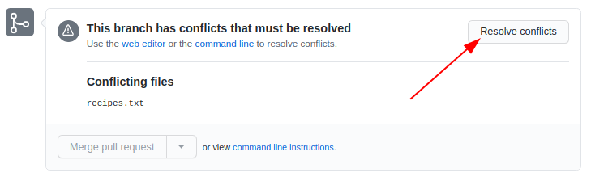

---
tags:
  - merging
  - merge
  - git
---

# Merging

!!!- info "Learning outcomes"

    - practice fixing merge conflicts on GitHub
    - practice merging branches using the command-line interface
    - practice fixing merge conflicts on local computer,
      using the command-line interface

???- question "For teachers"

    Teaching goals are:

    - Learners have practiced fixing merge conflicts on GitHub
    - Learners have practiced merging branches using the command-line interface


    ```mermaid
    gantt
      title Lesson plan apply merge
      dateFormat X
      axisFormat %s
      Introduction: intro, 0, 5s
      Theory 1: theory_1, after intro, 5s
      Exercise 1: crit, exercise_1, after theory_1, 40s
      Feedback 1: feedback_1, after exercise_1, 10s
    ```

???- admonition "Changes"

    - clear goal
    - VS code
    - clearer guide
    - If possible simplify things even further, or expand on rationale behind each step not just "big picture"
    - practical examples than just explain the concept.
    - more practical examples of git forking and branching and when it is appropriate to use them.
    - exercises
        - pull request
        - practical things within exercise (not needing to scroll back and forth)
        - clearer instructions
        - advanced exercises


## Prior questions

- What does a merge do?
- Do we need merging? When? Why?
- When does a merge give a merge conflict?
- Can a `git commit` result in a merge conflict? Why?
- Can a `git push` result in a merge conflict? Why?
- Can a `git pull` result in a merge conflict? Why?


## Workflow of merge

- Once a feature is ready, switch to main!
    - This is the **Branch** we want to **merge to**
- You may want to double check that you are there.

???+ admonition "Command line"

    ```git
    git switch main    # switch to main branch
    git branch           # check that we are on main branch
    git merge <feature branch>
    ```

???- example "Example of merged branches"

    ```git
    $ git graph
    *   1b29a8f (HEAD -> main, origin/main) Merge branch 'modularity'
    |\
    | * 4d4acaf (modularity) 4 modular files
    * | 000b440 rm print
    |/
    | * 2d4e252 (jupiter) add jupiter
    |/
    * b9465e4 planet.py documentation
    * 6a416b5 add folders and planet code
    ```

## Merge conflicts

- When merging two branches a conflict can arise *when the same file portion has been modified in two different ways on the two branches*.
- A merge conflict occurs when ``git`` is unsure how to merge branches and asks a human for help.

!!! example "**Two** branches to be merged"

    Based on: <https://coderefinery.github.io/git-intro/conflicts/>

    ???- note "License: Creative Commons Attribution 4.0 International"

        - Permits almost any use subject to providing credit and license notice.
        - Frequently used for media assets and educational materials.
        - The most common license for Open Access scientific publications.
        - Not recommended for software.

    - Once all features are ready, switch to main!
    - This is the **Branch** we want to **merge to**

    The first merge will work

    ```git
    $ git switch main    # switch to main branch
    $ git branch           # check that we are on main branch
    $ git merge like-cilantro

    Updating 4e03d4b..3caa632
    Fast-forward
     ingredients.txt | 2 +-
     1 file changed, 1 insertion(+), 1 deletion(-)
    ```

    - But the second will fail:

    ```git
    $ git merge dislike-cilantro

    Auto-merging ingredients.txt
    CONFLICT (content): Merge conflict in ingredients.txt
    Automatic merge failed; fix conflicts and then commit the result.
    ```

    - Without conflict Git would have automatically created a merge commit, but since there is a conflict, Git did not commit:

    ```git
    $ git status

    You have unmerged paths.
      (fix conflicts and run "git commit")
      (use "git merge --abort" to abort the merge)

    Unmerged paths:
      (use "git add <file>..." to mark resolution)
        both modified:   ingredients.txt

    no changes added to commit (use "git add" and/or "git commit -a")
    ```

    - Git won’t decide which to take and we need to decide. Observe how Git gives us clear instructions on how to move forward.

    ```console
    $ git diff

    diff --cc ingredients.txt
    index 6cacd50,6484462..0000000
    --- a/ingredients.txt
    +++ b/ingredients.txt
    @@@ -1,4 -1,4 +1,10 @@@
    ++<<<<<<< HEAD
     +* 2 tbsp cilantro
    ++=======
    + * 1/2 tbsp cilantro
    ++>>>>>>> dislike-cilantro
      * 2 avocados
      * 1 chili
      * 1 lime
    ```

    - Check status with git status and git diff.
    - Decide what you keep (the one, the other, or both or something else). Edit the file to do this.
        - Remove the resolution markers, if not already done.
        - The file(s) should now look exactly how you want them.
    - Check status with git status and git diff.
    - Tell Git that you have resolved the conflict with git add ingredients.txt (if you use the Emacs editor with a certain plugin the editor may stage the change for you after you have removed the conflict markers).
    - Verify the result with git status.
    - Finally commit the merge with only git commit. Everything is pre-filled.

### On GitHub

- Let's view the branches on Github!
- Go to _Insights_ in the top menu and then go to _Network_ in side-bar
- If we did this after the merging the branches do not show up.

- Conflicts may show up like this:


- We merge together one of the pull requests (this will work)
- Then we try to merge the other and we see a conflict:



- We try to resolve the conflict via web
- **Choose the version that you wish to keep**, remove conflict markers, "Mark as resolved" and commit the change


???- question "Test"


    - What does a merge do?
    - Do we need merging? When? Why?
    - When does a merge give a merge conflict?
    - Can a `git commit` result in a merge conflict? Why?
    - Can a `git push` result in a merge conflict? Why?
    - Can a `git pull` result in a merge conflict? Why?


## Exercises

### Exercise 1: practice merging `git` branches using the GitHub interface

!!!- info "Learning outcomes"

    - practice merging git branches **without** a merge conflict


- You work in a pair or trio
- On GitHub, create a branch for person A, e.g. `anna` that branches off from `develop`
- On GitHub, use the branch of person A and create a new commit.
  Use the web interface or command-line.
- On GitHub, create a branch for person B, e.g. `bertil` that branches off from `anna`
- On GitHub, use the branch of person B and create a new commit.
  Use the web interface or command-line.
- On GitHub, use web interface to create a Pull Request from `bertil` to `anna`.
  The person that does this requests a reviewer.
- On GitHub, the other person approves the Pull Request and merges
- On GitHub, use web interface to create a Pull Request from `anna` to `develop`.
  The person that does this requests a reviewer.
  If there is a merge conflict, either stop (you've done the exercise, well done!)
  or fix the merge conflict
- On GitHub, the other person approves the Pull Request and merges

    touch learners/richel/richel_is_on_richel.txt
  
### (Extra) exercise 2: Practice merging git branches locally


To merge in VS code 

- Image here

### (Extra) exercise 3: Practice merge conflicts between branches using GitHub.

Do the same step in 

**FIX** Make a GH version

!!!- info "Learning outcomes"

    - experience merge conflicts between branches
    - fix merge conflicts between branches

 ```mermaid
gitGraph
    commit id: "Before start"
    commit id: "Branching version"
    branch anna
    checkout anna
    commit id: "Modify the file"
    checkout main
    checkout main
    commit id: "Modify the file too"
    checkout main
    merge anna
    commit id: "End"
```

> An example picture of how to create a merge conflict.

- Create a merge conflict between two branches, e.g. a topic branch
  and the main branch.
- You can do so by following the structure from the figure above
  shows the minimal git branching history to do so.
- You can try to do all steps on in **GitHub**.

- Tip: Fig: new_branch_commit_VSC

???- info "Answers"

    - modify the README file in learners/<your name>, e.g. add the line `Anna was here`
      at the bottom 
    - commit with good message, but Create a new branch (instead of "commit directly to main")
    - Ignore the next step and go instead back to "Code" in the menu.
    - **Do not merge** branches yet, else there will be no merge conflicts!
    - **change back to main** branch by the "branch button"
    - Modify the same file, e.g. add the line `main person was here`.
    - Commit with message "main person was here"`
    - To generate the merge conflict, merge your branch into `main`, using `git merge main`.
      You will get a clear error :-)
    - Modify the file to have the texts merged.
      Then do `git add .`, `git commit -m "Fixed merge conflict"` and `git push`.

## Summary


## Reference Git

- [Main git book](https://git-scm.com/book/en/v2)
- [Pro Git](https://uppmax.github.io/programming_formalisms/reading/chacon_and_straub_2014.pdf)
- Tsitoara, Mariot, and Mariot Tsitoara. "Git best practices." Beginning Git and GitHub: A Comprehensive Guide to Version Control, Project Management, and Teamwork for the New Developer (2020): 79-86.
