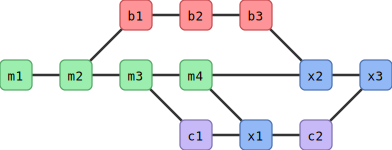

# Merging

!!!- info "Learning objectives"

    - practice fixing merge conflicts on GitHub
    - practice merging branches using the command-line interface
    - practice fixing merge conflicts on local computer,
      using the command-line interface

???- question "For teachers"

    Teaching goals are:

    - Learners have practiced fixing merge conflicts on GitHub
    - Learners have practiced merging branches using the command-line interface
    - Learners have practiced fixing merge conflicts on local computer,
      using the command-line interface


    ```mermaid
    gantt
      title Lesson plan apply merge
      dateFormat X
      axisFormat %s
      Introduction: intro, 0, 5s
      Theory 1: theory_1, after intro, 5s
      Exercise 1: crit, exercise_1, after theory_1, 40s
      Feedback 1: feedback_1, after exercise_1, 10s
    ```

## Prior questions

- What does a merge do?
- Do we need merging? When? Why?
- When does a merge give a merge conflict?
- Can a `git commit` result in a merge conflict? Why?
- Can a `git push` result in a merge conflict? Why?
- Can a `git pull` result in a merge conflict? Why?


- 

## Workflow of merge

- Once a feature is ready, switch to main!
    - This is the **Branch** we want to **merge to**
- You may want to double check with git branch

```git
git switch main    # switch to main branch
git branch           # check that we are on main branch
git merge <feature branch>
```

## Merge conflicts

- However, when we merge branches, it may result in a merge conflict.
- A merge conflict occurs when ``git`` is unsure how to merge branches
and asks a human for help.
- Here we create merge conflicts on trivial code.

!!! example "**Two** branches to be merged"

    Based on: <https://coderefinery.github.io/git-intro/conflicts/>

    ???- note "License: Creative Commons Attribution 4.0 International"
    
        - Permits almost any use subject to providing credit and license notice.
        - Frequently used for media assets and educational materials.
        - The most common license for Open Access scientific publications.
        - Not recommended for software.

    - Once all features are ready, switch to main!
    - This is the **Branch** we want to **merge to**

    The first merge will work

    ```git
    $ git switch main    # switch to main branch
    $ git branch           # check that we are on main branch
    $ git merge like-cilantro

    Updating 4e03d4b..3caa632
    Fast-forward
     ingredients.txt | 2 +-
     1 file changed, 1 insertion(+), 1 deletion(-)
    ```
    
    - But the second will fail:

    ```git
    $ git merge dislike-cilantro

    Auto-merging ingredients.txt
    CONFLICT (content): Merge conflict in ingredients.txt
    Automatic merge failed; fix conflicts and then commit the result.
    ```

    - Without conflict Git would have automatically created a merge commit, but since there is a conflict, Git did not commit:

    ```git
    $ git status

    You have unmerged paths.
      (fix conflicts and run "git commit")
      (use "git merge --abort" to abort the merge)

    Unmerged paths:
      (use "git add <file>..." to mark resolution)
        both modified:   ingredients.txt

    no changes added to commit (use "git add" and/or "git commit -a")
    ```

    - Git won’t decide which to take and we need to decide. Observe how Git gives us clear instructions on how to move forward.

    ```console
    $ git diff

    diff --cc ingredients.txt
    index 6cacd50,6484462..0000000
    --- a/ingredients.txt
    +++ b/ingredients.txt
    @@@ -1,4 -1,4 +1,10 @@@
    ++<<<<<<< HEAD
     +* 2 tbsp cilantro
    ++=======
    + * 1/2 tbsp cilantro
    ++>>>>>>> dislike-cilantro
      * 2 avocados
      * 1 chili
      * 1 lime
    ```

    - Check status with git status and git diff.
    - Decide what you keep (the one, the other, or both or something else). Edit the file to do this.
        - Remove the resolution markers, if not already done.
        - The file(s) should now look exactly how you want them.
    - Check status with git status and git diff.
    - Tell Git that you have resolved the conflict with git add ingredients.txt (if you use the Emacs editor with a certain plugin the editor may stage the change for you after you have removed the conflict markers).
    - Verify the result with git status.
    - Finally commit the merge with only git commit. Everything is pre-filled.

!!! example "Another example of merged branches"

    ```git
    $ git graph
    *   1b29a8f (HEAD -> main, origin/main) Merge branch 'modularity'
    |\
    | * 4d4acaf (modularity) 4 modular files
    * | 000b440 rm print
    |/
    | * 2d4e252 (jupiter) add jupiter
    |/
    * b9465e4 planet.py documentation
    * 6a416b5 add folders and planet code
    ```

### On GitHub

- Let's view the branches on Github!
- Go to _Insights_ in the top menu and then go to _Network_ in side-bar
- If we did this after the merging the branches do not show up.

### Exercise 1: practice merging `git` branches using the GitHub interface

!!!- info "Learning objectives"

    - practice merging git branches **without** a merge conflict


- You work in a pair or trio
- On GitHub, create a branch for person A, e.g. `anna` that branches off from `develop`
- On GitHub, use the branch of person A and create a new commit.
  Use the web interface or command-line.
- On GitHub, create a branch for person B, e.g. `bertil` that branches off from `anna`
- On GitHub, use the branch of person B and create a new commit.
  Use the web interface or command-line.
- On GitHub, use web interface to create a Pull Request from `bertil` to `anna`.
  The person that does this requests a reviewer.
- On GitHub, the other person approves the Pull Request and merges
- On GitHub, use web interface to create a Pull Request from `anna` to `develop`.
  The person that does this requests a reviewer.
  If there is a merge conflict, either stop (you've done the exercise, well done!)
  or fix the merge conflict
- On GitHub, the other person approves the Pull Request and merges

### Extra exercise 2: practice merging `git` branches using the command-line

!!!- info "Learning objectives"

    - practice merging git branches **without** a merge conflict

!!!- caution "Here we use the `main` branch for now"

    Instead of updating this exercise, its answer and video
    to use a proper branching workflow, we branch from `main`
    in this exercise


- For our GitHub repo, create a branch with your first name that is
  unique, e.g. `sven`, `sven_svensson` or `sven_svensson_314`.
  You may branch of from `main` or `develop` (if it exists).
  You may use the web interface (easiest!) or use the command line
- On your local computer:
    - update your repository
    - switch to that branch
    - change the repo
    - push your changes online
- Verify the changes are online
- On your local computer
    - switch to the `main` branch
    - merge your topic branch to `main`
    - upload your changes
- Delete your topic branch (i.e. the one with the unique name).
  You may use the web interface (easiest!) or use the command line
- On your local computer, update your code

???- info "Answers"

    

    Click on 1, type your branch name at 2 (in this case, `richel`), then click 3.
    Done!

    > - On your local computer:
    >     - update the repository

    On your local computer, navigate to the folder of the shared project
    and update:

    ```git
    git pull
    ```

    > - On your local computer:
    >     - switch to the new branch

    Switch to the new branch, for example, `richel`, by doing:

    ```git
    git switch richel
    ```

    > - On your local computer:
    >     - change the content of the repository, for example,
    >       by creating a file in `learners/[your_name]/[your_name]_is_on_[your_branch_name]`

    This can be any change you'd like.
    To create a file under Linux (and maybe this works on other
    operating systems too), one can do:

    ```git
    touch learners/richel/richel_is_on_richel.txt
    ```

    After the change, commit these:

    ```git
    git add .
    git commit -m "Richel is on richel"
    ```

    > - On your local computer:
    >     - push your changes online.

    Do:

    ```git
    git push
    ```

    And your code may end up online.

    If that does not work, do:

    ```git
    git pull
    ```

    and try pushing again, maybe multiple times, as many people
    are pushing to the shared repo.

    > - On GitHub, verify that your changes on your branch can be found online

    

    Make sure you look at the correct branch, as displayed at 1.
    Then your commit message shows up at 2.

    > - On your local computer
    >     - switch to the `main` branch

    ```git
    git switch main
    ```

    > - On your local computer
    >     - merge your topic branch to `main`

    ```git
    git merge richel
    ```

    > - On your local computer
    >     - upload your changes

    ```git
    git push
    ```

    > - Delete your branch (i.e. the one with the unique name).
    >   You may use the web interface (easiest!) or use the command line

    [github_view_branches_annotated](github_view_branches_annotated.png)

    Click on 'Branches', as shown in the image above.

    

    Click on garbage bin, as shown in the image above.

    

    The branch will now be deleted, as shown in the image above.

    > - On your local computer, update your code

    Do:

    ```git
    git pull
    ```

???- question "Prefer a video?"

    You can find a video [here](https://youtu.be/BSi9nFhlgwM)


### Extra exercise 3: practice merge conflicts between branches using the command line

!!!- info "Learning objectives"

    - experience merge conflicts between branches
    - fix merge conflicts between branches

!!!- caution "Here we use the `main` branch for now"

    Instead of updating this exercise, its answer and video
    to use a proper branching workflow, we branch from `main`
    in this exercise


> An example picture of how to create a merge conflict.

- Create a merge conflict between two branches, e.g. a topic branch
  and the main branch. You can do so by creating random commits
  on both branches and merge. Alternatively, the figure above
  shows the minimal git branching history to do so.

???- info "Answers"

    Here, I will replay the figure above

    - in GitHub, create a branch called `anna`
    - on your local computer, `git pull`, then `git switch anna`
    - on your local computer, modify a file, e.g. add the line `Anna was here`
      at the bottom of `README.md`. Then do `git add .`,
      `git commit -m "Anna was here"` and `git push`.
      Do not merge braches yet, else there will be no merge conflicts!
    - on your local computer, `git switch main`
    - on your local computer, modify a file, e.g. add the line `main person was here`.
      Then do `git add .`, `git commit -m "main person was here"` and `git push`.
    - To generate the merge conflict, merge `anna` into `main`, using `git merge main`.
      You will get a clear error :-)
    - Modify the file to have the texts merged.
      Then do `git add .`, `git commit -m "Fixed merge conflict"` and `git push`.

???- question "Enjoy a video?"

    You can find a video [here](https://youtu.be/2RTO8I9qdCk)
