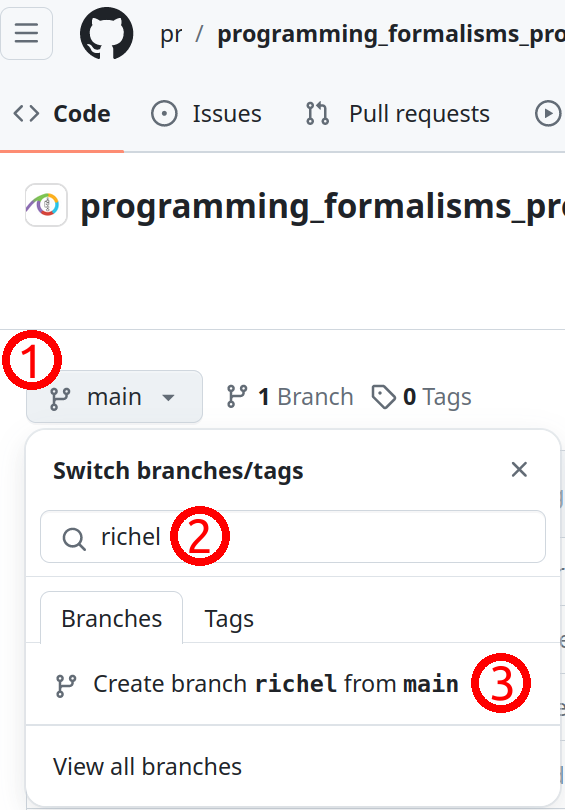
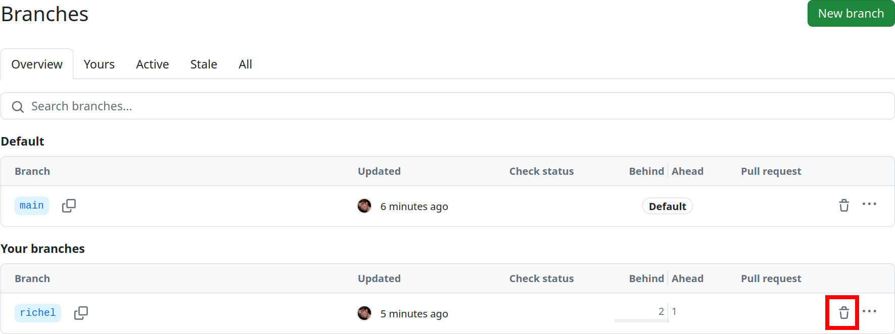

# Merging

- It turned out that our experiment with XX was a good idea.
- Our goal now is to merge modularity into main.


???- question "Demo: git merge"

!!! example "Merge into main"

    - once all features are ready, switch to main!

    ```git
    $ git switch main    # switch to main branch
    $ git branch           # check that we are on main branch
    $ git merge  XXXX          # merge modularity into main

    Merge made by the 'ort' strategy.
     output

    ```

    - let's now check the graphical view:

    ```git
    $ git graph
    * 1b29a8f (HEAD -> main) Merge branch 'modularity'
    |\
    | * 4d4acaf (modularity) 4 modular files
    * | 000b440 rm print
    |/
    | * 2d4e252 (jupiter) add jupiter
    |/
    * b9465e4 (origin/main) planet.py documentation
    * 6a416b5 add folders and planet code
    ```

    ```mermaid
    gitGraph

    commit id: "add planet.py"
    branch jupiter
    checkout jupiter
    commit id: "add jupiter"
    checkout main
    branch modular
    checkout modular
    commit id: "4 modular files"
    checkout main
    commit id:"rm print"
    merge modular
    ```

    - NOTE that (origin/main) planet.py documentation is not up-to-date
        - In other words: GitHub has an old version of the project
    - push to GitHub
    - ``git push``

    ```git
    $ git graph
    *   1b29a8f (HEAD -> main, origin/main) Merge branch 'modularity'
    |\
    | * 4d4acaf (modularity) 4 modular files
    * | 000b440 rm print
    |/
    | * 2d4e252 (jupiter) add jupiter
    |/
    * b9465e4 planet.py documentation
    * 6a416b5 add folders and planet code
    ```

    - Now local Git and GitHub are in phase!

### Exercise 1: practice merging `git` branches using the GitHub interface

!!!- info "Learning objectives"

    - practice merging git branches **without** a merge conflict

```mermaid
gitGraph
    commit id: "Stuff on main"
    branch develop
    checkout develop
    commit id: "Stuff on develop"
    branch anna
    checkout anna
    commit id: "Some work"
    commit id: "Branching version"
    branch bertil
    checkout bertil
    commit id: "Modify my file"
    checkout anna
    merge bertil
    commit id: "Another commit"
    checkout develop
    merge anna
```

- You work in a pair or trio
- On GitHub, create a branch for person A, e.g. `anna` that branches off from `develop`
- On GitHub, use the branch of person A and create a new commit.
  Use the web interface or command-line.
- On GitHub, create a branch for person B, e.g. `bertil` that branches off from `anna`
- On GitHub, use the branch of person B and create a new commit.
  Use the web interface or command-line.
- On GitHub, use web interface to create a Pull Request from `bertil` to `anna`.
  The person that does this requests a reviewer.
- On GitHub, the other person approves the Pull Request and merges
- On GitHub, use web interface to create a Pull Request from `anna` to `develop`.
  The person that does this requests a reviewer.
  If there is a merge conflict, either stop (you've done the exercise, well done!)
  or fix the merge conflict
- On GitHub, the other person approves the Pull Request and merges

### Extra exercise 2: practice merging `git` branches using the command-line

!!!- info "Learning objectives"

    - practice merging git branches **without** a merge conflict

!!!- caution "Here we use the `main` branch for now"

    Instead of updating this exercise, its answer and video
    to use a proper branching workflow, we branch from `main`
    in this exercise

```mermaid
gitGraph
    commit id: "Before start"
    commit id: "Branching version"
    branch sven
    checkout sven
    commit id: "Modify my file"
    checkout main
    merge sven
    commit id: "Another commit"
```

- For our GitHub repo, create a branch with your first name that is
  unique, e.g. `sven`, `sven_svensson` or `sven_svensson_314`.
  You may branch of from `main` or `develop` (if it exists).
  You may use the web interface (easiest!) or use the command line
- On your local computer:
    - update your repository
    - switch to that branch
    - change the repo
    - push your changes online
- Verify the changes are online
- On your local computer
    - switch to the `main` branch
    - merge your topic branch to `main`
    - upload your changes
- Delete your topic branch (i.e. the one with the unique name).
  You may use the web interface (easiest!) or use the command line
- On your local computer, update your code

???- info "Answers"

    

    Click on 1, type your branch name at 2 (in this case, `richel`), then click 3.
    Done!

    > - On your local computer:
    >    - update the repository

    On your local computer, navigate to the folder of the shared project
    and update:

    ```
    git pull
    ```

    > - On your local computer:
    >     - switch to the new branch

    Switch to the new branch, for example, `richel`, by doing:

    ```
    git switch richel
    ```

    > - On your local computer:
    >     - change the content of the repository, for example,
    >       by creating a file in `learners/[your_name]/[your_name]_is_on_[your_branch_name]`

    This can be any change you'd like.
    To create a file under Linux (and maybe this works on other
    operating systems too), one can do:

    ```
    touch learners/richel/richel_is_on_richel.txt
    ```

    After the change, commit these:

    ```
    git add .
    git commit -m "Richel is on richel"
    ```

    > - On your local computer:
    >     - push your changes online.

    Do:

    ```
    git push
    ```

    And your code may end up online.

    If that does not work, do:

    ```
    git pull
    ```

    and try pushing again, maybe multiple times, as many people
    are pushing to the shared repo.

    > - On GitHub, verify that your changes on your branch can be found online

    

    Make sure you look at the correct branch, as displayed at 1.
    Then your commit message shows up at 2.

    > - On your local computer
    >      - switch to the `main` branch

    ```
    git switch main
    ```

    > - On your local computer
    >      - merge your topic branch to `main`

    ```
    git merge richel
    ```

    > - On your local computer
    >      - upload your changes

    ```
    git push
    ```

    > - Delete your branch (i.e. the one with the unique name).
    >   You may use the web interface (easiest!) or use the command line

    [](github_view_branches_annotated.png)

    Click on 'Branches', as shown in the image above.

    

    Click on garbage bin, as shown in the image above.

    

    The branch will now be deleted, as shown in the image above.

    > - On your local computer, update your code

    Do:

    ```
    git pull
    ```

???- question "Prefer a video?"

    You can find a video [here](https://youtu.be/BSi9nFhlgwM)

### Extra exercise 3: practice merge conflicts between branches using the command line

!!!- info "Learning objectives"

    - experience merge conflicts between branches
    - fix merge conflicts between branches

!!!- caution "Here we use the `main` branch for now"

    Instead of updating this exercise, its answer and video
    to use a proper branching workflow, we branch from `main`
    in this exercise

```mermaid
gitGraph
    commit id: "Before start"
    commit id: "Branching version"
    branch anna
    checkout anna
    commit id: "Modify the file"
    checkout main
    checkout main
    commit id: "Modify the file too"
    checkout main
    merge anna
    commit id: "End"
```

> An example picture of how to create a merge conflict.

- Create a merge conflict between two branches, e.g. a topic branch
  and the main branch. You can do so by creating random commits
  on both branches and merge. Alternatively, the figure above
  shows the minimal git branching history to do so.

???- info "Answers"

    Here, I will replay the figure above

    - in GitHub, create a branch called `anna`
    - on your local computer, `git pull`, then `git switch anna`
    - on your local computer, modify a file, e.g. add the line `Anna was here`
      at the bottom of `README.md`. Then do `git add .`,
      `git commit -m "Anna was here"` and `git push`.
      Do not merge braches yet, else there will be no merge conflicts!
    - on your local computer, `git switch main`
    - on your local computer, modify a file, e.g. add the line `main person was here`.
      Then do `git add .`, `git commit -m "main person was here"` and `git push`.
    - To generate the merge conflict, merge `anna` into `main`, using `git merge main`.
      You will get a clear error :-)
    - Modify the file to have the texts merged.
      Then do `git add .`, `git commit -m "Fixed merge conflict"` and `git push`.

???- question "Enjoy a video?"

    You can find a video [here](https://youtu.be/2RTO8I9qdCk)
