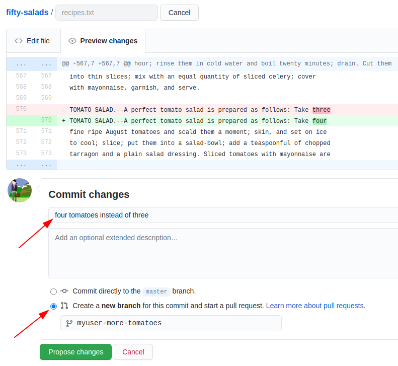
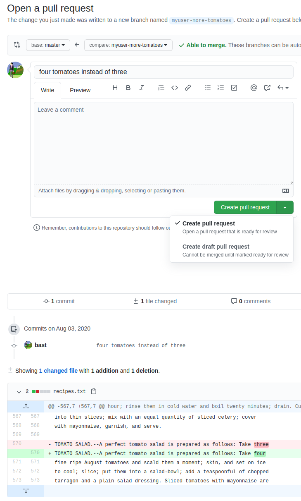
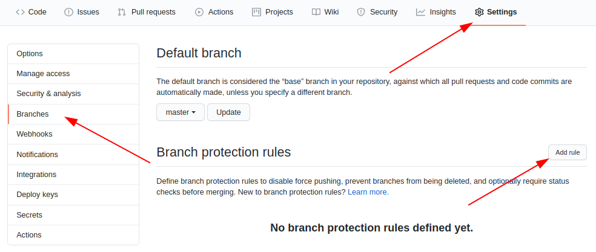
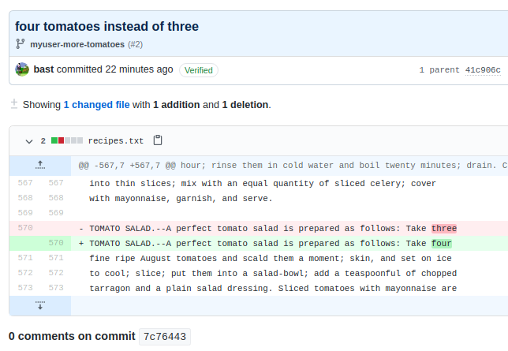

# Merging and git pull request with code review

!!! questions

    - How to collaborate in a project
    - How to contribute to someone else's project?

!!! info Content

    - We will give an overview GitHub

      - centralized collaboration

      - Forked collaboration

      - How to contribute


???- info "Learning objectives of 'Deployment'"

    - explain and evaluate the usefulness of git Pull Request with code review

!!! note "Instructor notes"

    Prerequisites are:

    - ...

    Lesson Plan: **FIX**
    
    - **Total** 30 min
    - Theory 20
    - Discussions 10 min

!!! info "Table of content"

    - GitHub
    - Centralized workflow
    - Distributed version control and Forking workflow
    - How to contribute changes to somebody else’s project
        - Contributing very minor changes
        - If you observe an issue and have an idea how to fix it

## All Exercises

???- question "Demo with Richel: Add to someone else's project (another planet)"

???- question "discussion"

???- question "quiz"


## GitHub

There are two more ways to create “copies” of repositories into your user space:

- A repository can be marked as **template** and new repositories can be **generated** from it, like using a cookie-cutter. The newly created repository will start with a new history, only one commit, and not inherit the history of the template.
- You can **import** a repository from another hosting service or web address. This will preserve the history of the imported project.

!!! admonition "Cheat-sheet"

    **Commits, branches, repositories, forks, clones**

    - **repository**: The project, contains all data and history (commits, branches, tags).
    - **commit**: Snapshot of the project, gets a unique identifier (e.g. `c7f0e8bfc718be04525847fc7ac237f470add76e`).
    - **branch**: Independent development line, often we call the main development line `master` or `main`.
    - **tag**: A pointer to one commit, to be able to refer to it later. Like a [commemorative plaque](https://en.wikipedia.org/wiki/Commemorative_plaque)
  that you attach to a particular commit (e.g. `phd-printed` or `paper-submitted`).
    - **cloning**: Copying the whole repository to your laptop - the first time.
        - It is not necessary to download each file one by one.
        - good within a group  
    - **forking**: Taking a copy of a repository (which is typically not yours)
        - our copy (fork) stays on GitHub and you can make changes to your copy.
        - better for contribution to other's project
    - `git clone` copies everything: all commits and all branches.
    - Branches on the remote appear as (read-only) local branches with a prefix, e.g. `origin/master`.
    - We synchronize commits between local and remote with `git fetch`/`git pull` and `git push`.
    - Repositories that are shared online often synchronize via **pull requests** or **merge requests**.
    - Repositories that are forked or cloned **do not automatically synchronize themselves**.

## Contributing to existing repositories using pull requests
Based on: https://coderefinery.github.io/github-without-command-line/contributing/

- **Step 1. [Add collaborators to your repository](https://coderefinery.github.io/github-without-command-line/contributing/#step-1-learn-how-to-add-collaborators-to-your-repository)**

- Add your group members or collaborators as "collaborators" under GitHub.  This allows them to change things directly (but we'll
actually do it with review).

- From here on the collaborators can push changes in the same way as we have done in a
single-person repository in the previous episodes.

!!! Discussion

    - Discuss the advantages and possible disadvantages of this setup.


- **Step 2: Submit a small change via the web interface as collaborator**

In the last episodes we learned how to directly commit changes either via web
or via the desktop and you need to be a collaborator (have write permissions)
to be able to do that.

In this exercise we will not change the `master` branch directly but
we will submit a "pull request" (a **change proposal**) towards the `master` branch
for **code review**.

{ width="800px" style="border:2px solid #000000;}

- After we click "Propose file change" we are taken to this form:
{ width="400px" style="border:2px solid #000000;}

- In there we verify the **source and target branch**, verify the **file changes**,
  can edit the **title** and **description** of the "pull request" (change proposal)
- After we have submitted the "pull request", one of our collaborators can review it
- We can discuss and ask for changes before merging the changes "Merge pull request"


!!! Discussion

    - Ideally submitter and reviewer should be two different persons.
        - When is this best? When not?
    - You can modify an open "pull request" by committing new changes to the branch
    - Review is not only to assure quality but also to enhance learning and **knowledge transfer** within the group


---

To make sure that *all* changes of the `master` branch are reviewed and nobody
can push commits to it directly, it can be useful to "protect" branches.

- "Settings", then "Branches", then "Add rule":

{ width="800px" }

> ## Discussion
>
> - Protecting the `main` branch "forces" all changes to it to be reviewed first.
>   **We recommend this for group repositories**.
>   Discuss the advantages/disadvantages of this.


---

## Step 3: Submit a small change via the web interface as external contributor

Submitting a change proposal as external contributor (we assume you are not added
as "collaborator" and thus have no write-permissions to a repository) looks very similar
to submitting a "pull request" to a repository with a protected `master` branch.
Only this time you have no other choice than "Propose file change".

Let's try this with one participant who has not been added as collaborator
sharing screen:
- Edit a file with the "pen" button
- Edit the commit message and click green button "Propose file change"
- This creates a **fork** of the repository (GitHub makes a copy of the original repository to your user space)
- You can now still review the change before submitting it, green button "Create pull request"
- Later you can remove the fork if you like

---

## Step 4: Resolving a conflict   

**FIX**

```{instructor-note}
- "Non-talking instructor" prepares a conflicting commit during session (check
  what the first PR does).
- Conflict can be shown as demo.
```

### Exercise/demo: let us experience a conflict

**When merging** two branches a conflict can arise when the same file **portion**
has been modified in two **different** ways on the two branches.

We can practice how a conflict looks and how to resolve it:
- Two participants should send two "pull requests" (change proposals)
  branching from `master` changing the same line in two different ways

{ width="400px" style="border:2px solid #000000;"}
{ width="400px" style="border:2px solid #000000;"}

- We merge together one of the pull requests (this will work)
- Then we try to merge the other and we see a conflict:

{ width="600px" style="border:2px solid #000000;}

- We try to resolve the conflict via web
- Choose the version that you wish to keep, remove conflict markers, "Mark as resolved" and commit the change

{width="800px" style="border:2px solid #000000;}

> ## Discussion
>
> - Compare with Google Docs: can you get conflicts there? What are the advantages and disadvantages?
> - What can we do to avoid conflicts?


## Centralized workflow
{width: 50%}

**Centralized layout**
- **Red** is the repository on GitHub.
- **Blue** is where all contributors work on their own computers.


- Centralized workflow is often used for **remote collaborative work**.
- `origin` refers to where you cloned from (but you can relocate it).
- `origin/mybranch` is a read-only pointer to branch `mybranch` on `origin`.
- These read-only pointers only move when you `git fetch`/`git pull` or `git push`.

## Distributed version control and Forking workflow

{width: 50%}

**Forking workflow**
- **Red** is the central repository, where only owners have access.
- **Green** are *forks* on GitHub (copy for a single user to work on).
- **Blue** are local copies where contributors work on their own computer.


In the forking layout described above we work with **multiple remotes**,
in this case **two remotes**: One remote refers to the **"central"** repository, and the other remote refers to the **"fork"**.

- Working with multiple remotes is not as scary as it might look.
- `origin` is just an alias/placeholder.
- We can add and remove remotes.
- We can call these aliases/placeholders as we like.
- We typically synchronize/updates remotes via the local clone.
- To see all remotes use `git remote -v`.
- If you are more than one person contributing to a project, consider using code review.


## How to contribute changes to somebody else’s project

- Avoid frustration and surprises by first discussing and then coding.

### Contributing very minor changes

- Fork repository
- Create a branch (e.g. with your name)
- Commit and push change
- File a pull request or merge request


### If you observe an issue and have an idea how to fix it

- Open an issue in the repository you wish to contribute to
- Describe the problem
- If you have a suggestion on how to fix it, describe your suggestion
- Possibly **discuss and get feedback**
- If you are working on the fix, indicate it in the issue so that others know that somebody is working on it and who is working on it
- Submit your fix as pull request or merge request which references/closes the issue

!!!- example "(Optional demo) Add to someone else's project"

    - Can we easily add one or more planets?

    - The importance of each planet should be determined by the distance and the mass of it. 
        - The acceleration effect should proportional with MASS/distance^2
        - That means that we can ignore small planets and/or far away planets
    - Below, see a first sorted out table of mass of the planets and their approximate shortest distance to Earth.

    |Planet|Mass (relative to Earth) |Mean distance to sun (AU)| Shortest distance to earth (AU)|
    |----|---|---|---|
    Venus| 0.815 | 0.72 | 0.28
    March| 0.107 | 1.52 | 0.52
    Jupiter| 318 | 5.2 | 4.2
    Saturn| 95.2 | 9.54 | 8.54

    - Adding a planet should be pretty straight-forward in our modular code!

    - For ideas view Code Refinery's  [Centralized workflow](https://coderefinery.github.io/git-collaborative/centralized/)
  


!!! admonition "Parts to be covered!"

    - &#9745; Source/version control
        - Git
        - We have a starting point!
        - GitHub as remote backup
        - branches
    - &#9745; Planning
        - &#9745; Analysis
        - &#9745;Design
    - &#9745; Testing
        - Different levels
    - &#9745; Collaboration
        - GitHub
        - pull requests
    - &#9744; Sharing
        - &#9745; open science
        - &#9744; citation
        - &#9745; licensing  
    - &#9744; Documentation
        - &#9745; in-code documentation
  

