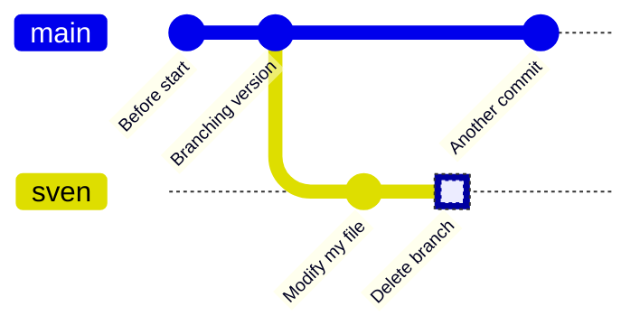

# Apply branches


> Branching structure of an earlier course iteration.

!!!- info "Learning outcomes"

    - create, switch and delete a `git` branch

???- question "For teachers"

    Teaching goals are:

    - Learners have create, switch and delete a `git` branch

    ```mermaid
    gantt
      title Lesson plan apply branches
      dateFormat X
      axisFormat %s
      Introduction: intro, 0, 5s
      Theory 1: theory_1, after intro, 5s
      Exercise 1: crit, exercise_1, after theory_1, 25s
      Feedback 1: feedback_1, after exercise_1, 10s
    ```

    Prior questions:

    - What is a branch?
    - What is the problem that branches alleviate?
    - What is the name/names of the most important branch?
    - What is our git branching setup?
    - What is the goal of that setup?
    - Why do we use that setup instead of a different one?
    - What is the purpose of each of those branches?
    - Does creating a branch create a new version? Why?
    - Does changing a branch change the content of your local computer? Why?
    - Does deleting a branch create a new version? Why?

## Exercises

### Exercise 1: create, switch and delete a `git` branch

!!!- info "Learning outcomes"

    - Create, switch and delete a `git` branch
    - Build up experience using git without troubleshooting



- For our shared GitHub repository, create a branch with your first name that is
  unique, e.g. `sven`, `sven_svensson` or `sven_svensson_314`.
  You may branch of from `main` or `develop` (if it exists).
  You may use the web interface (easiest!) or use the command line
- On your local computer:
    - update the repository
    - switch to the new branch
    - change the content of the repository, for example,
      by creating a file in `learners/[your_name]/[your_name]_is_on_[your_branch_name]`
    - push your changes online.
- On GitHub, verify that your changes on your branch can be found online
- On your local computer, switch to the main branch,
  as we'll delete the branch you are on now
- Delete your branch (i.e. the one with the unique name).
  You may use the web interface (easiest!) or use the command line
- On your local computer, update your code

???- info "Answers"

    > - For our shared GitHub repository, create a branch with your first name that is
    >   unique, e.g. `sven`, `sven_svensson` or `sven_svensson_314`.
    >   You may branch of from `main` or `develop` (if it exists).
    >   You may use the web interface (easiest!) or use the command line

    

    Click on 1, type your branch name at 2 (in this case, `richel`), then click 3.
    Done!

    > - On your local computer:
    >    - update the repository

    On your local computer, navigate to the folder of the shared project
    and update:

    ```
    git pull
    ```

    > - On your local computer:
    >     - switch to the new branch

    Switch to the new branch, for example, `richel`, by doing:

    ```
    git switch richel
    ```

    > - On your local computer:
    >     - change the content of the repository, for example,
    >       by creating a file in `learners/[your_name]/[your_name]_is_on_[your_branch_name]`

    This can be any change you'd like.
    To create a file under Linux (and maybe this works on other
    operating systems too), one can do:

    ```
    touch learners/richel/richel_is_on_richel.txt
    ```

    After the change, commit these:

    ```
    git add .
    git commit -m "Richel is on richel"
    ```

    > - On your local computer:
    >     - push your changes online.

    Do:

    ```
    git push
    ```

    And your code may end up online.

    If that does not work, do:

    ```
    git pull
    ```

    and try pushing again, maybe multiple times, as many people
    are pushing to the shared repo.

    > - On GitHub, verify that your changes on your branch can be found online

    

    Make sure you look at the correct branch, as displayed at 1.
    Then your commit message shows up at 2.

    > - On your local computer, switch to the main branch,
    >   as we'll delete the branch you are on now

    Switch to the main branch, for example, `main`, by doing:

    ```
    git switch main
    ```

    > - Delete your branch (i.e. the one with the unique name).
    >   You may use the web interface (easiest!) or use the command line

    [](github_view_branches_annotated.png)

    Click on 'Branches', as shown in the image above.

    

    Click on garbage bin, as shown in the image above.

    

    The branch will now be deleted, as shown in the image above.

    > - On your local computer, update your code

    Do:

    ```
    git pull
    ```

???- question "Need a video?"

    See a video [here](https://youtu.be/Ewewytijw1g)

## Links

- [Book 'Pro Git', chapter 'git branching'](https://git-scm.com/book/en/v2/Git-Branching-Branches-in-a-Nutshell)
