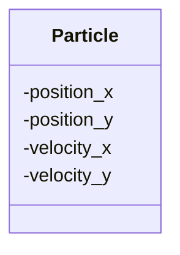
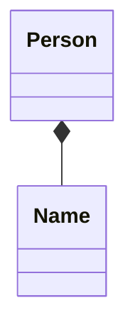
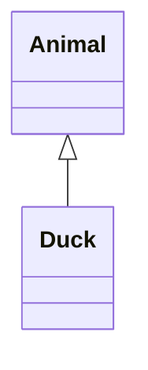
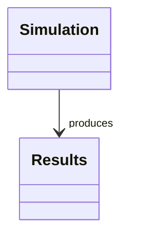
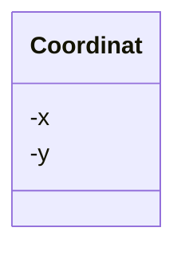
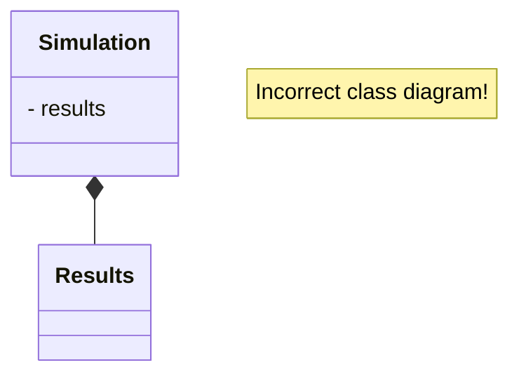
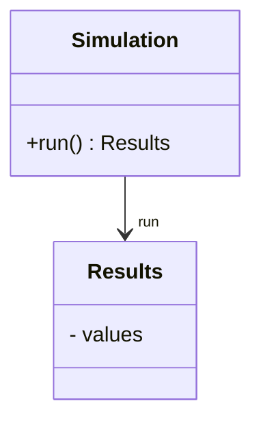
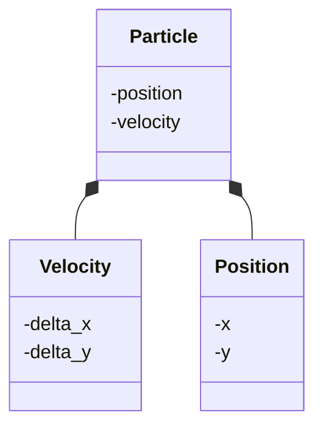

---
tags:
  - relationship
  - has-a
  - has a
  - composition
---

# Has-a relationships

!!!- info "Learning outcomes"

    - Understand the type of relation 'composition' is
    - Understand the type of relation 'inheritance' is
    - Write a class that is composed of another one

???- question "For teachers"

    Prerequisites are:

    - Learners have .

    Teaching goals are:

    - Learners .

    Teaching form used:

    - .

    Lesson plan:

    - 5 mins: prior knowledge
        - Imagine a university, departments, professors,
          the department of biology, the department of physics. Which relationships are there?
        - A university has departments. Departments have professors.
          Is this the same type of relationship?
          Hint: what happens if the bigger one ends existing?
    - 5 mins: presentation
    - 10 mins: demonstration `is_zero`
    - 25 mins: challenge
    - 10 mins: feedback


## Why?

You want to model your classes after the real world.
Your classes work together and you do not feel sure how to
put these together in code.

You want to know the most important relation between classes there is.

## Use case

Here we have a class called `Particle`:



It has both a 2D position and a 2D velocity.
This setup will work and maybe is 'good enough'
before one learns about a 'has-a relation'.

???- question "What is the problem with this class?"

    In English, this class would read as:

    > A particle has an x-position and y-position and x-velocity
    > any y-velocity.

    Note how unrelated the four elements are to each other.
    One could just as well have said:

    > A particle has an x-position and y-velocity and x-velocity
    > any y-position.

    What one wants to say instead is:

    > A particle has a position and a velocity.
    > A position has an x and a y.
    > A velocity has an x and a y.

## Class relations

In this course, we use only these types of relations:

- composition, a 'has-a' relationship
- inheritance, a 'is-a-type-of' relationship
- association, a 'uses' relationship

### Composition




> An example of composition

In English this would be read as 'a person has a name'.

### Inheritance



> An example of inheritance

In English this would be read as 'a duck is a type of animal'.

### Association



> An example of association

In English this would be read as 'a simulation creates results'.

## A 'has-a' relationship

When one data type has a 'has-a' relationship with another,
this is called *composition*.



A `Coordinat` has an `x` and `y`.
This is close to English, as it should be.

However, 'has a' is not always a literal translation.
Below is an incorrect class diagram:



Although we could say 'a simulation has results', a simulation does
not own these results. It does not manage the state of the results.
Instead, a simulation has an association with the results it produces
and the class design diagram should look like this:



## Composition of structs



- Organize related data into structures (structs or classes) `[CppCore C.1]`

## Exercise 1: write two classes with a has-a relation

- Pick a class to design at your skill level:
    - Easiest: the particle class, work in `src/learners`
    - Hardest: one in the learners' project, work in `src/weather`
- Write the definition of the classes

???- question "Answer for the particle"

    ```text
    class Position:
        def __init__(self, any_x, any_y):
          self.x = any_x
          self.y = any_y
        def __str__(self):
            return "(" + str(self.x) + ", " + str(self.y) + ")"

    class Velocity:
        def __init__(self, any_x, any_y):
          self.x = any_x
          self.y = any_y
        def __str__(self):
            return "(" + str(self.x) + ", " + str(self.y) + ")"

    class Particle:
        def __init__(self, any_position, any_velocity):
          self.position = any_position
          self.velocity = any_velocity
        def __str__(self):
            return (
                "Position: " + str(self.position)  + ", "
                + "velocity" + str(self.velocity)
            )
    ```

## References

- `[CppCore C.1]` [C.1. Organize related data into structures (structs or classes)](https://isocpp.github.io/CppCoreGuidelines/CppCoreGuidelines#Rc-org)
