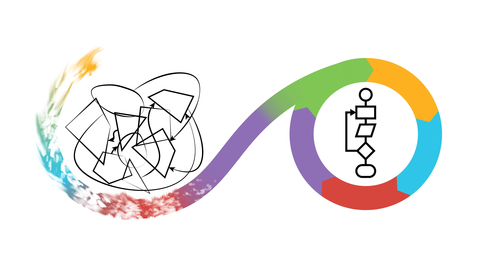

  

> 'Programming Formalisms' course logo, by Jonas Söderberg and Lars Eklund

<figure markdown="span">
  { width="300" }
  <figcaption>'Programming Formalisms' course logo, by Jonas Söderberg and Lars Eklund</figcaption>
</figure>

  

# Welcome to the Bianca workshop!
    

!!! info "Programming formalisms"
    
    - give scientists with some experience in programming and scripting:
      - an **understanding** of the **underlying principles** of software development, design, and programming.
    - strengthen the **understanding** of:
      - more **advanced programming concept**s
      - **ability to produce** more reusable scripts through modular programming
      - enable a better **understanding** of how to evaluate a script or programs **performance**.
    - encourage the **use of software development tools**, like:
      - Unified Model Language
      - Git and Github
    - convince the benefits of **sharing and social coding**

 
    
  

[Prerequirements](prereqs.md){ .md-button .md-button--primary }
[Intro ](intro.md){ .md-button .md-button--primary }

  

