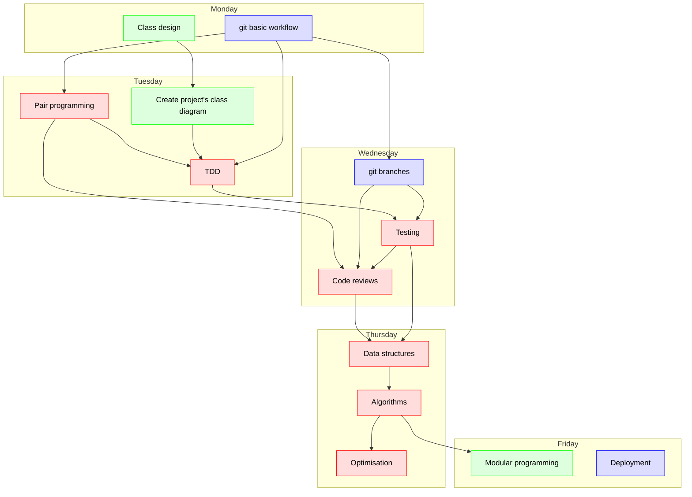

# Introduction of the week

!!! note "Course mottos"

    - Turning scripters into computer scientists
    - Add theory to bolster already present practical skills

## Course overview

## Schedule   

Day      |Time       |Teacher|Subject
---------|-----------|-------|-----------------------------------------------------------
Monday   |09:00-12:00|Lars   |Parts from Björn's intro and Class design (in groups, on repo, using web interface only)
Monday   |13:00-16:00|Björn  |Start project git basic on documents (no coding?) (in groups, on repo)
|||
Tuesday  |09:00-12:00|Lars   |Create project's class diagram (using git)
Tuesday  |13:00-16:00|Richel |pair programming + TDD
|
Wednesday|09:00-10:00|Björn  |understand git branches, git merge
Wednesday|10:15-11:00|Richel |apply git branches
Wednesday|11:15-12:00|Björn  |understand git pull request with code review
Wednesday|13:00-14:00|Richel |apply code review 
Wednesday|14:15-15:00|Richel |understand TDD (+data structures)
Wednesday|15:15-15:45|Richel |apply TDD (+data structures)
Wednesday|15:45-16:00|Richel |retrospect
|||
Thursday |09:00-12:00|Richel |Data structures (+ algorithms)
Thursday |13:00-16:00|R (+M) |Algorithms + Optimisation
|
Friday   |09:00-12:00|Lars   |Modular programming deep
Friday   |13:00-16:00|Björn  |Deployment
