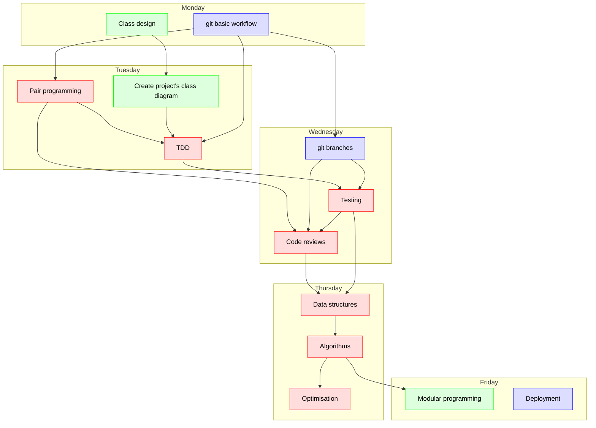
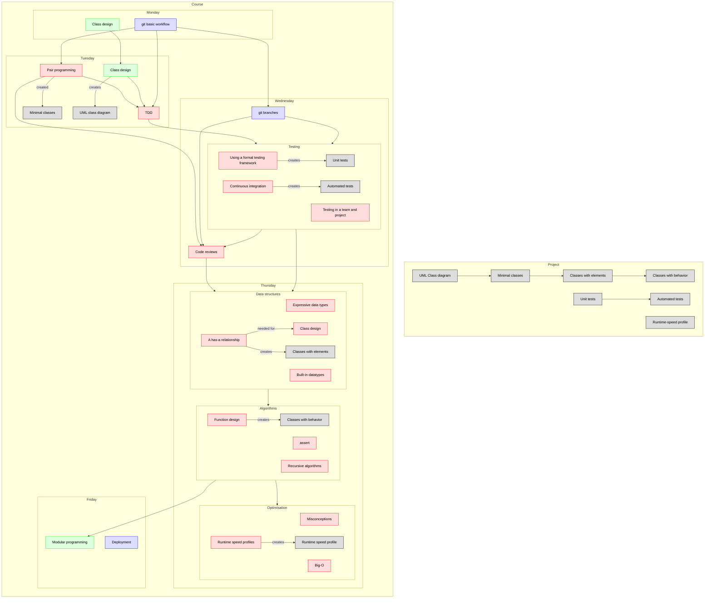

# Introduction of the week

!!! note "Course mottos"

    - Turning scripters into computer scientists
    - Add theory to bolster already present practical skills

## Course overview

!!! info "Programming Formalisms goal"
    
    Give scientists with some experience in programming and scripting
    an understanding of formal principles of software development.
    
    Teach evidence-based or expert-recommended best practices on how to:
     
    - write design documents for a project
    - work as a team
    - share code
    - develop code
    - test code
    - optimize code
    - write reusable code
    - deploy code

    Understand and do formal software development practices:

    - understand, use and create a UML class diagram
    - understand and use a formal git branching model
    - understand and use a formal GitHub workflow
    - understand and practice social coding, such as pair programming and code reviews
    - understand and use a run-time speed profiler

## Schedule   

This is a general course schedule, that intends to give a general overview
of the course's teaching.
For a detailed daily schedule, see the detailed schedule of that day.

Day      |Time       |Teacher|Subject
---------|-----------|-------|-----------------------------------------------------------
Monday   |09:00-12:00|Lars   |Parts from Björn's intro and Class design (in groups, on repo, using web interface only)
Monday   |13:00-15:45|Björn  |Start project git basic on documents (no coding?) (in groups, on repo)
Monday   |15:45-16:00|Richel |Retrospect
Tuesday  |09:00-12:00|Lars   |Create project's class diagram (using git)
Tuesday  |13:00-15:45|Richel |pair programming + TDD
Tuesday  |15:45-16:00|Richel |Retrospect
Wednesday|09:00-12:00|Björn  |Formal git workflow
Wednesday|13:00-16:00|Richel |Formal GitHub and software development work
Wednesday|15:45-16:00|Richel |Retrospect
Thursday |09:00-12:00|Richel |Data structures (+ algorithms)
Thursday |13:00-16:00|R (+M) |Algorithms + Optimisation
Thursday |15:45-16:00|Richel |Retrospect
Friday   |09:00-12:00|Lars   |Modular programming deep
Friday   |13:00-16:00|Björn  |Deployment
Friday   |15:45-16:00|Richel |Evaluation

## Detailed overview

