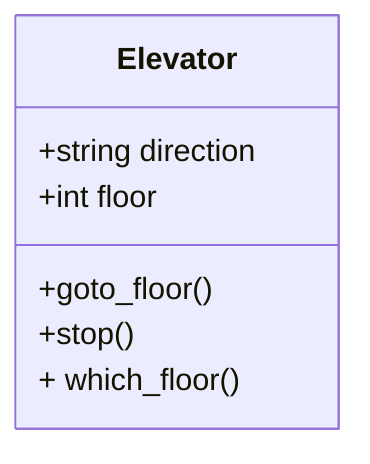

---
tags:
  - intro
  - introduction
---

# Introduction

???+ questions

    - What is the Purpose of Formalism in Computer Science?

    - What is software development life cycle

    - There seem to be many concepts in this course. What do they mean?


!!! info "Content"

    We start with a more **theoretical introduction** covering software and mindsets for software development.


!!! info "Learning outcomes of 'Introduction'"

    Learners can
    
    - Identify the main topics and objectives for the week's lessons.
    - Evaluate the importance of engaging with course content and identify
      strategies to maintain interest and motivation throughout the week.

???- note "Instructor notes"

    Prerequisites are:

    The [pre-requirements](../prereqs.md):

    - Learners know basic Git
    - Learners know basic Python
    - Learners have installed necessary tools

    Teaching goals are:

    - Learners can can understand why a formalized development of software
      is important.

    Lesson Plan:

    - **Total** 20 min
    - Theory 10
    - Discussions 10 min

???- info "TOC"

    - What is software?
        - software concepts
        - types
        - outcome
            - correct, reusable, efficient, changable
    - Example
    - Software Development Life Cycle

## Different types of Scientific software

- analysis of data
    - statistics
    - figures
    - visualization
- tools for process data
    - refining data (formatting)
    - bioinformatics
- workflows
- modelling (mimic the reality)
    - simulations time-varying behaviour of a system
    - mathematical models of relationships among variables in a system
- decision assistance
- Other

!!! discussion

    **What do you develop for?**

## Outcome of a Program

- **Correct**
    - and *flawless*
- **Efficient**
    - *Utilize* the computer system's resources
- **Reusable**
    - Finished *components*
    - Lower *development* *costs*
    - *Faster*
    - Higher *quality*
    - *packaging* technology
- **Changeable**
    - *Maintenance* cost
        - Fix errors, bugs
        - Adapt to *new requirements*
        - Independent *modules*
        - Encapsulation/*information hiding*

## How to program?

### Object oriented programming

- Object-oriented (OO) programming is
    - a mindset of mimicking the real-world as:
    - **entities (`objects`)** that are different
    - or **share attributes**with each-other (within a `**class**`)
    - info-hiding mindset...

**Objects**


**Class**



???- info "Object orientation (OO) in some programming languages"

    - OO (built-in classes)
        - C++
        - Java
        - Python
        - Julia
    - OO features
        - Fortran 2003-
        - MATLAB
        - Perl
        - PHP
    - OO object-based (but not class-based)
        - Javascript

### Functional programming

- Close to mathematics
- Programmer defines information and relations
  and the program concludes answers from that
- Data is immutable, which removes some types of programming errors

???- question "How does that look like?"

    Here we define some functions:

    ```text
    grandparent(X) := parent(parent(X)).
    parent(X) := mother(X).
    parent(X) := father(X).
    ```

    Here we add information:

    ```text
    mother(charles) := elizabeth.
    father(charles) := phillip.
    mother(harry) := diana.
    father(harry) := charles.
    ```

    Now we can ask who is a grandparent to whom:

    ```text
    ?- grandparent(X,Y).
    ````

    Results are:

    ```text
    X = harry, Y = elizabeth.
    X = harry, Y = phillip.
    ```

    The defining feature here is that the program itself concluded
    how to arrive at a conclusion from the given information,
    where in produral languages you'll need to define that search
    strategy yourself

!!! info "To sum up"

    - At its simplest, functional programming uses immutable data to tell the program exactly what to do.
    - Object-oriented programming tells the program how to achieve results through objects altering the program's state.
    - Both paradigms can be used to create elegant code.

### Modular coding

- Modular coding breaks up the code in blocks that could be separate files.
- Modularity could be within a program
- ... but also for a workflow.
    - script describing order of runs with different programs
    - Ex. bash script for preparing input data, running Fortran programs and analysing output with python program.

!!! example "Demo: WRF module and a workflow in 'runtime'"

    - [A weather model workflow](https://github.com/UPPMAX/programming_formalisms_intro/blob/main/doc/wrf-workflow.md)

!!! info "See also"

    - More on Thursday: Object-orientation **FIXLINK**
    - More on Thursday: [Algorithms](../thursday_intro.md)
    - More on Thursday: [Modular programming](../thursday_intro.md)

## Common problems

!!! quote "We want"

    - **Readability**
    - **Correct**
    - **Efficient**
    - **Reusable**
    - **Changeable**

- Can other people **use** your code?
- Do you or anyone else **understand** your code at a later moment?
- Does it work for **all cases**?
- Is is easy to **find** when and where the **code broke**?
- Is it easy to **make changes** in one part without ruin the rest of the program?
- Does is use the resources **efficiently**?
- Is is easy to use a part of the program in another program?
- Can the program be run on different platforms
    - like Linux/Max/Windows,
    - like different hardware architectures (intel, amd, arm)

!!! example "Discuss"

    - Do you want to add something?

??? question "How can we make it easier to get good software and usefulness?"

## Software Development Life Cycle (SDLC)

- We need a workflow in our programming projects!

### Some common steps

- **Planning**
    - Analysis and design
- **Development**
    - Source control
    - Algorithms
    - In-code documentation
    - Optimization
        - Parallelism
    - Tests
- **Deployment** and **maintenance**
    - Documentation
    - Reproducibility and sharing
    - Packaging and dependencies

- ... and **Iterations**

- Agile development
    - Division of tasks into **short phases of work** and frequent **re-assessment** and adaptation of plans.

## Summary of Introduction

- Now after the overview you are ready to dig deeper about the tools!

!!! abstract "Keypoints"

    - A program shall be or have content/components that is:
        - Correct
        - Efficient
        - Reusable
        - Changeable

    - Software development is both series of steps:
    
        1. Requirements
        2. Analysis and design
        3. Development
        4. Test
        5. Deployment and maintenance
        
    - ... and iteration of these

!!! info "Learning outcomes of 'Introduction'"

    Learners can
    
    - Identify the main topics and objectives for the week's lessons.
    - Evaluate the importance of engaging with course content and identify
      strategies to maintain interest and motivation throughout the week.

