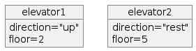

# Introduction

!!! questions

    - What is the Purpose of Formalism in Computer Science?

    - What is software development life cycle

    - There seem to be many concepts in this course. What do they mean?


!!! info "Content"

    We start with a more **theoretical introduction** covering the software and tools and mindsets for software development.


!!! info "Learning objectives of 'SDLC tools'"

    - Identify the main topics and objectives for the week's lessons.
    - Evaluate the importance of engaging with course content and identify strategies to maintain interest and motivation throughout the week.
    - We will set the start in why a formalized development of software is needed.

!!! note "Instructor notes"

    Prerequisites are:

    The [Pre-requirements](prereqs.md): 
    - Learners know basic Git
    - Learners know basic Python
    - Learners have installed necessary tools

    Teaching goals are:

    - Learners can can understand why a formalized development of software is important.

    Lesson Plan: 
    
    - **Total** 30 min
    - Theory 20
    - Discussions 10 min

!!! info "TOC"

    - What is software?
        - software concepts
        - types
        - outcome
            - correct, reusable, efficient, changable
    - Example
    - SLDC   


## What is software?
*Wikipedia*

- set of computer programs and associated documentation and data.
- This is in contrast to hardware, from which the system is built and which actually performs the work. 
- **User-written software: End-user development**
    - Users create this software themselves and _often overlook how important it may be to others_.

### Some software concepts
- program
- script (directly interpreted at run time)
- tool
- model
- application

!!! Note
   
    We will not be very definite in the course in when to use scripting, program or tools. 

## Different types of Scientific software:
- analysis of data
    - statistics
    - figures
    - visualization
- tools for process data
    - refining data (formatting)
    - bioinformatics
- workflows
- modelling (mimic the reality)
    - simulations time-varying behaviour of a system
    - mathematical models of relationships among variables in a system 
- decision assistance

!!! discussion

    **What do you develop for?**


### Outcome of a Program
- **Correct**
    - and _flawless_
- **Efficient**
    - _Utilize_ the computer system's resources
- **Reusable**
    - Finished _components_
    - Lower _development_ _costs_
    - _Faster_
    - Higher _quality_
    - _packaging_ technology
- **Changeable**
    - _Maintenance_ cost
        - Fix errors, bugs
        - Adapt to _new requirements_
        - Independent _modules_
        - Encapsulation/_information hiding_
    
## How to program?

### Object oriented programming
- Object-oriented (OO) programming is 
  - a mindset of mimicking the real-world as:
  - entities (`objects`) that are different 
  - or share attributes with each-other (within a `class`)
  - info-hiding mindset...


**Objects**



**Class**


!!!- note "Object orientation (OO) in some programming languages"

    - OO (built-in classes)
        - C++
        - Java
        - Python
        - Julia
    - OO features
        - Fortran 2003-
        - MATLAB
        - Perl
        - PHP
    - OO object-based (but not class-based)
        - Javascript

### Functional programming

- More classical as it is more focused on the algorithms
- Functions
- Modules: a way to _gather functions_ with similar functionality
- Also to some extent info-hiding mindset

!!! admonition "To sum up"

    - At its simplest, functional programming uses immutable data to tell the program exactly what to do. 
    - Object-oriented programming tells the program how to achieve results through objects altering the program's state. 
    - Both paradigms can be used to create elegant code.

!!! info "See also" 

    - More on Tuesday: Object-orientation **FIXLINK**
    - More on Thursday: [Algorithms](thursday_intro.md)
    - More on Friday: [Modular programming](friday_intro.md)

###  Modular coding
- Modular coding breaks up the code in blocks that could be separate files. 
- Modularity could be within a program but also for a workflow.

!!! example "WRF module and a workflow in 'runtime-"
    
    - [A weather model workflow](https://github.com/UPPMAX/programming_formalisms_intro/blob/main/doc/wrf-workflow.md)
   
## Code Example

???+ exercise "Problems with this code? 5-10 min"

    **Planet application**
    
    - Review this code that simulates the Earth's change of orbit due to the interaction with other planets
    - This was done in Python with no thought of best practices, just trying to solve the problem!
    ---
    
    - What are the problems?
    - Discuss the needs below:

    - **Reusable**
        - Finished _components_
        - Lower _development_ _costs_
        - _Faster_
        - Higher _quality_
        - _packaging_ technology
    - **Changeable**
        - _Maintenance_ cost
            - Fix errors, bugs
            - Adapt to _new requirements_
            - Independent _modules_
            - Encapsulation/_information hiding_
    - **Correct** Skip this for now!
        - and _flawless_
    - **Efficient** Skip this for now!
        - _Utilize_ the computer system's resources

    ???- exercise "planet.py"

        ```python
        #planet
        import numpy as np
        import matplotlib.pyplot as plt 

        #constants
        G=6.6743e-11
        AU=149.597871e9 # 1 astronomical unit (AU) is the mean distance between su
        AU1=150.8e9
        mj=5.97219e24
        mJ=1.899e27
        M=1.9891e30
        day=86400;
        year=31556926;
        v0=AU*2*np.pi/year;
        Fg=G*M*mj/AU**2
        ag=Fg/mj
        Fc=mj*v0**2/AU
        ac=Fc/mj

        L=2

        x0=AU1;
        y0=0;
        u0=0;
        x=np.zeros(365*L, dtype=float);
        y=np.zeros(365*L, dtype=float);

        x[0]=x0;
        y[0]=y0;
        u=u0;
        v=v0;

        for i in range(1,365*L):    
            print(i)
            x[i]=x[i-1]+day*u;
            y[i]=y[i-1]+day*v;
            ax=-G*M/(abs(x[i]**2+y[i]**2)**[3/2])*x[i];
            ay=-G*M/(abs(x[i]**2+y[i]**2)**[3/2])*y[i];
            u=u+ax*day;
            v=v+ay*day;

        rj=(x**2+y**2)**.5
        a=max(rj)
        b=min(rj)
        e=1-2/(a/b+1)
        rel=(a/b-1)


        fig=plt.figure(1,figsize=(12,5))
        ax=fig.add_subplot(1,2,1)
        ax.plot(x,y)
        ax.plot (0,0,'o')
        #axis equal

        ax=fig.add_subplot(1,2,2)
        ax.plot(range(0,365*2),rj)

        plt.savefig('../Figures/planet_earth.png', dpi=100, bbox_inches='tight') 

        ```

      
## Software Development Life Cycle (SDLC)

- We need a workflow in our programming projects!

### Some common steps 

- **Planning**
    - Analysis and design
- **Development**
    - Source control
    - Algorithms
    - In-code documentation
    - Optimization
        - Parallelism
    - Tests
- **Deployment** and **maintenance**
    - Documentation
    - Reproducibility and sharing
        - Packaging and dependencies  

- ... and **Iterations**

- Agile development
    - Division of tasks into **short phases of work** and frequent **re-assessment** and adaptation of plans.

## Summary of Introduction
- Now after the overview you are ready to dig deeper in the topics and try it out yourself!

!!! note "Keypoints"

    - A program shall be or have content/components that is:
        - Correct
        - Efficient
        - Reusable
        - Changeable

    - Software development is both series of steps: 
        1.	Requirements
        2.	Analysis and design
        3.	Development
        4.	Test
        5.	Development and maintenance
    - ... and iteration of these

