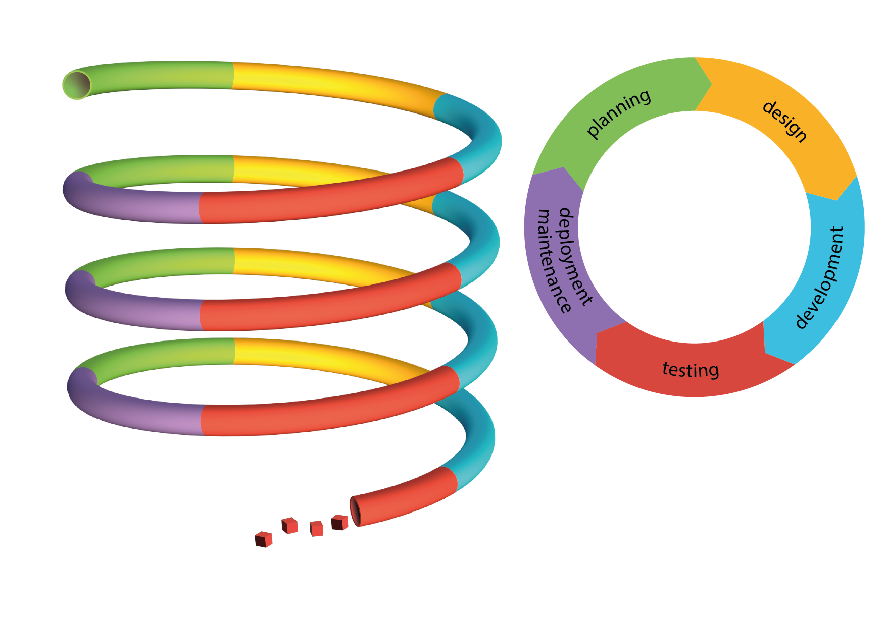

# Software Development Lifecycle

!!! info "Overview of oftware Development Lifecycle (SDLC)"
    
    This is a breef intro to the concept of SDLC further reading can
    be found in the reading material 
    == __All software have a life cycle__ ==  Weather you control that through formalism or if it is chaos is up to you.
    

THE SDLC is usually broken down into phases
       
    This is formalised in the ISO/IEC 12207 model described in ISO/IEC TR 24748-1:2010
    
    When developing a software the cummulative cost of the development increases with each iteration which means that bugs or forgotten features increase in cost when discovered later. There is a point in the life cycle of software where the software is retiered when cost of maintianing the software is higher than the benifit for the developer most retierement does not mean the complete stop of the software existing. This can be illustrated using a healical spiral of SDLC
    

!!! Planing or needs determination
    
    In the first phase one needs to determine what Trauth et.al call Perception of need, Feasibility and Analysis The ISO/IEC standard 12207 calls this Needs Determination after the needs, the initial requirements, have been determined through the above mentions process they are then fleshed out in the Concept and Exploration according to the SDLC_ISO_IEC_12207 this is the time to make a risk analysis of your development strategy, and then adopt that strategy, such as a once through(waterfall), iterative(such as RUP) or evolutionary software model(Living Software Development Process) Most models cover some form of risk assessment, involved in the requirements gathering process. In the Spiral model the concept of risk assessment is essential while in models like Rational Unified Process(RUP) it has a lesser role.

    As we go fowrard through out this course we adopt the Test Driven Design model which is a riskbased statategy, meaning to you asses the risk that your software has to fail and create a test for that.

!!! Taking a riskbased aproach to needs determination.

    This means first finding the needs of your project then analysing those needs for risk which may then lead to further analysis

??? what is  risk?
    
    -  ISO 31000 defines risk as "The effect of uncertainty on objectives"

??? What is risk Management?
    -"coordinated activities to direct and control and organization with regard to risk"

graph TD;
    A(Initiation) -->|Unclear Requirements| B(Planning);
    B -->|Scope Creep| C(Design);
    C -->|Poor Design Choices| D(Development);
    D -->|Bugs and Errors| E(Testing);
    E -->|Incomplete Testing| F(Release);
    F -->|Poor User Adoption| G(Maintenance);
    G -->|Lack of Updates| H(End of Life);
    G -->|Security Vulnerabilities| I(Security Patching);

    classDef red fill:#f9cccc,stroke:#333,stroke-width:2px;
    classDef orange fill:#ffe6cc,stroke:#333,stroke-width:2px;
    classDef green fill:#ccffcc,stroke:#333,stroke-width:2px;

    class A,B,H red;
    class C,E,F,I orange;
    class D,G green;

So how do we identify the needs of our system

??? Where do you start
        
        - project brief, if you are given a project breif or write one your self the project breif should state the problem you would like to solve and any related ideas and constraints you have on the project. This is done in plain english

!!! Fining the needs!

     Is a process of finding the subjects and verbs of the project brief and formalise them as testable statements, once that is done we do our firast iteration of risk analysis on those sets.

