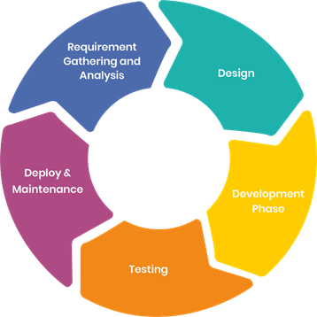

# Software Development Lifecycle

!!! info "Overview of Software Development Lifecycle (SDLC)"

    - This is a brief intro to the concept of SDLC further reading can be found in the reading material
    - __All software have a life cycle__
    - Whether you control that through formalism or if it is chaos is up to you.

## The SDLC is usually broken down into phases

- This is formalised in the ISO/IEC 12207 model described in ISO/IEC TR 24748-1:2010

- When developing a software the cumulative cost of the development increases with each iteration which means that bugs or forgotten features increase in cost when discovered later.
- There is a point in the life cycle of software where the software is retired when cost of maintaining the software is higher than the benefit for the developer - Most retirement does not mean the complete stop of the software existing.
- This can be illustrated using a helical spiral of SDLC

!!! info "Planning or needs determination"

    - In the first phase one needs to determine what Trauth et.al call Perception of need, Feasibility and Analysis
    - The ISO/IEC standard 12207 calls this Needs Determination after the needs, the initial requirements, have been determined through the above mentions process they are then fleshed out in the Concept and Exploration according to the SDLC_ISO_IEC_12207
    - This is the time to make a risk analysis of your development strategy, and then adopt that strategy, such as a once through(waterfall), iterative(such as RUP) or evolutionary software model (Living Software Development Process)
    - Most models cover some form of risk assessment, involved in the requirements gathering process.
    In the Spiral model the concept of risk assessment is essential while in models like Rational Unified Process(RUP) it has a lesser role.

    - As we go forward through out this course we adopt the Test Driven Design model which is a risk-based statategy, meaning to you asses the risk that your software has to fail and create a test for that.

!!! info "Taking a risk-based approach to needs determination"

    This means first finding the needs of your project then analysing those needs for risk which may then lead to further analysis

???- "What is risk?"

    ISO 31000 defines risk as "The effect of uncertainty on objectives"

???- "What is risk Management?"
    -"coordinated activities to direct and control and organization with regard to risk"

