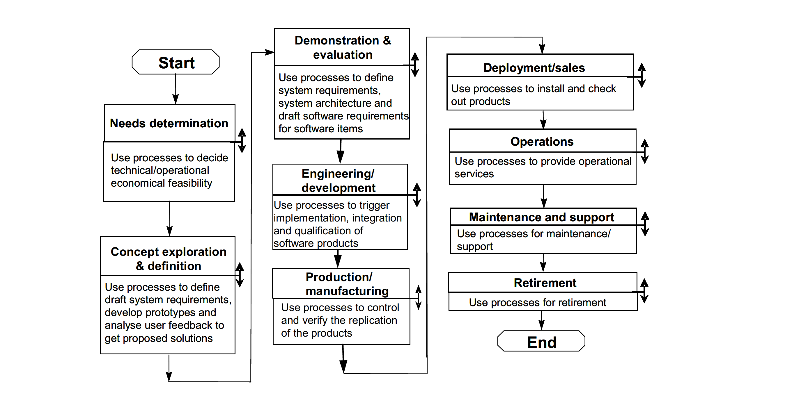

# Software Development Lifecycle

!!! info "Overview of Software Development Lifecycle (SDLC)"

    - This is a brief intro to the concept of SDLC further reading can be found in the reading material
    - __All software have a life cycle__
    - Whether you control that through formalism or if it is chaos is up to you.

## The SDLC is usually broken down into phases

- This is formalized in the ISO/IEC 12207 model described in [ISO/IEC TR 24748-1:2010]

!!! Info "the cycle is degenerative as cost increases
    - When developing a software the cumulative cost of the development increases with each iteration which means that bugs or forgotten features increase in cost when discovered later.
    - There is a point in the life cycle of software where the software is retired when cost of maintaining the software is higher than the benefit for the developer - Most retirement does not mean the complete stop of the software existing.
    - This can be illustrated using a helical spiral to illustrate that each iteration does not end up att the same place in a SDLC

!!! info " In ISO 12207:2017 the following models are defined:"
    > The “incremental development” model includes initial > planning, initial requirements analysis, initial 
    architectural
    definition, and initial validation, but allocates 
    design, implementation, verification (and sometimes delivery)
    activities to a series of stages, each of which provides a portion of the intended functionality. The approach
    provides for some flexibility to respond to inaccurate cost or schedule estimates by moving functionality to later
    increments.
    The “spiral” variation on incremental developmental proposes ordering the development of functionality based on
    risk, with the riskiest problems considered in the early increments. This provides some protection against cost
    surprises occurring late in the development cycle.
    The “iterative development” model performs initial planning and then consists of a cyclic process of prototyping,
    testing, analyzing and refining the requirements and the solution. “Iterative” models repeatedly perform the life
    cycle processes to deliver prioritized system functions sooner, with refined or more complex elements of the
    system coming in later iterations.
    The “evolutionary model” is intended to deal with incomplete knowledge of requirements. It provides for initial
    planning and initial architecture definition, but allocates requirements analysis, design, construction, verification,
    validation and delivery to a series of stages. Delivered capabilities that do not meet user needs can be reworked in
    subsequent stages of the evolution.
    “Agile” methods actually can be applied within a variety of models. While Agile methods are common in executing
    an evolutionary lifecycle model, they can be used in other lifecycle models at various stages. What the methods
    have in common is an emphasis on continuous inspection and collaboration in the rapid production of working
    software in an environment where changes, including changes to requirements, are expected. 
    `[ISO 12207:2017]`

!!! info "Planning or needs determination"

    - In the first phase one needs to determine what Trauth et.al call Perception of need, Feasibility and Analysis
    - The ISO/IEC standard 12207 calls this Needs Determination after the needs, the initial requirements, have been determined through the above mentions process they are then fleshed out in the Concept and Exploration according to the SDLC_ISO_IEC_12207 `[ISO 12207:2017]`
    - This is the time to make a risk analysis of your development strategy, and then adopt that strategy, such as a once through(waterfall), iterative(such as RUP) or evolutionary software model (Living Software Development Process)
    - Most models cover some form of risk assessment, involved in the requirements gathering process.
    In the Spiral model the concept of risk assessment is essential while in models like Rational Unified Process(RUP) it has a lesser role.

    - As we go forward through out this course we adopt the Test Driven Design model which is a risk-based strategy, meaning to you asses the risk that your software has to fail and create a test for that.

!!! info "Taking a risk-based approach to needs determination"

    This means first finding the needs of your project then analyzing those needs for risk which may then lead to further analysis

???- "What is risk?"

    ISO 31000 defines risk as "The effect of uncertainty on objectives"

???- "What is risk Management?"
    -"coordinated activities to direct and control and organization with regard to risk"

!!! info "Sneek peak at roles"
    - Project Manager
    - Requirements Engineer : A requirments enginer is responsilble for gathering and fromalising requirments and establishing and maintaining the Requirments Document
    - Lead programmer 

## Exercises
 Further requirements analysis Risk assessment
 each group will work with about 7 requirements in the requirements document
 Each group will Make a copy of the document and work with it in their folder
 They will label it Requirements_BR_x.md
 so that the requirements engineer can collate the documents
 
 For the fall 2024
 - Breakout room 1
    - R1.1 - R1.5
 - Breakout room 2
    - R1.6 - R1.8.1 
 - Breakout room 3
    - R1.9 -R2
 - Breakout room 4
    -R2.1-R5
 - Breakout room 5
    - R6-R11  

???+ "Exercise 30 min"
    For each requirement type(business or technical risk)
    Asses the major risk associated with the requirement it should be
    specified in one sentence. Asses the probability that the specified risk will happen during a run on a scale of 1-5 where 1 is a rare occurrence and 5 happens every time you run.
    And the same for severity S1 is a minor inconvenience to the stakeholder
    or the running of the program. S5 means a major injury or damage to stakeholder
    or catastrophic failure of the software. Then multiply P and S and set that as the value

!!! info "Task for the Requirements engineer"
     collate the document into one document

## Design

## Development 

## Deployment 

## Maintain

## Retiere
often does not happen but the software is gradually left to die, esp for scientific software where a retierment plan is seldom established esp if the software is developed by a phd student or post-doc or other short term person part of the research group.

## Further reading

## References

- `[ISO 12207:2017]`