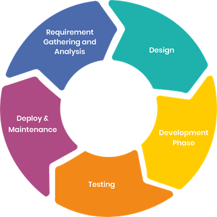
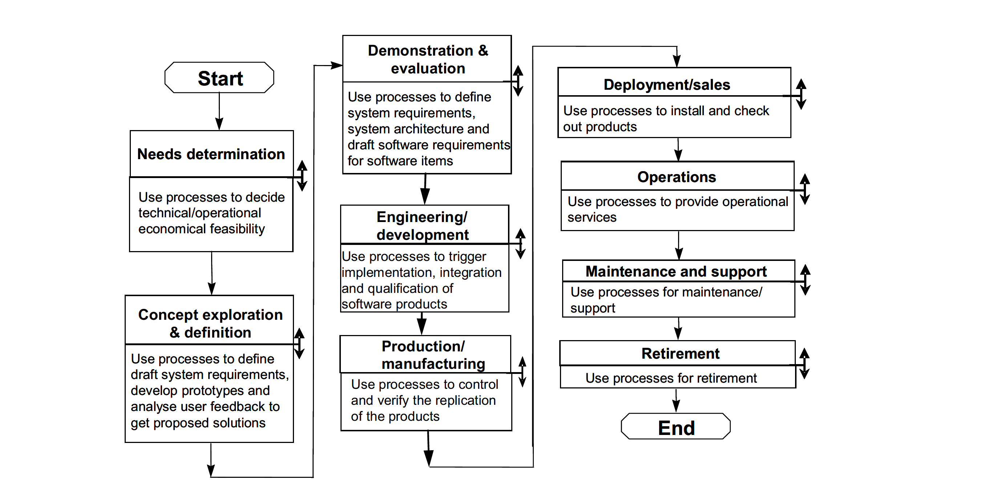
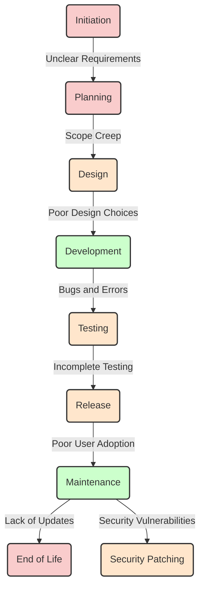

---
tags:
  - SDLC
  - software development
  - lifecycle
  - life cycle
---

# Software Development Lifecycle

!!! info "Overview of Software Development Lifecycle (SDLC)"

    - This is a brief intro to the concept of SDLC further reading can be found in the reading material
    - __All software have a life cycle__
    - Whether you control that through formalism or if it is chaos is up to you.

## The SDLC is usually broken down into phases

- This is formalized in the ISO/IEC 12207 model described in
  [ISO/IEC TR 24748-1:2010]

!!! Info "The cycle is degenerative as cost increases"

    - When developing a software the cumulative cost of the development increases with each iteration which means that bugs or forgotten features increase in cost when discovered later.
    - There is a point in the life cycle of software where the software is retired when cost of maintaining the software is higher than the benefit for the developer - Most retirement does not mean the complete stop of the software existing.
    - This can be illustrated using a helical spiral to illustrate that each iteration does not end up att the same place in a SDLC

!!! info "Models"

    In ISO 12207:2017 the following models are defined:

    > The “incremental development” model includes initial > planning, initial requirements analysis, initial
    architectural
    definition, and initial validation, but allocates
    design, implementation, verification (and sometimes delivery)
    activities to a series of stages, each of which provides a portion of the intended functionality. The approach
    provides for some flexibility to respond to inaccurate cost or schedule estimates by moving functionality to later
    increments.
    The “spiral” variation on incremental developmental proposes ordering the development of functionality based on
    risk, with the riskiest problems considered in the early increments. This provides some protection against cost
    surprises occurring late in the development cycle.
    The “iterative development” model performs initial planning and then consists of a cyclic process of prototyping,
    testing, analyzing and refining the requirements and the solution. “Iterative” models repeatedly perform the life
    cycle processes to deliver prioritized system functions sooner, with refined or more complex elements of the
    system coming in later iterations.
    The “evolutionary model” is intended to deal with incomplete knowledge of requirements. It provides for initial
    planning and initial architecture definition, but allocates requirements analysis, design, construction, verification,
    validation and delivery to a series of stages. Delivered capabilities that do not meet user needs can be reworked in
    subsequent stages of the evolution.
    “Agile” methods actually can be applied within a variety of models. While Agile methods are common in executing
    an evolutionary lifecycle model, they can be used in other lifecycle models at various stages. What the methods
    have in common is an emphasis on continuous inspection and collaboration in the rapid production of working
    software in an environment where changes, including changes to requirements, are expected.
    `[ISO 12207:2017]`

!!! info "Planning or needs determination"

    - In the first phase one needs to determine what Trauth et.al call Perception of need, Feasibility and Analysis
    - The ISO/IEC standard 12207 calls this Needs Determination after the needs, the initial requirements, have been determined through the above mentions process they are then fleshed out in the Concept and Exploration according to the SDLC_ISO_IEC_12207 `[ISO 12207:2017]`
    - This is the time to make a risk analysis of your development strategy, and then adopt that strategy, such as a once through(waterfall), iterative(such as RUP) or evolutionary software model (Living Software Development Process)
    - Most models cover some form of risk assessment, involved in the requirements gathering process.
      In the Spiral model the concept of risk assessment is essential while in models like Rational Unified Process(RUP) it has a lesser role.

    - As we go forward through out this course we adopt the Test Driven Design model which is a risk-based strategy, meaning to you asses the risk that your software has to fail and create a test for that.

!!! info "Taking a risk-based approach to needs determination"

    This means first finding the needs of your project then analyzing those needs for risk which may then lead to further analysis

???- question "What is risk?"

    ISO 31000 defines risk as "The effect of uncertainty on objectives"

???- "What is risk management?"

    Risk management is "coordinated activities to direct and control and
    organization with regard to risk"

!!! info "Sneak peak at roles"

    - Project Manager
    - Requirements Engineer : A requirements engineer is responsible for
      gathering and formalising requirements and establishing and
      maintaining the requirements document
    - Lead programmer

## Exercises

Further requirements analysis, risk assessment.
Each group will work with about 7 requirements in the requirements document,
that can be found [here](https://github.com/programming-formalisms/programming_formalisms_project_summer_2025/blob/main/docs/requirements.md).
Each group will Make a copy of the document and work with it in their folder.
They will label it `Requirements_BR_x.md`,
so that the requirements engineer can collate the documents

For the fall 2024:

- Breakout room 1
    - R1.1 - R1.5
- Breakout room 2
    - R1.6 - R1.8.1
- Breakout room 3
    - R1.9 -R2
- Breakout room 4
    -R2.1-R5
- Breakout room 5
    - R6-R11

???+ note "Exercise 30 min"

    For each requirement type(business or technical risk),
    asses the major risk associated with the requirement.
    It should be specified in one sentence.
    Asses the probability that the specified risk will happen during a run,
    on a scale of 1-5
    (where 1 is a rare occurrence and 5 happens every time you run).
    And do the same for severities (where S1 is a minor inconvenience to
    the stakeholder or the software, and S5 means a major injury or damage to
    stakeholder or catastrophic failure of the software).
    Then multiply P and S and set that as the risk value.

!!! info "Task for the Requirements engineer"

     Collate the document into one document

### Design

Once we know what we want we can start thinking on how.
in the design phase we commonly use Modeling Languages to illustrate concepts and architecture together with
pseudo code to describe algorithms in much the
same way as we use programming languages
during development .
Unified Modeling Language UML, is one such modeling
language [UML web page](https://www.uml.org/)
here is a [introduction to the language by Ed Seidewitz](https://www.youtube.com/watch?v=vAHHdnIV8rU)
UML was generated to unify the big popular object oriented modeling approaches of Booch (Booch Method superseded by the UML), Rumbaugh `[Rumbaugh 1991]`och Jacobsen.`[Ivar Jacobson 1992]`

When we design Object oriented our goal is to mimic the object of the real world which we the abstract into Classes

### Development

 During Development we implement the design using programming languages and techniques.

### Deployment

This is when you package and publish your software, this can be as simple as making your Github repository open an public, here we need to think on which license to publish under etc.

### Maintain

Updates and revisions bug testing etc. Maintaining persistent links and download locations

### Retire

Often does not happen but the software is gradually left to die, esp for scientific software where a retirement plan is seldom established esp if the software is developed by a PhD student or post-doc or other short term person part of the research group.

## Paradigms of Design

### Modular development/programming

A software design technique that emphasizes separating the functionality of a program into independent, interchangeable modules.Each module contains everything necessary to execute only one aspect of the desired functionality of the software. Each module fits together like pieces of lego. A derivation of modular programming is interface programming which uses OOP/OOD to implement the concept of modules in a language that have support for objects but not for modules.
The principles of modular programming was introduced in the 1960s by Larry LeRoy Constantine with the proposal of adding modules to ALGOL68 to ALGOL68-R being the concrete application of the modular development paradigm.

[Code labs introduction to modular programming](https://codelabs.rocks/blog/detailed-guide-for-modular-programming-concept) state the following principles regarding modular programming:
There are two types of module, *program control modules* which are purposely and only designed for controlling the flow of the program. This is usually where the main functionality of a program is defined. *Specific task modules* A module that carries the data transfer amid the initial module and other modules. Specific task modules carries the functionality of the program and have a set of predefined data transmission options:

- no communication in with no communication out
- no communication in with some communication out
- some communication in with some communication out
- some communication in with no communication out

The point of designing with modular development is to enforce information hiding which in this case mainly makes the development independent of the specific development team and enables code reuse. At a higher state a modular design achieve the same interchangeability over the design space.
`[Jones et.al 2001]`Approaches to modular model development is a practical modular development and design of Agri software (agricultural sector) it has a good practice described.

### Object Orientation

Object orientation is primarily a design paradigm unlike Imperative,procedural,functional and declarative programming which focuses on how you code. One can use any number of programming paradigms to implement the object-oriented design.

An object is the representation of a thing or concept, that encapsulates both data and the actions performed on it. A key concept of an object is that it interacts with the world through message passing of its parameters.

An object is characterised by a number of operations and a state which remembers the effect of these operations.

An object oriented model is comprised of a number of objects which are clearly delimited parts of the system.
Objects also carry any association to other objects in their states. These relationships are categorised as either static or dynamic. Two objects with static relationships are associated but have no direct communication that is they know of each other but to not pass messages between each other.
A dynamic object relationship on the other hand implies two or more objects that actually communicate with each other
`[Stroustrup B. 1998]`

## Paradigms of Programming

### Structural programming

The concept of structural programming is from 1950s with the aim of improving clarity and quality of software, by the introduction of structured control flow and block structures that is clearly defined areas of computation. Edsger W. Dijkstra coined the term in NOTES ON STRUCTURED PROGRAMMING `[Edsger W. Dijkstra 1970]`

### Imperative programming

Imperative programming is a software development paradigm where functions are implicitly coded in every step required to solve a problem. In imperative programming, every operation is coded and the code itself specifies how the problem is to be solved, which means that pre-coded models are not called on.

Imperative programming requires an understanding of the functions necessary to solve a problem, rather than a reliance on models that are able to solve it. The focus of imperative programming is how the problem should be solved, which requires a detailed step-by-step guide. Because the written code performs the functions instead of models, the programmer must code each step.
(<https://www.techtarget.com/whatis/definition/imperative-programming>)

### procedural programming

Derived from Imperative programming, the basic concept of a procedure call where a procedure is a routine or subroutine which contains the computational steps to be carried out.

### object oriented programming

The evolution of programming languages that support the object oriented design paradigm is long and branched with different amounts of support for the different concepts. Any language can be used to code object oriented but the effort of doing so may not be useful or cost effective.

### Functional programming

In functional programming, based of the lambda calculus of Alonzo Church during the 1930s and 1940s,The Calculi of Lambda-Conversion (1941)`[Church 1941]`, the idea of *pure functions*, are meant to have *no side effects is implemented as a design strategy*, the second concept that needs to be implemented is the *concept of recursion* which functions as the mechanism of iteration in functional programming.

Programming languages like Haskell, LISP, IPL are languages that represent languages that implement the functional paradigm to varying degrees, but as most design paradigms any language that allows for recursive high order functions will allow for functional programming.

### Declarative programming

A problem is solved is not specifically defined, but instead focuses on what needs to be solved. Declarative programming provides a constant to check to ensure the problem is solved correctly, but does not provide instructions on how to solve the problem. The exact manner in which the problem is solved is defined by the programming language’s implementation through models. Declarative programming is also called model-based programming. Functional, domain-specific (DSL) and logical programming languages fit under declarative programming, such as SQL, HTML, XML and CSS.
(<https://www.techtarget.com/whatis/definition/imperative-programming>)

### Pair Programming

A tool for rapid development is the so called Pair Programming where two developers code on the same code simultaneously one as the "Driver" and one as the "Navigator"

## References

- `[Church, 1941]` The  Calculi of lambda-conversion, Princeton, Princeton University Press, Londos: Humphrey Milford Oxford University Press, 1941
- `[Dijkstra, 1970]` Notes On Structured Programming ,T.H. - Report 70-WSK-03,Second edition April 1970
- `[ISO 12207:2017]`
- `[Jacobson, 1992]` Object-Oriented Software Engineering, a usecase driven approach, Addison-wesley 1992
- `[Jones et al., 2001]` Jones JW, Keating BA, Porter CH. Approaches to modular model development. Agricultural Systems. 2001 Nov 1;70(2):421–43. <https://www.sciencedirect.com/science/article/pii/S0308521X01000543>
- `[Rumbaugh, 1991]` Rumbaugh et. al, Object-oriented modeling and design, Prentice-Hall, Inc. 1991
- `[Stroustrup, 1998]` Stroustrup B. What is “Object-oriented Programming”? Software, IEEE. 1988 Jun 1;5:10–20.
